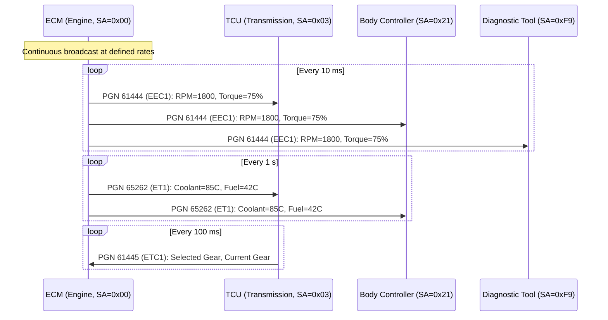
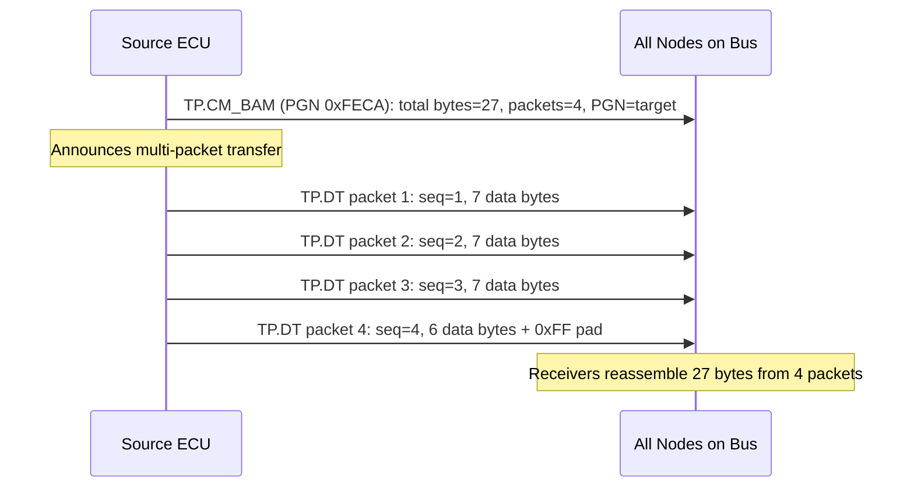
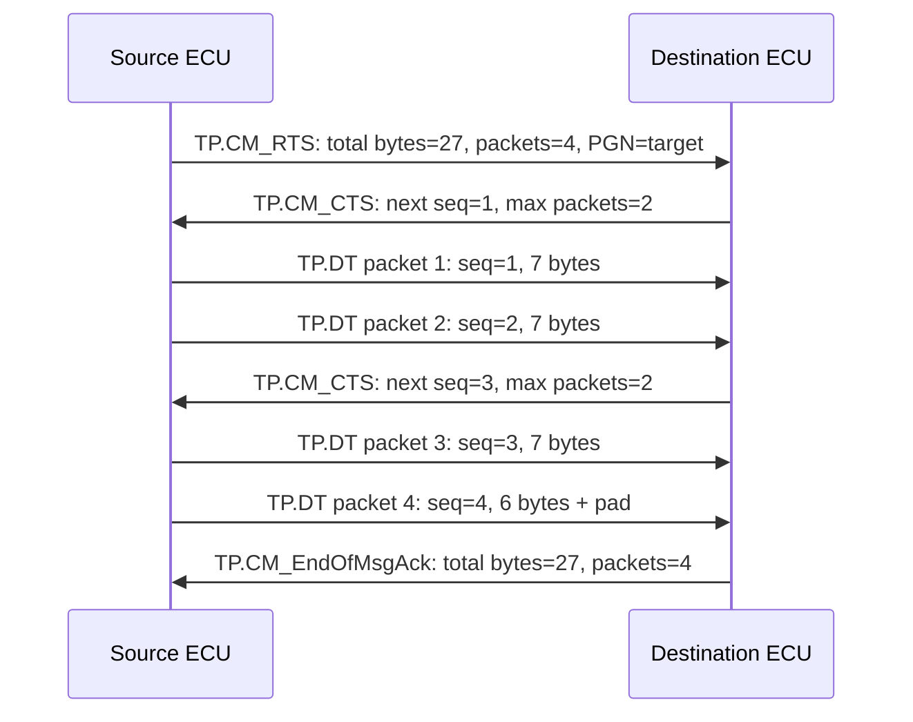
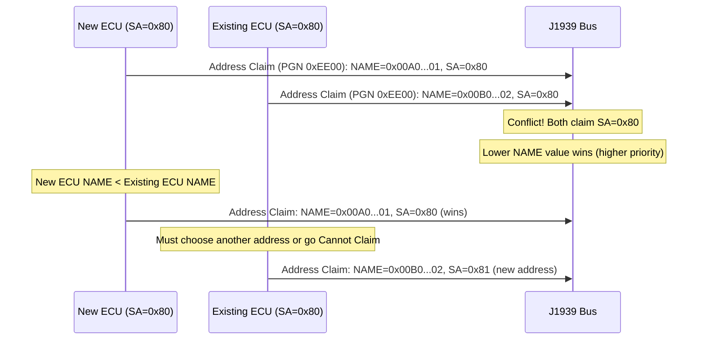

# SAE J1939

> **Standard:** [SAE J1939](https://www.sae.org/standards/content/j1939_202308/) | **Layer:** Application / Data Link (over CAN 2.0B) | **Wireshark filter:** `j1939`

SAE J1939 is the standard communication protocol for heavy-duty vehicles -- trucks, buses, agricultural equipment, marine engines, and construction machinery. Built on CAN 2.0B with 29-bit extended identifiers, J1939 defines a complete networking stack including addressing, transport, diagnostics, and a vast library of standardized parameters. Unlike OBD-II's simple request-response model, J1939 ECUs broadcast data continuously at defined rates, and any node on the bus can transmit. The protocol operates at 250 kbps (500 kbps for J1939-14 high-speed supplement).

## 29-Bit CAN ID Structure

| Field | Size | Description |
|-------|------|-------------|
| Priority | 3 bits | 0 (highest) to 7 (lowest); default 6 for most data, 3 for control |
| R | 1 bit | Reserved (0) |
| DP | 1 bit | Data Page -- selects between two PGN pages |
| PDU Format (PF) | 8 bits | Determines message format: PF < 240 = peer-to-peer, PF >= 240 = broadcast |
| PDU Specific (PS) | 8 bits | If PF < 240: Destination Address. If PF >= 240: Group Extension (GE) |
| Source Address (SA) | 8 bits | Address of the transmitting node (0-253; 254 = null, 255 = global) |

### PGN (Parameter Group Number)

The PGN is derived from the CAN ID: **PGN = (DP << 16) | (PF << 8) | PS** (for broadcast, PF >= 240) or **PGN = (DP << 16) | (PF << 8) | 0x00** (for peer-to-peer, PF < 240, PS = destination address).

PGNs are 18-bit identifiers that group related parameters. Each PGN has a defined transmission rate, priority, and data length.

## Common PGNs

| PGN | Acronym | Name | Key SPNs | Rate |
|-----|---------|------|----------|------|
| 61444 (0xF004) | EEC1 | Electronic Engine Controller 1 | Engine Speed (SPN 190), Engine Torque (SPN 513) | 10 ms |
| 65262 (0xFEEE) | ET1 | Engine Temperature 1 | Coolant Temp (SPN 110), Fuel Temp (SPN 174) | 1 s |
| 65263 (0xFEEF) | EFL/P | Engine Fluid Level/Pressure | Oil Pressure (SPN 100), Fuel Level (SPN 96) | 500 ms |
| 65265 (0xFEF1) | CCVS | Cruise Control / Vehicle Speed | Vehicle Speed (SPN 84), Brake Switch (SPN 597) | 100 ms |
| 65269 (0xFEF5) | AMB | Ambient Conditions | Barometric Pressure (SPN 108), Ambient Temp (SPN 171) | 1 s |
| 65270 (0xFEF6) | IC1 | Inlet/Exhaust Conditions 1 | Boost Pressure (SPN 102), Intake Temp (SPN 105) | 500 ms |
| 65279 (0xFEFF) | VEP1 | Vehicle Electrical Power 1 | Battery Voltage (SPN 168) | 1 s |
| 65272 (0xFEF8) | TF | Transmission Fluids | Trans Oil Temp (SPN 177), Trans Oil Pressure (SPN 127) | 1 s |

## SPNs (Suspect Parameter Numbers)

SPNs identify individual data fields within a PGN. Each SPN has a defined bit position, length, resolution, and offset:

| SPN | Name | PGN | Bits | Resolution | Offset | Range |
|-----|------|-----|------|------------|--------|-------|
| 190 | Engine Speed | 61444 | 24-39 (16 bits) | 0.125 rpm/bit | 0 | 0-8031.875 rpm |
| 84 | Vehicle Speed | 65265 | 8-23 (16 bits) | 1/256 km/h/bit | 0 | 0-250.996 km/h |
| 110 | Coolant Temp | 65262 | 0-7 (8 bits) | 1 C/bit | -40 | -40 to 210 C |
| 100 | Oil Pressure | 65263 | 24-31 (8 bits) | 4 kPa/bit | 0 | 0-1000 kPa |
| 96 | Fuel Level | 65263 | 8-15 (8 bits) | 0.4 %/bit | 0 | 0-100% |
| 513 | Actual Engine Torque | 61444 | 16-23 (8 bits) | 1 %/bit | -125 | -125 to 125% |

## Data Broadcast

## Transport Protocol (TP)

J1939 messages larger than 8 bytes (the CAN frame limit) use the Transport Protocol defined in J1939-21. There are two modes:

### BAM (Broadcast Announce Message)

For broadcast multi-packet messages (one-to-all):

### Connection Mode (CM / RTS-CTS)

For peer-to-peer multi-packet messages with flow control:

### TP PGNs

| PGN | Name | Description |
|-----|------|-------------|
| 60416 (0xEC00) | TP.CM | Connection Management (BAM, RTS, CTS, EndOfMsgAck, Abort) |
| 60160 (0xEB00) | TP.DT | Data Transfer (carries 7 data bytes per frame) |

## Address Claiming

J1939 nodes dynamically claim addresses using a priority-based arbitration mechanism based on the NAME (64-bit unique identifier):

### NAME Structure (64 bits)

| Bits | Field | Description |
|------|-------|-------------|
| 63 | Arbitrary Address Capable | 1 = can negotiate addresses |
| 62-59 | Industry Group | 0=Global, 1=Highway, 2=Agriculture, 3=Construction, 4=Marine |
| 58-55 | Vehicle System Instance | Instance of this vehicle system type |
| 54-48 | Vehicle System | Type of vehicle system |
| 47-40 | Function | ECU function (e.g., engine, transmission, brakes) |
| 39-35 | Function Instance | Instance of this function |
| 34-32 | ECU Instance | Instance of this ECU |
| 31-21 | Manufacturer Code | SAE-assigned manufacturer ID |
| 20-0 | Identity Number | Unique serial number |

## Diagnostic Messages

| PGN | Name | Description |
|-----|------|-------------|
| 65226 (0xFECA) | DM1 | Active Diagnostic Trouble Codes (broadcast continuously) |
| 65227 (0xFECB) | DM2 | Previously Active DTCs |
| 65228 (0xFECC) | DM3 | Diagnostic Data Clear / Reset |
| 65229 (0xFECD) | DM4 | Freeze Frame Parameters |
| 65230 (0xFECE) | DM5 | Diagnostic Readiness |
| 65231 (0xFECF) | DM6 | Pending DTCs |
| 65232 (0xFED0) | DM7 | Test Results Command |
| 65233 (0xFED1) | DM8 | Test Results Response |
| 65235 (0xFED3) | DM11 | Active DTC Clear |
| 65236 (0xFED4) | DM12 | Emissions-Related Active DTCs |

### DM1 DTC Structure (4 bytes per DTC)

| Byte(s) | Field | Description |
|---------|-------|-------------|
| 1-2 | SPN | Suspect Parameter Number (19 bits: bytes 1-2 + upper 3 bits of byte 3) |
| 3 (upper 3) | SPN (MSB) | Upper 3 bits of 19-bit SPN |
| 3 (bits 4-0) | FMI | Failure Mode Identifier (0-31) |
| 4 (bit 7) | CM | Conversion Method (0=J1939, 1=manufacturer) |
| 4 (bits 6-0) | OC | Occurrence Count (0-126; 127=not available) |

### Common FMI Values

| FMI | Meaning |
|-----|---------|
| 0 | Data valid but above normal range (most severe) |
| 1 | Data valid but below normal range (most severe) |
| 2 | Data erratic, intermittent, or incorrect |
| 3 | Voltage above normal or shorted to high source |
| 4 | Voltage below normal or shorted to low source |
| 5 | Current below normal or open circuit |
| 6 | Current above normal or grounded circuit |
| 7 | Mechanical system not responding or out of adjustment |
| 11 | Root cause not known |
| 12 | Bad intelligent device or component |
| 31 | Condition exists |

## J1939 vs OBD-II vs CANopen

| Feature | J1939 | OBD-II (CAN) | CANopen |
|---------|-------|-------------|---------|
| CAN ID | 29-bit extended | 11-bit standard | 11-bit standard |
| Speed | 250 kbps | 250 / 500 kbps | 10 kbps - 1 Mbps |
| Addressing | 254 node addresses (SA) | Fixed IDs (0x7DF, 0x7E0-7) | 127 node IDs |
| Data model | PGN/SPN (broadcast) | Service/PID (request-response) | Object Dictionary (index/subindex) |
| Application | Heavy-duty vehicles | Passenger car diagnostics | Industrial automation |
| Message flow | Continuous broadcast | On-demand request/response | PDO (broadcast) + SDO (request/response) |
| Multi-frame | TP BAM / CM (J1939-21) | ISO-TP (ISO 15765-2) | SDO segmented / block |
| Diagnostics | DM1-DM31 (SPN+FMI) | DTCs (P/C/B/U codes) | Emergency (EMCY) objects |

## Encapsulation

## Standards

| Document | Title |
|----------|-------|
| [SAE J1939-21](https://www.sae.org/standards/content/j1939/21_202211/) | Data Link Layer (TP, address claiming) |
| [SAE J1939-71](https://www.sae.org/standards/content/j1939/71_201611/) | Vehicle Application Layer (PGNs, SPNs) |
| [SAE J1939-73](https://www.sae.org/standards/content/j1939/73_202303/) | Application Layer -- Diagnostics (DM messages) |
| [SAE J1939-81](https://www.sae.org/standards/content/j1939/81_201710/) | Network Management (NAME, address claiming) |
| [SAE J1939-13](https://www.sae.org/standards/content/j1939/13_201610/) | Physical Layer (off-board connector, 250 kbps) |
| [SAE J1939-14](https://www.sae.org/standards/content/j1939/14_202108/) | Physical Layer (500 kbps high-speed supplement) |
| [ISO 11898](https://www.iso.org/standard/63648.html) | CAN data link and physical layer (underlying bus) |

## See Also

- [CAN](../bus/can.md) -- physical and data link layer that J1939 runs on
- [OBD-II](obdii.md) -- passenger vehicle diagnostics (also CAN-based, but simpler)
- [DoIP / UDS](doip.md) -- modern Ethernet-based diagnostics
- [SOME/IP](someip.md) -- automotive Ethernet service-oriented middleware
- [Modbus](../industrial/modbus.md) -- industrial protocol with a similar register-based data model
