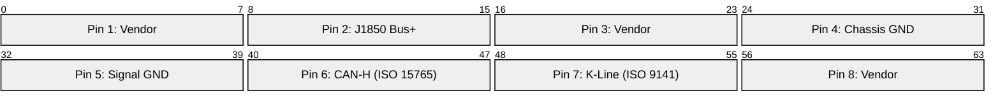
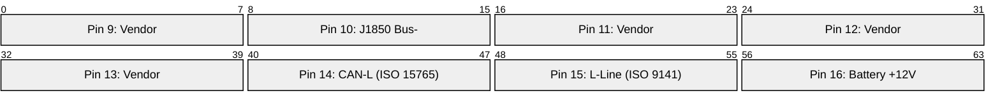
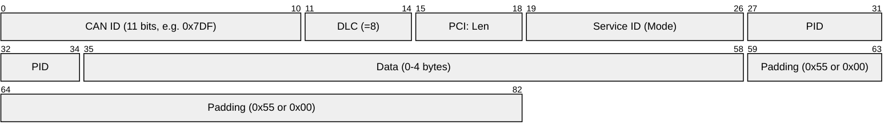
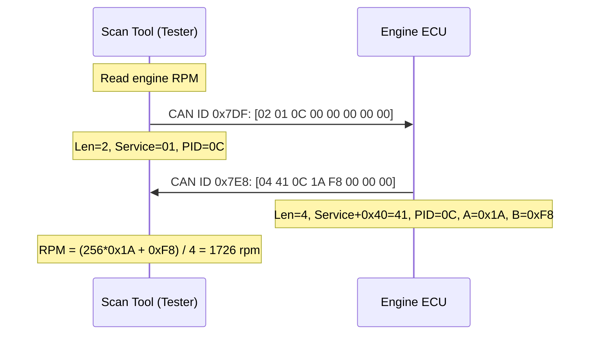
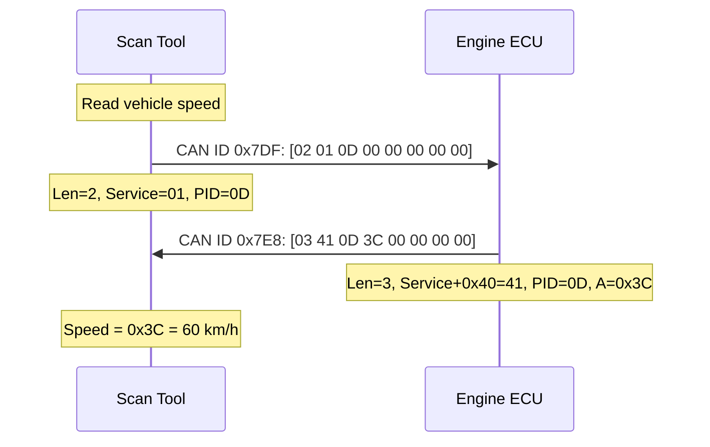
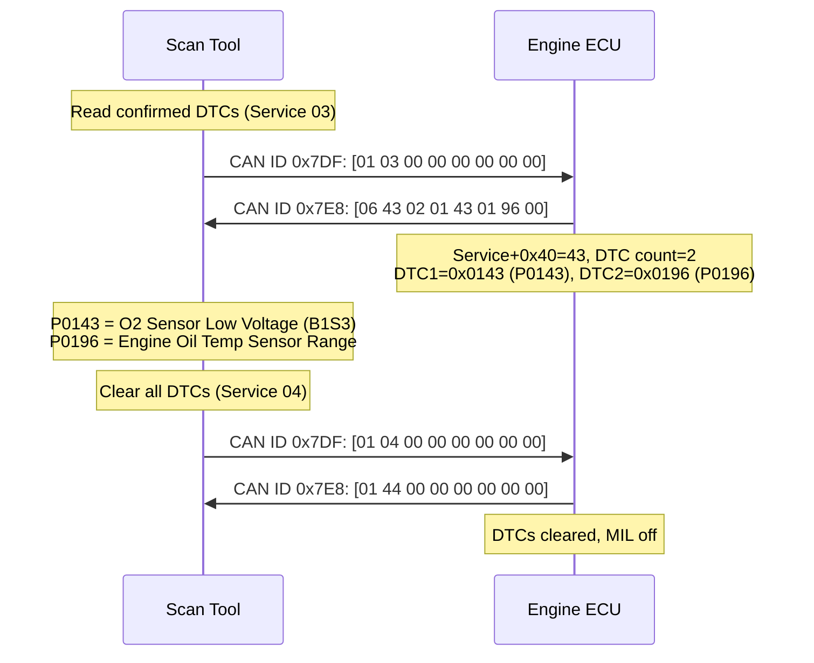
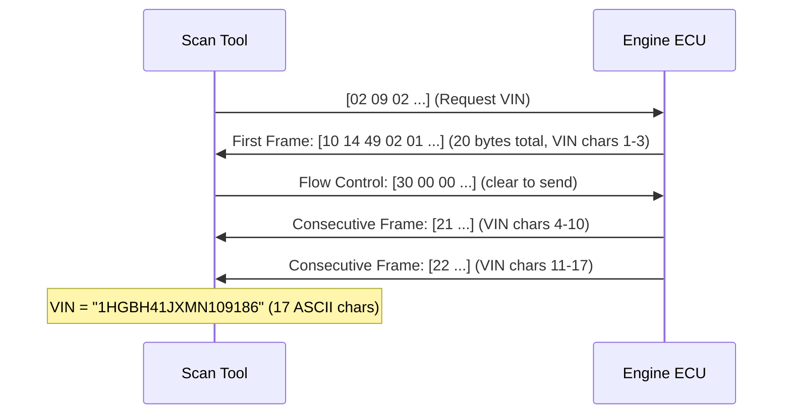

# OBD-II (On-Board Diagnostics II)

> **Standard:** [SAE J1979](https://www.sae.org/standards/content/j1979_202202/) / [ISO 15031](https://www.iso.org/standard/66369.html) | **Layer:** Application (over CAN / K-Line / J1850) | **Wireshark filter:** `iso15765`

OBD-II is a mandatory diagnostic interface for all passenger vehicles sold in the US (since 1996) and Europe (EOBD, since 2001). It provides standardized access to engine parameters, emissions data, and diagnostic trouble codes (DTCs) through a 16-pin connector under the dashboard. The most common physical layer is CAN (ISO 15765), though older vehicles may use K-Line (ISO 14230) or J1850 (legacy US). OBD-II defines a request-response protocol where a diagnostic tool sends a Service ID (mode) + Parameter ID (PID), and the ECU responds with the requested data.

## Physical Layers

| Protocol | Standard | Speed | Notes |
|----------|----------|-------|-------|
| CAN (most common) | ISO 15765-4 | 250 / 500 kbps | Standard since ~2008, required in US since 2008 |
| K-Line | ISO 14230 (KWP2000) | 10.4 kbps | Single-wire bidirectional, older European vehicles |
| J1850 VPW | SAE J1850 | 10.4 kbps | Variable Pulse Width, legacy GM |
| J1850 PWM | SAE J1850 | 41.6 kbps | Pulse Width Modulation, legacy Ford |
| ISO 9141-2 | ISO 9141 | 10.4 kbps | K-Line variant, older Asian/European |

## DLC (Data Link Connector) — SAE J1962

Key pins: **6** (CAN-H), **14** (CAN-L), **4/5** (ground), **16** (+12V power), **7** (K-Line).

## CAN-Based OBD Request/Response IDs

| CAN ID | Direction | Description |
|--------|-----------|-------------|
| 0x7DF | Request (functional) | Broadcast to all ECUs ("anyone who supports this PID") |
| 0x7E0-0x7E7 | Request (physical) | Addressed to specific ECU (0x7E0 = engine ECU) |
| 0x7E8-0x7EF | Response | Response from ECU (0x7E8 = engine ECU response) |

## CAN OBD Frame (ISO 15765 — Single Frame)

For CAN-based OBD, each request/response is wrapped in ISO-TP (ISO 15765-2) framing. Most PID responses fit in a single CAN frame.

### ISO-TP Frame Types (ISO 15765-2)

| PCI Type | Nibble | Description |
|----------|--------|-------------|
| Single Frame (SF) | 0x0 | Complete message in one frame, lower nibble = length |
| First Frame (FF) | 0x1 | First of multi-frame, followed by length (12 bits) |
| Consecutive Frame (CF) | 0x2 | Continuation, lower nibble = sequence number (0-F) |
| Flow Control (FC) | 0x3 | Receiver controls sender's pacing (BS, STmin) |

## Service IDs (Modes)

| Service (hex) | Name | Description |
|---------------|------|-------------|
| 0x01 | Current Data | Read real-time sensor values (PIDs) |
| 0x02 | Freeze Frame | Snapshot of data when DTC was set |
| 0x03 | Read DTCs | Retrieve confirmed diagnostic trouble codes |
| 0x04 | Clear DTCs | Clear DTCs and reset MIL (check engine light) |
| 0x05 | O2 Sensor Monitoring | Oxygen sensor test results |
| 0x06 | On-Board Test Results | Non-continuous monitoring test results |
| 0x07 | Pending DTCs | DTCs detected during current drive cycle |
| 0x08 | Control On-Board System | Actuator tests (manufacturer-specific) |
| 0x09 | Vehicle Information | VIN, calibration IDs, ECU name |
| 0x0A | Permanent DTCs | DTCs that persist even after clearing |

## Common PIDs (Service 0x01)

| PID (hex) | Name | Formula | Unit |
|-----------|------|---------|------|
| 0x00 | Supported PIDs [01-20] | Bit-encoded (each bit = one PID supported) | bitmask |
| 0x04 | Calculated Engine Load | A / 2.55 | % |
| 0x05 | Engine Coolant Temp | A - 40 | C |
| 0x0C | Engine RPM | (256*A + B) / 4 | rpm |
| 0x0D | Vehicle Speed | A | km/h |
| 0x0F | Intake Air Temp | A - 40 | C |
| 0x10 | MAF Air Flow Rate | (256*A + B) / 100 | g/s |
| 0x11 | Throttle Position | A / 2.55 | % |
| 0x1F | Run Time Since Start | 256*A + B | sec |
| 0x2F | Fuel Tank Level | A / 2.55 | % |
| 0x31 | Distance Since Codes Cleared | 256*A + B | km |

A, B = response data bytes.

## PID Request/Response

## DTC Read / Clear

## DTC Format

DTCs are 2 bytes (16 bits) encoded as follows:

| Bits | Field | Values |
|------|-------|--------|
| 15-14 | Category | 00=P (Powertrain), 01=C (Chassis), 10=B (Body), 11=U (Network) |
| 13-12 | Sub-type | 0=SAE standard, 1=Manufacturer-specific |
| 11-8 | System group | 0-F |
| 7-0 | Fault number | 00-FF |

### DTC Category Prefixes

| Prefix | System | Examples |
|--------|--------|----------|
| P0xxx | Powertrain (SAE-defined) | P0300 = Random misfire, P0420 = Catalyst efficiency |
| P1xxx | Powertrain (manufacturer) | Manufacturer-specific codes |
| C0xxx | Chassis | ABS, stability control, steering |
| B0xxx | Body | Airbags, HVAC, lighting |
| U0xxx | Network | CAN bus communication faults |

## VIN Read (Service 09, PID 02)

The Vehicle Identification Number requires multi-frame ISO-TP because it is 17 characters (> 8 bytes):

## Encapsulation (CAN-Based OBD)

## Standards

| Document | Title |
|----------|-------|
| [SAE J1979](https://www.sae.org/standards/content/j1979_202202/) | OBD-II diagnostic services (modes/PIDs) |
| [SAE J1962](https://www.sae.org/standards/content/j1962_201607/) | OBD-II diagnostic connector (DLC) |
| [ISO 15765-4](https://www.iso.org/standard/66570.html) | OBD on CAN (emissions-related) |
| [ISO 15765-2](https://www.iso.org/standard/66574.html) | ISO-TP transport protocol for CAN |
| [ISO 15031-5](https://www.iso.org/standard/66369.html) | Emissions-related diagnostic services |
| [ISO 15031-6](https://www.iso.org/standard/66370.html) | DTC definitions |
| [ISO 14230](https://www.iso.org/standard/54310.html) | KWP2000 (K-Line diagnostics) |
| [SAE J1850](https://www.sae.org/standards/content/j1850_201510/) | J1850 VPW/PWM physical layer |

## See Also

- [CAN](../bus/can.md) -- physical and data link layer for modern OBD-II
- [J1939](j1939.md) -- heavy-duty vehicle protocol (also CAN-based)
- [DoIP / UDS](doip.md) -- modern Ethernet-based diagnostics replacing OBD-II in newer vehicles
- [SOME/IP](someip.md) -- automotive Ethernet middleware
