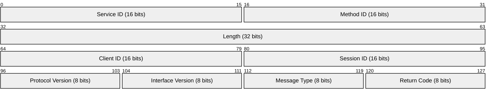
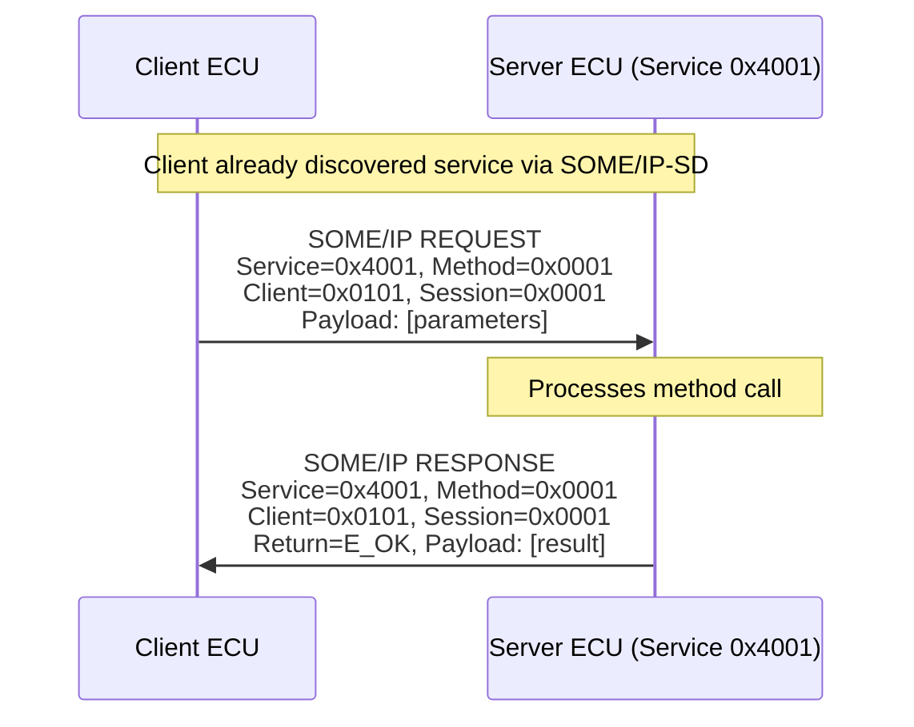
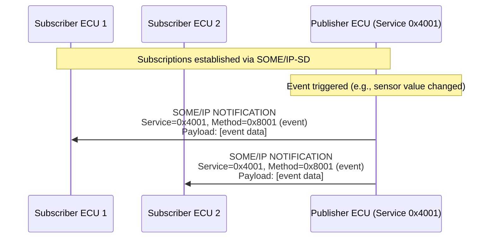
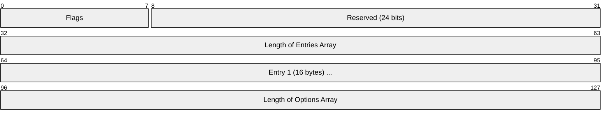
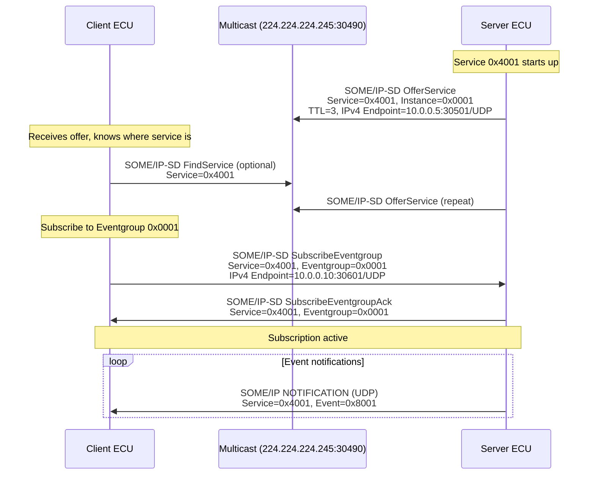
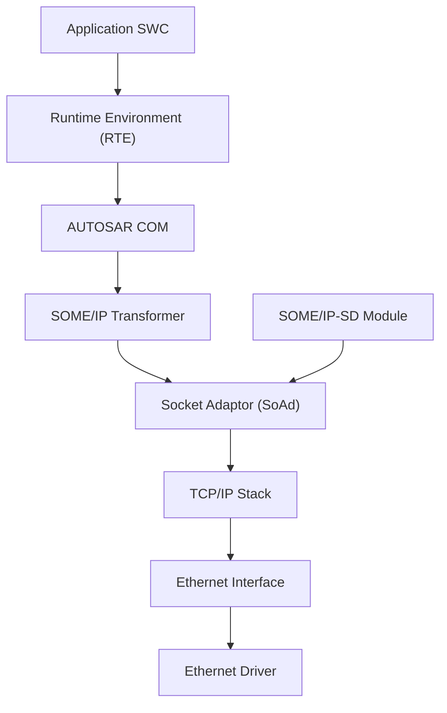
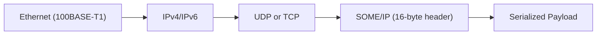

# SOME/IP (Scalable service-Oriented MiddlewarE over IP)

> **Standard:** [AUTOSAR SOME/IP Protocol Specification](https://www.autosar.org/standards/adaptive-platform/) | **Layer:** Application (over UDP/TCP) | **Wireshark filter:** `someip`

SOME/IP is a service-oriented communication protocol designed for automotive Ethernet networks. It enables ECUs to offer and consume services (remote procedure calls and events) over standard IP networking, replacing the signal-oriented paradigm of CAN. SOME/IP is a key enabler for next-generation vehicle architectures (zonal, centralized compute) where high-bandwidth sensors (cameras, lidar, radar) and ADAS functions require Ethernet. It includes a built-in Service Discovery (SOME/IP-SD) mechanism for dynamic service registration and subscription. SOME/IP is specified by AUTOSAR and is used in both Classic and Adaptive AUTOSAR platforms.

## SOME/IP Header

Every SOME/IP message has a 16-byte header followed by the payload.

## Key Fields

| Field | Size | Description |
|-------|------|-------------|
| Service ID | 16 bits | Identifies the service (e.g., 0x0001 = Navigation Service) |
| Method ID | 16 bits | Method, getter, setter, or event within the service; 0x8000+ = events/notifications |
| Length | 32 bits | Length of payload + Client ID through Return Code (payload + 8 bytes) |
| Client ID | 16 bits | Unique ID of the calling client (ECU ID + local client) |
| Session ID | 16 bits | Sequence number for request-response matching |
| Protocol Version | 8 bits | SOME/IP protocol version (currently 0x01) |
| Interface Version | 8 bits | Service interface version |
| Message Type | 8 bits | Type of message (request, response, notification, etc.) |
| Return Code | 8 bits | Result status for responses |

## Message Types

| Value | Name | Description |
|-------|------|-------------|
| 0x00 | REQUEST | Client calls a method on a service (expects response) |
| 0x01 | REQUEST_NO_RETURN | Fire-and-forget method call (no response expected) |
| 0x02 | NOTIFICATION | Event/notification from server to subscribed clients |
| 0x80 | RESPONSE | Server response to a REQUEST |
| 0x81 | ERROR | Server response indicating an error |
| 0x20 | TP_REQUEST | Segmented request (SOME/IP-TP, large payloads) |
| 0x21 | TP_REQUEST_NO_RETURN | Segmented fire-and-forget |
| 0x22 | TP_NOTIFICATION | Segmented notification |
| 0xA0 | TP_RESPONSE | Segmented response |
| 0xA1 | TP_ERROR | Segmented error response |

## Return Codes

| Value | Name | Description |
|-------|------|-------------|
| 0x00 | E_OK | No error |
| 0x01 | E_NOT_OK | Unspecified error |
| 0x02 | E_UNKNOWN_SERVICE | Service ID not known |
| 0x03 | E_UNKNOWN_METHOD | Method ID not known |
| 0x04 | E_NOT_READY | Service not ready (still initializing) |
| 0x05 | E_NOT_REACHABLE | Service not reachable (network issue) |
| 0x06 | E_TIMEOUT | Response timeout |
| 0x07 | E_WRONG_PROTOCOL_VERSION | Protocol version mismatch |
| 0x08 | E_WRONG_INTERFACE_VERSION | Interface version mismatch |
| 0x09 | E_MALFORMED_MESSAGE | Deserialization error |
| 0x0A | E_WRONG_MESSAGE_TYPE | Unexpected message type |

## Method Invocation (Request-Response)

## Event Notification (Publish-Subscribe)

## SOME/IP-SD (Service Discovery)

SOME/IP-SD allows ECUs to dynamically find and subscribe to services at runtime. SD messages are sent on UDP port 30490 (default), typically to multicast address 224.224.224.245.

### SD Header

SD messages contain a list of **entries** (service offers, finds, subscriptions) and **options** (endpoint addresses).

### SD Entry Types

| Type | Value | Description |
|------|-------|-------------|
| FindService | 0x00 | Client looking for a service on the network |
| OfferService | 0x01 | Server advertising an available service |
| StopOfferService | 0x01 (TTL=0) | Server withdrawing a service |
| SubscribeEventgroup | 0x06 | Client subscribing to events from a service |
| StopSubscribeEventgroup | 0x06 (TTL=0) | Client unsubscribing |
| SubscribeEventgroupAck | 0x07 | Server confirming subscription |
| SubscribeEventgroupNack | 0x07 (TTL=0) | Server rejecting subscription |

### SD Options

| Type | Description |
|------|-------------|
| IPv4 Endpoint | Service endpoint: IPv4 address + port + protocol (UDP/TCP) |
| IPv6 Endpoint | Service endpoint: IPv6 address + port + protocol |
| IPv4 Multicast | Multicast group for event distribution |
| IPv6 Multicast | Multicast group (IPv6) for event distribution |
| Configuration | Key-value configuration strings |

## Service Discovery Flow

## SD State Machine (Server)

| Phase | Behavior | Duration |
|-------|----------|----------|
| Initial Wait | Wait random 0-100 ms before first offer | Startup |
| Repetition | Send OfferService at exponentially increasing intervals | Configurable (e.g., 3 rounds) |
| Main | Send OfferService at fixed interval (cyclic) | Ongoing |

## Transport Binding

| Transport | Use Case | Notes |
|-----------|----------|-------|
| UDP | Events, notifications, fire-and-forget | Low latency, best for cyclic data |
| TCP | Reliable method calls, large payloads | Connection-oriented, guaranteed delivery |
| SOME/IP-TP | Large payloads over UDP | Segmentation for messages > UDP MTU |

## SOME/IP-TP (Segmentation)

For payloads exceeding UDP MTU, SOME/IP-TP adds a 4-byte TP header after the standard SOME/IP header:

| Field | Size | Description |
|-------|------|-------------|
| Offset | 28 bits | Byte offset of this segment in the original message |
| More Segments | 1 bit | 1 = more segments follow, 0 = last segment |
| Reserved | 3 bits | Reserved |

## AUTOSAR Integration

## Encapsulation

## Standards

| Document | Title |
|----------|-------|
| [AUTOSAR SOME/IP PRS](https://www.autosar.org/standards/adaptive-platform/) | SOME/IP Protocol Specification |
| [AUTOSAR SOME/IP-SD PRS](https://www.autosar.org/standards/adaptive-platform/) | SOME/IP Service Discovery Protocol Specification |
| [AUTOSAR SOME/IP-TP PRS](https://www.autosar.org/standards/adaptive-platform/) | SOME/IP Transport Protocol Specification |
| [AUTOSAR SWS SomeIPXf](https://www.autosar.org/standards/classic-platform/) | SOME/IP Transformer (serialization) |
| [AUTOSAR SWS SD](https://www.autosar.org/standards/classic-platform/) | Service Discovery Module |
| [IEEE 802.3](https://standards.ieee.org/standard/802_3-2022.html) | Ethernet (including automotive 100BASE-T1, 1000BASE-T1) |

## See Also

- [CAN](../bus/can.md) -- legacy automotive bus that SOME/IP is replacing for high-bandwidth use cases
- [OBD-II](obdii.md) -- automotive diagnostics (signal-oriented, CAN-based)
- [J1939](j1939.md) -- heavy-duty vehicle CAN protocol
- [DoIP / UDS](doip.md) -- diagnostics over IP (often coexists with SOME/IP on automotive Ethernet)
- [MQTT](../messaging/mqtt.md) -- lightweight pub-sub protocol (similar subscribe pattern, different domain)
