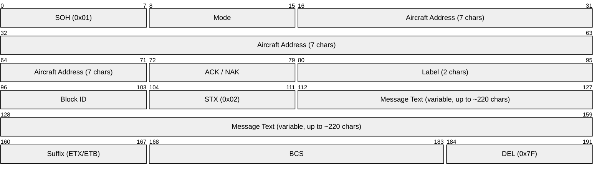
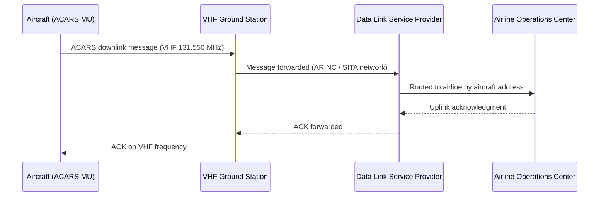
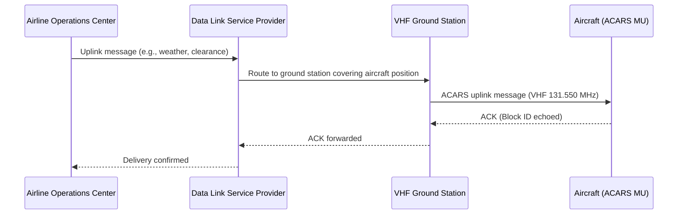
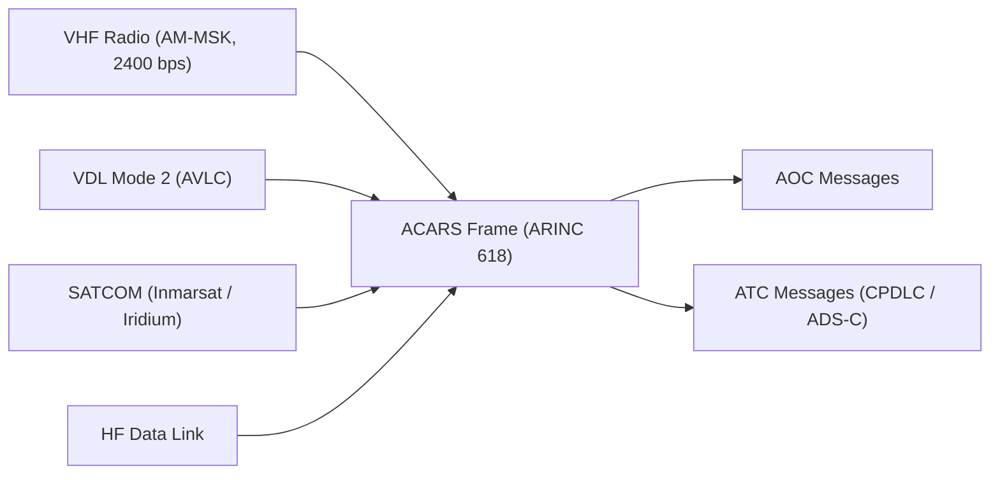

# ACARS (Aircraft Communications Addressing and Reporting System)

> **Standard:** [ARINC 618](https://www.aviation-ia.com/products/618) | **Layer:** Application (VHF / SATCOM / HF data link) | **Wireshark filter:** `acars` (with VDL Mode 2 plugins)

ACARS is a character-oriented digital data link system for air-to-ground and ground-to-air messaging between aircraft and airline operations centers or ATC facilities. Introduced in 1978, it carries pre-departure clearances, weather requests, OOOI events (Out of gate, Off ground, On ground, Into gate), position reports, and free-text messages. ACARS operates over VHF (most common), HF data link, and SATCOM (Inmarsat, Iridium), providing global coverage. It is the transport backbone for higher-level protocols such as CPDLC (FANS-1/A) and ADS-C.

## ACARS Message Frame

## Key Fields

| Field | Size | Description |
|-------|------|-------------|
| SOH | 1 byte | Start of Header (0x01) — marks beginning of message |
| Mode | 1 char | Link mode character: `2` = VHF ACARS, `H` = HF data link, etc. |
| Aircraft Address | 7 chars | Aircraft registration (e.g., `.N12345`) — dot-padded |
| ACK/NAK | 1 char | Acknowledgment character or NAK for negative acknowledgment |
| Label | 2 chars | Message type identifier (determines content interpretation) |
| Block ID | 1 char | Sequence identifier for multi-block messages (0-9, A-Z) |
| STX | 1 byte | Start of Text (0x02) — separates header from message body |
| Message Text | Variable | Free text or structured data, up to ~220 characters |
| Suffix | 1 byte | ETX (0x03) for final block, ETB (0x17) for intermediate blocks |
| BCS | 2 bytes | Block Check Sequence — parity-based error detection |
| DEL | 1 byte | Delete character (0x7F) — end of transmission block |

## Field Details

### Mode Characters

| Mode | Description |
|------|-------------|
| `2` | VHF ACARS (standard) |
| `H` | HF data link |
| `C` | VHF ACARS (Canada) |
| `E` | VHF ACARS (Europe secondary) |
| `X` | Airline-defined |

### Common Labels

| Label | Description |
|-------|-------------|
| `_d` | OOOI event (Out/Off/On/Into gate) |
| `H1` | HF voice position report |
| `SA` | System status / test |
| `Q0` | Link test / request |
| `RA` | ETA update |
| `5Z` | Airline-defined free text |
| `B6` | Takeoff report |
| `B3` | Turbulence report |
| `_7` | Weather request |
| `AA` | ATN / CPDLC message (FANS) |

### OOOI Events

ACARS automatically reports four key flight events via sensors on the aircraft:

| Event | Trigger | Label |
|-------|---------|-------|
| **O**ut of gate | Parking brake released / door closed | `_d` |
| **O**ff ground | Weight off wheels (liftoff) | `_d` |
| **O**n ground | Weight on wheels (touchdown) | `_d` |
| **I**nto gate | Parking brake set / door opened | `_d` |

These OOOI events are the original core function of ACARS, used by airlines for fleet tracking and on-time performance.

## Message Types

| Type | Direction | Description |
|------|-----------|-------------|
| AOC (Airline Operational Control) | Both | Operational messages — OOOI, fuel, loadsheet, gate info, delays |
| ATC (Air Traffic Control) | Both | CPDLC clearances, ADS-C reports, DCL (pre-departure clearance) |
| AAC (Airline Administrative Control) | Both | Crew scheduling, maintenance, company messages |

### Direction

| Direction | Description |
|-----------|-------------|
| Downlink | Aircraft to ground station |
| Uplink | Ground station to aircraft |

## Downlink Message Flow

## Uplink Message Flow

## Physical Layer

### VHF (Primary)

| Parameter | Value |
|-----------|-------|
| Modulation | AM-MSK (Minimum Shift Keying on AM carrier) |
| Data rate | 2400 bps |
| Frequencies | 129.125, 130.025, 130.450, 131.125, 131.550 MHz (common) |
| Range | Line-of-sight, ~200 nm |
| Providers | ARINC (Americas), SITA (Europe, Asia) |

### VDL Mode 2

| Parameter | Value |
|-----------|-------|
| Data rate | 31.5 kbps |
| Modulation | D8PSK |
| Link layer | AVLC (Aviation VHF Link Control) — HDLC derivative |
| Frequency | 136.725, 136.775, 136.875, 136.975 MHz |
| Protocol stack | VDL2 PHY → AVLC → ACARS / ATN |

VDL Mode 2 is the next-generation VHF data link, offering higher throughput and supporting both ACARS (AOA — ACARS over AVLC) and ATN-based applications.

### SATCOM

| System | Coverage | Data rate |
|--------|----------|-----------|
| Inmarsat (Classic Aero) | Global (excl. poles) | 600-10,500 bps |
| Inmarsat SwiftBroadband | Global (excl. poles) | Up to 432 kbps |
| Iridium | Global (incl. poles) | 2400 bps (short burst) |

### HF Data Link (HFDL)

| Parameter | Value |
|-----------|-------|
| Frequencies | 2-22 MHz (HF band) |
| Data rate | 300-1800 bps |
| Coverage | Global (especially oceanic/polar) |
| Ground stations | ~15 worldwide |

## ARINC Specification Family

| Specification | Description |
|---------------|-------------|
| ARINC 618 | Character-oriented ACARS protocol (original) |
| ARINC 619 | ACARS Protocols for Avionics End Systems |
| ARINC 620 | FANS-1/A data link (CPDLC / ADS-C over ACARS) |
| ARINC 623 | Binary-format ACARS messages (extended character set) |
| ARINC 631 | VDL Mode 2 aviation VHF data link |
| ARINC 633 | ACARS over IP (modern ground infrastructure) |

## Hobbyist Monitoring

ACARS messages can be received and decoded by radio enthusiasts using inexpensive SDR equipment:

| Tool | Description |
|------|-------------|
| RTL-SDR (hardware) | USB software-defined radio dongle (~$25), tunes VHF frequencies |
| acarsdec | Open-source multi-channel ACARS decoder |
| dumpvdl2 | VDL Mode 2 decoder for RTL-SDR |
| acarsdeco2 | Multi-channel ACARS/VDL2 decoder with web interface |
| Jaero | Inmarsat ACARS decoder (L-band satellite) |
| airframes.io | Community aggregator for decoded ACARS messages |

## Encapsulation

## Standards

| Document | Title |
|----------|-------|
| [ARINC 618](https://www.aviation-ia.com/products/618) | Air/Ground Character-Oriented Protocol Specification |
| [ARINC 620](https://www.aviation-ia.com/products/620) | Data Link Ground System Standard and Interface Specification (FANS) |
| [ARINC 623](https://www.aviation-ia.com/products/623) | Character-Oriented Air Traffic Service (ATS) Applications |
| [ARINC 631](https://www.aviation-ia.com/products/631) | Aviation VHF Digital Link (VDL) Mode 2 |
| [ARINC 633](https://www.aviation-ia.com/products/633) | ACARS over IP |
| [ICAO Annex 10 Vol III](https://www.icao.int/) | Aeronautical Telecommunications — Communication Systems |

## See Also

- [CPDLC](cpdlc.md) — controller-pilot data link communications carried over ACARS
- [Mode S](modes.md) — secondary surveillance radar transponder protocol
- [ASTERIX](asterix.md) — ATC surveillance data exchange format
