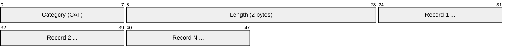
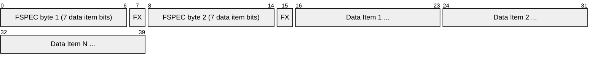
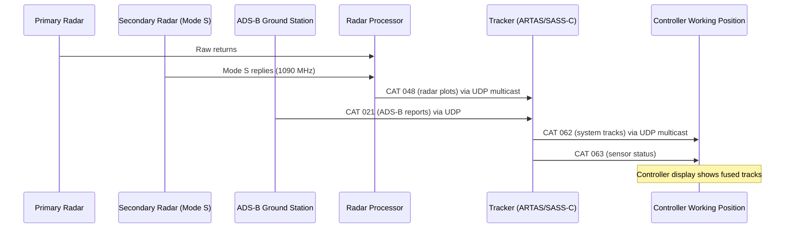
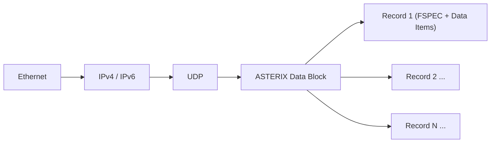

# ASTERIX (All Purpose Structured Eurocontrol Surveillance Information Exchange)

> **Standard:** [Eurocontrol ASTERIX](https://www.eurocontrol.int/asterix) | **Layer:** Application (typically over UDP) | **Wireshark filter:** `asterix`

ASTERIX is a binary protocol developed by Eurocontrol for the exchange of ATC surveillance data. It carries radar plots, system tracks, ADS-B reports, MLAT data, weather information, and sensor status between surveillance sensors, tracker systems, and ATC displays. ASTERIX uses a compact, bit-oriented encoding with a flexible field-presence mechanism (FSPEC) that allows each message to carry only the data items actually present. It is the standard surveillance data format across European airspace and is widely adopted worldwide, typically transported over UDP multicast or unicast.

## Data Block Structure

A single UDP datagram may contain one or more data blocks, and each data block may contain one or more records of the same category.

## Record Structure

## Key Fields

| Field | Size | Description |
|-------|------|-------------|
| Category (CAT) | 1 byte | Identifies the type of data (001 = radar, 021 = ADS-B, 048 = radar, etc.) |
| Length | 2 bytes | Total length of the data block in bytes (including CAT and Length) |
| FSPEC | Variable | Field Specification — bit mask indicating which data items are present |
| FX bit | 1 bit | Field Extension — if 1, another FSPEC byte follows |
| Data Items | Variable | Encoded data items in the order defined by the category specification |

## Field Details

### FSPEC (Field Specification)

The FSPEC is a variable-length bit field at the start of each record. Each byte contains 7 data item presence bits (MSB first) and 1 FX (Field Extension) bit in the LSB:

| Bit Position | Meaning |
|--------------|---------|
| Bit 7 (MSB) | Data Item 1 present (1) or absent (0) |
| Bit 6 | Data Item 2 present/absent |
| Bit 5 | Data Item 3 present/absent |
| Bit 4 | Data Item 4 present/absent |
| Bit 3 | Data Item 5 present/absent |
| Bit 2 | Data Item 6 present/absent |
| Bit 1 | Data Item 7 present/absent |
| Bit 0 (LSB) | FX — if 1, another FSPEC byte follows; if 0, FSPEC ends |

This mechanism allows records to include only the data items that are actually populated, keeping messages compact.

### Data Item Types

| Type | Description |
|------|-------------|
| Fixed Length | Predefined size (e.g., 2 bytes for a position) |
| Variable Length | Length indicator followed by data |
| Repetitive | Repetition factor (1 byte) followed by N fixed-length sub-items |
| Compound | Sub-field presence indicator (like a nested FSPEC) followed by sub-items |
| Explicit | Length byte followed by variable data (for extensions and special data) |

### Common Encoding Conventions

| Data Type | Encoding |
|-----------|----------|
| Time of Day | 24-bit unsigned, LSB = 1/128 second (midnight reference) |
| Position (lat/lon) | 32-bit signed, LSB = 180/2^25 degrees (WGS-84) |
| Altitude | 16-bit signed, LSB = 6.25 ft (Mode C) or 25 ft |
| Range | 16-bit unsigned, LSB = 1/128 NM (category-dependent) |
| Azimuth | 16-bit unsigned, LSB = 360/2^16 degrees |
| Groundspeed | 16-bit unsigned, LSB = 2^-14 NM/s |
| Track angle | 16-bit unsigned, LSB = 360/2^16 degrees |

## Key Categories

| Category | Description | Typical Source |
|----------|-------------|----------------|
| CAT 001 | Monoradar target reports (plots and tracks) | Primary/secondary radar |
| CAT 002 | Monoradar service messages | Radar sensor status |
| CAT 008 | Monoradar weather data | Weather radar |
| CAT 010 | Monosensor surface movement data | MLAT, SMR |
| CAT 020 | Multilateration target reports | MLAT systems |
| CAT 021 | ADS-B target reports | ADS-B ground stations |
| CAT 023 | CNS/ATM ground station service messages | ADS-B sensor status |
| CAT 030 | ARTAS tracks (deprecated, replaced by 062) | Multi-radar tracker |
| CAT 034 | Monoradar transmission of service messages | Radar status/config |
| CAT 048 | Monoradar target reports (enhanced) | Modern radar systems |
| CAT 062 | System track data | Multi-sensor tracker (ARTAS, SASS-C) |
| CAT 063 | Sensor status messages | System status |
| CAT 065 | SDPS service status | Data processing system |
| CAT 240 | Radar video (digitized) | Primary radar video |
| CAT 247 | Version cross-reference | Version numbering |

### CAT 048 (Monoradar) — Common Data Items

| Data Item | FRN | Description |
|-----------|-----|-------------|
| I048/010 | 1 | Data Source Identifier (SAC/SIC) |
| I048/140 | 2 | Time of Day |
| I048/020 | 3 | Target Report Descriptor |
| I048/040 | 4 | Measured Position (range/azimuth) |
| I048/070 | 5 | Mode 3/A Code (squawk) |
| I048/090 | 6 | Mode C Code (altitude) |
| I048/130 | 7 | Radar Plot Characteristics |
| I048/220 | 8 | Aircraft Address (24-bit ICAO) |
| I048/240 | 9 | Aircraft Identification (callsign) |
| I048/250 | 10 | Mode S BDS register data |

### CAT 062 (System Tracks) — Common Data Items

| Data Item | FRN | Description |
|-----------|-----|-------------|
| I062/010 | 1 | Data Source Identifier |
| I062/015 | 2 | Service Identification |
| I062/070 | 3 | Time of Track Information |
| I062/105 | 4 | Calculated Track Position (WGS-84) |
| I062/100 | 5 | Calculated Track Position (Cartesian) |
| I062/185 | 6 | Calculated Track Velocity (Cartesian) |
| I062/210 | 7 | Calculated Acceleration |
| I062/060 | 8 | Track Mode 3/A Code |
| I062/245 | 9 | Target Identification |
| I062/380 | 10 | Aircraft Derived Data (compound) |

## Radar Data Distribution

## Transport

ASTERIX data blocks are typically transported over UDP:

| Parameter | Typical Value |
|-----------|---------------|
| Transport | UDP (connectionless) |
| Addressing | Multicast (e.g., 232.x.x.x) or unicast |
| Port | Application-defined (no standard port) |
| MTU | Usually fits within single Ethernet frame |
| Reliability | Application-layer sequence numbers (no TCP retransmission) |

## Users

| Organization | Region | Role |
|--------------|--------|------|
| Eurocontrol | Pan-European | Standards body and ASTERIX maintainer |
| ENAV | Italy | Air navigation service provider |
| DFS | Germany | Air navigation service provider |
| NATS | United Kingdom | Air navigation service provider |
| DSNA | France | Air navigation service provider |
| FAA | United States | Uses ASTERIX adaptations for some surveillance feeds |
| NAV CANADA | Canada | ASTERIX adoption for ATC surveillance |

## Encapsulation

## Standards

| Document | Title |
|----------|-------|
| [Eurocontrol ASTERIX](https://www.eurocontrol.int/asterix) | ASTERIX specification overview and category documents |
| [CAT 021 Ed 2.4](https://www.eurocontrol.int/asterix) | ADS-B Target Reports |
| [CAT 048 Ed 1.31](https://www.eurocontrol.int/asterix) | Monoradar Target Reports |
| [CAT 062 Ed 1.19](https://www.eurocontrol.int/asterix) | System Track Data |
| [ICAO Annex 10 Vol IV](https://www.icao.int/) | Surveillance and Collision Avoidance Systems |

## See Also

- [Mode S](modes.md) — secondary surveillance radar protocol (source of much ASTERIX data)
- [ACARS](acars.md) — aircraft data link messaging
- [CPDLC](cpdlc.md) — controller-pilot data link communications
