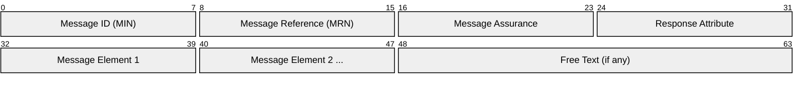
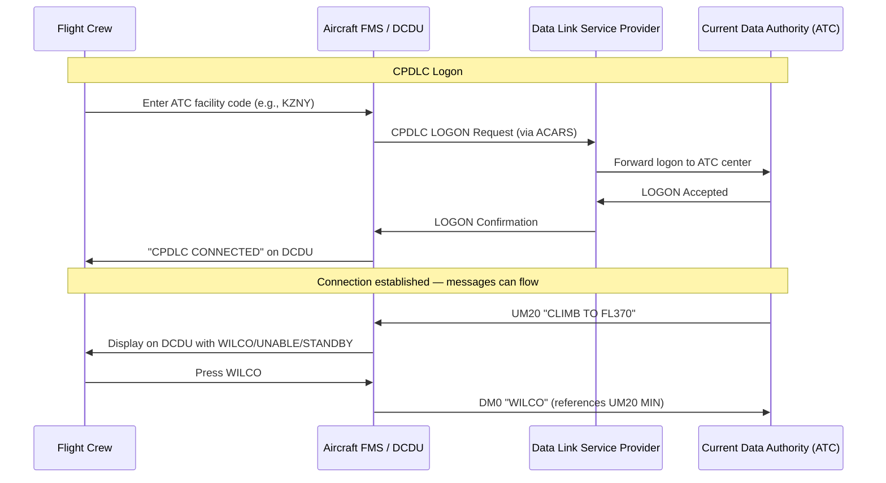
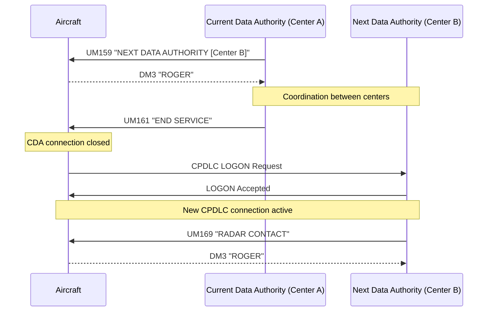
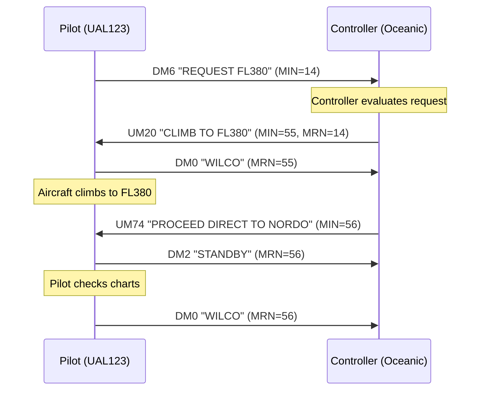
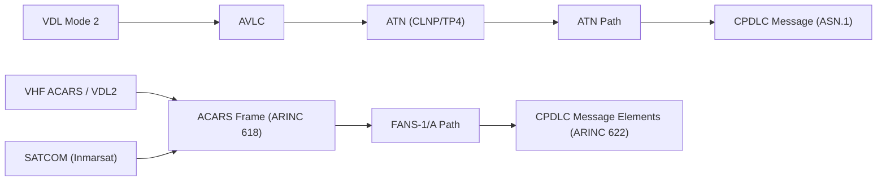

# CPDLC (Controller-Pilot Data Link Communications)

> **Standard:** [ICAO Doc 4444 (PANS-ATM)](https://www.icao.int/) / [RTCA DO-258A](https://www.rtca.org/) | **Layer:** Application (over ACARS or ATN) | **Wireshark filter:** N/A (carried over ACARS or ATN stack)

CPDLC is a digital text-based communication system that supplements (and in some airspace replaces) voice radio between air traffic controllers and pilots. Instead of spoken clearances on congested VHF frequencies, CPDLC delivers standardized message elements as selectable text on cockpit displays, with defined response options (WILCO, UNABLE, STANDBY). Two implementations exist: FANS-1/A CPDLC, which runs over ACARS for oceanic and remote airspace (deployed since the mid-1990s across the Pacific, Atlantic, and Indian oceans), and ATN-based CPDLC (ATN B1), which uses the OSI-based Aeronautical Telecommunication Network for domestic and European airspace (Link 2000+).

## CPDLC Message Structure

Note: CPDLC messages are encoded as structured data elements within ACARS (FANS-1/A) or ATN ULCS/ACSE frames, not as a standalone binary frame. The diagram above represents the logical message structure.

## Key Fields

| Field | Description |
|-------|-------------|
| Message ID (MIN) | Message Identification Number — sequence number assigned by originator |
| Message Reference (MRN) | References the MIN of the message being responded to |
| Message Assurance | Indicates whether message delivery confirmation is required |
| Response Attribute | Specifies which responses are valid (W/U = WILCO/UNABLE, A/N = AFFIRM/NEGATIVE, R = ROGER, Y = YES/NO) |
| Message Element | Standardized uplink (UM) or downlink (DM) element with parameters |
| Free Text | Optional unformatted text (discouraged for operational use) |

## Message Types

### Uplink Messages (UM) — ATC to Pilot

| Tag | Message | Response |
|-----|---------|----------|
| UM19 | MAINTAIN [level] | W/U |
| UM20 | CLIMB TO [level] | W/U |
| UM23 | DESCEND TO [level] | W/U |
| UM46 | CROSS [position] AT [level] | W/U |
| UM47 | CROSS [position] AT OR ABOVE [level] | W/U |
| UM74 | PROCEED DIRECT TO [position] | W/U |
| UM77 | AT [position] PROCEED DIRECT TO [position] | W/U |
| UM79 | CLEARED TO [position] VIA [route] | W/U |
| UM80 | CLEARED [route clearance] | W/U |
| UM94 | TURN LEFT HEADING [degrees] | W/U |
| UM95 | TURN RIGHT HEADING [degrees] | W/U |
| UM106 | MAINTAIN [speed] | W/U |
| UM116 | RESUME NORMAL SPEED | W/U |
| UM169 | RADAR CONTACT | R |
| UM170 | RADAR CONTACT LOST | R |
| UM171 | RADAR SERVICE TERMINATED | R |
| UM179 | SQUAWK [code] | W/U |
| UM183 | [free text] | R/W/U |
| UM190 | REPORT HEADING | Y |
| UM215 | TURN LEFT/RIGHT [degrees] DEGREES | W/U |
| UM228 | REPORT ETA [position] | Y |

### Downlink Messages (DM) — Pilot to ATC

| Tag | Message | Response |
|-----|---------|----------|
| DM0 | WILCO | N/A |
| DM1 | UNABLE | N/A |
| DM2 | STANDBY | N/A |
| DM3 | ROGER | N/A |
| DM4 | AFFIRM | N/A |
| DM5 | NEGATIVE | N/A |
| DM6 | REQUEST [level] | Y |
| DM9 | REQUEST CLIMB TO [level] | Y |
| DM10 | REQUEST DESCENT TO [level] | Y |
| DM15 | REQUEST HEADING [degrees] | Y |
| DM18 | REQUEST [speed] | Y |
| DM22 | REQUEST DIRECT TO [position] | Y |
| DM25 | REQUEST [route clearance] | Y |
| DM27 | REQUEST WEATHER DEVIATION TO [position] VIA [route] | Y |
| DM48 | POSITION REPORT | N/A |
| DM62 | ERROR [error information] | N/A |
| DM63 | NOT CURRENT DATA AUTHORITY | N/A |
| DM67 | [free text] | Y |
| DM80 | DEVIATING [direction] OF ROUTE [distance] | N/A |

## Response Types

| Response | Code | Meaning |
|----------|------|---------|
| WILCO | DM0 | Will comply — pilot accepts and will execute the clearance |
| UNABLE | DM1 | Unable to comply — pilot cannot execute (with optional reason) |
| STANDBY | DM2 | Need more time to evaluate — must follow up with WILCO or UNABLE |
| ROGER | DM3 | Message received and understood (no action required) |
| AFFIRM | DM4 | Yes (in response to a question) |
| NEGATIVE | DM5 | No (in response to a question) |

## CPDLC Logon and Connection

## Transfer of Data Authority

When an aircraft transitions between ATC sectors or centers, the CPDLC connection transfers:

## Clearance Exchange Example

## FANS-1/A vs ATN CPDLC

| Feature | FANS-1/A CPDLC | ATN B1 CPDLC (Link 2000+) |
|---------|----------------|---------------------------|
| Transport | ACARS (ARINC 622/620) | ATN (OSI stack, TP4/CLNP) |
| Airspace | Oceanic, remote | Continental (Europe, domestic) |
| Encoding | Character-oriented (ARINC 622) | ASN.1 BER/PER |
| Latency requirement | <4 minutes (oceanic) | <60 seconds (en-route) |
| Deployed regions | NAT, PAC, Indian Ocean, South Atlantic | EUROCONTROL LINK 2000+ airspace |
| Connection management | FANS logon/logoff | ATN CM (Context Management) |
| Voice backup | HF radio | VHF radio |

## Operational Parameters

| Parameter | Value |
|-----------|-------|
| Message delivery time (target) | <60 seconds (continental), <4 min (oceanic) |
| Pilot response time (expected) | <120 seconds for RA-required messages |
| CPDLC timeout (no response) | 5 minutes (controller typically follows up via voice) |
| Max message elements per message | Multiple elements allowed, but typically 1-3 |
| Emergency use | Not primary — voice radio remains primary for emergencies |

## Deployment

| Region / Program | Implementation | Status |
|------------------|----------------|--------|
| North Atlantic (NAT) | FANS-1/A over SATCOM/HF | Operational since ~1995 |
| Pacific (NOPAC, CENPAC) | FANS-1/A over SATCOM | Operational |
| Indian Ocean | FANS-1/A over SATCOM | Operational |
| South Atlantic (SAT) | FANS-1/A over SATCOM | Operational |
| Europe (Link 2000+) | ATN B1 over VDL Mode 2 | Operational (Maastricht UAC, DSNA, etc.) |
| US domestic | FANS-1/A (en-route, limited) | Expanding (FAA DataComm program) |
| Australia | FANS-1/A over SATCOM | Operational (oceanic) |

## Encapsulation

## Standards

| Document | Title |
|----------|-------|
| [ICAO Doc 4444 (PANS-ATM)](https://www.icao.int/) | Procedures for Air Navigation Services — Air Traffic Management |
| [RTCA DO-258A](https://www.rtca.org/) | Interoperability Requirements for ATS Applications Using ARINC 622 |
| [EUROCAE ED-110B](https://www.eurocae.net/) | Initial CPDLC MASPS (Minimum Aviation System Performance Standard) |
| [ICAO Doc 9694](https://www.icao.int/) | Manual of Air Traffic Services Data Link Applications |
| [GOLD (Global Operational Data Link)](https://www.icao.int/) | Guidance for operational implementation of data link |
| [ARINC 622](https://www.aviation-ia.com/) | ATS Data Link Application over ACARS Air-Ground Network |
| [ARINC 620](https://www.aviation-ia.com/) | Data Link Ground System Standard (FANS-1/A) |
| [ICAO Annex 10 Vol III](https://www.icao.int/) | Aeronautical Telecommunications — Communication Systems |

## See Also

- [ACARS](acars.md) — transport layer for FANS-1/A CPDLC messages
- [Mode S](modes.md) — secondary surveillance radar (SSR) transponder protocol
- [ASTERIX](asterix.md) — ATC surveillance data exchange format
- [METAR / TAF](metar.md) — aviation weather reports (weather drives CPDLC re-route requests)
