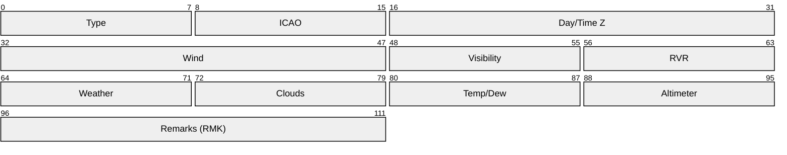
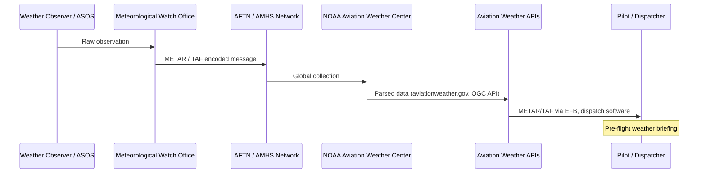

# METAR / TAF (Aviation Weather Reports)

> **Standard:** [ICAO Annex 3](https://www.icao.int/) / [WMO Manual on Codes](https://library.wmo.int/) | **Layer:** Application (text format) | **Wireshark filter:** N/A (text format, distributed via AFTN or HTTP APIs)

METAR (Meteorological Aerodrome Report) and TAF (Terminal Aerodrome Forecast) are standardized text formats for aviation weather. METAR reports current observed conditions at an airport, issued every 30 or 60 minutes. TAF provides a forecast for the next 24-30 hours. Both use a compact, fixed-order encoding that pilots and dispatchers can read at a glance. SPECI is a special unscheduled METAR issued when conditions change significantly. These reports are distributed via AFTN (Aeronautical Fixed Telecommunication Network), AMHS, NOAA Aviation Weather Center, and numerous aviation weather APIs.

## METAR Field Layout



Note: METAR is a text format — the packet diagram above represents the logical field order, not binary framing.

## Example Decode

Raw METAR:
```
METAR KJFK 211756Z 31012G20KT 10SM FEW250 M02/M17 A3042 RMK AO2 SLP308
```

| Field | Value | Meaning |
|-------|-------|---------|
| Type | `METAR` | Routine weather observation |
| ICAO | `KJFK` | John F. Kennedy International Airport |
| Day/Time | `211756Z` | 21st day of month, 17:56 UTC |
| Wind | `31012G20KT` | From 310 degrees, 12 knots gusting 20 knots |
| Visibility | `10SM` | 10 statute miles |
| Clouds | `FEW250` | Few clouds at 25,000 ft AGL |
| Temp/Dew | `M02/M17` | Temperature -2C, dewpoint -17C |
| Altimeter | `A3042` | 30.42 inHg altimeter setting |
| Remarks | `RMK AO2 SLP308` | Automated station type 2, sea-level pressure 1030.8 hPa |

## Key Fields

| Field | Format | Description |
|-------|--------|-------------|
| Type | `METAR` or `SPECI` | METAR = routine, SPECI = special (unscheduled, significant change) |
| ICAO Identifier | 4 letters | Airport code (e.g., KJFK, EGLL, LFPG) |
| Date/Time | `ddhhmmZ` | Day of month, hour, minute, always Zulu (UTC) |
| Wind | `dddssGggKT` | Direction (degrees true), speed, gusts, in knots |
| Visibility | `nnSM` or `nnnn` | Statute miles (US) or meters (ICAO) |
| RVR | `Rnn/nnnnFT` | Runway Visual Range — specific runway, in feet or meters |
| Weather | `[+-]xxxx` | Present weather phenomena (intensity + descriptor + type) |
| Clouds | `xxxnnn[CB/TCU]` | Coverage + height in hundreds of feet AGL |
| Temperature | `TT/TD` | Temperature / dewpoint in Celsius, M prefix = negative |
| Altimeter | `Annnn` or `Qnnnn` | inHg (US) or hPa (ICAO) |
| Remarks | `RMK ...` | Supplementary data (automated station type, sea-level pressure, etc.) |

## Field Details

### Wind

| Format | Example | Meaning |
|--------|---------|---------|
| `dddssKT` | `27015KT` | From 270 degrees at 15 knots |
| `dddssGggKT` | `31012G25KT` | From 310 at 12 gusting 25 knots |
| `VRBssKT` | `VRB03KT` | Variable direction at 3 knots |
| `dddssKT dddVddd` | `24010KT 210V270` | Variable between 210 and 270 degrees |
| `00000KT` | `00000KT` | Calm |

### Visibility

| Format | Region | Example | Meaning |
|--------|--------|---------|---------|
| `nnSM` | US | `10SM` | 10 statute miles |
| `n n/nSM` | US | `1 1/2SM` | 1.5 statute miles |
| `nnnn` | ICAO | `9999` | 10 km or greater |
| `nnnn` | ICAO | `0800` | 800 meters |
| `CAVOK` | ICAO | `CAVOK` | Ceiling and Visibility OK (vis >10 km, no significant weather, no clouds below 5000 ft) |

### Weather Phenomena

#### Intensity

| Prefix | Meaning |
|--------|---------|
| `-` | Light |
| (none) | Moderate |
| `+` | Heavy |
| `VC` | In vicinity (5-10 SM from airport) |

#### Descriptor

| Code | Meaning |
|------|---------|
| `TS` | Thunderstorm |
| `SH` | Showers |
| `FZ` | Freezing |
| `DR` | Low drifting |
| `BL` | Blowing |
| `MI` | Shallow |
| `PR` | Partial |
| `BC` | Patches |

#### Precipitation

| Code | Meaning |
|------|---------|
| `RA` | Rain |
| `SN` | Snow |
| `DZ` | Drizzle |
| `GR` | Hail (>5mm) |
| `GS` | Small hail/snow pellets |
| `PL` | Ice pellets |
| `SG` | Snow grains |
| `IC` | Ice crystals |
| `UP` | Unknown precipitation (automated) |

#### Obscuration

| Code | Meaning |
|------|---------|
| `FG` | Fog (visibility <1 km) |
| `BR` | Mist (visibility 1-5 km) |
| `HZ` | Haze |
| `FU` | Smoke |
| `SA` | Sand |
| `DU` | Dust |

### Cloud Coverage

| Code | Coverage | Oktas |
|------|----------|-------|
| `SKC` | Sky clear | 0 (manual) |
| `CLR` | Clear | 0 (automated, no clouds below 12,000 ft) |
| `FEW` | Few | 1-2 |
| `SCT` | Scattered | 3-4 |
| `BKN` | Broken | 5-7 |
| `OVC` | Overcast | 8 |
| `VV` | Vertical visibility (sky obscured) | N/A |

Height is encoded in hundreds of feet AGL: `SCT025` = scattered at 2,500 ft, `OVC005` = overcast at 500 ft. Suffix `CB` indicates cumulonimbus, `TCU` indicates towering cumulus.

### Temperature / Dewpoint

| Format | Example | Meaning |
|--------|---------|---------|
| `TT/TD` | `22/15` | 22C temperature, 15C dewpoint |
| `MTT/MTD` | `M02/M17` | -2C temperature, -17C dewpoint |
| `TT/` | `15/` | Dewpoint missing |

### Altimeter Setting

| Format | Region | Example | Meaning |
|--------|--------|---------|---------|
| `Annnn` | US, Canada | `A3042` | 30.42 inches of mercury |
| `Qnnnn` | ICAO (rest of world) | `Q1013` | 1013 hPa (hectopascals) |

## TAF (Terminal Aerodrome Forecast)

TAF follows a similar field structure but adds forecast change groups:

### TAF Example

```
TAF KJFK 211730Z 2118/2224 31015G25KT P6SM FEW250
  TEMPO 2118/2122 4SM -SNBR BKN020
  FM220200 28008KT P6SM SCT040
  BECMG 2210/2212 18012KT
```

### TAF Change Groups

| Keyword | Format | Description |
|---------|--------|-------------|
| `FM` | `FMddhhmm` | From — abrupt change at specified time |
| `BECMG` | `BECMG ddhh/ddhh` | Becoming — gradual change over time period |
| `TEMPO` | `TEMPO ddhh/ddhh` | Temporary — fluctuations expected during period |
| `PROB30` | `PROB30 ddhh/ddhh` | 30% probability of conditions during period |
| `PROB40` | `PROB40 ddhh/ddhh` | 40% probability of conditions during period |

### TAF Validity

| Format | Example | Meaning |
|--------|---------|---------|
| `ddhh/ddhh` | `2118/2224` | Valid from 21st 18:00Z to 22nd 24:00Z (30 hours) |

## SPECI (Special Observation)

SPECI is issued when significant changes occur between routine METAR reports:

| Trigger | Condition |
|---------|-----------|
| Visibility | Drops below or rises above 3, 2, 1.5, 1, 0.5 SM thresholds |
| Ceiling | Drops below or rises above 3000, 1500, 1000, 500, 200 ft thresholds |
| Tornado/Funnel | Observed |
| Thunderstorm | Begins or ends at the airport |
| Freezing precip | Begins or ends |
| Wind shift | Direction change of 45+ degrees in <15 minutes |

## Distribution



## Related Formats

| Format | Description |
|--------|-------------|
| METAR | Routine aviation weather observation |
| SPECI | Special (unscheduled) observation |
| TAF | Terminal area forecast (24-30 hours) |
| SIGMET | Significant meteorological information (en-route) |
| AIRMET | Airmen's meteorological information (less severe) |
| PIREP | Pilot report (in-flight weather conditions) |
| NOTAM | Notices to Air Missions (runway closures, hazards) |

## Standards

| Document | Title |
|----------|-------|
| [ICAO Annex 3](https://www.icao.int/) | Meteorological Service for International Air Navigation |
| [WMO Manual on Codes (WMO-306)](https://library.wmo.int/) | International Codes — Vol I.1, Part A (FM 15 METAR, FM 51 TAF) |
| [FAA Order 7900.5](https://www.faa.gov/) | Surface Weather Observing (ASOS/AWOS) |
| [FAA AC 00-45](https://www.faa.gov/) | Aviation Weather Services |

## See Also

- [ACARS](acars.md) — data link that carries weather requests and METAR uplinks to aircraft
- [ASTERIX](asterix.md) — ATC surveillance data (CAT 008 carries weather radar data)
- [CPDLC](cpdlc.md) — digital ATC communications (weather may prompt re-routes)
