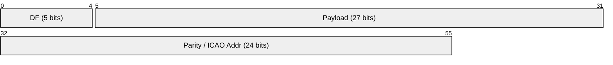
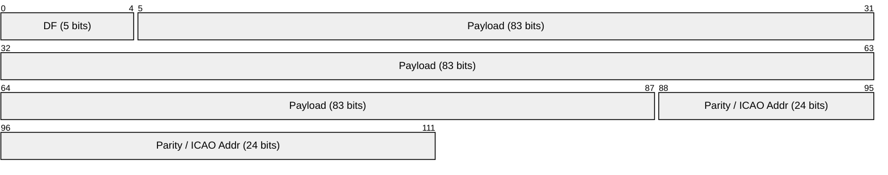
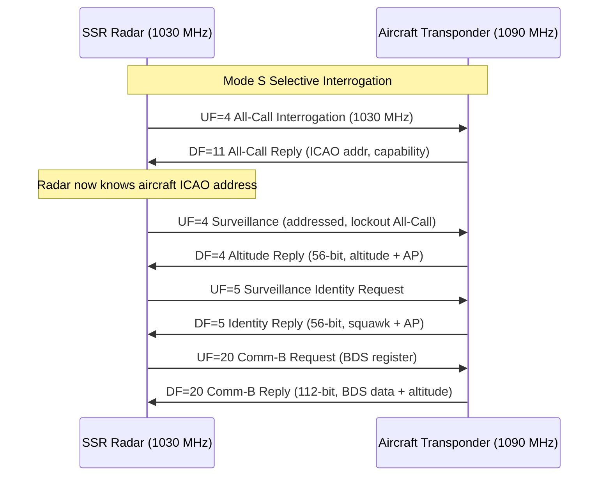
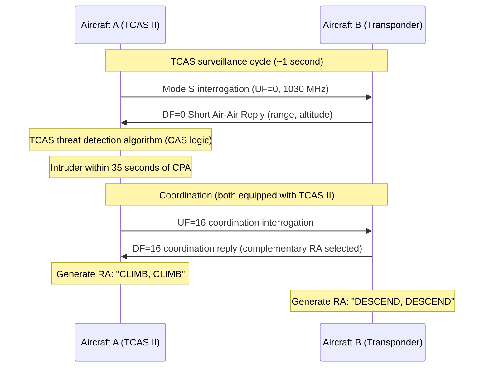
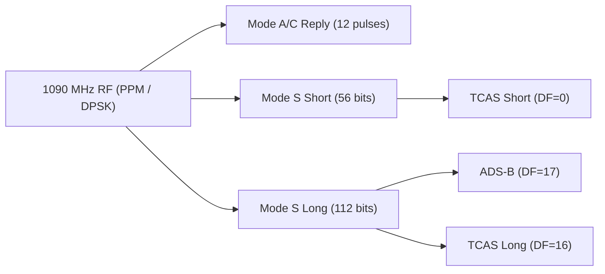

# Mode S / Mode A/C / TCAS (Secondary Surveillance Radar)

> **Standard:** [ICAO Annex 10 Vol IV](https://www.icao.int/) / [RTCA DO-260B](https://www.rtca.org/) | **Layer:** Physical / Data Link (1090 MHz RF) | **Wireshark filter:** N/A (radio protocol, decoded by dump1090 / readsb)

Mode S (Mode Select) is a secondary surveillance radar (SSR) interrogation-reply protocol used by ATC to identify and track aircraft. It extends the earlier Mode A (identity/squawk code) and Mode C (altitude) with 24-bit unique aircraft addressing, selective interrogation, and data link capabilities. Mode S is also the physical layer for ADS-B Extended Squitter (DF=17) and provides the surveillance foundation for TCAS (Traffic Alert and Collision Avoidance System). All interrogations transmit on 1030 MHz; all replies and squitters transmit on 1090 MHz.

## Mode A/C (Legacy SSR)

Mode A and Mode C are the original SSR transponder modes, still in widespread use alongside Mode S.

### Mode A (Identity)

| Parameter | Value |
|-----------|-------|
| Purpose | Aircraft identity (squawk code) |
| Encoding | 12 pulse positions → 4 octal digits (0000-7777) |
| Total codes | 4096 |
| Interrogation | 1030 MHz, P1-P3 spacing = 8 us |

#### Special Squawk Codes

| Code | Meaning |
|------|---------|
| 7700 | Emergency / distress |
| 7600 | Radio failure (communications lost) |
| 7500 | Hijack / unlawful interference |
| 1200 | VFR (US default) |
| 2000 | Entering controlled airspace (ICAO default) |

### Mode C (Altitude)

| Parameter | Value |
|-----------|-------|
| Purpose | Pressure altitude |
| Encoding | 12-bit Gillham (Gray) code |
| Resolution | 100 ft increments |
| Range | -1200 to 126,700 ft |
| Interrogation | 1030 MHz, P1-P3 spacing = 21 us |

## Mode S Short Message (56 bits)

## Mode S Long Message (112 bits)

## Key Fields

| Field | Size | Description |
|-------|------|-------------|
| DF | 5 bits | Downlink Format — identifies the reply type |
| CA | 3 bits | Capability — transponder capability level (in DF=11/17) |
| AA | 24 bits | Aircraft Address — ICAO 24-bit unique identifier |
| AP | 24 bits | Address/Parity — CRC-24 remainder XORed with ICAO address |
| PI | 24 bits | Parity/Interrogator ID — for addressed replies |
| ME | 56 bits | Extended Squitter message (in DF=17, contains ADS-B data) |
| MB | 56 bits | Comm-B message field (in DF=20/21) |

## Downlink Formats (DF)

| DF | Name | Length | Description |
|----|------|--------|-------------|
| 0 | Short Air-Air Surveillance | 56 bits | ACAS/TCAS short reply |
| 4 | Surveillance Altitude Reply | 56 bits | Altitude in response to ground interrogation |
| 5 | Surveillance Identity Reply | 56 bits | Squawk code in response to ground interrogation |
| 11 | All-Call Reply | 56 bits | Acquisition squitter — broadcast ICAO address and capability |
| 16 | Long Air-Air Surveillance | 112 bits | ACAS/TCAS long reply (with resolution advisory data) |
| 17 | Extended Squitter (ADS-B) | 112 bits | Unsolicited broadcast: position, velocity, ID |
| 18 | Extended Squitter (non-transponder) | 112 bits | TIS-B and ADS-R messages |
| 20 | Comm-B with Altitude | 112 bits | Ground interrogation response with BDS register data + altitude |
| 21 | Comm-B with Identity | 112 bits | Ground interrogation response with BDS register data + squawk |

## Mode S Interrogation / Reply

## TCAS (Traffic Alert and Collision Avoidance System)

TCAS II interrogates nearby Mode S and Mode A/C transponders to build a picture of surrounding traffic and generate collision avoidance advisories independent of ATC.

### TCAS Advisory Types

| Advisory | Abbreviation | Description |
|----------|--------------|-------------|
| Traffic Advisory | TA | Warning: traffic detected, pilot awareness |
| Resolution Advisory | RA | Command: climb, descend, or maintain vertical rate |

### TCAS Resolution Advisory (RA) Types

| RA | Vertical Command |
|----|-----------------|
| Climb | Climb at 1500-2500 fpm |
| Descend | Descend at 1500-2500 fpm |
| Adjust Vertical Speed | Reduce climb/descent rate |
| Maintain Vertical Speed | Continue current vertical rate |
| Monitor Vertical Speed | Do not exceed specified rate |
| Level Off | Return to level flight |
| Crossing | Climb/descend through intruder's altitude |
| Reversal | Reverse a previous RA |

### TCAS Interrogation / Reply Sequence

### TCAS Parameters

| Parameter | Value |
|-----------|-------|
| Surveillance range | ~14 nm (Mode S), ~7 nm (Mode A/C) |
| TA threshold | ~35 seconds to CPA (varies by altitude) |
| RA threshold | ~25 seconds to CPA (varies by altitude) |
| Update rate | ~1 second |
| Vertical resolution | 25 ft or 100 ft |

## RF Parameters

| Parameter | Value |
|-----------|-------|
| Interrogation frequency | 1030 MHz |
| Reply frequency | 1090 MHz |
| Pulse modulation | PPM (Mode A/C), DPSK-on-pulse (Mode S) |
| Mode S short reply | 56 bits, 8 us preamble + 56 us data |
| Mode S long reply | 112 bits, 8 us preamble + 112 us data |
| Bit rate | 1 Mbps |
| Power (transponder) | Typically 125-500 W peak |

## Hobbyist Decoding

| Tool | Description |
|------|-------------|
| RTL-SDR | USB software-defined radio dongle, 1090 MHz reception |
| dump1090 | Open-source Mode S / ADS-B decoder |
| readsb | Enhanced fork of dump1090 with additional features |
| tar1090 | Web-based visualization for dump1090/readsb |
| FlightAware / Flightradar24 | Community feed networks aggregating 1090 MHz data |

## Encapsulation

## Standards

| Document | Title |
|----------|-------|
| [ICAO Annex 10 Vol IV](https://www.icao.int/) | Surveillance and Collision Avoidance Systems |
| [RTCA DO-260B](https://www.rtca.org/) | Minimum Operational Performance Standards for 1090 MHz ADS-B |
| [RTCA DO-181E](https://www.rtca.org/) | Minimum Operational Performance Standards for TCAS II |
| [EUROCAE ED-73E](https://www.eurocae.net/) | TCAS II MOPS (European equivalent of DO-181E) |
| [ICAO Doc 9871](https://www.icao.int/) | Technical Provisions for Mode S Services and Extended Squitter |

## See Also

- [ACARS](acars.md) — VHF data link messaging for aircraft
- [ASTERIX](asterix.md) — ATC surveillance data exchange format (carries decoded Mode S data)
- [CPDLC](cpdlc.md) — digital controller-pilot communications
