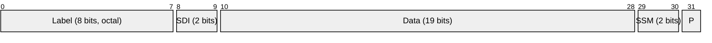
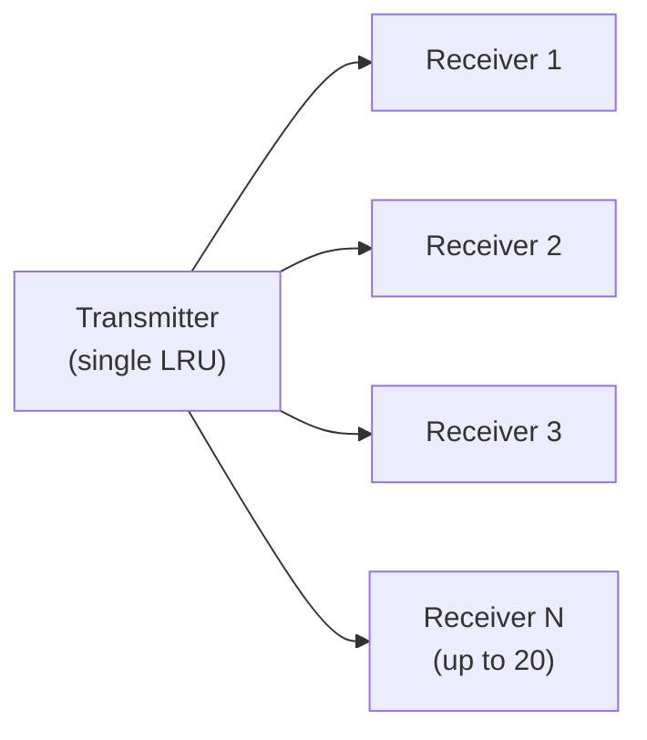
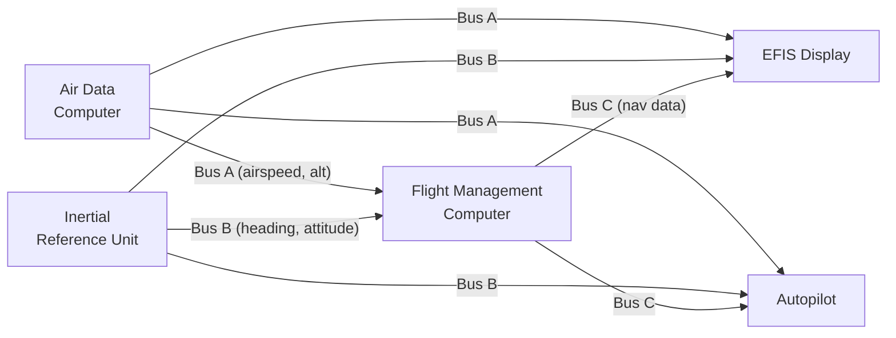

# ARINC 429 (Aeronautical Radio, Incorporated)

> **Standard:** [ARINC Specification 429](https://aviation-ia.sae-itc.com/) | **Layer:** Physical / Data Link | **Wireshark filter:** N/A (avionics bus; dedicated analyzer equipment)

ARINC 429 is the most widely used avionics data bus in commercial aircraft. Defined in 1977 and still in use today, it provides a simple, reliable, simplex (one-way) broadcast link where a single transmitter sends 32-bit data words to up to 20 receivers over a twisted-pair cable. The protocol encodes avionics parameters — airspeed, altitude, heading, navigation data, and system status — in a well-defined word format with self-identifying labels. Its simplicity and fault tolerance make it the backbone of flight data exchange on aircraft from the Boeing 737 to the Airbus A320.

## 32-Bit Word Format



## Key Fields

| Field | Bits | Size | Description |
|-------|------|------|-------------|
| Label | 0-7 | 8 bits | Parameter identifier (transmitted LSB first, encoded in octal) |
| SDI | 8-9 | 2 bits | Source/Destination Identifier — distinguishes multiple sources or receivers |
| Data | 10-28 | 19 bits | Parameter value (BNR, BCD, or discrete) |
| SSM | 29-30 | 2 bits | Sign/Status Matrix — data validity and sign |
| Parity | 31 | 1 bit | Odd parity over all 32 bits |

## Field Details

### Label (Bits 0-7)

Labels are 8-bit identifiers transmitted LSB first and conventionally expressed in octal. The label identifies what parameter the word carries:

| Label (Octal) | Parameter | Description |
|---------------|-----------|-------------|
| 010 | Discrete Data 1 | System discretes |
| 011 | Computed Airspeed | Airspeed in knots |
| 012 | Mach Number | Mach speed |
| 014 | True Airspeed | TAS in knots |
| 035 | Altitude (baro) | Barometric altitude |
| 036 | Altitude Rate | Vertical speed |
| 044 | Heading (true) | True heading in degrees |
| 045 | Heading (mag) | Magnetic heading in degrees |
| 101 | ILS Localizer Deviation | Lateral guidance |
| 102 | ILS Glideslope Deviation | Vertical guidance |
| 110 | VOR Bearing | VOR station bearing |
| 133 | DME Distance | Distance to station |
| 203 | Latitude | Aircraft latitude |
| 204 | Longitude | Aircraft longitude |
| 251 | Time of Day | UTC time |
| 270 | Discrete Word | System status discretes |
| 310 | GPS Latitude | GPS position |
| 311 | GPS Longitude | GPS position |
| 350 | Radio Altitude | Radar altimeter |

### SDI (Bits 8-9)

| SDI | Meaning |
|-----|---------|
| 00 | All receivers / no source ID |
| 01 | Source/receiver 1 (e.g., left system) |
| 10 | Source/receiver 2 (e.g., right system) |
| 11 | Source/receiver 3 (e.g., center system) |

In some label definitions, SDI bits are incorporated into the data field, extending it to 21 bits.

### Data Encoding Types

#### BNR (Binary)

Two's complement binary representation with defined resolution and range:

| Example Label | Parameter | Resolution | Range |
|---------------|-----------|------------|-------|
| 203 (Latitude) | Degrees | 180/2^20 | -180 to +180 |
| 035 (Altitude) | Feet | 131072/2^19 | -131072 to +131072 |
| 011 (Airspeed) | Knots | 0.0625 | 0 to 1024 |

#### BCD (Binary Coded Decimal)

Each 4-bit nibble encodes one decimal digit (0-9):

| Bit Range | Content |
|-----------|---------|
| 10-13 | Ones digit |
| 14-17 | Tens digit |
| 18-21 | Hundreds digit |
| 22-25 | Thousands digit |
| 26-28 | Ten-thousands (3 bits) |

#### Discrete

Individual bits represent ON/OFF states, flags, or enumerated selections:

| Bit | Meaning (example) |
|-----|-------------------|
| 10 | System ready |
| 11 | Warning flag |
| 12-13 | Mode selection (00=off, 01=mode1, 10=mode2) |

### SSM (Bits 29-30)

The SSM interpretation depends on the data encoding type:

#### BNR Data SSM

| SSM | Meaning |
|-----|---------|
| 00 | Failure Warning |
| 01 | No Computed Data |
| 10 | Functional Test |
| 11 | Normal Operation |

#### BCD Data SSM

| SSM | Meaning |
|-----|---------|
| 00 | Plus, North, East, Right, To, Above |
| 01 | No Computed Data |
| 10 | Functional Test |
| 11 | Minus, South, West, Left, From, Below |

#### Discrete Data SSM

| SSM | Meaning |
|-----|---------|
| 00 | Verified Data / Normal |
| 01 | No Computed Data |
| 10 | Functional Test |
| 11 | Failure Warning |

## Electrical Characteristics

| Parameter | High Speed | Low Speed |
|-----------|-----------|-----------|
| Bit Rate | 100 kbps | 12.5 kbps |
| Bit Period | 10 us | 80 us |
| Voltage (differential) | +/-10V (+/-1V null) | +/-10V (+/-1V null) |
| Cable | Shielded twisted pair | Shielded twisted pair |
| Impedance | 75 ohm | 75 ohm |
| Encoding | Bipolar RZ (Return-to-Zero) | Bipolar RZ |

### Signaling

```
High:   +10V ──┐    ┌── +10V
                │    │
Null:    0V  ───┘    └── 0V
                │    │
Low:   -10V ────┘    └── -10V

         Bit 1    Bit 0    Gap
```

- Logic 1 = High-then-Low within the bit period (bipolar return-to-zero)
- Logic 0 = Low-then-High within the bit period
- Null (0V) = bit boundary / inter-word gap

## Bus Topology (Simplex)



A single transmitter broadcasts to up to 20 receivers. Each parameter stream requires a dedicated wire pair. Bidirectional communication requires two separate buses (one in each direction).

### Typical Aircraft Wiring



## Word Transmission

| Parameter | Value |
|-----------|-------|
| Word length | 32 bits |
| Inter-word gap | Minimum 4 bit times (40 us at high speed) |
| Transmission rate | Up to ~2500 words/sec (high speed) |
| Bit order | LSB first (label), MSB first (data) |

Note: The label field is transmitted LSB first (bit 0 first), which is why octal label numbers appear bit-reversed relative to the wire order. The data field is transmitted MSB first.

## Standards

| Document | Title |
|----------|-------|
| [ARINC 429](https://aviation-ia.sae-itc.com/) | Mark 33 Digital Information Transfer System (DITS) |
| [ARINC 429P1-18](https://aviation-ia.sae-itc.com/) | Part 1 — Functional Description, Electrical Interface, Label Assignments |
| [ARINC 429P2-19](https://aviation-ia.sae-itc.com/) | Part 2 — Standard Data Formats |
| [ARINC 429P3-17](https://aviation-ia.sae-itc.com/) | Part 3 — Data Standards |

## See Also

- [MIL-STD-1553](milstd1553.md) — military avionics bus (bidirectional, command/response)
- [CAN](can.md) — automotive bus (similar simplicity, different domain)
