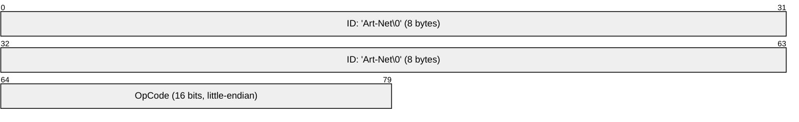
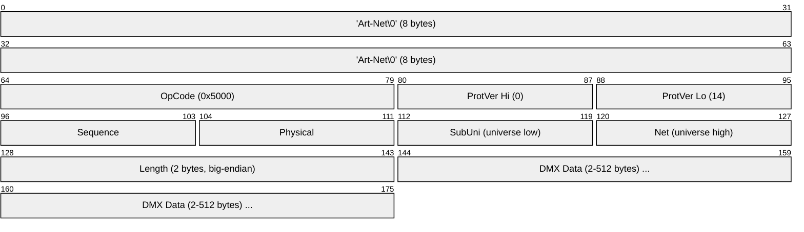
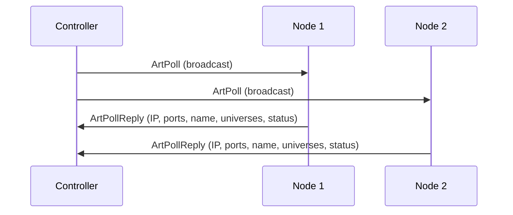
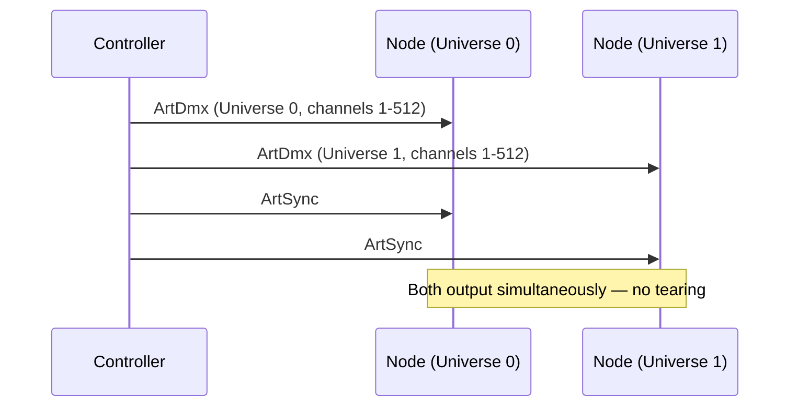

# Art-Net

> **Standard:** [Art-Net 4 (Artistic Licence)](https://art-net.org.uk/) | **Layer:** Application (Layer 7) | **Wireshark filter:** `artnet`

Art-Net is an open protocol for transmitting DMX512 lighting data over Ethernet/IP networks. It encapsulates DMX universes in UDP packets (port 6454), allowing lighting consoles to control fixtures across standard IT infrastructure instead of dedicated DMX cabling. Art-Net 4 supports up to 32,768 universes (over 16 million channels), discovery of nodes, RDM tunneling, and synchronization. It is the most widely deployed DMX-over-Ethernet protocol, used in concerts, theatre, architectural lighting, and broadcast studios.

## Packet Header

All Art-Net packets begin with a common header:

The 8-byte ASCII string `Art-Net\0` (null-terminated) identifies the packet. The OpCode determines the packet type.

## Key Packet Types

| OpCode | Name | Description |
|--------|------|-------------|
| 0x2000 | ArtPoll | Controller discovers nodes on the network |
| 0x2100 | ArtPollReply | Node responds with capabilities and status |
| 0x5000 | ArtDmx (ArtOutput) | **DMX data** — carries one universe of 512 channels |
| 0x5200 | ArtSync | Synchronization — nodes hold output until sync received |
| 0x7000 | ArtTodRequest | Request Table of Devices (RDM discovery) |
| 0x7100 | ArtTodData | Table of Devices response (RDM UIDs) |
| 0x7200 | ArtTodControl | RDM discovery control |
| 0x7300 | ArtRdm | Tunneled RDM message |
| 0x6000 | ArtAddress | Re-program node settings (universe, name, merge mode) |
| 0xF000 | ArtInput | Set input enable/disable on a node |
| 0x9700 | ArtTimeCode | Distribute SMPTE time code |
| 0x9800 | ArtTimeSync | NTP-based time synchronization |

## ArtDmx Packet (OpCode 0x5000)

The most common packet — carries one universe of DMX data:

| Field | Size | Description |
|-------|------|-------------|
| ID | 8 bytes | `Art-Net\0` identifier |
| OpCode | 16 bits | 0x5000 (little-endian) |
| ProtVer | 16 bits | Protocol version (14) |
| Sequence | 8 bits | Sequence counter (1-255, 0 = disable reordering) |
| Physical | 8 bits | Physical DMX port this data came from |
| SubUni | 8 bits | Low byte of the 15-bit universe address |
| Net | 8 bits | High 7 bits of the 15-bit universe address |
| Length | 16 bits | DMX data length (2-512, must be even, big-endian) |
| Data | 2-512 bytes | DMX channel values (channel 1 at offset 0) |

### Universe Addressing

Art-Net 4 uses a 15-bit universe address:

| Field | Range | Calculation |
|-------|-------|-------------|
| Universe (low 4 bits) | 0-15 | |
| Sub-Net (next 4 bits) | 0-15 | |
| Net (upper 7 bits) | 0-127 | |
| **Total address** | 0-32,767 | Net × 256 + Sub-Net × 16 + Universe |
| **Total channels** | 16,711,680 | 32,768 universes × 512 channels |

## ArtPoll / ArtPollReply (Discovery)

ArtPoll (broadcast to 2.255.255.255 or 10.255.255.255) discovers all Art-Net nodes:

### ArtPollReply Key Fields

| Field | Description |
|-------|-------------|
| IP Address | Node's IP |
| Port | UDP port (6454) |
| Short Name | 18-char node name |
| Long Name | 64-char node description |
| Num Ports | Number of DMX ports (1-4 typical) |
| Port Types | Input/output capability per port |
| Good Input/Output | Port status flags |
| SwIn/SwOut | Universe assignments per port |
| Style | Node type (controller, node, media server, etc.) |

## ArtSync (Synchronization)

Without sync, nodes update their DMX output as each ArtDmx packet arrives, causing visible tearing across universes. ArtSync solves this:

## Merge Modes

When multiple controllers send to the same universe, nodes merge using:

| Mode | Description |
|------|-------------|
| HTP (Highest Takes Precedence) | Per-channel maximum value wins (default) |
| LTP (Latest Takes Precedence) | Most recent packet wins |

## Art-Net IP Addressing

Art-Net traditionally uses the `2.x.x.x` or `10.x.x.x` private subnet:

| Network | Range | Usage |
|---------|-------|-------|
| 2.x.x.x | 2.0.0.1 - 2.255.255.254 | Art-Net primary (class A private) |
| 10.x.x.x | 10.0.0.1 - 10.255.255.254 | Art-Net alternative |
| Any | DHCP-assigned | Modern Art-Net 4 supports any subnet |

Broadcast address for discovery: `2.255.255.255` or `10.255.255.255` (or subnet broadcast).

## Art-Net vs sACN

| Feature | Art-Net | sACN (E1.31) |
|---------|---------|-------------|
| Standard body | Artistic Licence (proprietary, free) | ESTA/ANSI (open standard) |
| Transport | UDP unicast + broadcast | UDP **multicast** (or unicast) |
| Port | 6454 | 5568 |
| Discovery | ArtPoll/ArtPollReply | E1.31 Universe Discovery |
| Max universes | 32,768 | 63,999 |
| Sync | ArtSync | E1.31 Synchronization (Universe 63999) |
| RDM support | ArtRdm (tunneled) | Draft (E1.33 RDMnet) |
| Priority | HTP/LTP merge | Per-source priority (0-200) |
| Multicast | No (unicast + broadcast) | Yes (efficient for many receivers) |
| Adoption | Dominant in live entertainment | Growing, preferred for install |

## Encapsulation

## Standards

| Document | Title |
|----------|-------|
| [Art-Net 4 Specification](https://art-net.org.uk/) | Art-Net 4 Protocol (Artistic Licence, freely available) |
| [Art-Net 4 OEM Codes](https://art-net.org.uk/) | Manufacturer OEM code registration |

## See Also

- [sACN (E1.31)](sacn.md) — standards-based alternative (multicast)
- [DMX512](dmx512.md) — the lighting data Art-Net carries
- [Ethernet](../link-layer/ethernet.md) — physical transport
- [UDP](../transport-layer/udp.md) — Art-Net transport
