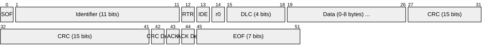
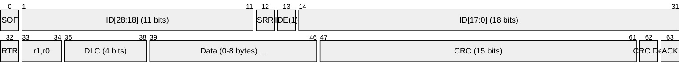
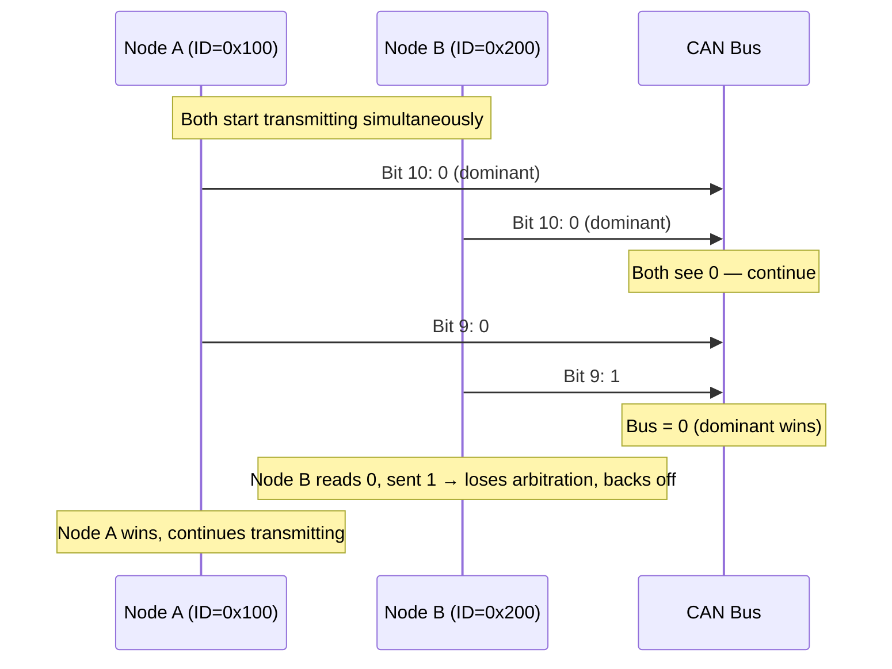
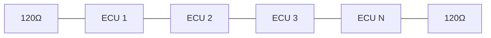

# CAN (Controller Area Network)

> **Standard:** [ISO 11898](https://www.iso.org/standard/63648.html) | **Layer:** Data Link / Physical | **Wireshark filter:** `can` (with SocketCAN capture)

CAN is a robust, multi-master serial bus developed by Bosch in 1986 for automotive applications. It uses differential signaling, priority-based bitwise arbitration, and built-in error detection to provide reliable communication in electrically noisy environments. CAN is the backbone of automotive networking (OBD-II, J1939), industrial automation (CANopen, DeviceNet), and medical devices. CAN FD (Flexible Data-Rate) extends the original standard with larger payloads and higher data rates.

## Frame (CAN 2.0A — Standard Frame)

## Frame (CAN 2.0B — Extended Frame)

## Key Fields

| Field | Size | Description |
|-------|------|-------------|
| SOF | 1 bit | Start of Frame — dominant (0), synchronizes all nodes |
| Identifier | 11 or 29 bits | Message priority and ID (lower value = higher priority) |
| RTR | 1 bit | Remote Transmission Request — 0 = data, 1 = remote request |
| IDE | 1 bit | Identifier Extension — 0 = standard (11-bit), 1 = extended (29-bit) |
| DLC | 4 bits | Data Length Code — number of data bytes (0-8) |
| Data | 0-64 bits | Payload (0-8 bytes) |
| CRC | 15 bits | Cyclic Redundancy Check |
| ACK | 1 bit | Acknowledgment — receiver drives dominant to acknowledge |
| EOF | 7 bits | End of Frame — 7 recessive (1) bits |
| IFS | 3+ bits | Inter-Frame Space — minimum gap between frames |

## Field Details

### Bus States

| State | CAN_H - CAN_L | Logic |
|-------|----------------|-------|
| Recessive (idle) | ~0V differential | 1 |
| Dominant | ~2V differential | 0 |

A dominant bit always overwrites a recessive bit — this is how arbitration works.

### Arbitration

When multiple nodes transmit simultaneously, they perform bitwise arbitration on the identifier field. Each transmitter monitors the bus — if it sends recessive (1) but reads dominant (0), another node with higher priority (lower ID) is transmitting and it backs off:

### Data Length Code (DLC)

CAN 2.0:

| DLC | Data Bytes |
|-----|------------|
| 0-8 | 0-8 bytes (1:1 mapping) |

CAN FD extends this:

| DLC | Data Bytes |
|-----|------------|
| 0-8 | 0-8 |
| 9 | 12 |
| 10 | 16 |
| 11 | 20 |
| 12 | 24 |
| 13 | 32 |
| 14 | 48 |
| 15 | 64 |

### Error Detection

CAN has five mechanisms for error detection:

| Mechanism | Description |
|-----------|-------------|
| CRC | 15-bit CRC over frame contents |
| ACK check | Transmitter checks for dominant ACK bit |
| Bit monitoring | Transmitter compares sent vs. read values |
| Bit stuffing | After 5 consecutive same-polarity bits, a stuff bit is inserted |
| Form check | Fixed-format fields (EOF, delimiters) verified |

### Error States

Each node maintains transmit and receive error counters:

| State | Condition | Behavior |
|-------|-----------|----------|
| Error Active | TEC < 128 and REC < 128 | Normal operation, sends active error flags |
| Error Passive | TEC ≥ 128 or REC ≥ 128 | Can transmit, but with restrictions |
| Bus Off | TEC ≥ 256 | Node disconnects from bus, requires recovery |

## CAN FD (Flexible Data-Rate)

| Feature | CAN 2.0 | CAN FD |
|---------|---------|--------|
| Max data bytes | 8 | 64 |
| Arbitration rate | Up to 1 Mbps | Up to 1 Mbps |
| Data phase rate | Same as arbitration | Up to 8 Mbps |
| CRC | 15-bit | 17-bit (≤16 bytes) or 21-bit (>16 bytes) |

CAN FD switches to a higher bit rate after arbitration for the data and CRC fields, then switches back for the ACK and EOF.

## Bit Rates and Cable Length

| Bit Rate | Approximate Max Length |
|----------|----------------------|
| 1 Mbps | 25 m |
| 500 kbps | 100 m |
| 250 kbps | 250 m |
| 125 kbps | 500 m |
| 50 kbps | 1000 m |

## Common Higher-Layer Protocols

| Protocol | Application | Standard |
|----------|-------------|----------|
| OBD-II | Automotive diagnostics | SAE J1979, ISO 15765 |
| SAE J1939 | Heavy-duty vehicles, trucks | SAE J1939 |
| CANopen | Industrial automation | CiA 301 |
| DeviceNet | Factory automation | IEC 62026-3 |
| NMEA 2000 | Marine electronics | NMEA 2000 / IEC 61162-3 |
| ISO-TP | Transport protocol (multi-frame) | ISO 15765-2 |

## Bus Topology

Linear bus with 120Ω termination at each end. Stubs should be kept short.

## Standards

| Document | Title |
|----------|-------|
| [ISO 11898-1](https://www.iso.org/standard/63648.html) | CAN data link layer and physical signaling |
| [ISO 11898-2](https://www.iso.org/standard/67244.html) | CAN high-speed physical layer |
| [ISO 11898-1:2015](https://www.iso.org/standard/63648.html) | Includes CAN FD |
| [Bosch CAN 2.0 Specification](https://www.bosch-semiconductors.com/) | Original CAN specification |
| [CiA 301](https://www.can-cia.org/) | CANopen application layer |
| [SAE J1939](https://www.sae.org/) | CAN-based protocol for commercial vehicles |

## See Also

- [RS-485](../serial/rs485.md) — another differential bus used in industrial settings
- [I2C](i2c.md) — simpler bus for on-board IC communication
