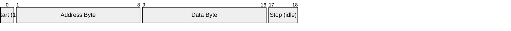
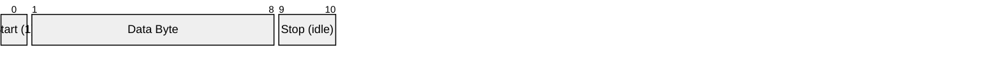
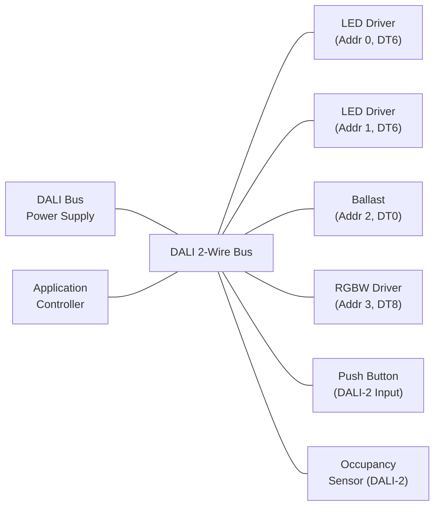
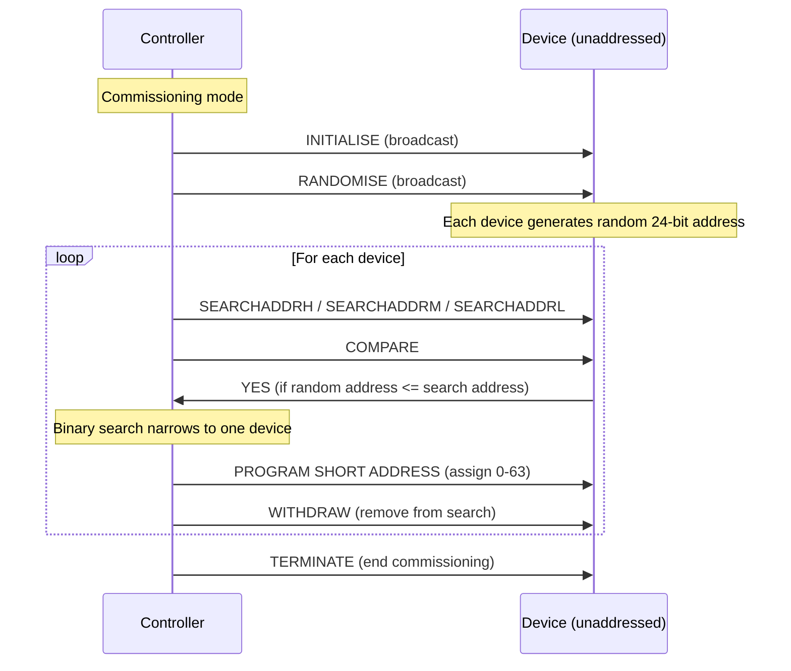

# DALI (Digital Addressable Lighting Interface)

> **Standard:** [IEC 62386](https://webstore.iec.ch/en/publication/6963) | **Layer:** Physical / Data Link / Application | **Wireshark filter:** N/A (physical bus protocol, not IP-based)

DALI is a two-wire digital bus protocol for intelligent lighting control in commercial and industrial buildings. It provides individual addressability of up to 64 luminaires per bus, enabling dimming, color control, scene management, and diagnostics. DALI uses Manchester encoding on a low-voltage, polarity-independent bus at 1200 bps. Originally defined for fluorescent ballasts, DALI has expanded through device type extensions (LED, color, emergency) and DALI-2, which adds input devices like sensors and push buttons.

## Forward Frame (Controller to Device)

The forward frame is sent from a controller (application controller or bus power supply with control) to gear (drivers, ballasts) or input devices:

### Forward Frame Fields

| Field | Size | Description |
|-------|------|-------------|
| Start bit | 1 bit | Always 1 (transition from idle) |
| Address byte | 8 bits | Target address and addressing mode |
| Data byte | 8 bits | Command or direct arc power level |
| Stop bits | 2 bits (idle) | Idle bus state (settling time) |

Total forward frame: 19 bits at 1200 bps = ~16.7 ms

## Backward Frame (Device to Controller)

The backward frame is a reply from a device, sent within a defined window after a query command:

### Backward Frame Fields

| Field | Size | Description |
|-------|------|-------------|
| Start bit | 1 bit | Always 1 |
| Data byte | 8 bits | Response value (0-255 or status) |
| Stop bits | 2 bits (idle) | Idle bus state |

Total backward frame: 11 bits at 1200 bps = ~9.2 ms

## Address Byte Format

| Bit 7 | Bits 6-1 | Bit 0 | Addressing Mode |
|-------|----------|-------|-----------------|
| 0 | AAAAAA | S | Short address (0-63), S = selector bit |
| 1 | 0GGGG | S | Group address (0-15), S = selector bit |
| 1 | 1111111 | S | Broadcast, S = selector bit |
| 1 | 1111110 | S | Broadcast unaddressed |

The selector bit (bit 0) determines interpretation of the data byte:
- **S = 0**: Data byte is a direct arc power command (0-254 = dimming level, 255 = MASK)
- **S = 1**: Data byte is a DALI command code

## Direct Arc Power

When the selector bit is 0, the data byte sets the output level directly:

| Value | Meaning |
|-------|---------|
| 0 | OFF (via fade) |
| 1-254 | Logarithmic dimming levels (0.1% to 100%) |
| 255 | MASK (do not change) |

DALI uses a logarithmic dimming curve following the human eye's perception. The actual light output for level N is approximately: output = 10^((N-1)/(253/3)) percent.

## DALI Commands

When the selector bit is 1, the data byte encodes a command:

### Arc Power Commands

| Code | Command | Description |
|------|---------|-------------|
| 0 | OFF | Immediate off (no fade) |
| 1 | UP | Increase light level by one step |
| 2 | DOWN | Decrease light level by one step |
| 3 | STEP UP | Step up and switch on |
| 4 | STEP DOWN | Step down and switch off if minimum |
| 5 | RECALL MAX LEVEL | Go to configured maximum level |
| 6 | RECALL MIN LEVEL | Go to configured minimum level |
| 7 | STEP DOWN AND OFF | Step down, switch off at minimum |
| 8 | ON AND STEP UP | Switch on and step up |
| 16-31 | GO TO SCENE 0-15 | Recall scene 0 through scene 15 |

### Configuration Commands (Sent Twice)

| Code | Command | Description |
|------|---------|-------------|
| 32 | RESET | Reset all parameters to defaults |
| 33 | STORE ACTUAL DIM LEVEL AS DTR | Store current level into DTR |
| 42 | STORE DTR AS MAX LEVEL | Set maximum output level |
| 43 | STORE DTR AS MIN LEVEL | Set minimum output level |
| 44 | STORE DTR AS SYSTEM FAILURE LEVEL | Level on bus failure |
| 45 | STORE DTR AS POWER ON LEVEL | Level on power up |
| 46 | STORE DTR AS FADE TIME | Set fade time |
| 47 | STORE DTR AS FADE RATE | Set fade rate |
| 64-79 | STORE DTR AS SCENE 0-15 | Store DTR as scene level |
| 80-95 | REMOVE FROM SCENE 0-15 | Remove device from scene |
| 96-111 | ADD TO GROUP 0-15 | Add device to group |
| 112-127 | REMOVE FROM GROUP 0-15 | Remove device from group |

### Query Commands

| Code | Command | Response |
|------|---------|----------|
| 144 | QUERY STATUS | Status byte (bits: controlGear failure, lamp failure, limitError, fadeRunning, resetState, missingShort, powerOn) |
| 145 | QUERY CONTROL GEAR PRESENT | YES (0xFF) if present |
| 146 | QUERY LAMP FAILURE | YES if lamp has failed |
| 148 | QUERY LAMP POWER ON | YES if lamp is on |
| 154 | QUERY ACTUAL LEVEL | Current light level (0-254) |
| 155 | QUERY MAX LEVEL | Configured maximum level |
| 156 | QUERY MIN LEVEL | Configured minimum level |
| 160 | QUERY POWER ON LEVEL | Level after power cycle |
| 161 | QUERY SYSTEM FAILURE LEVEL | Level during bus failure |
| 165 | QUERY FADE TIME / FADE RATE | Encoded fade parameters |
| 176-191 | QUERY SCENE LEVEL 0-15 | Stored scene level |
| 192 | QUERY GROUPS 0-7 | Group membership bitmask (low) |
| 193 | QUERY GROUPS 8-15 | Group membership bitmask (high) |
| 197 | QUERY DEVICE TYPE | Device type number (0, 6, 8, etc.) |

## Device Types

| DT | Device Type | Description |
|----|------------|-------------|
| 0 | Fluorescent lamp | Original DALI device type |
| 1 | Emergency lighting | Self-contained emergency gear |
| 2 | HID (discharge lamp) | High-intensity discharge |
| 3 | Low-voltage halogen | Halogen transformers |
| 4 | Incandescent dimmer | Phase-cut dimmers |
| 5 | DC converter | Constant voltage supplies |
| 6 | LED driver | LED gear (most common today) |
| 7 | Switching function | Relay modules |
| 8 | Color control | Tunable white, RGB, RGBW, xy color |

### DT8 (Color) Extensions

DT8 adds color control commands for tunable white and full-color luminaires:

| Feature | Description |
|---------|-------------|
| Tc (color temperature) | 1000-10000 Kelvin (Mirek: 100-1000) |
| RGBWAF | Individual channel control (Red, Green, Blue, White, Amber, Freecolor) |
| xy coordinates | CIE 1931 xy chromaticity |
| Primary N | Direct control of individual LED primaries |

## Electrical Characteristics

| Parameter | Specification |
|-----------|---------------|
| Bus voltage | 9.5-22.5 V (typical 16 V from bus power supply) |
| Maximum current | 250 mA per bus |
| Data rate | 1200 bps (Manchester encoded) |
| Manchester encoding | Bit period = 833.3 us (2 x half-bit of 416.7 us) |
| Logic high | Bus voltage > 9.5 V |
| Logic low | Bus voltage < 6.5 V |
| Polarity | Independent (either wire can be DATA+ or DATA-) |
| Max bus length | ~300 m (depending on cable and load) |
| Max devices | 64 per bus (short addresses 0-63) |
| Max groups | 16 per bus |
| Max scenes | 16 per device |
| Topology | Bus, star, tree, or mixed (no ring) |

## DALI-2 Enhancements

DALI-2 (IEC 62386 Parts 103 and 3xx) significantly extends the original DALI specification:

| Feature | DALI (Edition 1) | DALI-2 |
|---------|------------------|--------|
| Control gear | Yes | Yes (expanded) |
| Input devices | No | Yes (push buttons, sliders, occupancy sensors, light sensors) |
| Application controllers | Single master only | Multi-master support |
| Event-based messaging | No | Yes (instance-based events from input devices) |
| Bus power supply | Unspecified | Standardized (Part 101) |
| Interoperability testing | Limited | Mandatory certification program |
| Device types | DT0-DT8 | DT0-DT8 + new device types |
| 24-bit frames | No | Yes (extended frame for device addressing) |

### DALI-2 Input Device Types (Part 3xx)

| Part | Device Type | Examples |
|------|------------|---------|
| 301 | Push button | Wall switches, scene panels |
| 302 | Absolute input | Sliders, rotary encoders |
| 303 | Occupancy sensor | PIR, ultrasonic, microwave sensors |
| 304 | Light sensor | Daylight harvesting |
| 305 | Color sensor | Measurement of illuminance and color |

## Bus Topology

## Addressing and Commissioning

## Standards

| Document | Title |
|----------|-------|
| [IEC 62386-101](https://webstore.iec.ch/en/publication/6963) | General requirements -- System components |
| [IEC 62386-102](https://webstore.iec.ch/en/publication/6964) | General requirements -- Control gear |
| [IEC 62386-103](https://webstore.iec.ch/en/publication/6965) | General requirements -- Control devices (DALI-2) |
| [IEC 62386-201](https://webstore.iec.ch/en/publication/6966) | Control gear -- Fluorescent lamps (DT0) |
| [IEC 62386-207](https://webstore.iec.ch/en/publication/6972) | Control gear -- LED gear (DT6) |
| [IEC 62386-209](https://webstore.iec.ch/en/publication/6974) | Control gear -- Color control (DT8) |
| [IEC 62386-301](https://webstore.iec.ch/en/publication/6975) | Input devices -- Push buttons |
| [IEC 62386-303](https://webstore.iec.ch/en/publication/6977) | Input devices -- Occupancy sensors |
| [IEC 62386-304](https://webstore.iec.ch/en/publication/6978) | Input devices -- Light sensors |

## See Also

- [DMX512](dmx512.md) -- entertainment lighting control protocol
- [I2C](i2c.md) -- another two-wire serial bus (different domain)
