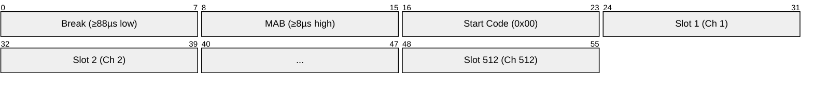
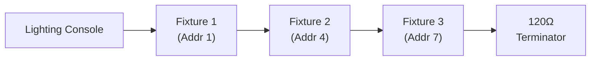

# DMX512 (Digital Multiplex)

> **Standard:** [ANSI E1.11 (USITT DMX512-A)](https://tsp.esta.org/tsp/documents/published_docs.php) | **Layer:** Data Link / Physical | **Wireshark filter:** `dmx` (via Art-Net or sACN capture)

DMX512 is the standard protocol for controlling stage lighting, moving heads, fog machines, LED fixtures, and other entertainment equipment. It transmits up to 512 channels of 8-bit data per universe over a single RS-485 bus at 250 kbps. Each channel carries a value from 0 to 255, and fixtures are assigned a starting address to determine which channels they respond to. DMX512 is unidirectional — the controller broadcasts and fixtures listen.

## Packet

A DMX512 packet consists of a Break, Mark After Break, Start Code, and up to 512 data slots:

Each slot is framed as a standard UART byte: 1 start bit + 8 data bits + 2 stop bits = 11 bits at 250 kbps.

## Key Fields

| Field | Duration / Size | Description |
|-------|----------------|-------------|
| Break | ≥ 88 µs (low) | Signals start of a new packet; resets all receivers |
| MAB (Mark After Break) | ≥ 8 µs (high) | Gap between Break and first byte |
| Start Code | 1 byte (8 bits) | Identifies the packet type (0x00 = dimmer data) |
| Slot 1-512 | 1 byte each | Channel data (0-255 per channel) |
| Inter-Slot Time | ≥ 0 µs | Optional gap between slots |
| Mark Before Break | ≥ 0 µs | Optional gap before next packet |

## Field Details

### Timing

| Parameter | Minimum | Typical | Maximum |
|-----------|---------|---------|---------|
| Break | 88 µs | 88-176 µs | — |
| MAB | 8 µs | 8-12 µs | < 1 sec |
| Slot time | 44 µs | 44 µs | — |
| Packet (512 ch) | — | ~23 ms | — |
| Refresh rate (512 ch) | — | ~44 Hz | — |
| Refresh rate (24 ch) | — | ~830 Hz | — |

Fewer channels = faster refresh. A controller can send fewer than 512 slots per packet.

### Start Codes

| Code | Purpose |
|------|---------|
| 0x00 | Dimmer/intensity data (standard lighting) |
| 0x17 | Text packet (ASCII) |
| 0x55 | Test packet |
| 0x91 | SIP (System Information Packet) |
| 0xCC | RDM (Remote Device Management, ANSI E1.20) |
| 0xCF | Sub-device discovery |

### Channel Assignment Example

A typical RGB LED fixture uses 3 channels:

| Channel | Function | Value Range |
|---------|----------|-------------|
| Start + 0 | Red | 0-255 |
| Start + 1 | Green | 0-255 |
| Start + 2 | Blue | 0-255 |

A moving head might use 16+ channels (pan, tilt, color wheel, gobo, intensity, zoom, etc.).

### Universe Addressing

One DMX512 link = one universe = 512 channels. Large installations use multiple universes:

| Method | Description |
|--------|-------------|
| Multiple RS-485 links | One physical cable per universe |
| Art-Net | DMX over Ethernet/IP (UDP port 6454) |
| sACN (E1.31) | Streaming ACN — DMX over Ethernet/IP (multicast UDP) |

## Physical Layer

| Parameter | Specification |
|-----------|---------------|
| Electrical | [RS-485](../serial/rs485.md) differential |
| Data rate | 250 kbps |
| Connector | 5-pin XLR (ANSI standard) or 3-pin XLR (common but non-standard) |
| Cable | Shielded twisted pair, 120Ω characteristic impedance |
| Termination | 120Ω at the last fixture in the daisy chain |
| Max cable length | 300 m (1000 ft) per run |
| Max devices | 32 unit loads per universe |
| Topology | Daisy chain (bus) |

### XLR Pinout (5-pin)

| Pin | Signal |
|-----|--------|
| 1 | Signal Ground |
| 2 | Data − (cold) |
| 3 | Data + (hot) |
| 4 | Optional second data pair − |
| 5 | Optional second data pair + |

## Bus Topology

## RDM (Remote Device Management)

[ANSI E1.20](https://tsp.esta.org/) extends DMX512 with bidirectional communication on the same RS-485 bus, allowing:
- Device discovery and addressing
- Remote configuration (mode, personality, label)
- Sensor readback (temperature, lamp hours, status)

RDM uses start code 0xCC and interleaves with normal DMX packets.

## Standards

| Document | Title |
|----------|-------|
| [ANSI E1.11](https://tsp.esta.org/tsp/documents/published_docs.php) | USITT DMX512-A — Entertainment Technology |
| [ANSI E1.20](https://tsp.esta.org/) | RDM — Remote Device Management |
| [ANSI E1.31](https://tsp.esta.org/) | sACN — Streaming Architecture for Control Networks (DMX over IP) |
| [Art-Net 4](https://art-net.org.uk/) | Art-Net — DMX over Ethernet (Artistic Licence) |

## See Also

- [RS-485](../serial/rs485.md) — physical layer DMX512 runs on
- [UART](../serial/uart.md) — framing used for each DMX slot
- [MIDI](midi.md) — another entertainment control protocol (music)
