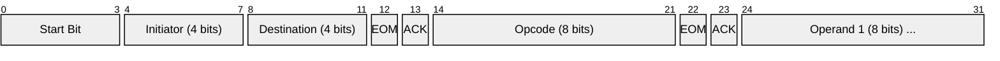
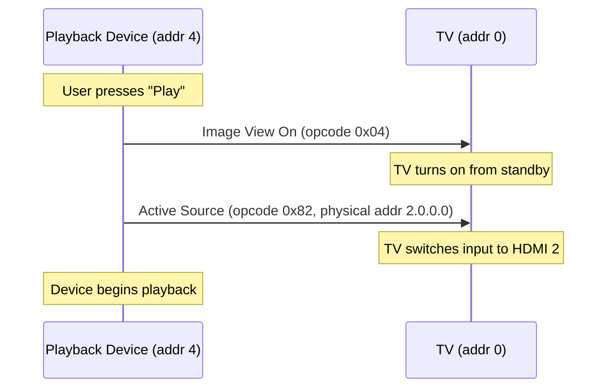
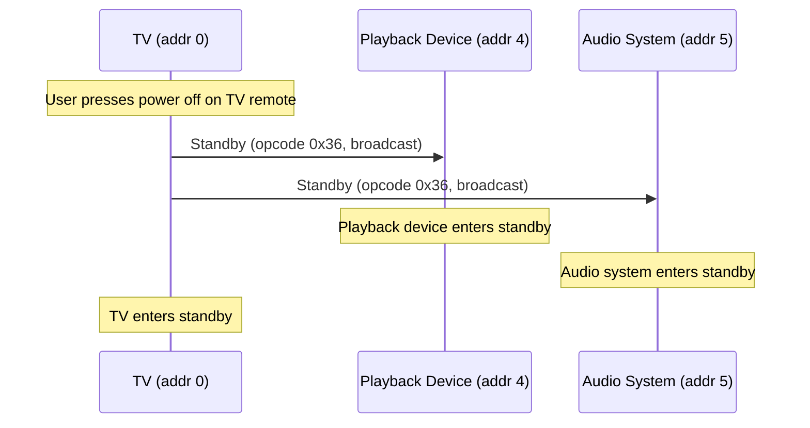
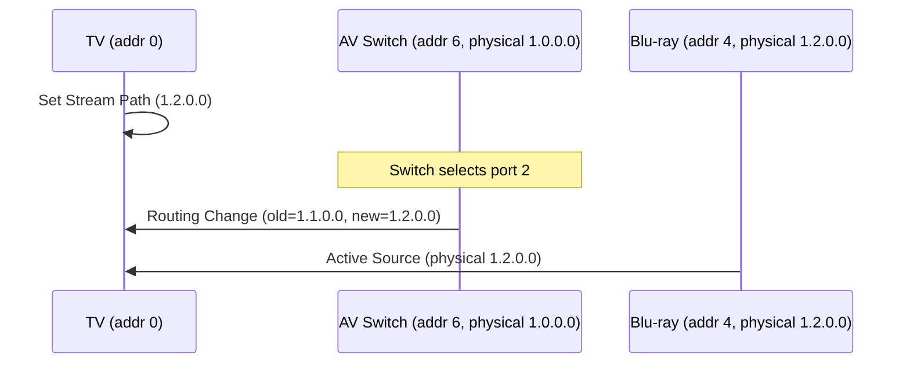

# HDMI CEC (Consumer Electronics Control)

> **Standard:** [HDMI 1.4+ Specification (CEC Supplement)](https://www.hdmi.org/spec/index) | **Layer:** Application (over HDMI physical) | **Wireshark filter:** N/A (hardware bus; protocol analyzer / logic analyzer)

HDMI CEC is a single-wire, bidirectional serial bus that allows HDMI-connected devices to control each other. It runs on pin 13 of the HDMI connector at 400 bps, enabling features like one-touch play (turn on a TV by pressing play on a Blu-ray player), system standby (one remote powers off all devices), and automatic input switching. CEC is implemented under various vendor brand names: Samsung Anynet+, LG SimpLink, Sony Bravia Sync, and Roku 1-Touch Play, among others.

## Bus Characteristics

| Parameter | Value |
|-----------|-------|
| Signal | Single-wire, open-drain with pull-up |
| HDMI Pin | Pin 13 (CEC) |
| Bit Rate | ~400 bps |
| Voltage | 3.3V logic levels |
| Max Devices | 15 (logical addresses 0-14; 15 = broadcast) |
| Protocol | CSMA/CA-like with bit-level arbitration |

## CEC Frame

### Start Bit

Start bit: 3.7 ms low, 0.8 ms high.

### Header Block (Initiator + Destination)

### Data Block

### Complete CEC Frame

## Key Fields

| Field | Size | Description |
|-------|------|-------------|
| Start Bit | 1 bit time | 3.7 ms low + 0.8 ms high — marks frame start |
| Initiator | 4 bits | Logical address of the sender |
| Destination | 4 bits | Logical address of the target (0xF = broadcast) |
| EOM | 1 bit | End of Message — 1 = last block, 0 = more blocks follow |
| ACK | 1 bit | Acknowledgment — receiver pulls low to acknowledge |
| Opcode | 8 bits | Command code (see opcode table) |
| Operands | 0-14 bytes | Opcode-specific parameters |

## Logical Addresses

| Address | Device Type | Description |
|---------|-------------|-------------|
| 0 | TV | Television display |
| 1 | Recording Device 1 | DVR, PVR |
| 2 | Recording Device 2 | Second recording device |
| 3 | Tuner 1 | Set-top box, satellite receiver |
| 4 | Playback Device 1 | Blu-ray, DVD, streaming box |
| 5 | Audio System | AV receiver, soundbar |
| 6 | Tuner 2 | Second tuner |
| 7 | Tuner 3 | Third tuner |
| 8 | Playback Device 2 | Second playback device |
| 9 | Recording Device 3 | Third recording device |
| 10 | Tuner 4 | Fourth tuner |
| 11 | Playback Device 3 | Third playback device |
| 12-13 | Reserved | Future use |
| 14 | Specific Use | Free use / backup |
| 15 | Broadcast | Unregistered / broadcast |

## Key Opcodes

| Opcode | Name | Direction | Description |
|--------|------|-----------|-------------|
| 0x04 | Image View On | Source -> TV | Turn on the TV |
| 0x0D | Text View On | Source -> TV | Turn on TV, display text |
| 0x36 | Standby | Any -> Any | Put the destination device in standby |
| 0x44 | User Control Pressed | Any -> Any | Remote control key press (play, pause, etc.) |
| 0x45 | User Control Released | Any -> Any | Remote control key release |
| 0x46 | Give OSD Name | Any -> Any | Request the device's OSD name |
| 0x47 | Set OSD Name | Any -> Any | Response with device's display name |
| 0x70 | System Audio Mode Request | Source -> Audio | Request audio system to handle audio |
| 0x72 | Set System Audio Mode | Audio -> All | Enable/disable system audio mode |
| 0x80 | Routing Change | Switch -> All | Active route has changed |
| 0x82 | Active Source | Source -> Broadcast | Declare this device as the active source |
| 0x83 | Give Physical Address | Any -> Any | Request physical address |
| 0x84 | Report Physical Address | Any -> Broadcast | Report physical address + device type |
| 0x85 | Request Active Source | TV -> Broadcast | Ask which device is the active source |
| 0x86 | Set Stream Path | TV -> Broadcast | Direct all switches to route to this path |
| 0x8F | Give Power Status | Any -> Any | Request power status |
| 0x90 | Report Power Status | Any -> Any | Reply with power status (on/standby/transition) |
| 0x9E | CEC Version | Any -> Any | Report supported CEC version |
| 0xFF | Abort | Any -> Any | Feature not supported or refused |

## Physical Address

The CEC physical address encodes the device's position in the HDMI topology as a 4-level address (a.b.c.d):

| Address | Meaning |
|---------|---------|
| 0.0.0.0 | TV (root) |
| 1.0.0.0 | Device on HDMI port 1 of the TV |
| 2.0.0.0 | Device on HDMI port 2 of the TV |
| 2.1.0.0 | Device on port 1 of a switch on TV's HDMI port 2 |

## One-Touch Play

## System Standby

## Routing and Input Switching

## Bit Timing

| Timing | Low Period | High Period | Total |
|--------|-----------|-------------|-------|
| Start Bit | 3.7 ms | 0.8 ms | 4.5 ms |
| Logic 0 | 1.5 ms | 0.9 ms | 2.4 ms |
| Logic 1 | 0.6 ms | 1.8 ms | 2.4 ms |

Each data bit has a fixed total period of 2.4 ms, with the duration of the low period distinguishing 0 from 1. The initiator drives the line low; receivers sample mid-bit.

## Arbitration

CEC uses a mechanism similar to CAN arbitration. During the header block, if two devices transmit simultaneously, the one sending a 0 (longer low pulse) wins over the one sending 1 — the losing device detects the bus mismatch and backs off.

## Standards

| Document | Title |
|----------|-------|
| [HDMI 1.4 Specification](https://www.hdmi.org/spec/index) | HDMI Specification (includes CEC supplement) |
| [HDMI 2.1 Specification](https://www.hdmi.org/spec/hdmi2_1) | HDMI 2.1 (enhanced CEC features) |
| [CEC-O-Matic](http://www.cec-o-matic.com/) | Community CEC frame decoder and reference |

## See Also

- [USB](usb.md) — another device interconnect with control capabilities
- [I2C](i2c.md) — CEC's signaling shares similarities with I2C (open-drain, arbitration)
