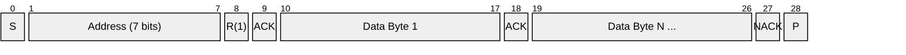
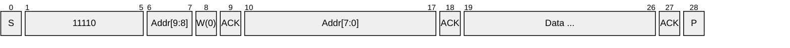
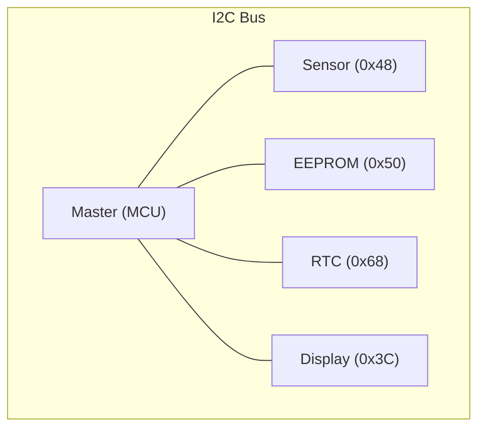

# I2C (Inter-Integrated Circuit)

> **Standard:** [NXP I2C-bus specification](https://www.nxp.com/docs/en/user-guide/UM10204.pdf) | **Layer:** Data Link / Physical | **Wireshark filter:** N/A (sub-packet-capture; logic analyzer protocols)

I2C (pronounced "I-squared-C" or "I-two-C") is a synchronous, multi-master, multi-slave serial bus invented by Philips (now NXP) in 1982. It uses just two bidirectional lines — SDA (data) and SCL (clock) — with open-drain drivers and pull-up resistors. I2C is ubiquitous for connecting low-speed peripherals on a PCB: sensors, EEPROMs, RTCs, ADCs, DACs, display controllers, and I/O expanders.

## Bus Signals

| Signal | Description |
|--------|-------------|
| SDA | Serial Data — bidirectional, open-drain |
| SCL | Serial Clock — driven by master, open-drain |
| GND | Common ground |

Both lines idle high (pulled up by resistors, typically 4.7kΩ for 100 kHz).

## Frame

### Write Transaction


### Read Transaction



## Key Fields

| Field | Size | Description |
|-------|------|-------------|
| S (Start) | 1 condition | SDA falls while SCL is high |
| Address | 7 or 10 bits | Slave device address |
| R/W | 1 bit | 0 = Write (master to slave), 1 = Read (slave to master) |
| ACK/NACK | 1 bit | 0 = ACK (acknowledged), 1 = NACK (not acknowledged) |
| Data | 8 bits | Data byte, MSB first |
| P (Stop) | 1 condition | SDA rises while SCL is high |
| Sr (Repeated Start) | 1 condition | Start without preceding Stop (for combined transactions) |

## Field Details

### Start and Stop Conditions

```
SDA:  ‾‾‾\___    ___/‾‾‾
SCL:  ‾‾‾‾‾‾‾    ‾‾‾‾‾‾‾
      START        STOP
```

- **Start**: SDA transitions high→low while SCL is high
- **Stop**: SDA transitions low→high while SCL is high
- During normal data transfer, SDA only changes while SCL is low

### Addressing

| Mode | Address Bits | Addresses Available |
|------|-------------|---------------------|
| 7-bit | 7 | 112 (16 reserved) |
| 10-bit | 10 | 1024 |

Reserved 7-bit addresses:

| Address | Purpose |
|---------|---------|
| 0x00 | General Call |
| 0x01 | CBUS compatibility |
| 0x02 | Reserved for different bus formats |
| 0x03 | Reserved for future use |
| 0x04-0x07 | High-speed master code |
| 0x78-0x7B | 10-bit addressing prefix (11110xx) |
| 0x7C-0x7F | Reserved for future use |

### 10-bit Addressing

Uses a two-byte address with the first byte containing the prefix `11110` + upper 2 address bits + R/W:



### ACK/NACK

- The **receiver** pulls SDA low during the 9th clock cycle to acknowledge
- **ACK** (SDA low): Byte received successfully
- **NACK** (SDA high): No device at address, or receiver signals end of read

### Clock Stretching

A slave can hold SCL low to pause the master when it needs more time to process data. The master must check SCL before proceeding.

## Speed Modes

| Mode | Max Clock | Max Capacitance |
|------|-----------|-----------------|
| Standard | 100 kHz | 400 pF |
| Fast | 400 kHz | 400 pF |
| Fast-plus | 1 MHz | 550 pF |
| High-speed | 3.4 MHz | 400 pF |
| Ultra-fast | 5 MHz | — (push-pull, unidirectional) |

## Common I2C Device Addresses

| Address (7-bit) | Device Type |
|-----------------|-------------|
| 0x20-0x27 | PCF8574 I/O expander |
| 0x48-0x4F | TMP102/LM75 temperature sensor |
| 0x50-0x57 | AT24C EEPROM |
| 0x68 | DS1307/DS3231 RTC |
| 0x68/0x69 | MPU-6050 IMU |
| 0x76/0x77 | BME280/BMP280 pressure/temperature |
| 0x3C/0x3D | SSD1306 OLED display |
| 0x27 | HD44780 LCD (via PCF8574) |

## Bus Topology



All devices share SDA and SCL with pull-up resistors.

## Standards

| Document | Title |
|----------|-------|
| [NXP UM10204](https://www.nxp.com/docs/en/user-guide/UM10204.pdf) | I2C-bus specification and user manual (Rev. 7.0) |
| [SMBus 3.2](http://smbus.org/specs/) | System Management Bus specification (I2C variant) |

## See Also

- [SPI](spi.md) — faster alternative for point-to-point IC communication
- [I2S](i2s.md) — related Philips/NXP bus for digital audio
- [1-Wire](onewire.md) — simpler single-wire bus for sensors
