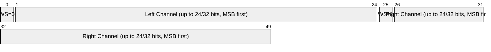
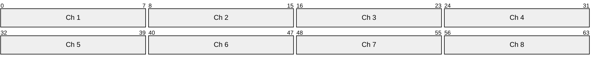
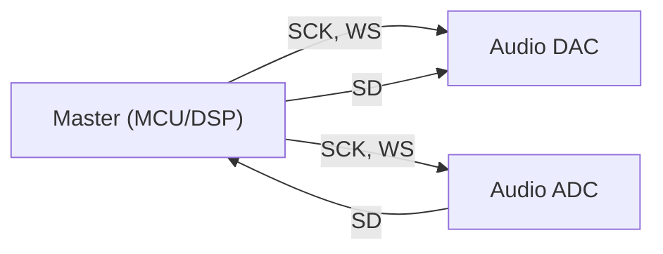

# I2S (Inter-IC Sound)

> **Standard:** [NXP I2S bus specification](https://www.nxp.com/docs/en/user-manual/UM11732.pdf) | **Layer:** Data Link / Physical | **Wireshark filter:** N/A (sub-packet-capture; logic analyzer protocols)

I2S (pronounced "I-squared-S") is a synchronous serial bus designed specifically for digital audio data transfer between integrated circuits. Developed by Philips (now NXP) in 1986 and revised in 1996, it provides a simple, standardized way to connect audio codecs, DACs, ADCs, DSPs, and microcontrollers. I2S carries PCM audio data in a time-division multiplexed format with separate clock and word-select lines.

## Bus Signals

| Signal | Description |
|--------|-------------|
| SCK (BCLK) | Serial Clock / Bit Clock — one pulse per audio bit |
| WS (LRCLK) | Word Select / Left-Right Clock — selects the audio channel |
| SD | Serial Data — audio sample bits, MSB first |

Some configurations add:

| Signal | Description |
|--------|-------------|
| MCLK | Master Clock — typically 256× or 384× the sample rate |

## Frame

I2S uses a continuous stream. The Word Select signal toggles to indicate left and right channels:



### Timing

```
WS:    ‾‾‾‾‾‾‾‾‾\________________________/‾‾‾‾‾‾‾‾‾‾‾‾‾‾‾‾‾‾‾‾‾‾‾
SCK:   _/‾\_/‾\_/‾\_/‾\_/‾\_/‾\_/‾\_/‾\_/‾\_/‾\_/‾\_/‾\_/‾\_/‾\_/‾\_
SD:    ==X MSB X b1 X b2 X ...               X MSB X b1 X b2 X ...
              LEFT CHANNEL                         RIGHT CHANNEL
```

Key timing detail: In standard I2S, the data transitions one clock cycle **before** the WS transition (the MSB is clocked in on the clock after WS changes). This one-cycle offset distinguishes I2S from other formats.

## Key Fields

| Field | Description |
|-------|-------------|
| Word Select = 0 | Left channel (or Channel 1) |
| Word Select = 1 | Right channel (or Channel 2) |
| Data bits | Audio sample, MSB first, two's complement |
| Bit depth | Commonly 16, 24, or 32 bits per channel |

## Field Details

### Word Select Timing

| Standard | WS Transition Relative to MSB |
|----------|-------------------------------|
| I2S (Philips) | WS changes 1 BCLK before MSB (data delayed by 1 clock) |
| Left-Justified | WS changes aligned with MSB (no delay) |
| Right-Justified | MSB aligned to end of WS period |
| DSP/TDM | Short WS pulse, data starts immediately |

### Clock Relationships

| Parameter | Formula | Example (44.1 kHz, 16-bit stereo) |
|-----------|---------|-------------------------------------|
| Sample Rate (Fs) | — | 44,100 Hz |
| Bit Clock (BCLK) | Fs × bits × channels | 44,100 × 16 × 2 = 1.4112 MHz |
| Master Clock (MCLK) | Fs × 256 (typical) | 44,100 × 256 = 11.2896 MHz |

### Common Sample Rates

| Rate | Application |
|------|-------------|
| 8 kHz | Telephony |
| 16 kHz | Wideband voice |
| 44.1 kHz | CD audio |
| 48 kHz | Professional audio, video soundtracks |
| 96 kHz | High-resolution audio |
| 192 kHz | Studio recording |

### Common Bit Depths

| Bits | Dynamic Range | Usage |
|------|---------------|-------|
| 16 | 96 dB | CD quality, most consumer audio |
| 24 | 144 dB | Professional audio, modern DACs |
| 32 | 192 dB | Internal processing, some high-end DACs |

## TDM (Time Division Multiplexing)

TDM extends I2S to more than 2 channels by dividing each WS period into time slots:



TDM is used for multi-channel audio (5.1/7.1 surround, microphone arrays, multi-channel ADC/DAC).

## Bus Topology



I2S has one master that generates SCK and WS. The master can be the transmitter, the receiver, or a separate controller.

## I2S vs SPI vs I2C

| Feature | I2S | SPI | I2C |
|---------|-----|-----|-----|
| Purpose | Audio data | General-purpose | General-purpose |
| Wires | 3 (+ optional MCLK) | 4 + CS | 2 |
| Clock | Continuous | Burst | Burst |
| Data format | MSB first, two's complement | Configurable | MSB first |
| Duplex | Simplex per data line | Full | Half |
| Addressing | None (dedicated connections) | CS lines | 7/10-bit address |

## Standards

| Document | Title |
|----------|-------|
| [NXP I2S bus specification (1996)](https://www.nxp.com/docs/en/user-manual/UM11732.pdf) | Original I2S standard |
| [NXP UM11732](https://www.nxp.com/docs/en/user-manual/UM11732.pdf) | I2S bus specification Rev. 2 |

## See Also

- [I2C](i2c.md) — related NXP bus for control/configuration (often used alongside I2S)
- [SPI](spi.md) — general-purpose serial bus with similar signal count
