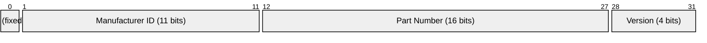
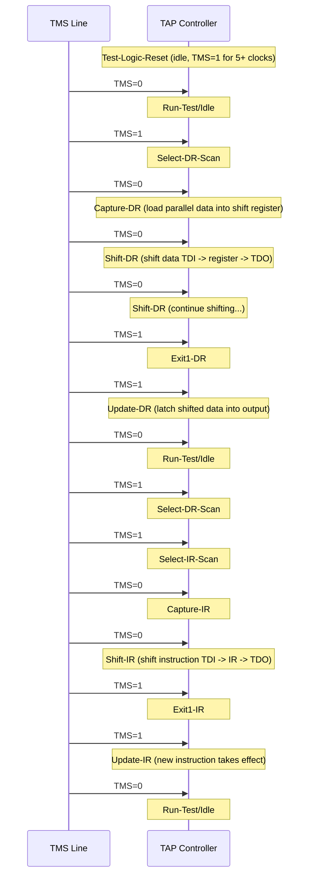
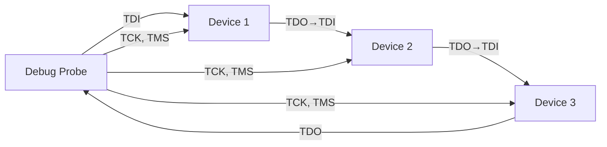
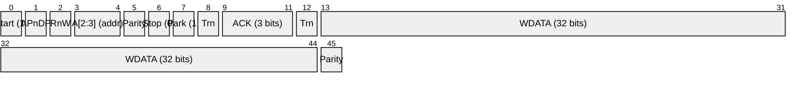
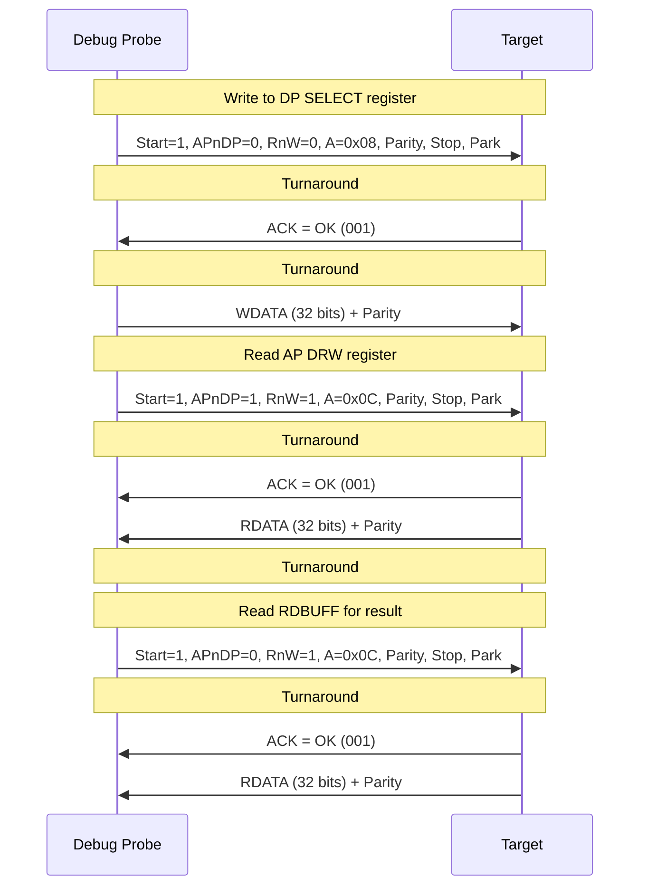

# JTAG / SWD

> **Standard:** [IEEE 1149.1 (JTAG)](https://standards.ieee.org/standard/1149_1-2013.html), [ARM Debug Interface Architecture (ADIv5)](https://developer.arm.com/documentation/ihi0031/latest/) | **Layer:** Physical / Debug | **Wireshark filter:** N/A (hardware debug interface)

JTAG (Joint Test Action Group) and SWD (Serial Wire Debug) are the two dominant interfaces for debugging, programming, and testing integrated circuits. JTAG was originally designed for boundary scan testing of solder joints on PCBs (IEEE 1149.1, 1990) and was later extended for on-chip debug access. SWD is ARM's 2-wire alternative to JTAG, offering the same debug capabilities with fewer pins. Together they are used for flashing firmware, setting breakpoints, reading/writing memory, and production testing on virtually every modern microcontroller and processor.

---

## JTAG (IEEE 1149.1)

### Bus Signals

| Signal | Direction | Description |
|--------|-----------|-------------|
| TCK | Input | Test Clock -- clocks the TAP state machine |
| TMS | Input | Test Mode Select -- controls state transitions on TCK rising edge |
| TDI | Input | Test Data In -- serial data into the device |
| TDO | Output | Test Data Out -- serial data out of the device |
| TRST | Input (optional) | Test Reset -- active-low asynchronous reset of TAP controller |

### IDCODE Register (32 bits)

The IDCODE register identifies the device. Bit 0 is always 1 (distinguishes IDCODE from BYPASS). The 11-bit manufacturer ID follows the JEDEC JEP106 standard. The part number and version are vendor-defined.

### Key Fields

| Field | Size | Description |
|-------|------|-------------|
| Instruction Register (IR) | Device-specific (2+ bits) | Selects which data register is active |
| BYPASS Register | 1 bit | Passes data through with 1-clock delay (all 1s instruction) |
| Boundary Scan Register (BSR) | 1 bit per pin | Captures/drives every I/O pin on the device |
| IDCODE Register | 32 bits | Device identification (version + part + manufacturer + 1) |

### Mandatory Instructions

| Instruction | IR Code | Description |
|-------------|---------|-------------|
| BYPASS | All 1s | Selects 1-bit bypass register (shortest path through device) |
| EXTEST | Implementation-defined | Drives BSR values onto pins for testing interconnects |
| SAMPLE/PRELOAD | Implementation-defined | Captures pin states into BSR without affecting device |

### Common Debug Instructions (ARM)

| Instruction | Description |
|-------------|-------------|
| IDCODE | Selects the 32-bit IDCODE register |
| DPACC | Access to Debug Port registers (ARM CoreSight) |
| APACC | Access to Access Port registers (ARM CoreSight) |
| ABORT | Abort current AP transaction |

### TAP State Machine

The JTAG TAP (Test Access Port) controller is a 16-state finite state machine. TMS is sampled on the rising edge of TCK to determine the next state.

### TAP State Summary

| State | Purpose |
|-------|---------|
| Test-Logic-Reset | All test logic disabled, device operates normally |
| Run-Test/Idle | Idle state between operations |
| Select-DR-Scan | Entry point for data register operations |
| Capture-DR | Load parallel data into the selected data register |
| Shift-DR | Serially shift data through TDI -> Data Register -> TDO |
| Update-DR | Latch shifted data into the data register output |
| Select-IR-Scan | Entry point for instruction register operations |
| Capture-IR | Load status into instruction register |
| Shift-IR | Serially shift new instruction in via TDI |
| Update-IR | Latch new instruction -- selects the active data register |
| Exit1/Exit2, Pause | Intermediate states for multi-step operations |

### Daisy-Chaining

Multiple JTAG devices share a single bus. TDO of one device connects to TDI of the next, forming a serial chain. TCK and TMS are shared. The debugger shifts instructions for all devices in the chain simultaneously, using BYPASS for devices it does not need to access.

---

## SWD (Serial Wire Debug)

### Bus Signals

| Signal | Direction | Description |
|--------|-----------|-------------|
| SWCLK | Input | Serial Wire Clock -- driven by debug probe |
| SWDIO | Bidirectional | Serial Wire Data I/O -- driven by probe or target (turnaround) |

SWD uses just two wires to provide the same debug access as JTAG's four. SWDIO is bidirectional -- the probe and target take turns driving it, with a turnaround period in between.

### SWD Packet (Read)

### SWD Packet (Write)

### Key Fields

| Field | Size | Description |
|-------|------|-------------|
| Start | 1 bit | Always 1 -- marks packet start |
| APnDP | 1 bit | 0 = Debug Port access, 1 = Access Port access |
| RnW | 1 bit | 0 = Write, 1 = Read |
| A[2:3] | 2 bits | Register address within the selected port |
| Parity (request) | 1 bit | Even parity over APnDP + RnW + A[2:3] |
| Stop | 1 bit | Always 0 |
| Park | 1 bit | Always 1 (drive high before turnaround) |
| Turnaround (Trn) | 1 bit | Bus direction change -- neither side drives |
| ACK | 3 bits | Target response: OK, WAIT, or FAULT |
| Data | 32 bits | Read or write data |
| Parity (data) | 1 bit | Even parity over the 32 data bits |

### ACK Responses

| ACK Value | Bits | Meaning |
|-----------|------|---------|
| OK | 001 | Transaction completed successfully |
| WAIT | 010 | Target busy, retry later |
| FAULT | 100 | Error -- check CTRL/STAT for details |

### Debug Port (DP) Registers

| Register | Address | Description |
|----------|---------|-------------|
| DPIDR | 0x00 (read) | DP Identification Register |
| CTRL/STAT | 0x04 | Control and status (power-up, error flags) |
| SELECT | 0x08 | Select AP and register bank |
| RDBUFF | 0x0C (read) | Read buffer for previous AP read result |

### Access Port (AP) Registers (MEM-AP)

| Register | Description |
|----------|-------------|
| CSW | Control/Status Word -- configures transfer size, auto-increment |
| TAR | Transfer Address Register -- target memory address |
| DRW | Data Read/Write -- reads or writes data at TAR address |

Through MEM-AP, the debugger can read and write any memory-mapped address on the target, enabling flash programming, register inspection, and breakpoint control.

### SWD Read/Write Sequence

### SWD Multidrop (ADIv5.2+)

SWD multidrop allows multiple targets on a single SWCLK/SWDIO bus. The debug probe sends a TARGETSEL command (a write to DP address 0x0C with specific target ID) to select which device responds. Unselected devices ignore subsequent transactions. This is ARM's answer to JTAG daisy-chaining with fewer wires.

---

## JTAG vs SWD

| Feature | JTAG | SWD |
|---------|------|-----|
| Wires | 4 (+ optional TRST) | 2 |
| Direction | Unidirectional TDI/TDO | Bidirectional SWDIO |
| Multi-device | Daisy-chain (serial) | Multidrop (target select, ADIv5.2+) |
| Debug capability | Full (CoreSight, RISC-V DMI) | Full (ARM CoreSight only) |
| Boundary scan | Yes (IEEE 1149.1) | No |
| Speed | Up to ~50 MHz typical | Up to ~50 MHz typical |
| Architectures | ARM, RISC-V, MIPS, x86, FPGA, any | ARM only |
| Pin sharing | Fixed function | SWDIO shared with TMS, SWCLK shared with TCK |
| Production test | Yes (boundary scan, BIST) | No (debug only) |

SWD pins are typically shared with JTAG: SWCLK maps to TCK, and SWDIO maps to TMS. A debug probe can switch between JTAG and SWD mode using a special bit sequence on the shared lines.

## Common Debug Probes

| Probe | Interfaces | Description |
|-------|------------|-------------|
| SEGGER J-Link | JTAG, SWD | Industry-standard commercial probe, wide device support |
| ST-Link | JTAG, SWD | Bundled with STMicroelectronics development boards |
| CMSIS-DAP | JTAG, SWD | ARM's open-source debug probe standard (DAPLink) |
| OpenOCD | JTAG, SWD | Open-source debug software, supports many probe hardware |
| Black Magic Probe | JTAG, SWD | Open-source probe with built-in GDB server |
| Lauterbach TRACE32 | JTAG, SWD, trace | High-end commercial probe with trace capture |

## Common Use Cases

| Use Case | Interface | Description |
|----------|-----------|-------------|
| Flash programming | JTAG or SWD | Write firmware to on-chip or external flash memory |
| Breakpoint debugging | JTAG or SWD | Set hardware breakpoints, single-step, inspect registers |
| Memory read/write | JTAG or SWD | Direct access to any memory-mapped address |
| Boundary scan test | JTAG only | Test solder joints and PCB interconnects in production |
| FPGA programming | JTAG | Load bitstreams into FPGAs (Xilinx, Intel/Altera) |
| Chip identification | JTAG (IDCODE) | Read device ID to verify correct part |
| Trace capture | JTAG + SWO/ETM | Capture instruction trace, ITM printf, profiling data |

## Standards

| Document | Title |
|----------|-------|
| [IEEE 1149.1-2013](https://standards.ieee.org/standard/1149_1-2013.html) | Standard Test Access Port and Boundary-Scan Architecture |
| [IEEE 1149.7](https://standards.ieee.org/standard/1149_7-2022.html) | Reduced-pin JTAG (cJTAG, 2-wire JTAG) |
| [ARM ADIv5](https://developer.arm.com/documentation/ihi0031/latest/) | ARM Debug Interface Architecture Specification v5 |
| [ARM ADIv6](https://developer.arm.com/documentation/ihi0074/latest/) | ARM Debug Interface Architecture Specification v6 |
| [RISC-V Debug Spec](https://github.com/riscv/riscv-debug-spec) | RISC-V External Debug Support (uses JTAG DMI) |
| [CMSIS-DAP](https://arm-software.github.io/CMSIS_5/DAP/html/index.html) | ARM Cortex Microcontroller Software Interface Standard -- Debug Access Port |

## See Also

- [SPI](spi.md) -- synchronous serial bus (similar clock + data topology)
- [I2C](i2c.md) -- 2-wire bus with addressing (compare with SWD's 2-wire approach)
- [USB](usb.md) -- debug probes typically connect to host via USB
- [UART](../serial/uart.md) -- serial debug output (SWO/ITM often uses UART framing)
- [ARINC 429](arinc429.md) -- avionics data bus
