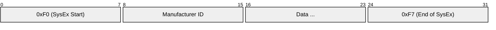

# MIDI (Musical Instrument Digital Interface)

> **Standard:** [MIDI 1.0 / MIDI 2.0 (MMA/AMEI)](https://midi.org/specifications) | **Layer:** Data Link / Physical / Application | **Wireshark filter:** N/A (sub-packet-capture; USB-MIDI via `usbmidi`)

MIDI is a protocol for communicating musical performance data — notes, control changes, program changes, and timing — between electronic instruments, computers, and controllers. Defined in 1983, it became the universal language for electronic music. The original MIDI 1.0 uses a 31.25 kbps serial link with 5-pin DIN connectors. Modern MIDI travels over USB, Bluetooth LE, and Ethernet (RTP-MIDI). MIDI 2.0 (2020) adds higher resolution, bidirectional negotiation, and per-note control.

## MIDI 1.0 Message

MIDI messages consist of a Status byte followed by one or two Data bytes:

| Field | Size | Description |
|-------|------|-------------|
| Status Byte | 8 bits | High bit always 1; identifies message type and channel |
| Data Byte 1 | 7 bits | First parameter (high bit always 0) |
| Data Byte 2 | 7 bits | Second parameter (some messages have only one) |

The high bit distinguishes Status (1) from Data (0), enabling receivers to resynchronize mid-stream.

## Channel Messages

The Status byte encodes the message type (upper nibble) and channel (lower nibble, 0-15):

### Channel Voice Messages

| Status | Type | Data 1 | Data 2 | Description |
|--------|------|--------|--------|-------------|
| 0x8n | Note Off | Note (0-127) | Velocity (0-127) | Release a note |
| 0x9n | Note On | Note (0-127) | Velocity (0-127) | Play a note (velocity 0 = Note Off) |
| 0xAn | Poly Aftertouch | Note (0-127) | Pressure (0-127) | Per-note pressure |
| 0xBn | Control Change | Controller (0-127) | Value (0-127) | Knobs, pedals, switches |
| 0xCn | Program Change | Program (0-127) | — | Change patch/preset |
| 0xDn | Channel Aftertouch | Pressure (0-127) | — | Channel-wide pressure |
| 0xEn | Pitch Bend | LSB (0-127) | MSB (0-127) | 14-bit pitch bend (center = 0x2000) |

### Common Control Change Numbers

| CC | Name | Description |
|----|------|-------------|
| 0 | Bank Select (MSB) | Selects bank of programs |
| 1 | Modulation Wheel | Vibrato/modulation amount |
| 7 | Channel Volume | Main volume |
| 10 | Pan | Left-right positioning |
| 11 | Expression | Sub-volume (performance dynamics) |
| 64 | Sustain Pedal | On/Off (0-63 = off, 64-127 = on) |
| 120 | All Sound Off | Silence all voices |
| 121 | Reset All Controllers | Reset CCs to defaults |
| 123 | All Notes Off | Release all held notes |

### Note Numbers

| MIDI Note | Name | Octave |
|-----------|------|--------|
| 0 | C-1 | -1 |
| 21 | A0 | 0 (lowest piano key) |
| 60 | C4 | 4 (Middle C) |
| 69 | A4 | 4 (440 Hz tuning reference) |
| 108 | C8 | 8 (highest piano key) |
| 127 | G9 | 9 |

## System Messages

System messages have no channel number:

### System Common

| Status | Name | Description |
|--------|------|-------------|
| 0xF1 | MTC Quarter Frame | MIDI Time Code |
| 0xF2 | Song Position | 14-bit position in song (MIDI beats) |
| 0xF3 | Song Select | Select a song (0-127) |
| 0xF6 | Tune Request | Request oscillator tuning |

### System Real-Time

Single-byte messages that can be inserted between any other bytes:

| Status | Name | Description |
|--------|------|-------------|
| 0xF8 | Timing Clock | 24 pulses per quarter note (PPQN) |
| 0xFA | Start | Start playback from beginning |
| 0xFB | Continue | Resume playback |
| 0xFC | Stop | Stop playback |
| 0xFE | Active Sensing | Keepalive (optional, every 300ms) |
| 0xFF | System Reset | Reset all devices |

### System Exclusive (SysEx)

Variable-length manufacturer-specific messages:

Manufacturer IDs are assigned by the MMA. Three-byte IDs use 0x00 as the first byte.

## Physical Layer (MIDI 1.0)

| Parameter | Specification |
|-----------|---------------|
| Data rate | 31.25 kbps (±1%) |
| Encoding | Asynchronous serial, 8N1 (start + 8 data + stop) |
| Connector | 5-pin DIN 180° |
| Signal | Current loop (5 mA) via opto-isolator |
| Direction | Unidirectional per cable |
| Cable | Shielded twisted pair, max 15 m |

### DIN Connector Pinout

| Pin | Function |
|-----|----------|
| 1 | Not connected (shield on some cables) |
| 2 | Shield / Ground |
| 3 | Not connected |
| 4 | Current source (+5V via 220Ω) |
| 5 | Current sink (data, via 220Ω) |

The receiver uses an opto-isolator to electrically isolate the two devices, preventing ground loops.

### MIDI Ports

| Port | Direction | Description |
|------|-----------|-------------|
| MIDI OUT | Transmit | Sends messages from this device |
| MIDI IN | Receive | Receives messages (opto-isolated) |
| MIDI THRU | Forward | Copies MIDI IN to pass along the chain |

## Modern Transports

| Transport | Standard | Description |
|-----------|----------|-------------|
| USB-MIDI | USB Device Class | Most common modern connection |
| BLE-MIDI | Apple/MMA spec | Bluetooth Low Energy MIDI |
| RTP-MIDI | RFC 6295 | MIDI over IP (network sessions) |
| MIDI 2.0 | MMA/AMEI | 32-bit resolution, bidirectional, profiles |

## MIDI 2.0

| Feature | MIDI 1.0 | MIDI 2.0 |
|---------|----------|----------|
| Velocity resolution | 7-bit (128 values) | 16-bit (65,536 values) |
| Controller resolution | 7-bit (or 14-bit paired) | 32-bit |
| Per-note controllers | No (Poly Aftertouch only) | Yes (pitch, CC, management) |
| Bidirectional | No | Yes (capability inquiry) |
| Profiles | No | Yes (standardized device behaviors) |
| Property Exchange | No | Yes (JSON-based configuration) |

## Standards

| Document | Title |
|----------|-------|
| [MIDI 1.0 Specification](https://midi.org/specifications) | MIDI 1.0 Detailed Specification (MMA/AMEI) |
| [MIDI 2.0 Specification](https://midi.org/specifications) | MIDI 2.0 (MMA/AMEI, 2020) |
| [General MIDI (GM)](https://midi.org/specifications) | Standard instrument/drum map |
| [RFC 6295](https://www.rfc-editor.org/rfc/rfc6295) | RTP Payload Format for MIDI |
| [USB MIDI Class](https://usb.org/) | USB Device Class Definition for MIDI Devices |

## See Also

- [DMX512](dmx512.md) — entertainment control for lighting (similar ecosystem)
- [UART](../serial/uart.md) — MIDI 1.0 uses asynchronous serial framing
- [RS-485](../serial/rs485.md) — sometimes used for long-distance MIDI runs
