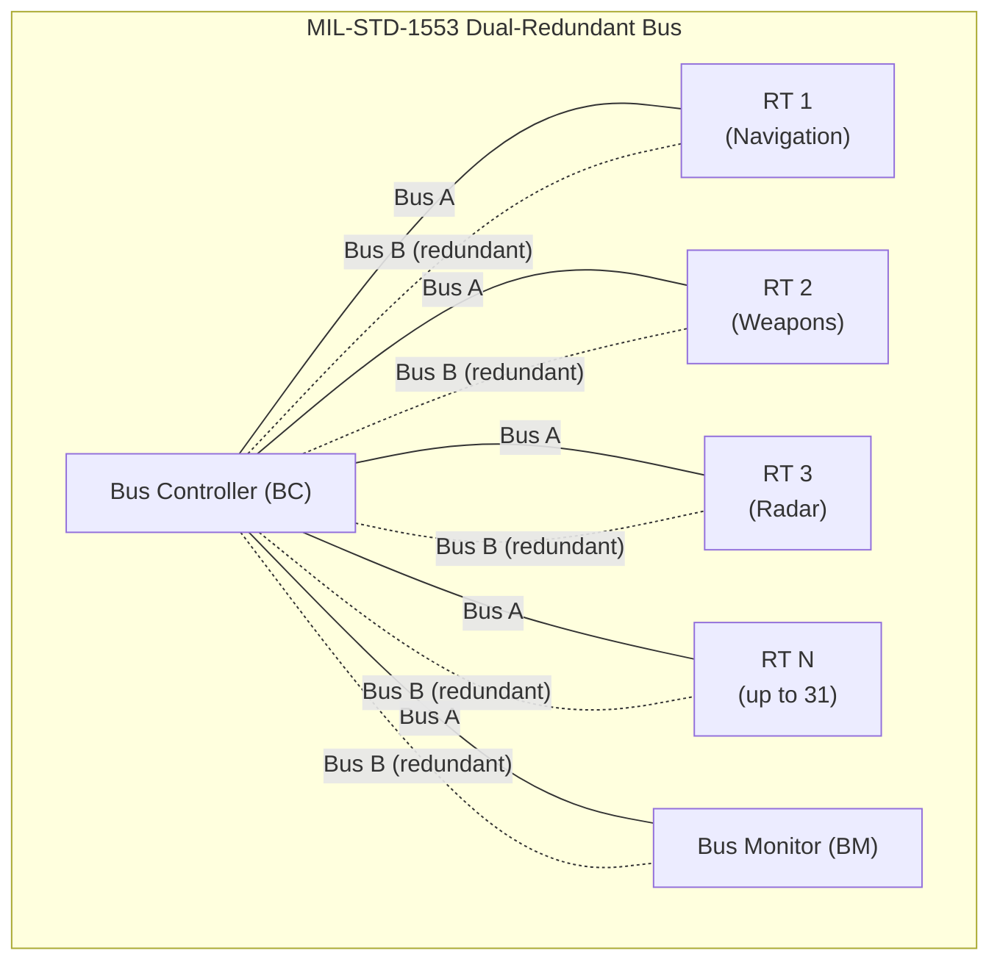
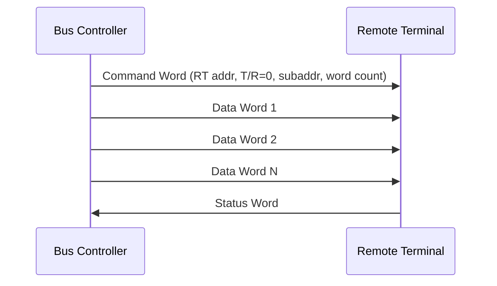
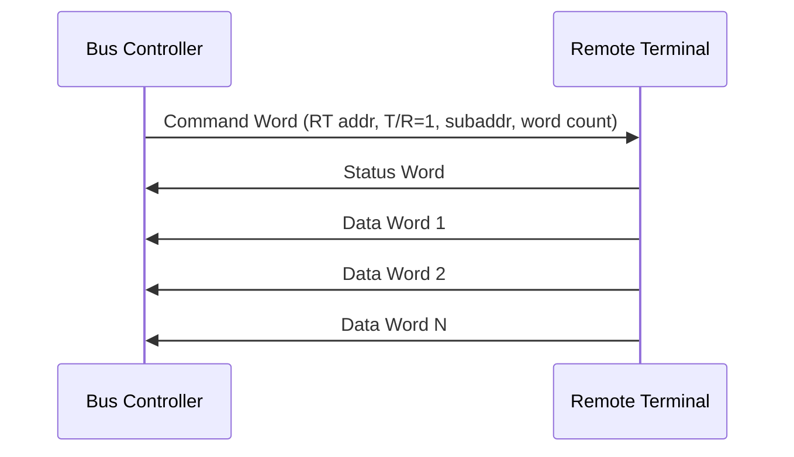
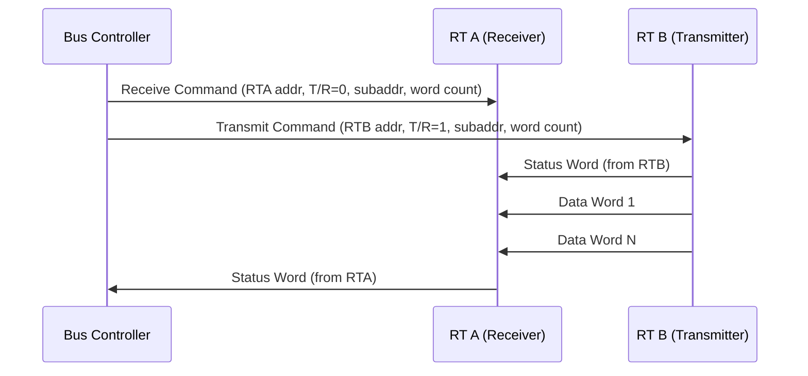

# MIL-STD-1553 (Military Standard 1553B)

> **Standard:** [MIL-STD-1553B](https://quicksearch.dla.mil/qsDocDetails.aspx?ident_number=36973) | **Layer:** Physical / Data Link | **Wireshark filter:** N/A (military bus; dedicated analyzer equipment)

MIL-STD-1553 is a military standard that defines a serial data bus for interconnecting avionics subsystems in aircraft, spacecraft, and ground vehicles. First published in 1973 (current revision 1553B from 1978), it uses a dual-redundant, transformer-coupled, differential bus operating at 1 Mbps with Manchester II bi-phase encoding. The bus follows a strict command/response architecture: a single Bus Controller (BC) orchestrates all communication by issuing commands to up to 31 Remote Terminals (RTs), while optional Bus Monitors (BMs) passively record traffic. MIL-STD-1553 remains in use on platforms ranging from the F-16 to the International Space Station.

## Word Format (20 bits)

Every MIL-STD-1553 transmission consists of 20-bit words: 3 sync bits, 16 data/command bits, and 1 odd parity bit.

### Command Word


### Data Word


### Status Word


## Key Fields

| Field | Size | Description |
|-------|------|-------------|
| Sync | 3 bit times | Synchronization pattern — distinguishes word types |
| RT Address | 5 bits | Remote Terminal address (0-30 valid; 31 = broadcast) |
| T/R | 1 bit | Transmit/Receive — 1 = RT transmits, 0 = RT receives |
| Subaddress | 5 bits | Sub-unit or data type identifier within the RT |
| Word Count | 5 bits | Number of data words (0 = 32 words) |
| Data | 16 bits | Payload data |
| Parity | 1 bit | Odd parity over bits 3-18 |

### Sync Patterns

| Word Type | Sync Pattern | Description |
|-----------|-------------|-------------|
| Command Word | Positive-going | +V then -V (3 bit times) |
| Status Word | Positive-going | +V then -V (same as command) |
| Data Word | Negative-going | -V then +V (3 bit times) |

The sync pattern is invalid Manchester encoding, making it unambiguously distinguishable from data.

## Status Word Flags

| Bit | Name | Description |
|-----|------|-------------|
| 8 | Message Error (ME) | Error in the received command/data |
| 9 | Instrumentation (Inst) | RT is in instrumentation mode |
| 10 | Service Request (SR) | RT needs servicing by the BC |
| 11 | Reserved | Set to 0 |
| 12 | Broadcast Command (BC) | RT received a broadcast command |
| 13 | Busy | RT cannot process the command |
| 14 | Subsystem Flag (SF) | Subsystem-defined condition |
| 15 | Dynamic Bus Accept (DBA) | RT accepts dynamic bus control |
| 16 | Terminal Flag (TF) | RT has a fault condition |
| 17-18 | Reserved | Set to 0 |

## Bus Architecture



### Component Roles

| Component | Count | Role |
|-----------|-------|------|
| Bus Controller (BC) | 1 active | Initiates all transfers; manages bus schedule |
| Remote Terminal (RT) | Up to 31 | Responds to BC commands; interfaces to subsystems |
| Bus Monitor (BM) | Optional | Passively records all bus traffic (flight recorder) |
| Backup BC | Optional | Standby controller; can take over if primary BC fails |

## Message Formats

### BC-to-RT Transfer (Receive)



### RT-to-BC Transfer (Transmit)



### RT-to-RT Transfer



### Broadcast Transfer

```mermaid
sequenceDiagram
  participant BC as Bus Controller
  participant RT1 as RT 1
  participant RT2 as RT 2
  participant RTN as RT N

  BC->>RT1: Command Word (addr=31, T/R=0, subaddr, WC)
  BC->>RT2: (same broadcast command)
  BC->>RTN: (same broadcast command)
  BC->>RT1: Data Word 1
  BC->>RT1: Data Word N
  Note over RT1,RTN: All RTs receive; no status word response (broadcast)
```

## Mode Codes (Subaddress 0x00 or 0x1F)

When the subaddress is 00000 or 11111, the word count field becomes a mode code for bus management:

| Mode Code | Name | T/R | Description |
|-----------|------|-----|-------------|
| 00001 | Dynamic Bus Control | T | Offer bus control to an RT |
| 00010 | Synchronize | R | Synchronize RT with BC timing |
| 00011 | Transmit Status Word | T | RT sends its status word |
| 00100 | Initiate Self-Test | R | RT runs built-in test |
| 00101 | Transmitter Shutdown | R | Disable RT transmitter |
| 00110 | Override Transmitter | R | Override transmitter shutdown |
| 01000 | Reset Remote Terminal | R | Reset the RT |
| 10000 | Transmit Vector Word | T | RT sends an interrupt vector |
| 10001 | Synchronize (with data) | R | Synchronize with data word |
| 10010 | Transmit Last Command | T | RT echoes last received command |
| 10011 | Transmit BIT Word | T | RT sends built-in test results |

## Electrical Characteristics

| Parameter | Value |
|-----------|-------|
| Data Rate | 1 Mbps |
| Encoding | Manchester II bi-phase |
| Cable | Shielded twisted pair (dual redundant) |
| Impedance | 70-85 ohm |
| Voltage | 6-9V peak-to-peak (across transformer) |
| Coupling | Transformer-coupled (direct or stub) |
| Bus Length | Up to ~100 m (depending on stub count) |
| Stub Length | Up to 6 m (direct coupled) or 0.3 m (transformer coupled) |
| Termination | Matched impedance at each end |

### Manchester II Encoding

```
Clock:  ┐ ┌─┐ ┌─┐ ┌─┐ ┌─┐ ┌
        └─┘ └─┘ └─┘ └─┘ └─┘

Bit 1:  ──┐    Transition high-to-low at mid-bit
          └──

Bit 0:  ──┘    Transition low-to-high at mid-bit
          ┌──
```

Each bit always has a transition at its center: logic 1 transitions from high to low, logic 0 from low to high. This guarantees clock recovery and DC balance.

## Timing

| Parameter | Value |
|-----------|-------|
| Bit period | 1.0 us |
| Word (20 bits) | 20 us |
| Inter-message gap | 4-12 us minimum |
| RT response time | 4-12 us (after command received) |
| Max message length | 20 us + (32 x 20 us) = 660 us |
| Bus utilization | Typically scheduled at 80% or less |

## Dual Redundancy

MIL-STD-1553 mandates two physically separate buses (Bus A and Bus B):

| Feature | Description |
|---------|-------------|
| Normal operation | BC uses Bus A for all transfers |
| Fault detected | BC retries on Bus B if Bus A transfer fails |
| RT requirement | Every RT must connect to both buses |
| Active bus | Only one bus is active for any given transfer |
| Failover | BC decides which bus to use per message |

## Standards

| Document | Title |
|----------|-------|
| [MIL-STD-1553B](https://quicksearch.dla.mil/) | Digital Time Division Command/Response Multiplex Data Bus |
| [MIL-HDBK-1553A](https://quicksearch.dla.mil/) | Multiplex Applications Handbook |
| [AS15531](https://www.sae.org/) | SAE commercial equivalent of MIL-STD-1553 |
| [STANAG 3838](https://www.nato.int/) | NATO standardization agreement for 1553 |
| [DEF STAN 00-18](https://www.dstan.mod.uk/) | UK Defence Standard (1553 equivalent) |

## See Also

- [ARINC 429](arinc429.md) — commercial avionics bus (simpler, unidirectional)
- [CAN](can.md) — automotive/industrial bus (multi-master, similar robustness goals)
