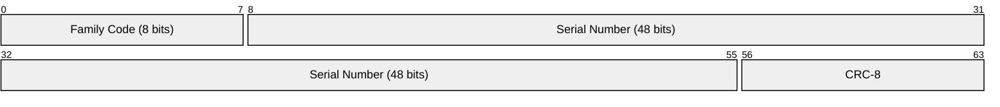
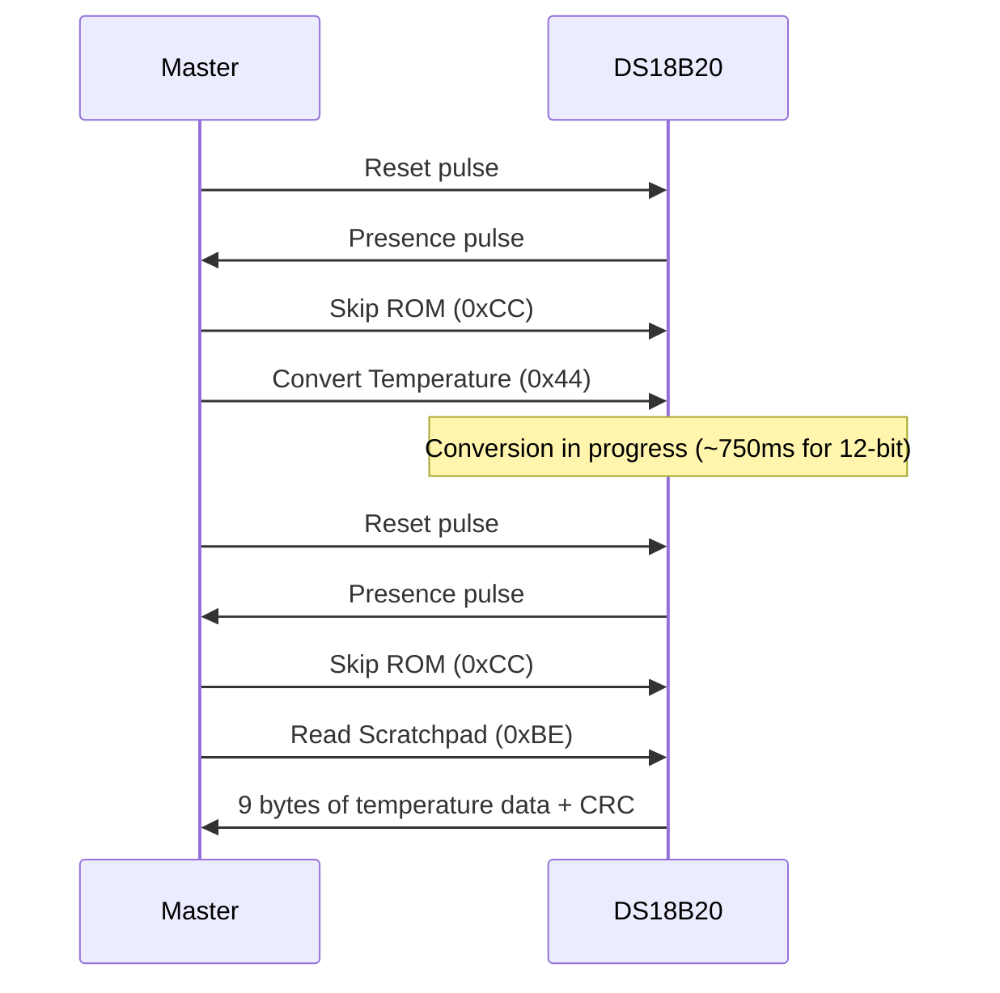
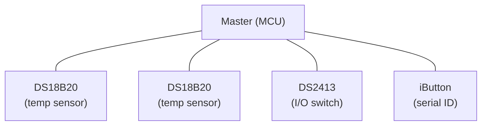

# 1-Wire

> **Standard:** Maxim/Dallas proprietary (public datasheets) | **Layer:** Data Link / Physical | **Wireshark filter:** N/A (sub-packet-capture; logic analyzer protocols)

1-Wire is a serial bus developed by Dallas Semiconductor (now Maxim/Analog Devices) that uses a single data wire plus ground for both communication and parasitic power. Each 1-Wire device has a globally unique 64-bit ROM code burned in at the factory, enabling multiple devices on a single wire without addressing conflicts. 1-Wire is commonly used for temperature sensors (DS18B20), iButtons, battery monitors, and secure authentication ICs.

## Bus Signals

| Signal | Description |
|--------|-------------|
| DQ | Data line — bidirectional, open-drain with pull-up (typically 4.7kΩ) |
| GND | Ground |
| VDD | Power supply (optional — devices can run parasitically from DQ) |

The bus idles high. All communication is initiated by the master pulling the line low.

## ROM Code (64-bit)

Every 1-Wire device has a unique 64-bit identifier:



| Field | Size | Description |
|-------|------|-------------|
| Family Code | 8 bits | Identifies the device type |
| Serial Number | 48 bits | Globally unique serial number |
| CRC-8 | 8 bits | CRC of the preceding 56 bits (polynomial: x^8 + x^5 + x^4 + 1) |

### Common Family Codes

| Code | Device |
|------|--------|
| 0x10 | DS18S20 temperature sensor |
| 0x22 | DS1822 temperature sensor |
| 0x28 | DS18B20 temperature sensor |
| 0x01 | DS1990A iButton (serial number) |
| 0x05 | DS2405 addressable switch |
| 0x26 | DS2438 battery monitor |
| 0x29 | DS2408 8-channel I/O |
| 0x3A | DS2413 2-channel I/O |

## Transaction Sequence

Every 1-Wire transaction follows the same pattern:


## Communication Primitives

### Reset / Presence

```
DQ:  ‾‾‾‾\________________/‾‾‾‾‾\____/‾‾‾‾‾‾‾‾
          |← 480µs min →|  |← 60-240µs →|
          Reset pulse       Presence pulse
          (master pulls     (slave pulls
           low)              low)
```

| Phase | Duration | Description |
|-------|----------|-------------|
| Reset pulse | 480 µs min | Master pulls DQ low |
| Release | 15-60 µs | Master releases, bus floats high |
| Presence pulse | 60-240 µs | Slave pulls DQ low to indicate presence |
| Recovery | — | Bus returns high |

### Write Bit

| Bit | Timing |
|-----|--------|
| Write 0 | Master pulls low for 60-120 µs |
| Write 1 | Master pulls low for 1-15 µs, then releases (bus floats high) |

### Read Bit

| Phase | Timing |
|-------|--------|
| Master initiates | Pulls low for 1-15 µs |
| Slave drives | Slave holds low (for 0) or releases (for 1) |
| Master samples | At 15 µs after falling edge |
| Slot duration | 60-120 µs total |

All data is transmitted **LSB first**.

## ROM Commands

| Command | Code | Description |
|---------|------|-------------|
| Search ROM | 0xF0 | Enumerate all devices on the bus |
| Read ROM | 0x33 | Read the 64-bit ROM code (single device only) |
| Match ROM | 0x55 | Address a specific device by its 64-bit code |
| Skip ROM | 0xCC | Address all devices (single device or broadcast) |
| Alarm Search | 0xEC | Find devices with alarm flag set |

### Search ROM Algorithm

The master discovers devices by walking the 64-bit address space bit by bit. At each bit position, devices respond with their bit value, and the master selects a branch. This binary tree search finds all devices in O(N × 64) time slots, where N is the number of devices.

## Example: DS18B20 Temperature Reading



## Parasitic Power

1-Wire devices can draw power from the DQ line through an internal diode and capacitor, eliminating the need for a separate VDD wire. During high-current operations (e.g., temperature conversion), the master must provide a strong pull-up (typically via a MOSFET) on DQ.

## Bus Topology



All devices share the single DQ line. Each is individually addressable by its unique 64-bit ROM code.

## Standards

1-Wire is proprietary to Maxim/Analog Devices but is fully documented in public datasheets:

| Document | Title |
|----------|-------|
| [Maxim AN126](https://www.analog.com/en/resources/technical-articles/1wire-communication-through-software.html) | 1-Wire Communication Through Software |
| [Maxim AN187](https://www.analog.com/en/resources/technical-articles/1wire-search-algorithm.html) | 1-Wire Search Algorithm |
| [DS18B20 Datasheet](https://www.analog.com/en/products/ds18b20.html) | Programmable Resolution 1-Wire Digital Thermometer |

## See Also

- [I2C](i2c.md) — two-wire bus with more overhead but more features
- [SPI](spi.md) — faster multi-wire alternative for IC communication
- [UART](../serial/uart.md) — point-to-point serial alternative
