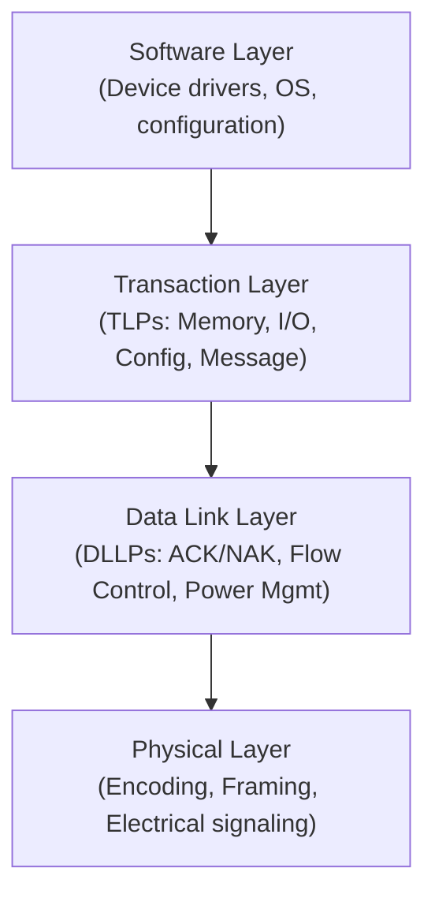
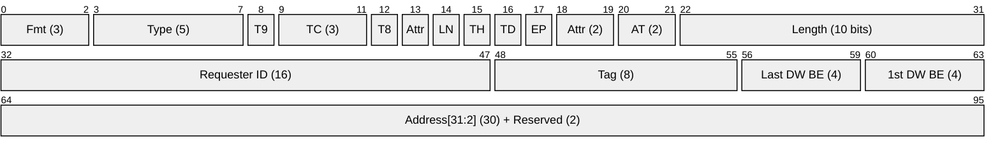
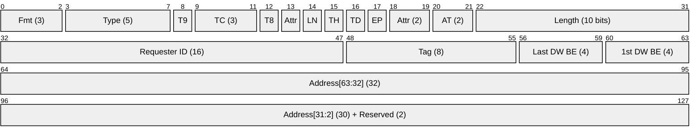
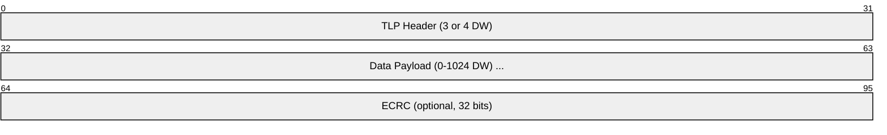
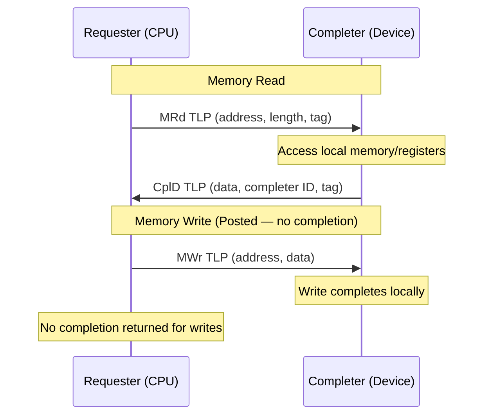
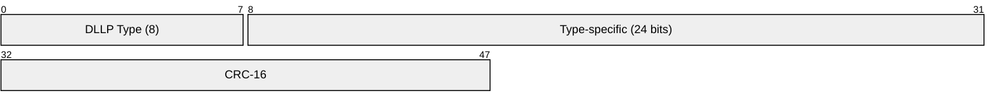
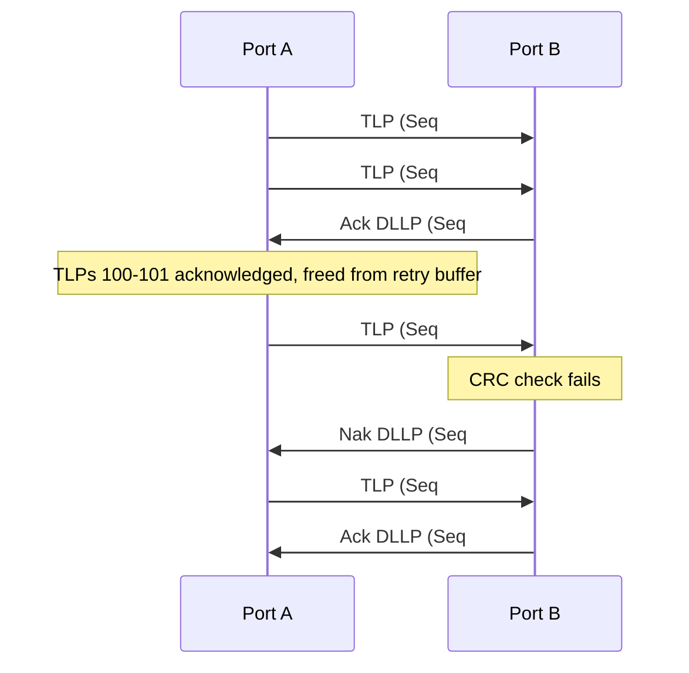

# PCIe (PCI Express)

> **Standard:** [PCI-SIG PCIe 6.0](https://pcisig.com/specifications) | **Layer:** Full stack (Physical, Data Link, Transaction) | **Wireshark filter:** N/A (hardware bus; logic analyzer / protocol analyzer)

PCI Express is the dominant high-speed serial interconnect for connecting processors to GPUs, NVMe SSDs, network adapters, and virtually all expansion cards in modern computers. Unlike its parallel PCI predecessor, PCIe uses point-to-point serial links organized into lanes (x1, x4, x8, x16), with each lane consisting of a differential transmit and receive pair. PCIe defines a three-layer architecture — Transaction, Data Link, and Physical — with Transaction Layer Packets (TLPs) carrying the actual read/write/completion operations.

## Protocol Stack

## Transaction Layer Packet (TLP)

### 3-DW Header (32-bit address)

### 4-DW Header (64-bit address)

### Full TLP Structure

## Key Fields

| Field | Size | Description |
|-------|------|-------------|
| Fmt | 3 bits | Format — 3DW or 4DW header, with/without data |
| Type | 5 bits | Transaction type (memory, I/O, config, completion, message) |
| TC | 3 bits | Traffic Class — maps to virtual channels for QoS |
| TD | 1 bit | TLP Digest — ECRC present |
| EP | 1 bit | Poisoned — data is known bad (error forwarding) |
| Length | 10 bits | Payload length in DWs (0 = 1024 DWs = 4096 bytes) |
| Requester ID | 16 bits | Bus:Device:Function of the requester |
| Tag | 8 bits (10 with extended) | Transaction tag for matching completions |
| Byte Enables | 4+4 bits | First and last DW byte enables |
| Address | 30 or 62 bits | Target memory address (DW-aligned) |

## TLP Types

| Fmt | Type | Name | Has Data | Description |
|-----|------|------|----------|-------------|
| 000 | 00000 | MRd (3DW) | No | Memory Read (32-bit address) |
| 001 | 00000 | MRd (4DW) | No | Memory Read (64-bit address) |
| 010 | 00000 | MWr (3DW) | Yes | Memory Write (32-bit address) |
| 011 | 00000 | MWr (4DW) | Yes | Memory Write (64-bit address) |
| 000 | 00010 | IORd | No | I/O Read (legacy) |
| 010 | 00010 | IOWr | Yes | I/O Write (legacy) |
| 000 | 00100 | CfgRd0 | No | Configuration Read Type 0 |
| 010 | 00100 | CfgWr0 | Yes | Configuration Write Type 0 |
| 000 | 00101 | CfgRd1 | No | Configuration Read Type 1 |
| 010 | 00101 | CfgWr1 | Yes | Configuration Write Type 1 |
| 000 | 01010 | Cpl | No | Completion without data |
| 010 | 01010 | CplD | Yes | Completion with data |
| 010 | 10000 | Msg | Varies | Message (interrupts, PM, errors) |

## Memory Read/Write Flow

## Data Link Layer Packet (DLLP)

DLLPs manage the link-level reliability and flow control between adjacent PCIe ports:

### DLLP Types

| Type | Name | Description |
|------|------|-------------|
| 0x00 | Ack | Acknowledge successful TLP receipt (by sequence number) |
| 0x10 | Nak | Negative acknowledge — request TLP retransmission |
| 0x40-0x4B | InitFC1 | Initialize Flow Control (credit advertisement, round 1) |
| 0x50-0x5B | InitFC2 | Initialize Flow Control (round 2) |
| 0x60-0x6B | UpdateFC | Update Flow Control credits |
| 0x20 | PM_Enter_L1 | Power management — enter L1 |
| 0x21 | PM_Enter_L23 | Power management — enter L23 |
| 0x23 | PM_Active_St_Req_L1 | Request L1 entry |
| 0x24 | PM_Request_Ack | Power management request acknowledged |

### ACK/NAK Protocol

### Flow Control

PCIe uses a credit-based flow control system. The receiver advertises available buffer credits for each TLP category:

| Credit Type | Description |
|-------------|-------------|
| Posted Header (PH) | Credits for posted request headers (e.g., MWr) |
| Posted Data (PD) | Credits for posted request data |
| Non-Posted Header (NPH) | Credits for non-posted request headers (e.g., MRd) |
| Non-Posted Data (NPD) | Credits for non-posted request data |
| Completion Header (CplH) | Credits for completion headers |
| Completion Data (CplD) | Credits for completion data |

## Physical Layer

### Encoding Schemes

| Generation | Encoding | Overhead | Description |
|------------|----------|----------|-------------|
| Gen 1, Gen 2 | 8b/10b | 20% | 8 data bits encoded as 10 symbols |
| Gen 3, Gen 4, Gen 5 | 128b/130b | 1.5% | 128 data bits + 2-bit sync header |
| Gen 6 | PAM4 + 242B/256B FEC | ~5.5% (net) | 4-level signaling with forward error correction |

### Speed Generations

| Gen | Year | Rate (per lane) | Encoding | x16 Throughput |
|-----|------|-----------------|----------|----------------|
| Gen 1 | 2003 | 2.5 GT/s | 8b/10b | 4 GB/s |
| Gen 2 | 2007 | 5 GT/s | 8b/10b | 8 GB/s |
| Gen 3 | 2010 | 8 GT/s | 128b/130b | 15.75 GB/s |
| Gen 4 | 2017 | 16 GT/s | 128b/130b | 31.5 GB/s |
| Gen 5 | 2019 | 32 GT/s | 128b/130b | 63 GB/s |
| Gen 6 | 2022 | 64 GT/s | PAM4 + FEC | 121 GB/s |

### Lane Widths

| Width | Common Use |
|-------|-----------|
| x1 | NVMe SSDs, Wi-Fi cards, low-bandwidth devices |
| x4 | NVMe SSDs, USB controllers, most add-in cards |
| x8 | Network adapters (25/100GbE), RAID controllers |
| x16 | GPUs, high-end network adapters, accelerators |

## Configuration Space

Every PCIe device exposes a configuration space for enumeration and setup:

| Region | Offset | Size | Description |
|--------|--------|------|-------------|
| Header (Type 0) | 0x00-0x3F | 64 bytes | Vendor ID, Device ID, BARs, interrupt info |
| PCI Capabilities | 0x40-0xFF | Variable | MSI, MSI-X, Power Management, PCIe Capability |
| Extended Config | 0x100-0xFFF | 3840 bytes | AER, ARI, SR-IOV, LTR, and other extended caps |

### Key Configuration Registers

| Register | Offset | Description |
|----------|--------|-------------|
| Vendor ID | 0x00 | Manufacturer (e.g., 0x8086 = Intel, 0x10DE = NVIDIA) |
| Device ID | 0x02 | Specific device model |
| Command | 0x04 | Enable memory space, bus master, interrupt disable |
| Status | 0x06 | Capability list, error indicators |
| BAR 0-5 | 0x10-0x24 | Base Address Registers (memory / I/O regions) |
| Interrupt Line/Pin | 0x3C-0x3D | Legacy interrupt routing |

## Power States

| State | Description | Exit Latency |
|-------|-------------|-------------|
| D0 | Fully active | N/A |
| D1 | Light sleep (context preserved) | Microseconds |
| D2 | Deeper sleep | Milliseconds |
| D3hot | Software-off (context preserved, aux power) | ~10 ms |
| D3cold | Power removed (full re-initialization needed) | ~100 ms |
| L0 | Link active | N/A |
| L0s | Link standby (fast re-entry) | < 1 us |
| L1 | Link low-power | 2-4 us |
| L2/L3 | Link off / auxiliary power | ~100 ms |

## Standards

| Document | Title |
|----------|-------|
| [PCI Express Base Spec 6.0](https://pcisig.com/specifications) | PCI Express Base Specification Revision 6.0 |
| [PCI Express Base Spec 5.0](https://pcisig.com/specifications) | PCI Express Base Specification Revision 5.0 |
| [PCI Express CEM 5.0](https://pcisig.com/specifications) | Card Electromechanical Specification |
| [PCI Express M.2 Spec](https://pcisig.com/specifications) | M.2 form factor for NVMe SSDs |
| [Single Root I/O Virtualization (SR-IOV)](https://pcisig.com/specifications) | PCIe device virtualization for VMs |

## See Also

- [USB](usb.md) — peripheral interconnect (USB4 tunnels PCIe)
- [NVMe-oF](../storage/nvmeof.md) — extends NVMe (which runs on PCIe) over networks
