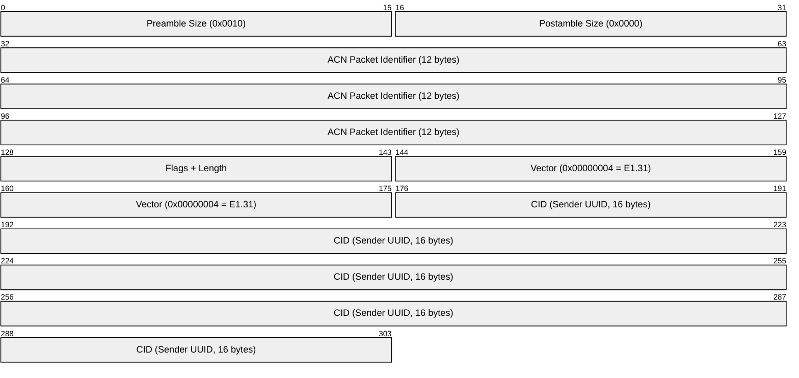
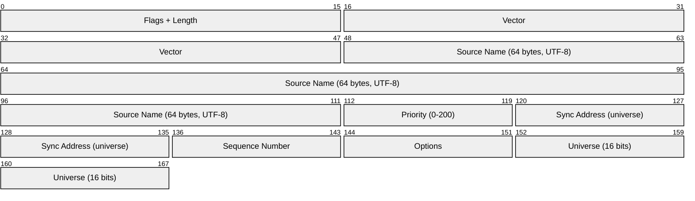
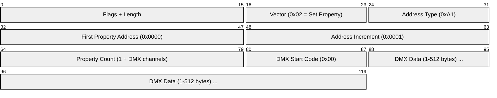
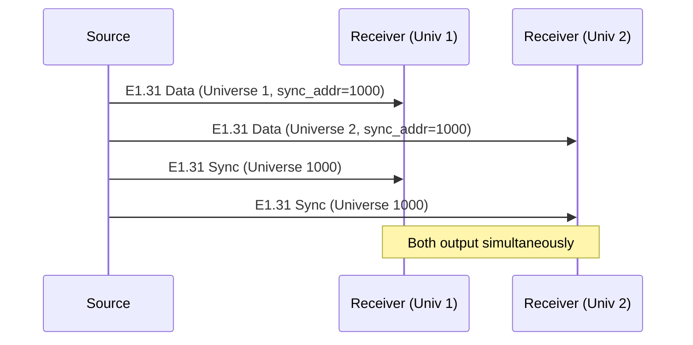
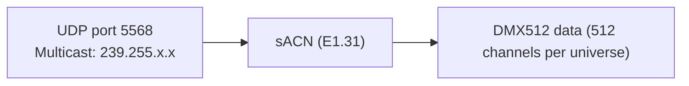

# sACN / E1.31 (Streaming Architecture for Control Networks)

> **Standard:** [ANSI E1.31-2018](https://tsp.esta.org/tsp/documents/published_docs.php) | **Layer:** Application (Layer 7) | **Wireshark filter:** `acn` or `e131`

sACN (Streaming ACN, formally ANSI E1.31) is a standard for transmitting DMX512 lighting data over Ethernet/IP using UDP **multicast**. Each DMX universe is mapped to a multicast group, allowing multiple receivers to efficiently receive the same data without the sender needing to know about them. sACN is an ANSI/ESTA standard (unlike the proprietary Art-Net) and is increasingly preferred for permanent installations, architectural lighting, and large-scale entertainment systems.

## Packet Structure

sACN is built on top of ACN (Architecture for Control Networks, E1.17). Each sACN packet has three layers of PDU (Protocol Data Unit):

### Root Layer PDU



### Framing Layer PDU



### DMP Layer PDU (Device Management Protocol)



## Key Fields

| Field | Size | Description |
|-------|------|-------------|
| CID | 16 bytes | Component Identifier — UUID uniquely identifying the sender |
| Source Name | 64 bytes | Human-readable source name (UTF-8, null-padded) |
| Priority | 8 bits | Source priority (0-200, default 100, higher wins) |
| Sync Address | 16 bits | Universe number used for synchronization (0 = no sync) |
| Sequence | 8 bits | Sequence counter (0-255, wrapping) |
| Options | 8 bits | Bit 6 = Force Sync, Bit 5 = Stream Terminated, Bit 7 = Preview |
| Universe | 16 bits | DMX universe number (1-63999) |
| Start Code | 8 bits | DMX start code (0x00 = dimmer data, 0xCC = RDM) |
| DMX Data | 1-512 bytes | Channel values for this universe |

## Multicast Addressing

Each universe maps to a specific IPv4 multicast address:

```
239.255.{universe_high}.{universe_low}
```

| Universe | Multicast Address |
|----------|------------------|
| 1 | 239.255.0.1 |
| 2 | 239.255.0.2 |
| 256 | 239.255.1.0 |
| 1000 | 239.255.3.232 |
| 63999 | 239.255.249.255 |

Formula: `239.255.(universe >> 8).(universe & 0xFF)`

Receivers join the multicast group for the universes they need — no configuration on the sender side.

## Priority and Merging

sACN's priority system is its key advantage over Art-Net:

| Priority | Usage |
|----------|-------|
| 0 | Lowest (background) |
| 100 | Default |
| 200 | Highest (emergency override) |

### Per-Source Priority

When multiple sources send to the same universe:
1. **Highest priority wins** (entire universe from that source)
2. **Equal priority** — receiver decides (typically HTP merge or reject)

### Per-Channel Priority (E1.31-2018, Appendix)

Using start code 0xDD, a source can assign different priorities per channel, allowing fine-grained merging:

```
Source A: Priority 100, channels 1-100 (stage left)
Source B: Priority 100, channels 101-200 (stage right)
Source C: Priority 200, channels 1-200 (emergency override)
```

## Synchronization

sACN supports synchronization so multiple universes update simultaneously:



The sync universe is a separate multicast group that receivers subscribe to.

## Universe Discovery

E1.31 includes a discovery mechanism (added in 2018 revision):

| Packet | Description |
|--------|-------------|
| Universe Discovery | Source periodically multicasts a list of universes it's transmitting |

Multicast address for discovery: `239.255.250.0`

Receivers can use this to automatically subscribe to relevant universes.

## Options Flags

| Bit | Name | Description |
|-----|------|-------------|
| 5 | Stream Terminated | Source is stopping — receivers should time out gracefully |
| 6 | Force Synchronization | Data must not be output until sync packet received |
| 7 | Preview Data | Data is for visualization only, not output (lighting previz) |

## Timing

| Parameter | Value |
|-----------|-------|
| Transmit rate | Up to 44 packets/sec per universe (same as DMX512) |
| Timeout | 2.5 seconds (no data = source lost) |
| Keep-alive | Source should send at least 1 packet/sec even with no changes |
| Terminated flag | Send 3 packets with Stream Terminated before stopping |

## sACN vs Art-Net

| Feature | sACN (E1.31) | Art-Net 4 |
|---------|-------------|-----------|
| Standard | ANSI/ESTA (open) | Artistic Licence (proprietary, free) |
| Transport | **Multicast** (+ unicast option) | Unicast + broadcast |
| Port | 5568 | 6454 |
| Priority | 0-200 per source (+ per channel) | HTP/LTP merge only |
| Discovery | Universe Discovery | ArtPoll/ArtPollReply |
| Max universes | 63,999 | 32,768 |
| Sync | Sync universe | ArtSync |
| Multicast efficiency | Excellent (IGMP snooping) | Poor (broadcast or unicast per node) |
| RDM | Via E1.33 (RDMnet) | ArtRdm (tunneled) |
| Adoption | Installations, architectural | Live entertainment, concerts |
| Network impact | Low (IGMP + multicast) | Higher (broadcast/unicast per node) |

## Encapsulation



## Standards

| Document | Title |
|----------|-------|
| [ANSI E1.31-2018](https://tsp.esta.org/tsp/documents/published_docs.php) | Entertainment Technology — Lightweight streaming protocol for transport of DMX512 using ACN |
| [ANSI E1.17](https://tsp.esta.org/tsp/documents/published_docs.php) | Architecture for Control Networks (ACN) — base protocol |
| [ANSI E1.33](https://tsp.esta.org/tsp/documents/published_docs.php) | RDMnet — RDM over ACN/sACN networks |

## See Also

- [Art-Net](artnet.md) — alternative DMX-over-Ethernet protocol
- [DMX512](dmx512.md) — the lighting data sACN carries
- [IGMP](../network-layer/igmp.md) — multicast group management (critical for sACN)
- [Ethernet](../link-layer/ethernet.md) — physical transport
- [UDP](../transport-layer/udp.md) — sACN transport
