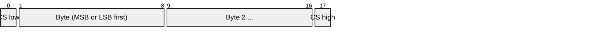
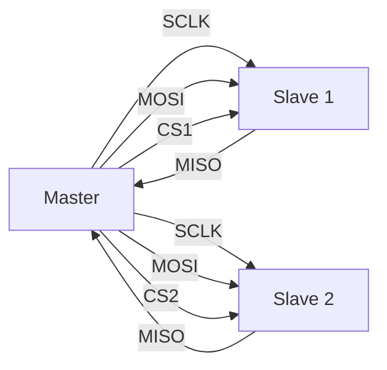
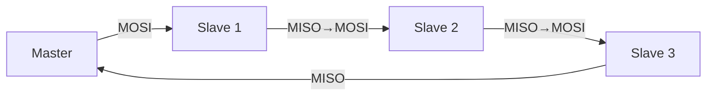

# SPI (Serial Peripheral Interface)

> **Standard:** No formal standard (Motorola de facto) | **Layer:** Data Link / Physical | **Wireshark filter:** N/A (sub-packet-capture; logic analyzer protocols)

SPI is a synchronous, full-duplex serial bus originally developed by Motorola in the 1980s. It uses a master-slave architecture with separate clock, data-in, data-out, and chip-select lines. SPI is faster than I2C (commonly 1-50 MHz, sometimes 100+ MHz) at the cost of more wires. It is widely used for flash memory, SD cards, display controllers, ADCs/DACs, radio transceivers, and any peripheral requiring high throughput.

## Bus Signals

| Signal | Alternative Names | Description |
|--------|------------------|-------------|
| SCLK | SCK, CLK | Serial Clock — driven by master |
| MOSI | SDO, COPI, DI | Master Out Slave In — data from master to slave |
| MISO | SDI, CIPO, DO | Master In Slave Out — data from slave to master |
| CS | SS, NSS, CSn | Chip Select — active low, one per slave |

Note: The MOSI/MISO terminology is being replaced by COPI (Controller Out Peripheral In) / CIPO (Controller In Peripheral Out) in some specifications.

## Frame

SPI transmits data simultaneously in both directions. A typical 8-bit exchange:



Each clock cycle shifts one bit out on MOSI and one bit in on MISO simultaneously. There is no addressing, start/stop conditions, or acknowledgment — the CS line selects the target device.

## Key Fields

| Element | Description |
|---------|-------------|
| CS assertion | Master pulls CS low to select a slave |
| Data bits | Shifted MSB-first (most common) or LSB-first |
| Clock edge | Data sampled/shifted on configurable edges (see clock modes) |
| CS deassertion | Master pulls CS high to end the transaction |

There is no fixed frame format — the number of bits, byte order, and meaning are defined by the peripheral's datasheet.

## Clock Modes (CPOL / CPHA)

SPI has four clock modes defined by Clock Polarity (CPOL) and Clock Phase (CPHA):

| Mode | CPOL | CPHA | Idle State | Sample Edge | Shift Edge |
|------|------|------|------------|-------------|------------|
| 0 | 0 | 0 | Low | Rising | Falling |
| 1 | 0 | 1 | Low | Falling | Rising |
| 2 | 1 | 0 | High | Falling | Rising |
| 3 | 1 | 1 | High | Rising | Falling |

**Mode 0** (CPOL=0, CPHA=0) is the most common default.

### Timing Diagram (Mode 0)

```
CS:    ‾‾‾\________________________________/‾‾‾
SCLK:  ____/‾\_/‾\_/‾\_/‾\_/‾\_/‾\_/‾\_/‾\____
MOSI:  ====X D7 X D6 X D5 X D4 X D3 X D2 X D1 X D0 X====
MISO:  ====X D7 X D6 X D5 X D4 X D3 X D2 X D1 X D0 X====
            ↑    ↑    ↑    ↑    ↑    ↑    ↑    ↑
         Sample on rising edge
```

## Bus Topology

### Independent Slave (standard)

Each slave has its own CS line:



### Daisy Chain

Slaves are chained — MISO of one feeds MOSI of the next. Data shifts through all devices:



Used by LED drivers (WS2801), shift registers, and some sensor chains.

## Common SPI Speeds

| Device Type | Typical Clock | Notes |
|-------------|---------------|-------|
| SD Card (SPI mode) | 400 kHz init, 25 MHz data | SPI is the slow/compatible mode |
| SPI Flash (W25Q) | 50-133 MHz | Quad-SPI uses 4 data lines |
| ADC (MCP3008) | 1.35 MHz | 10-bit, 200 ksps |
| Display (ILI9341) | 10-40 MHz | SPI TFT LCD |
| Radio (nRF24L01) | 8 MHz | 2.4 GHz transceiver |
| IMU (BMI160) | 10 MHz | Accelerometer/gyroscope |

## SPI vs I2C

| Feature | SPI | I2C |
|---------|-----|-----|
| Wires | 4 + 1 CS per slave | 2 (shared) |
| Speed | 1-100+ MHz | 100 kHz - 5 MHz |
| Duplex | Full | Half |
| Addressing | CS line per device | 7/10-bit address |
| Multi-master | Rare | Supported |
| Acknowledgment | None | ACK/NACK |
| Max devices | Limited by CS pins | 112+ on shared bus |
| Complexity | Simple hardware | More complex (start/stop, ACK, arbitration) |

## Variants

| Variant | Data Lines | Description |
|---------|-----------|-------------|
| Standard SPI | 1 in, 1 out | Full duplex, single data line each way |
| Dual SPI | 2 bidirectional | Half duplex, 2x throughput |
| Quad SPI (QSPI) | 4 bidirectional | Half duplex, 4x throughput (common for flash) |
| Octal SPI (OSPI) | 8 bidirectional | Half duplex, 8x throughput |

## Standards

SPI has no formal standard body specification. It is a de facto standard originating from Motorola:

| Document | Title |
|----------|-------|
| Motorola M68HC11 Reference | Original SPI definition |
| [JEDEC xSPI](https://www.jedec.org/) | JESD251 — eXpanded SPI standard for flash memory |

## See Also

- [I2C](i2c.md) — lower-speed alternative with fewer wires
- [I2S](i2s.md) — audio-specific serial bus (different from SPI despite similar signals)
