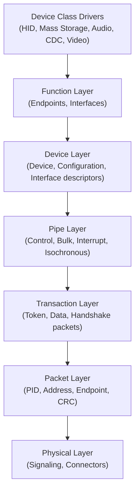
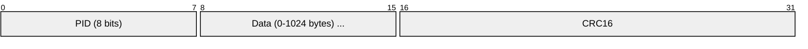
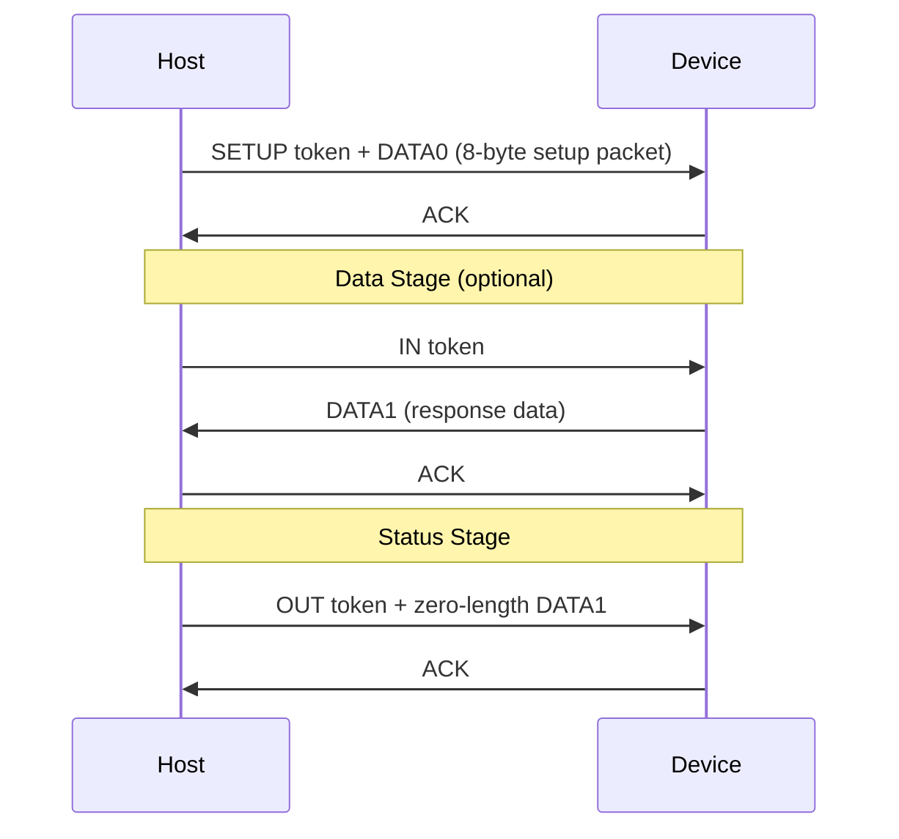
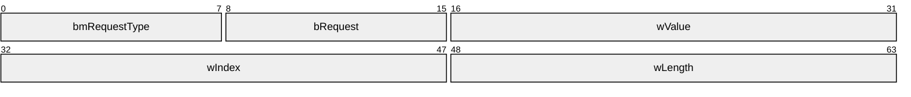
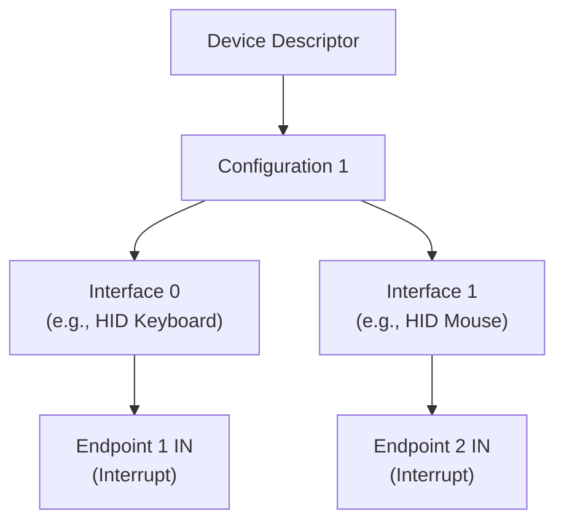

# USB (Universal Serial Bus)

> **Standard:** [USB Specification (usb.org)](https://www.usb.org/documents) | **Layer:** Full stack (Physical through Application) | **Wireshark filter:** `usb`

USB is the dominant wired peripheral interconnect, connecting keyboards, mice, storage, cameras, phones, audio devices, and virtually every computer peripheral manufactured since the late 1990s. It uses a host-controlled, polled bus architecture where the host initiates all data transfers. USB has evolved through multiple generations — from 1.5 Mbps (USB 1.0 Low Speed) to 120 Gbps (USB4). USB Power Delivery enables up to 240W charging over the same cable.

## Protocol Stack

## Token Packet (USB 2.0)

## Data Packet

## Packet IDs (PIDs)

| Category | PID | Name | Description |
|----------|-----|------|-------------|
| Token | 0x01 | OUT | Host to device transfer |
| Token | 0x09 | IN | Device to host transfer |
| Token | 0x05 | SOF | Start of Frame (1 ms marker) |
| Token | 0x0D | SETUP | Control transfer setup stage |
| Data | 0x03 | DATA0 | Data packet (even) |
| Data | 0x0B | DATA1 | Data packet (odd — for toggle) |
| Data | 0x07 | DATA2 | High-speed isochronous |
| Data | 0x0F | MDATA | High-speed split |
| Handshake | 0x02 | ACK | Transfer accepted |
| Handshake | 0x0A | NAK | Device busy, retry later |
| Handshake | 0x0E | STALL | Error — endpoint halted |
| Handshake | 0x06 | NYET | Not yet (high-speed flow control) |

## Transfer Types

| Type | Use Case | Max Size (HS) | Guaranteed Bandwidth | Error Recovery |
|------|----------|---------------|---------------------|----------------|
| Control | Device setup, configuration | 64 bytes | No | Yes (retry) |
| Bulk | Large data (storage, printing) | 512 bytes | No | Yes (retry) |
| Interrupt | Periodic input (keyboard, mouse) | 1024 bytes | Yes (polling interval) | Yes (retry) |
| Isochronous | Streaming (audio, video) | 1024 bytes | Yes (reserved) | No (no retry) |

### Control Transfer

## Setup Packet (Control Transfers)

### Standard Requests

| bRequest | Name | Description |
|----------|------|-------------|
| 0 | GET_STATUS | Read device/endpoint status |
| 1 | CLEAR_FEATURE | Clear a feature (e.g., endpoint halt) |
| 5 | SET_ADDRESS | Assign a device address (1-127) |
| 6 | GET_DESCRIPTOR | Read device, configuration, or string descriptor |
| 9 | SET_CONFIGURATION | Activate a device configuration |
| 11 | SET_INTERFACE | Select an alternate interface setting |

## Descriptor Hierarchy

## Common Device Classes

| Class | Code | Description | Examples |
|-------|------|-------------|----------|
| HID | 0x03 | Human Interface Device | Keyboard, mouse, gamepad |
| Mass Storage | 0x08 | Block storage (SCSI over USB) | Flash drives, external HDDs |
| CDC | 0x02 | Communications Device | USB serial (ACM), Ethernet (ECM/NCM) |
| Audio | 0x01 | Audio streaming and control | USB microphones, DACs, headsets |
| Video | 0x0E | Video streaming (UVC) | Webcams |
| Printer | 0x07 | Printing | USB printers |
| Wireless | 0xE0 | Wireless controllers | Bluetooth adapters |
| Vendor Specific | 0xFF | Custom protocols | Proprietary devices |

## USB Generations

| Version | Year | Speed | Marketing Name | Connector |
|---------|------|-------|---------------|-----------|
| 1.0 | 1996 | 1.5 Mbps (Low) / 12 Mbps (Full) | USB | A, B |
| 2.0 | 2000 | 480 Mbps | Hi-Speed | A, B, Mini, Micro |
| 3.0 | 2008 | 5 Gbps | SuperSpeed | A, B, Micro-B (blue) |
| 3.1 | 2013 | 10 Gbps | SuperSpeed+ | A, C |
| 3.2 | 2017 | 20 Gbps | SuperSpeed 20Gbps | C |
| USB4 | 2019 | 40 Gbps | USB4 40Gbps | C |
| USB4 v2 | 2022 | 120 Gbps | USB4 120Gbps | C |

## USB Type-C

| Feature | Description |
|---------|-------------|
| Connector | Reversible, 24-pin |
| USB PD | Up to 240W (48V × 5A) power delivery |
| Alternate Modes | DisplayPort, Thunderbolt, HDMI over USB-C |
| USB4 | Tunnels USB 3.x, DisplayPort, and PCIe over USB-C |

## Standards

| Document | Title |
|----------|-------|
| [USB 2.0 Spec](https://www.usb.org/document-library/usb-20-specification) | USB 2.0 Specification |
| [USB 3.2 Spec](https://www.usb.org/document-library/usb-32-specification) | USB 3.2 Specification |
| [USB4 Spec](https://www.usb.org/document-library/usb4-specification) | USB4 Specification |
| [USB PD Spec](https://www.usb.org/document-library/usb-power-delivery) | USB Power Delivery Specification |
| [USB Type-C Spec](https://www.usb.org/document-library/usb-type-cr-cable-and-connector-specification) | USB Type-C Cable and Connector Specification |

## See Also

- [I2C](i2c.md) — low-speed IC bus (some USB devices bridge to I2C)
- [SPI](spi.md) — IC bus (some USB devices bridge to SPI)
- [Bluetooth](../wireless/bluetooth.md) — wireless alternative for peripherals
