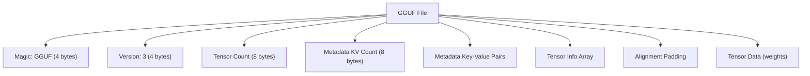
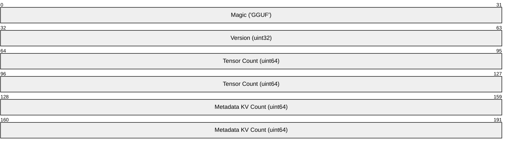

# GGUF (GPT-Generated Unified Format)

> **Standard:** [GGUF Specification (github.com/ggerganov/ggml)](https://github.com/ggerganov/ggml/blob/master/docs/gguf.md) | **Category:** LLM Model Storage Format

GGUF is the model file format for llama.cpp and the broader local LLM inference ecosystem. It stores quantized model weights with rich metadata (architecture, tokenizer, quantization type) in a single self-contained file. GGUF replaced the earlier GGML format and is designed for fast memory-mapped loading — the entire file can be `mmap()`-ed directly, enabling instant model loading even for large models. GGUF is the format behind Ollama, LM Studio, GPT4All, and most local LLM tools.

## File Structure

### Header

| Field | Size | Description |
|-------|------|-------------|
| Magic | 4 bytes | `0x46475547` ("GGUF" in little-endian) |
| Version | 4 bytes | Format version (currently 3) |
| Tensor Count | 8 bytes | Number of tensors in the file |
| Metadata KV Count | 8 bytes | Number of metadata key-value pairs |

## Metadata

Metadata is stored as key-value pairs with typed values:

### Value Types

| Type | ID | Description |
|------|-----|-------------|
| UINT8 | 0 | Unsigned 8-bit |
| INT8 | 1 | Signed 8-bit |
| UINT16 | 2 | Unsigned 16-bit |
| UINT32 | 4 | Unsigned 32-bit |
| INT32 | 5 | Signed 32-bit |
| FLOAT32 | 6 | 32-bit float |
| UINT64 | 8 | Unsigned 64-bit |
| INT64 | 9 | Signed 64-bit |
| FLOAT64 | 10 | 64-bit float |
| BOOL | 7 | Boolean |
| STRING | 3 | Length-prefixed UTF-8 string |
| ARRAY | 11 | Typed array |

### Standard Metadata Keys

| Key | Type | Description |
|-----|------|-------------|
| `general.architecture` | string | Model architecture (llama, mistral, phi, gemma, etc.) |
| `general.name` | string | Model name |
| `general.quantization_version` | uint32 | Quantization format version |
| `general.file_type` | uint32 | Quantization type (see table below) |
| `llama.context_length` | uint32 | Maximum context length |
| `llama.embedding_length` | uint32 | Hidden size / embedding dimension |
| `llama.block_count` | uint32 | Number of transformer layers |
| `llama.feed_forward_length` | uint32 | FFN intermediate size |
| `llama.attention.head_count` | uint32 | Number of attention heads |
| `llama.attention.head_count_kv` | uint32 | Number of KV heads (GQA) |
| `llama.rope.freq_base` | float32 | RoPE theta base frequency |
| `llama.vocab_size` | uint32 | Vocabulary size |
| `tokenizer.ggml.model` | string | Tokenizer type (llama, gpt2, etc.) |
| `tokenizer.ggml.tokens` | string[] | Token vocabulary |
| `tokenizer.ggml.scores` | float[] | Token scores/priorities |
| `tokenizer.ggml.token_type` | int[] | Token type (normal, control, byte, etc.) |
| `tokenizer.ggml.bos_token_id` | uint32 | Beginning of sequence token |
| `tokenizer.ggml.eos_token_id` | uint32 | End of sequence token |

## Quantization Types

| File Type | Name | Bits/Weight | Description |
|-----------|------|-------------|-------------|
| 0 | F32 | 32 | Full precision (huge) |
| 1 | F16 | 16 | Half precision |
| 2 | Q4_0 | 4.5 | 4-bit quantization (basic, fast) |
| 3 | Q4_1 | 5.0 | 4-bit with offset (slightly better quality) |
| 7 | Q8_0 | 8.5 | 8-bit quantization (near-lossless) |
| 8 | Q5_0 | 5.5 | 5-bit quantization |
| 9 | Q5_1 | 6.0 | 5-bit with offset |
| 10 | Q2_K | 3.35 | 2-bit K-quantization (smallest, lower quality) |
| 11 | Q3_K_S | 3.4375 | 3-bit K-quant small |
| 12 | Q3_K_M | 3.9 | 3-bit K-quant medium |
| 13 | Q3_K_L | 4.3 | 3-bit K-quant large |
| 14 | Q4_K_S | 4.5 | 4-bit K-quant small |
| 15 | Q4_K_M | 4.8 | 4-bit K-quant medium (best quality/size balance) |
| 16 | Q5_K_S | 5.5 | 5-bit K-quant small |
| 17 | Q5_K_M | 5.7 | 5-bit K-quant medium |
| 18 | Q6_K | 6.5 | 6-bit K-quant (high quality) |
| 30 | IQ2_XXS | 2.06 | Importance-weighted 2-bit (cutting edge) |
| 31 | IQ2_XS | 2.31 | Importance-weighted 2-bit |
| 36 | IQ4_NL | 4.5 | Importance-weighted 4-bit non-linear |

### Quantization Size Comparison (7B parameter model)

| Quantization | File Size | RAM Required | Quality |
|-------------|-----------|-------------|---------|
| F16 | ~14 GB | ~14 GB | Reference |
| Q8_0 | ~7.5 GB | ~8 GB | Near-lossless |
| Q5_K_M | ~5.0 GB | ~5.5 GB | Excellent |
| Q4_K_M | ~4.2 GB | ~4.7 GB | Very good (most popular) |
| Q3_K_M | ~3.3 GB | ~3.8 GB | Good |
| Q2_K | ~2.8 GB | ~3.3 GB | Acceptable |
| IQ2_XXS | ~1.9 GB | ~2.4 GB | Usable (aggressive) |

## Tensor Info

Each tensor has metadata followed by the raw data:

| Field | Type | Description |
|-------|------|-------------|
| Name | string | Tensor name (e.g., `blk.0.attn_q.weight`) |
| N Dimensions | uint32 | Number of dimensions |
| Dimensions | uint64[] | Shape (e.g., [4096, 4096]) |
| Type | uint32 | Quantization type for this tensor |
| Offset | uint64 | Byte offset from start of tensor data section |

### Common Tensor Names (LLaMA)

| Pattern | Description |
|---------|-------------|
| `token_embd.weight` | Token embedding matrix |
| `blk.{n}.attn_q.weight` | Query weight for layer n |
| `blk.{n}.attn_k.weight` | Key weight for layer n |
| `blk.{n}.attn_v.weight` | Value weight for layer n |
| `blk.{n}.attn_output.weight` | Attention output projection |
| `blk.{n}.ffn_gate.weight` | FFN gate (SwiGLU) |
| `blk.{n}.ffn_up.weight` | FFN up projection |
| `blk.{n}.ffn_down.weight` | FFN down projection |
| `blk.{n}.attn_norm.weight` | Pre-attention RMSNorm |
| `blk.{n}.ffn_norm.weight` | Pre-FFN RMSNorm |
| `output.weight` | Language model head |
| `output_norm.weight` | Final RMSNorm |

## GGUF Ecosystem

| Tool | Description |
|------|-------------|
| llama.cpp | Reference inference engine |
| Ollama | Desktop LLM manager (uses GGUF) |
| LM Studio | GUI for local LLM inference |
| GPT4All | Desktop LLM app |
| vLLM | High-performance serving (GGUF support added) |
| text-generation-webui | Web UI for local LLMs |
| convert-hf-to-gguf.py | Hugging Face → GGUF converter (in llama.cpp) |
| llama-quantize | Quantize GGUF models to different types |

## GGUF vs Other Model Formats

| Feature | GGUF | Safetensors | PyTorch (.pt) | ONNX |
|---------|------|-------------|--------------|------|
| Primary use | Local LLM inference | Model weights (HF) | Training + inference | Cross-framework |
| Quantization | Built-in (Q2-Q8, IQ) | External | External | Built-in ops |
| Tokenizer | Embedded | Separate file | Separate | N/A |
| Architecture info | Embedded metadata | Separate config.json | Separate | In graph |
| Memory mapping | Designed for mmap | mmap-safe | Not mmap-safe | Not mmap-safe |
| Security | Safe (no executable code) | Safe (no pickle) | **Unsafe** (pickle) | Safe (protobuf) |
| Loading speed | Instant (mmap) | Fast | Slow (deserialize) | Medium |

## Standards

| Resource | Description |
|----------|-------------|
| [GGUF Spec](https://github.com/ggerganov/ggml/blob/master/docs/gguf.md) | Format specification |
| [llama.cpp](https://github.com/ggerganov/llama.cpp) | Reference implementation |
| [Hugging Face GGUF](https://huggingface.co/docs/hub/gguf) | GGUF support on Hugging Face Hub |

## See Also

- [ONNX](onnx.md) — cross-framework model interchange
- [Safetensors](safetensors.md) — secure weight storage
- [Parquet](parquet.md) — training data format
