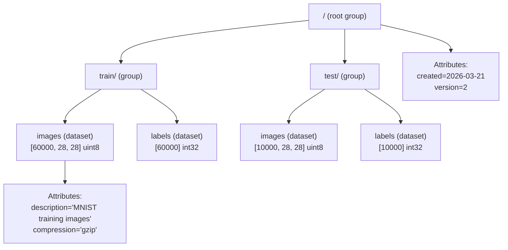

# HDF5 (Hierarchical Data Format 5)

> **Standard:** [HDF5 Specification (hdfgroup.org)](https://www.hdfgroup.org/solutions/hdf5/) | **Category:** Scientific / ML Data Storage Format

HDF5 is a binary file format and library for storing large, heterogeneous, multi-dimensional datasets. It organizes data in a filesystem-like hierarchy of groups (directories) and datasets (arrays), with arbitrary metadata attributes on any object. HDF5 is the standard format for scientific computing, satellite imagery, genomics, physics simulations, and was the default model format for Keras/TensorFlow 1.x (`.h5` files). It supports chunking, compression, and partial I/O for datasets too large to fit in memory.

## File Structure



## Key Concepts

| Concept | Description |
|---------|-------------|
| Group | Container (like a directory) — can contain datasets and other groups |
| Dataset | N-dimensional array of a single type — the actual data |
| Attribute | Key-value metadata attached to any group or dataset |
| Datatype | Element type (int8, float32, compound, string, etc.) |
| Dataspace | Shape and dimensionality of a dataset |
| Chunk | Sub-block of a dataset stored independently (enables compression, partial I/O) |
| Filter | Compression or transformation pipeline (gzip, SZIP, LZF, shuffle, checksum) |

## Datatypes

| Category | Types |
|----------|-------|
| Integer | int8, int16, int32, int64, uint8, uint16, uint32, uint64 |
| Float | float16, float32, float64 |
| String | Fixed-length or variable-length (ASCII or UTF-8) |
| Compound | Struct-like (named fields of mixed types) |
| Array | Fixed-size array within each element |
| Enum | Named integer values |
| Opaque | Raw bytes (uninterpreted) |
| Reference | Pointer to another object or region in the file |
| Variable-length | Variable-size arrays per element |

## Chunking

Datasets can be stored contiguously or in chunks:

```
Dataset shape: [1000, 1000, 3]  (1M pixels × RGB)
Chunk shape:   [100, 100, 3]    (100×100 pixel tiles)

Reading pixel [500, 500]:
  → Only chunk [5, 5] (covering [500-599, 500-599]) is read and decompressed
  → Other 99 chunks are not touched
```

| Storage Layout | Description |
|---------------|-------------|
| Contiguous | Single block (fast sequential read, no compression) |
| Chunked | Independent blocks (enables compression, partial I/O, extensible) |
| Compact | Stored in metadata (tiny datasets only) |

### Chunk Size Selection

| Data Pattern | Recommended Chunk Shape | Why |
|-------------|------------------------|-----|
| Time-series | [N, full_width] | Read chunks of consecutive timesteps |
| Images | [1, H, W, C] | One image per chunk |
| 3D volume | [32, 32, 32] | Cube-shaped for spatial queries |
| Training batches | [batch_size, features] | Align with training read pattern |

## Compression Filters

| Filter | Description | Speed | Ratio |
|--------|-------------|-------|-------|
| gzip | General-purpose (zlib) | Slow | High |
| LZF | Fast compression | Fast | Medium |
| SZIP | NASA-developed for scientific data | Medium | High (floating point) |
| Blosc | Meta-compressor (LZ4, Zstd, etc.) | Very fast | Variable |
| Shuffle | Reorder bytes for better compression | — | Used with gzip/LZF |
| Fletcher32 | Checksum (error detection, not compression) | — | — |

Filters can be chained: `shuffle → gzip` typically gives 2-5× better compression on numeric data.

## ML Usage

### Keras Model Format (.h5)

```
model.h5:
  /model_weights/
    /dense_1/
      /dense_1/kernel:0  [784, 128] float32
      /dense_1/bias:0    [128] float32
    /dense_2/
      /dense_2/kernel:0  [128, 10] float32
      /dense_2/bias:0    [10] float32
  /model_config (attribute): JSON string of architecture
  /training_config (attribute): optimizer, loss, metrics
```

### Training Data

```python
import h5py

with h5py.File('dataset.h5', 'r') as f:
    # Lazy loading — only reads requested slice from disk
    batch = f['train/images'][1000:1032]  # shape [32, 28, 28]
    labels = f['train/labels'][1000:1032]  # shape [32]
```

## HDF5 vs Other Formats

| Feature | HDF5 | Parquet | TFRecord | NumPy (.npy) | Safetensors |
|---------|------|--------|----------|-------------|-------------|
| Layout | Hierarchical (groups/datasets) | Columnar | Sequential records | Single array | Flat tensor map |
| Dimensions | N-dimensional | Tabular (2D) | Serialized protobufs | N-dimensional | N-dimensional |
| Partial I/O | Yes (chunked) | Yes (row groups, columns) | No (sequential) | No | Yes (offsets) |
| Compression | Per-chunk (gzip, LZF, etc.) | Per-column (Snappy, ZSTD) | Per-record (gzip) | No | No |
| Schema | Self-describing (groups + attrs) | Self-describing (footer) | Protobuf schema | dtype + shape only | JSON header |
| Random access | Yes (by index/slice) | By row group | No (sequential only) | Yes | By tensor name |
| File size limit | Exabytes (theoretical) | No limit (row groups) | No limit | ~2 GB (single array) | No limit |
| Concurrent write | Limited (SWMR mode) | No (immutable) | Yes (append) | No | No |
| ML use | Keras weights, scientific data | Training data (tabular) | TensorFlow training | NumPy/Scikit-learn | Model weights (HF) |

## Common Tools

| Tool | Language | Usage |
|------|----------|-------|
| h5py | Python | Primary Python interface |
| HDFView | Java (GUI) | Visual file explorer |
| h5dump | C (CLI) | Command-line inspection |
| PyTables | Python | High-level table interface |
| netCDF4 | Python/C | Climate/weather data (built on HDF5) |
| Keras | Python | `model.save('model.h5')` |

## Standards

| Document | Title |
|----------|-------|
| [HDF5 File Format Spec](https://docs.hdfgroup.org/hdf5/develop/_f_m_t3.html) | HDF5 File Format Specification |
| [HDF5 Library](https://www.hdfgroup.org/solutions/hdf5/) | Reference implementation |
| [h5py Documentation](https://docs.h5py.org/) | Python HDF5 interface |

## See Also

- [Parquet](parquet.md) — columnar format for tabular ML data
- [Safetensors](safetensors.md) — modern replacement for HDF5 model storage
- [ONNX](onnx.md) — model interchange format
- [GGUF](gguf.md) — LLM model format
