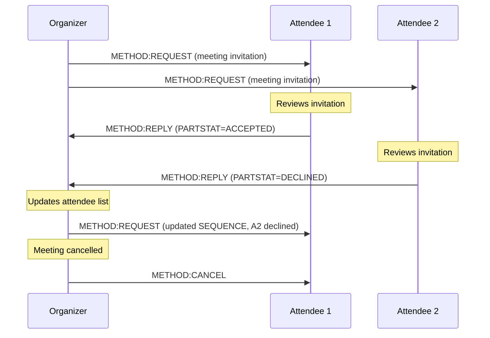

# iCalendar (Internet Calendaring and Scheduling)

> **Standard:** [RFC 5545](https://www.rfc-editor.org/rfc/rfc5545) | **Category:** Data Format | **Wireshark filter:** N/A (data format, not wire protocol)

iCalendar is a text-based data format for representing calendar events, to-do items, journal entries, and free/busy information. It is the universal interchange format for calendaring: when you receive a meeting invitation by email, that is an `.ics` file containing iCalendar data. When your calendar app syncs via CalDAV, the events are stored as iCalendar objects. Every major calendar system — Google Calendar, Apple Calendar, Outlook, Thunderbird — reads and writes iCalendar. It is to scheduling what vCard is to contacts.

## Format

An iCalendar object is plain text wrapped in `BEGIN:VCALENDAR` / `END:VCALENDAR` delimiters, containing one or more components (events, to-dos, etc.), each with properties in the form `PROPERTY;PARAMETER=VALUE:property-value`:

```
BEGIN:VCALENDAR
VERSION:2.0
PRODID:-//Example Corp//Calendar App//EN
CALSCALE:GREGORIAN
METHOD:PUBLISH
BEGIN:VEVENT
DTSTART:20240315T143000Z
DTEND:20240315T153000Z
SUMMARY:Project Review
DESCRIPTION:Quarterly project status review with the engineering team.
LOCATION:Conference Room B
ORGANIZER;CN=Alice:mailto:alice@example.com
ATTENDEE;PARTSTAT=ACCEPTED;CN=Bob:mailto:bob@example.com
ATTENDEE;PARTSTAT=NEEDS-ACTION;CN=Carol:mailto:carol@example.com
STATUS:CONFIRMED
UID:event-20240315-review@example.com
DTSTAMP:20240301T120000Z
CREATED:20240301T120000Z
LAST-MODIFIED:20240310T090000Z
SEQUENCE:0
TRANSP:OPAQUE
BEGIN:VALARM
ACTION:DISPLAY
TRIGGER:-PT15M
DESCRIPTION:Meeting in 15 minutes
END:VALARM
END:VEVENT
END:VCALENDAR
```

## Components

| Component | Description |
|-----------|-------------|
| VCALENDAR | Top-level wrapper (required) — contains metadata and components |
| VEVENT | A calendar event (meeting, appointment, all-day event) |
| VTODO | A task or to-do item with optional due date and completion status |
| VJOURNAL | A journal entry or note associated with a date |
| VFREEBUSY | Free/busy time information for scheduling |
| VALARM | A reminder/alarm attached to a VEVENT or VTODO |
| VTIMEZONE | Time zone definition with daylight/standard rules |

## Calendar-Level Properties

| Property | Required | Description |
|----------|----------|-------------|
| VERSION | Yes | iCalendar version (always `2.0`) |
| PRODID | Yes | Product identifier of the generating application |
| CALSCALE | No | Calendar scale (`GREGORIAN` is default and only defined value) |
| METHOD | No | iTIP method when used for scheduling (REQUEST, REPLY, CANCEL, etc.) |

## VEVENT Key Properties

| Property | Required | Description |
|----------|----------|-------------|
| UID | Yes | Globally unique identifier for this event |
| DTSTAMP | Yes | Timestamp when the iCalendar object was created |
| DTSTART | Yes* | Start date/time of the event |
| DTEND | No | End date/time (mutually exclusive with DURATION) |
| DURATION | No | Duration of the event (e.g., `PT1H30M` = 1 hour 30 min) |
| SUMMARY | No | Short title / subject of the event |
| DESCRIPTION | No | Detailed description (plain text) |
| LOCATION | No | Location of the event (free text) |
| GEO | No | Geographic coordinates (`lat;lon`) |
| URL | No | Associated URL |
| ORGANIZER | No | Calendar address of the organizer (`mailto:...`) |
| ATTENDEE | No | Calendar address of an attendee (repeatable) |
| STATUS | No | Event status: `TENTATIVE`, `CONFIRMED`, or `CANCELLED` |
| CATEGORIES | No | Comma-separated category tags |
| PRIORITY | No | Priority (0 = undefined, 1 = highest, 9 = lowest) |
| SEQUENCE | No | Revision sequence number (incremented on updates) |
| RRULE | No | Recurrence rule |
| EXDATE | No | Exception dates excluded from recurrence |
| RDATE | No | Additional dates added to recurrence |
| TRANSP | No | Time transparency: `OPAQUE` (blocks time) or `TRANSPARENT` (does not) |
| CREATED | No | Date the event was first created |
| LAST-MODIFIED | No | Date the event was last modified |
| CLASS | No | Access classification: `PUBLIC`, `PRIVATE`, `CONFIDENTIAL` |

## Date-Time Formats

iCalendar supports several date-time representations:

| Format | Example | Description |
|--------|---------|-------------|
| DATE | `20240315` | Date only (all-day event) |
| DATE-TIME (local) | `20240315T143000` | Local time (no time zone — "floating") |
| DATE-TIME (UTC) | `20240315T143000Z` | UTC time (Z suffix) |
| DATE-TIME (TZID) | `DTSTART;TZID=America/New_York:20240315T103000` | Time in a specific zone |
| DURATION | `PT1H30M` | Period: 1 hour 30 minutes |
| DURATION | `-PT15M` | Negative period: 15 minutes before |
| PERIOD | `20240315T143000Z/PT1H` | Start time + duration |

## Recurrence Rules (RRULE)

The RRULE property defines repeating events with a powerful rule language:

```
RRULE:FREQ=WEEKLY;BYDAY=MO,WE,FR;UNTIL=20241231T235959Z
```

| Parameter | Values | Description |
|-----------|--------|-------------|
| FREQ | SECONDLY, MINUTELY, HOURLY, DAILY, WEEKLY, MONTHLY, YEARLY | Recurrence frequency (required) |
| INTERVAL | Integer | How often the rule repeats (default 1) |
| COUNT | Integer | Number of occurrences |
| UNTIL | Date or date-time | Recurrence end date (mutually exclusive with COUNT) |
| BYDAY | MO, TU, WE, TH, FR, SA, SU | Day(s) of the week (prefix with +1, -1 etc. for nth) |
| BYMONTH | 1-12 | Month(s) of the year |
| BYMONTHDAY | 1-31, -1 to -31 | Day(s) of the month |
| BYHOUR | 0-23 | Hour(s) of the day |
| BYMINUTE | 0-59 | Minute(s) of the hour |
| BYSETPOS | Integer | Position within the set of instances |
| WKST | MO-SU | Week start day (default MO) |

### Recurrence Examples

| Rule | Meaning |
|------|---------|
| `FREQ=DAILY;COUNT=10` | Every day for 10 days |
| `FREQ=WEEKLY;BYDAY=TU,TH` | Every Tuesday and Thursday |
| `FREQ=MONTHLY;BYDAY=2FR` | Second Friday of every month |
| `FREQ=MONTHLY;BYMONTHDAY=-1` | Last day of every month |
| `FREQ=YEARLY;BYMONTH=3;BYMONTHDAY=15` | Every March 15 |
| `FREQ=WEEKLY;INTERVAL=2;BYDAY=MO` | Every other Monday |

## ATTENDEE Parameters

| Parameter | Values | Description |
|-----------|--------|-------------|
| PARTSTAT | NEEDS-ACTION, ACCEPTED, DECLINED, TENTATIVE, DELEGATED | Participation status |
| ROLE | CHAIR, REQ-PARTICIPANT, OPT-PARTICIPANT, NON-PARTICIPANT | Attendee role |
| RSVP | TRUE / FALSE | Whether a reply is requested |
| CN | Display name | Common name (display name) |
| CUTYPE | INDIVIDUAL, GROUP, ROOM, RESOURCE, UNKNOWN | Calendar user type |
| DELEGATED-TO | mailto: URI | Delegated to another attendee |
| DELEGATED-FROM | mailto: URI | Delegated from another attendee |
| SENT-BY | mailto: URI | Acting on behalf of |

## VALARM (Reminders)

Alarms are nested inside VEVENT or VTODO components:

```
BEGIN:VALARM
ACTION:DISPLAY
TRIGGER:-PT15M
DESCRIPTION:Meeting starts in 15 minutes
END:VALARM
```

| Property | Description |
|----------|-------------|
| ACTION | Alarm type: `DISPLAY` (pop-up), `AUDIO` (sound), `EMAIL` (send email) |
| TRIGGER | When to fire: `-PT15M` (15 min before), `-PT1H` (1 hour before), `-P1D` (1 day before) |
| REPEAT | Number of additional repetitions after initial trigger |
| DURATION | Interval between repetitions |
| DESCRIPTION | Alert text (for DISPLAY) |
| SUMMARY | Email subject (for EMAIL action) |
| ATTENDEE | Email recipient (for EMAIL action) |

## iTIP — Scheduling Protocol (RFC 5546)

iTIP defines how iCalendar objects are used for scheduling between organizers and attendees. The METHOD property specifies the intent:



### iTIP Methods

| Method | Direction | Description |
|--------|-----------|-------------|
| PUBLISH | Organizer to anyone | Publish an event (no scheduling, information only) |
| REQUEST | Organizer to attendees | Invite attendees to an event or request update |
| REPLY | Attendee to organizer | Accept, decline, or tentatively accept |
| CANCEL | Organizer to attendees | Cancel a previously sent invitation |
| ADD | Organizer to attendees | Add instances to a recurring event |
| REFRESH | Attendee to organizer | Request an updated copy of the event |
| COUNTER | Attendee to organizer | Propose a different time or details |
| DECLINECOUNTER | Organizer to attendee | Decline a counter-proposal |

## iMIP — Email Transport (RFC 6047)

iMIP defines how to carry iTIP messages over email. The iCalendar object is sent as a MIME attachment with `Content-Type: text/calendar; method=REQUEST`. This is how meeting invitations work in every email client:

| MIME Header | Value |
|-------------|-------|
| Content-Type | `text/calendar; method=REQUEST; charset=UTF-8` |
| Content-Disposition | `attachment; filename="invite.ics"` |
| Content-Transfer-Encoding | `base64` or `7bit` |

## VTODO (Tasks)

| Property | Description |
|----------|-------------|
| SUMMARY | Task title |
| DUE | Due date/time |
| DTSTART | Start date/time |
| COMPLETED | Date/time the task was completed |
| PERCENT-COMPLETE | 0-100 completion percentage |
| STATUS | NEEDS-ACTION, IN-PROCESS, COMPLETED, CANCELLED |
| PRIORITY | 1 (highest) to 9 (lowest), 0 = undefined |

## Line Folding

Identical to vCard: lines longer than 75 octets are folded by inserting a CRLF followed by a single space or tab. Parsers reassemble by removing CRLF + leading whitespace:

```
DESCRIPTION:This is a long description that needs to be folded because
  it exceeds the 75-octet line length limit specified by the RFC.
```

## jCal (JSON Representation)

jCal ([RFC 7265](https://www.rfc-editor.org/rfc/rfc7265)) maps iCalendar to JSON, mirroring jCard's approach:

```json
["vcalendar", [
  ["version", {}, "text", "2.0"],
  ["prodid", {}, "text", "-//Example//App//EN"]
], [
  ["vevent", [
    ["dtstart", {}, "date-time", "2024-03-15T14:30:00Z"],
    ["dtend", {}, "date-time", "2024-03-15T15:30:00Z"],
    ["summary", {}, "text", "Project Review"],
    ["uid", {}, "text", "event-20240315@example.com"]
  ], []]
]]
```

## File Format

| Property | Value |
|----------|-------|
| MIME type | `text/calendar` |
| File extension | `.ics` |
| Character encoding | UTF-8 |
| Line ending | CRLF (`\r\n`) |
| Line length limit | 75 octets (fold longer lines) |
| Multiple events | Multiple VEVENTs in one VCALENDAR |

## Standards

| Document | Title |
|----------|-------|
| [RFC 5545](https://www.rfc-editor.org/rfc/rfc5545) | Internet Calendaring and Scheduling Core Object Specification (iCalendar) |
| [RFC 5546](https://www.rfc-editor.org/rfc/rfc5546) | iCalendar Transport-Independent Interoperability Protocol (iTIP) |
| [RFC 6047](https://www.rfc-editor.org/rfc/rfc6047) | iCalendar Message-Based Interoperability Protocol (iMIP) |
| [RFC 7265](https://www.rfc-editor.org/rfc/rfc7265) | jCal: The JSON Format for iCalendar |
| [RFC 7986](https://www.rfc-editor.org/rfc/rfc7986) | New Properties for iCalendar (NAME, COLOR, IMAGE, etc.) |
| [RFC 7529](https://www.rfc-editor.org/rfc/rfc7529) | Non-Gregorian Recurrence Rules in iCalendar |
| [RFC 9073](https://www.rfc-editor.org/rfc/rfc9073) | Event Publishing Extensions to iCalendar |

## See Also

- [CalDAV](../web/caldav.md) — sync protocol that uses iCalendar as its data format
- [vCard](vcard.md) — sister format for contact data
- [SMTP](../email/smtp.md) — carries iCalendar meeting invitations via iMIP
- [HTTP](../web/http.md) — jCal is used in REST APIs
- [JMAP](../email/jmap.md) — modern API protocol with calendar extensions
