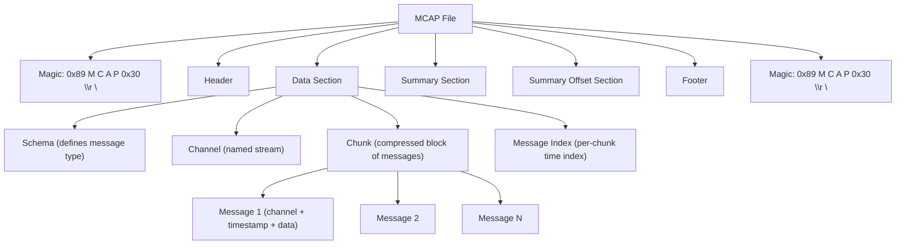
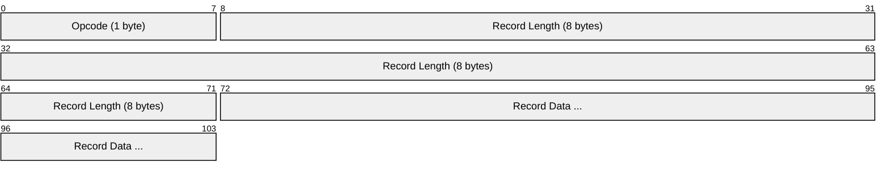
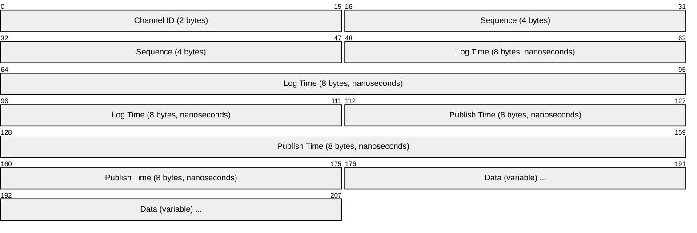

# MCAP (Multimodal Container for Autonomous Platforms)

> **Standard:** [MCAP Specification (mcap.dev)](https://mcap.dev/spec) | **Category:** Multimodal Log Data Container Format

MCAP (pronounced "em-cap") is an open-source container file format for storing timestamped, multimodal log data. It is designed for robotics, autonomous vehicles, and any system that produces multiple concurrent data streams — camera images, LiDAR point clouds, IMU readings, GPS, CAN bus, control commands, and diagnostics — all in a single file with fast random access by time. MCAP is the default recording format for Foxglove and is widely used with ROS 2, replacing the older ROS 1 bag format.

## File Structure



### Record Format

Every record in an MCAP file uses a uniform TLV (Type-Length-Value) structure:



| Field | Size | Description |
|-------|------|-------------|
| Opcode | 1 byte | Record type identifier |
| Record Length | 8 bytes (uint64 LE) | Length of the data that follows |
| Record Data | Variable | Record-specific content |

## Record Types (Opcodes)

| Opcode | Name | Description |
|--------|------|-------------|
| 0x01 | Header | File metadata (profile, library) |
| 0x02 | Footer | Pointers to summary section |
| 0x03 | Schema | Message type definition (name + encoding + data) |
| 0x04 | Channel | Named data stream (topic + schema + metadata) |
| 0x05 | Message | Single timestamped data record |
| 0x06 | Chunk | Compressed block of messages |
| 0x07 | MessageIndex | Time-based index for messages within a chunk |
| 0x08 | ChunkIndex | Summary of each chunk (offset, time range, size) |
| 0x09 | Attachment | Arbitrary file attachment (calibration, config, etc.) |
| 0x0A | AttachmentIndex | Index of attachments |
| 0x0B | Statistics | File-level statistics (message counts, time range) |
| 0x0C | Metadata | Arbitrary key-value metadata |
| 0x0D | MetadataIndex | Index of metadata records |
| 0x0E | SummaryOffset | Offset to groups of summary records |
| 0x0F | DataEnd | Marks end of data section (CRC-32 of data) |

## Key Records

### Header

| Field | Type | Description |
|-------|------|-------------|
| profile | string | Content profile (e.g., `ros2`, `foxglove`, empty for generic) |
| library | string | Writer library and version |

### Schema

| Field | Type | Description |
|-------|------|-------------|
| id | uint16 | Unique schema ID within the file |
| name | string | Schema name (e.g., `sensor_msgs/Image`, `foxglove.PointCloud`) |
| encoding | string | Schema encoding (`ros2msg`, `protobuf`, `jsonschema`, `flatbuffer`, `omgidl`) |
| data | bytes | The schema definition itself |

### Channel

| Field | Type | Description |
|-------|------|-------------|
| id | uint16 | Unique channel ID |
| schema_id | uint16 | References a Schema record |
| topic | string | Channel name (e.g., `/camera/image_raw`, `/imu/data`) |
| message_encoding | string | How messages are serialized (`cdr`, `protobuf`, `json`, `ros1msg`, `cbor`) |
| metadata | map | Key-value metadata (e.g., `{"offered_qos_profiles": "..."}`) |

### Message



| Field | Type | Description |
|-------|------|-------------|
| channel_id | uint16 | Which channel this message belongs to |
| sequence | uint32 | Publisher's sequence number |
| log_time | uint64 | When the message was recorded (nanoseconds since epoch) |
| publish_time | uint64 | When the message was published (nanoseconds since epoch) |
| data | bytes | Serialized message payload |

### Chunk (Compression)

Messages are grouped into chunks for compression:

| Field | Type | Description |
|-------|------|-------------|
| message_start_time | uint64 | Earliest message timestamp in this chunk |
| message_end_time | uint64 | Latest message timestamp in this chunk |
| uncompressed_size | uint64 | Size before compression |
| uncompressed_crc | uint32 | CRC-32 of uncompressed data |
| compression | string | `""` (none), `lz4`, `zstd` |
| records | bytes | Compressed block of Message records |

## Random Access

MCAP is designed for fast time-based seeking — critical for replaying robot logs:


The Summary Section at the end of the file contains:
- **ChunkIndex** records — which time ranges each chunk covers
- **Statistics** — total message count, channel counts, time bounds
- **Attachment/Metadata indexes**

This means a reader can seek to any timestamp in O(log N) time without scanning the entire file.

## MCAP vs ROS 1 Bag vs Other Formats

| Feature | MCAP | ROS 1 Bag | SQLite (ROS 2 default) | HDF5 |
|---------|------|-----------|------------------------|------|
| Random access | Yes (chunk index) | Limited (connections + index) | Yes (SQL queries) | Yes (chunked datasets) |
| Compression | Per-chunk (LZ4, Zstd) | Per-chunk (LZ4, BZ2) | None (or whole-file) | Per-chunk (gzip, LZF) |
| Multi-encoding | Yes (CDR, Protobuf, JSON, FlatBuffers) | ROS 1 only | ROS 2 CDR only | Any (opaque datasets) |
| Streaming write | Yes (append-only) | Yes | Yes | Limited |
| File integrity | CRC-32 per chunk + data end | None | SQLite WAL | Optional checksums |
| Schema storage | Embedded in file | Embedded (connection records) | Not in file (type hash) | Not standardized |
| Recovery from corruption | Chunk-level (skip bad chunks) | Difficult | SQLite recovery | Difficult |
| Typical use | ROS 2, Foxglove, autonomous vehicles | ROS 1 | ROS 2 (Humble default) | Scientific computing |
| File extension | `.mcap` | `.bag` | `.db3` | `.h5`, `.hdf5` |

## Ecosystem

| Tool | Description |
|------|-------------|
| Foxglove | Web-based visualization and playback of MCAP files |
| ros2 bag | `ros2 bag record/play` supports MCAP storage plugin |
| mcap CLI | Command-line tool for inspecting, converting, and merging MCAP files |
| mcap libraries | Python, C++, Go, Rust, TypeScript, Swift readers/writers |
| MCAP → Foxglove Studio | Drag-and-drop visualization of robot logs |

### ROS 2 Integration

```bash
# Record to MCAP format
ros2 bag record -s mcap /camera/image_raw /imu/data /tf

# Play back
ros2 bag play recording.mcap

# Inspect
mcap info recording.mcap
```

## Message Encoding Support

| Encoding | Schema Encoding | Description |
|----------|----------------|-------------|
| `cdr` | `ros2msg` or `omgidl` | ROS 2 native (CDR serialization) |
| `ros1msg` | `ros1msg` | ROS 1 message format |
| `protobuf` | `protobuf` | Protocol Buffers |
| `json` | `jsonschema` | JSON with JSON Schema |
| `flatbuffer` | `flatbuffer` | FlatBuffers |
| `cbor` | — | Concise Binary Object Representation |

The self-describing nature (schema + encoding embedded in the file) means MCAP files can be read without access to the original message definitions.

## Standards

| Resource | Description |
|----------|-------------|
| [MCAP Specification](https://mcap.dev/spec) | Format specification |
| [MCAP GitHub](https://github.com/foxglove/mcap) | Reference implementations (multi-language) |
| [Foxglove](https://foxglove.dev/) | Primary visualization tool for MCAP |

## See Also

- [DDS / ROS 2](../robotics/dds.md) — the pub/sub middleware MCAP records
- [ROS 1 (TCPROS)](../robotics/ros1.md) — MCAP replaces ROS 1's bag format
- [Parquet](parquet.md) — columnar data format (tabular, not timestamped multimodal)
- [HDF5](hdf5.md) — hierarchical scientific data format
