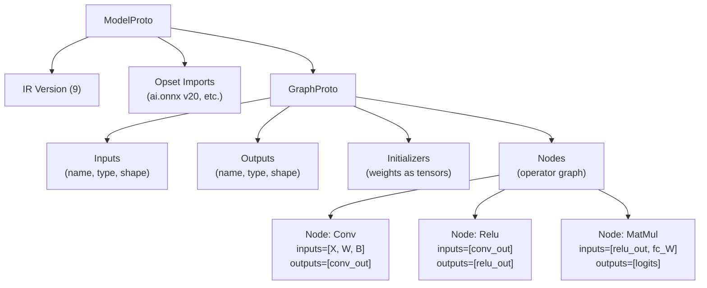
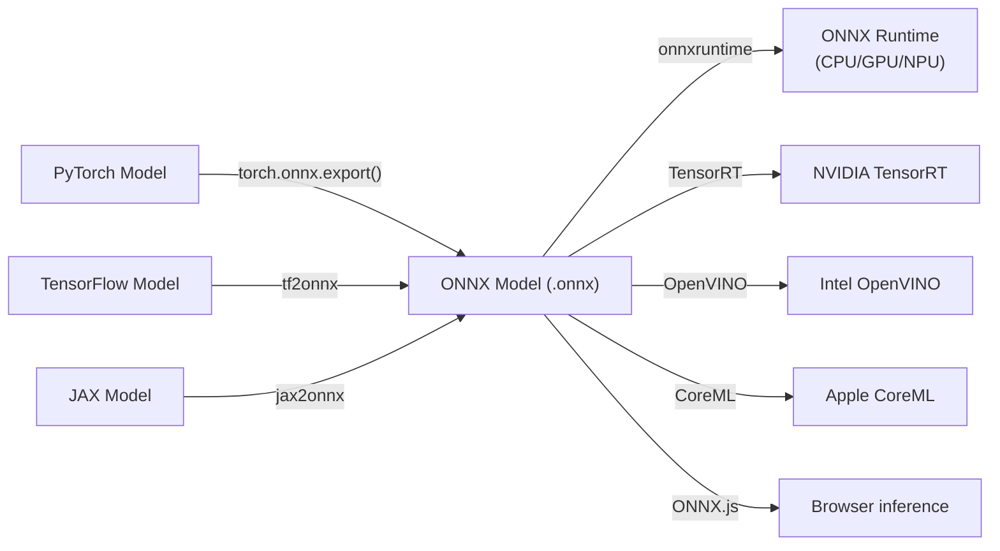

# ONNX (Open Neural Network Exchange)

> **Standard:** [ONNX Specification (onnx.ai)](https://onnx.ai/onnx/repo-docs/IR.html) | **Category:** ML Model Interchange Format

ONNX is an open format for representing machine learning models, enabling interoperability between training frameworks (PyTorch, TensorFlow, JAX) and inference engines (ONNX Runtime, TensorRT, OpenVINO, CoreML). An ONNX model is a directed acyclic graph of operators (Add, MatMul, Conv, Relu, etc.) with typed inputs, outputs, and weights. ONNX defines both the graph format (Protocol Buffers) and a standard set of operators (opset), ensuring models are portable.

## File Structure

ONNX models are serialized as Protocol Buffers (`.onnx` files):



## Key Components

| Component | Protobuf Type | Description |
|-----------|---------------|-------------|
| ModelProto | Top-level | Contains metadata, opset, and the graph |
| GraphProto | Model.graph | The computation graph (nodes, inputs, outputs, initializers) |
| NodeProto | Graph.node[] | Single operation (op_type, inputs, outputs, attributes) |
| TensorProto | Graph.initializer[] | Weight tensor (data_type, dims, raw_data) |
| ValueInfoProto | Graph.input/output | Typed tensor description (name, elem_type, shape) |
| AttributeProto | Node.attribute[] | Operator parameters (kernel_size, padding, etc.) |

## Data Types

| Type | Enum | Description |
|------|------|-------------|
| FLOAT | 1 | 32-bit floating point |
| UINT8 | 2 | 8-bit unsigned integer |
| INT8 | 3 | 8-bit signed integer |
| UINT16 | 4 | 16-bit unsigned |
| INT16 | 5 | 16-bit signed |
| INT32 | 6 | 32-bit signed |
| INT64 | 7 | 64-bit signed |
| STRING | 8 | String |
| BOOL | 9 | Boolean |
| FLOAT16 | 10 | 16-bit floating point |
| DOUBLE | 11 | 64-bit floating point |
| BFLOAT16 | 16 | Brain floating point (16-bit, 8-bit exponent) |
| FLOAT8E4M3FN | 17 | 8-bit float (FP8, for transformer training) |

## Common Operators (Opset 20)

| Category | Operators |
|----------|----------|
| Math | Add, Sub, Mul, Div, Pow, Sqrt, Exp, Log, MatMul, Gemm |
| Activation | Relu, Sigmoid, Tanh, Softmax, LeakyRelu, Gelu |
| Convolution | Conv, ConvTranspose, MaxPool, AveragePool, GlobalAveragePool |
| Normalization | BatchNormalization, LayerNormalization, InstanceNormalization |
| Attention | (composed from MatMul, Softmax, etc. — or custom ops) |
| Recurrent | LSTM, GRU, RNN |
| Tensor | Reshape, Transpose, Concat, Split, Squeeze, Unsqueeze, Gather, Scatter |
| Reduction | ReduceSum, ReduceMean, ReduceMax, ReduceMin |
| Comparison | Equal, Greater, Less, Where |
| Quantization | QuantizeLinear, DequantizeLinear |

## Model Example (Simple MLP)

```
Input: X [batch, 784]
Node: MatMul(X, W1) → hidden        # W1 [784, 256]
Node: Add(hidden, B1) → hidden_b     # B1 [256]
Node: Relu(hidden_b) → activated
Node: MatMul(activated, W2) → logits # W2 [256, 10]
Node: Softmax(logits) → probs
Output: probs [batch, 10]
```

## ONNX Workflow



## ONNX Runtime

| Feature | Description |
|---------|-------------|
| Execution Providers | CPU, CUDA, TensorRT, DirectML, OpenVINO, CoreML, NNAPI |
| Optimization | Graph optimization, operator fusion, constant folding |
| Quantization | INT8/UINT8 quantization for faster inference |
| Multi-threading | Intra-op and inter-op parallelism |
| Languages | C, C++, Python, Java, C#, JavaScript, Rust |

## ONNX vs Other Model Formats

| Feature | ONNX | PyTorch (.pt) | TF SavedModel | GGUF | Safetensors |
|---------|------|--------------|---------------|------|-------------|
| Cross-framework | Yes | PyTorch only | TF only | llama.cpp | Any (weights only) |
| Computation graph | Yes | Optional | Yes | No (weights + metadata) | No (weights only) |
| Inference engines | Many | TorchScript/libtorch | TF Serving | llama.cpp, ollama | Any (HF, vLLM) |
| Quantization | Built-in ops | Separate tool | TF Lite | Built-in types | No (separate) |
| Optimization | Graph-level (ORT) | torch.compile | XLA | At load time | N/A |
| Opset versioning | Yes (backward compat) | No formal versioning | SavedModel versions | Format version | Format version |

## Standards

| Document | Title |
|----------|-------|
| [ONNX IR Spec](https://onnx.ai/onnx/repo-docs/IR.html) | ONNX Intermediate Representation |
| [ONNX Operators](https://onnx.ai/onnx/operators/) | Operator definitions and schemas |
| [ONNX GitHub](https://github.com/onnx/onnx) | Specification and reference implementation |
| [ONNX Runtime](https://onnxruntime.ai/) | Microsoft's high-performance inference engine |

## See Also

- [GGUF](gguf.md) — LLM-specific format for local inference
- [Safetensors](safetensors.md) — secure weight storage format
- [Parquet](parquet.md) — training data storage
- [gRPC](../web/grpc.md) — ML serving transport (Triton, TF Serving)
