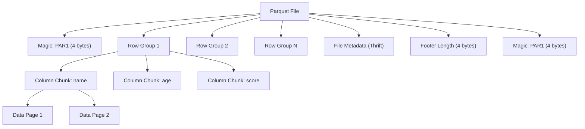

# Apache Parquet

> **Standard:** [Apache Parquet Format (parquet.apache.org)](https://parquet.apache.org/documentation/latest/) | **Category:** Columnar Data Storage Format

Parquet is a columnar storage format designed for efficient analytics on large datasets. Unlike row-oriented formats (CSV, JSON), Parquet stores data column by column, enabling efficient compression (similar values together), column pruning (read only needed columns), and predicate pushdown (skip irrelevant row groups). It is the de facto standard for data lakes (S3, GCS, ADLS), ML training datasets, and analytics engines (Spark, DuckDB, Polars, BigQuery).

## File Structure



| Component | Description |
|-----------|-------------|
| Magic bytes | `PAR1` at start and end of file |
| Row Group | Horizontal partition (~128 MB default); unit of parallel reading |
| Column Chunk | All data for one column within a row group |
| Data Page | Compressed unit within a column chunk (~1 MB) |
| Dictionary Page | Optional — stores unique values for dictionary encoding |
| Footer | Schema, row group metadata, column statistics (min/max/null count) |

## Key Properties

| Property | Value |
|----------|-------|
| Format | Columnar (column-major storage) |
| Encoding | Multiple per column (dictionary, RLE, delta, etc.) |
| Compression | Snappy (default), ZSTD, Gzip, LZ4, Brotli, or none |
| Schema | Self-describing (schema in footer) |
| Types | Boolean, int32, int64, float, double, byte_array, fixed_len_byte_array |
| Logical types | String, decimal, date, timestamp, UUID, JSON, BSON, list, map, struct |
| Nested data | Full support (Dremel encoding — definition/repetition levels) |
| Max file size | No hard limit (row groups are independently readable) |

## Encodings

| Encoding | Best For | How It Works |
|----------|----------|-------------|
| PLAIN | Any | Raw values, no compression |
| DICTIONARY (PLAIN_DICTIONARY) | Low-cardinality columns | Map values to integer IDs |
| RLE (Run-Length Encoding) | Repeated values, booleans | Count consecutive identical values |
| DELTA_BINARY_PACKED | Sorted integers, timestamps | Store differences between consecutive values |
| DELTA_LENGTH_BYTE_ARRAY | Variable-length strings | Delta-encode string lengths |
| DELTA_BYTE_ARRAY | Strings with common prefixes | Delta-encode shared prefixes |
| BYTE_STREAM_SPLIT | Floating point | Split bytes across values (better compression) |

## Why Columnar Matters for ML

```
Query: SELECT age, score FROM users WHERE age > 25

Row-oriented (CSV): Must read ALL columns for every row
  [name, age, score, email, address, ...]  ← reads everything

Columnar (Parquet): Reads only age + score columns, skips row groups where max(age) ≤ 25
  [age column]   ← reads this
  [score column] ← reads this
  [name, email, address, ...] ← SKIPPED
```

## Footer Metadata

The footer contains schema and statistics enabling query engines to skip data:

| Metadata | Description |
|----------|-------------|
| Schema | Column names, types, nesting |
| Row group metadata | Number of rows, total byte size |
| Column chunk metadata | File offset, compressed/uncompressed size, encoding, statistics |
| Column statistics | Min value, max value, null count, distinct count |
| Key-value metadata | User-defined (pandas metadata, Arrow schema, etc.) |

### Predicate Pushdown Example

```
File footer says Row Group 3 has: age min=18, max=22
Query filter: age > 25
→ Skip Row Group 3 entirely (never decompressed or read)
```

## Parquet vs Other Formats

| Feature | Parquet | CSV | JSON | ORC | Avro |
|---------|--------|-----|------|-----|------|
| Layout | Columnar | Row | Row | Columnar | Row |
| Schema | Self-describing | None | Implicit | Self-describing | Self-describing |
| Compression | Excellent (columnar) | Poor | Poor | Excellent | Good |
| Column pruning | Yes | No | No | Yes | No |
| Nested data | Yes (Dremel) | No | Yes | Yes (limited) | Yes |
| Streaming write | No (needs footer) | Yes | Yes | No | Yes |
| Ecosystem | Universal | Universal | Universal | Hive/Hadoop | Kafka/Hadoop |
| ML training | Excellent | Slow | Slow | Good | Good |

## Common Tools

| Tool | Usage |
|------|-------|
| Apache Arrow | In-memory columnar + Parquet reader/writer |
| pandas | `pd.read_parquet()` / `df.to_parquet()` |
| Polars | Native Parquet support (faster than pandas) |
| DuckDB | SQL queries directly on Parquet files |
| Apache Spark | Distributed Parquet processing |
| PyArrow | Python Parquet library (Arrow-based) |
| Hugging Face Datasets | ML datasets stored as Parquet |

## Standards

| Document | Title |
|----------|-------|
| [Apache Parquet Format](https://parquet.apache.org/documentation/latest/) | Format specification |
| [Parquet Thrift Definition](https://github.com/apache/parquet-format) | Thrift schema for metadata |
| [Apache Arrow](https://arrow.apache.org/) | In-memory format + Parquet integration |

## See Also

- [ONNX](onnx.md) — model interchange format
- [HDF5](hdf5.md) — hierarchical data format for scientific computing
- [TFRecord](tfrecord.md) — TensorFlow's training data format
