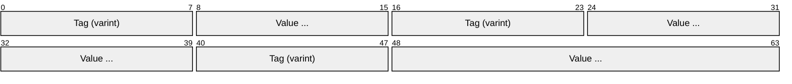
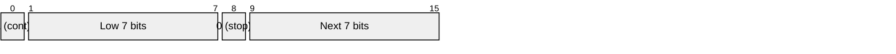
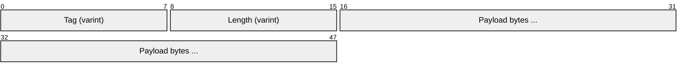
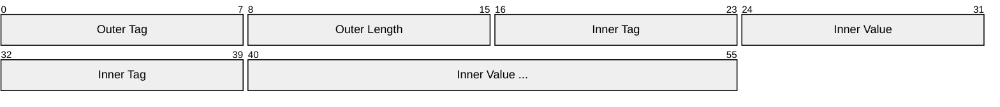
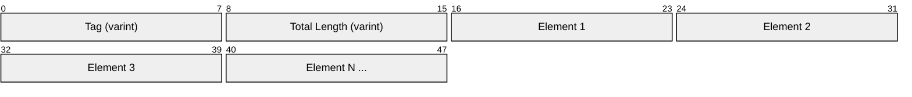
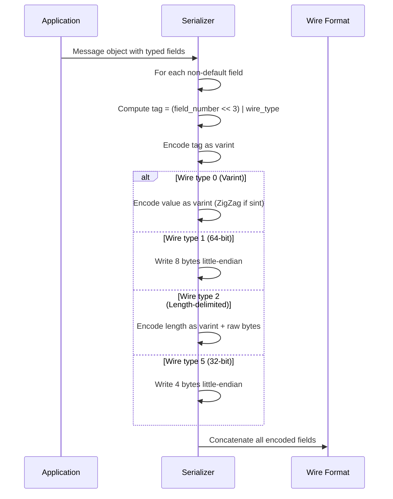
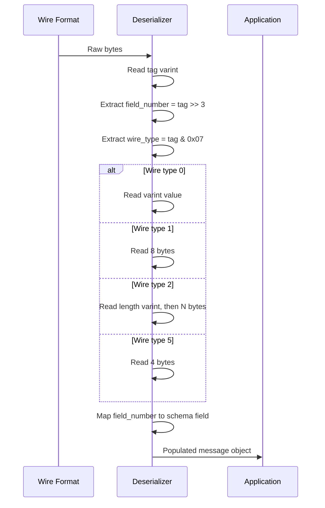

# Protocol Buffers (Protobuf)

> **Standard:** [Protocol Buffers Language Guide](https://protobuf.dev/) | **Layer:** Data Format (Serialization) | **Wireshark filter:** `protobuf`

Protocol Buffers is Google's language-neutral, platform-neutral binary serialization format. This document covers the **wire format** -- the binary encoding that goes on the network or into files -- not the `.proto` IDL used to define messages. A protobuf message is simply a concatenation of key-value pairs where each pair is a field tag (field number + wire type) followed by the encoded value. The format is self-delimiting, compact (typically 3-10x smaller than JSON), and designed for both forward and backward compatibility.

## Message Structure

A serialized protobuf message is a sequence of tagged fields with no framing header or length prefix:



Each field is encoded as:

```
[field_tag] [field_value]
```

The **field tag** is a single varint that encodes both the field number and the wire type:

```
tag = (field_number << 3) | wire_type
```

### Tag Encoding Example

For field number 2, wire type 0 (varint): `tag = (2 << 3) | 0 = 16 = 0x10`

For field number 1, wire type 2 (length-delimited): `tag = (1 << 3) | 2 = 10 = 0x0A`

## Wire Types

| Wire Type | Name | Size | Used For |
|-----------|------|------|----------|
| 0 | Varint | Variable (1-10 bytes) | int32, int64, uint32, uint64, sint32, sint64, bool, enum |
| 1 | 64-bit fixed | 8 bytes | fixed64, sfixed64, double |
| 2 | Length-delimited | varint length + N bytes | string, bytes, embedded messages, packed repeated fields |
| 3 | Start group | N/A | Group start marker (deprecated) |
| 4 | End group | N/A | Group end marker (deprecated) |
| 5 | 32-bit fixed | 4 bytes | fixed32, sfixed32, float |

## Varint Encoding

Varints use Base-128 encoding with little-endian byte order. The most significant bit (MSB) of each byte is a continuation bit -- 1 means more bytes follow, 0 means this is the last byte.



### Varint Example: Encoding 300

```
300 = 0b100101100

Split into 7-bit groups (little-endian):
  Group 0: 0101100 (low 7 bits)
  Group 1: 0000010 (next 7 bits)

Add continuation bits:
  Byte 0: 1_0101100 = 0xAC (MSB=1, more bytes follow)
  Byte 1: 0_0000010 = 0x02 (MSB=0, last byte)

Wire bytes: 0xAC 0x02
```

### Common Varint Values

| Value | Encoded Bytes | Size |
|-------|---------------|------|
| 0 | `0x00` | 1 byte |
| 1 | `0x01` | 1 byte |
| 127 | `0x7F` | 1 byte |
| 128 | `0x80 0x01` | 2 bytes |
| 300 | `0xAC 0x02` | 2 bytes |
| 16383 | `0xFF 0x7F` | 2 bytes |
| 16384 | `0x80 0x80 0x01` | 3 bytes |

Field numbers 1-15 encode in a single-byte tag (1 byte for tag + wire type), so assign frequently-used fields to numbers 1-15 for optimal size.

## ZigZag Encoding

Standard varint encoding is inefficient for negative numbers because the sign bit sits in the most significant position, producing 10-byte encodings for small negative values. The `sint32` and `sint64` types use **ZigZag encoding** to map signed integers to unsigned integers so that small-magnitude values (positive or negative) use fewer bytes.

| Signed Value | ZigZag Encoded |
|-------------|----------------|
| 0 | 0 |
| -1 | 1 |
| 1 | 2 |
| -2 | 3 |
| 2 | 4 |
| 2147483647 | 4294967294 |
| -2147483648 | 4294967295 |

Formula: `zigzag(n) = (n << 1) ^ (n >> 31)` for sint32, `(n << 1) ^ (n >> 63)` for sint64.

## Length-Delimited Fields

Strings, bytes, embedded messages, and packed repeated fields all use wire type 2. The value is a varint-encoded length followed by that many bytes of content.



### String Example

Field 2, value `"testing"`:

```
Tag:    0x12  (field 2, wire type 2)
Length: 0x07  (7 bytes)
Data:   0x74 0x65 0x73 0x74 0x69 0x6E 0x67  ("testing" in UTF-8)
```

## Embedded Messages

An embedded message is encoded as a length-delimited field whose payload is itself a complete serialized protobuf message.



For example, given:

```
message Inner { int32 a = 1; }
message Outer { Inner inner = 3; }
```

Encoding `Outer { inner: Inner { a: 150 } }`:

```
0x1A       (field 3, wire type 2 = length-delimited)
0x03       (3 bytes follow)
  0x08     (field 1, wire type 0 = varint)
  0x96     (varint: 150, byte 1)
  0x01     (varint: 150, byte 2)
```

## Packed Repeated Fields

In proto3, repeated fields of scalar numeric types are **packed** by default. Instead of repeating the tag for each element, all values are concatenated into a single length-delimited field.



### Packed Example

Field 4 (repeated int32), values `[3, 270, 86942]`:

```
0x22       (field 4, wire type 2)
0x06       (6 bytes of packed data)
  0x03             (varint: 3)
  0x8E 0x02        (varint: 270)
  0x9E 0xA7 0x05   (varint: 86942)
```

Without packing, this would require a separate tag before each value (3 extra bytes).

## Encoding Flow





## Field Ordering and Default Values

| Behavior | Description |
|----------|-------------|
| Field order | Fields can appear in any order on the wire; decoders must not assume ordering |
| Unknown fields | Preserved by default in proto3 (since 3.5); decoders keep unrecognized tags |
| Default values (proto3) | Zero-value fields (0, false, "", empty bytes) are **not serialized** |
| Default values (proto2) | Explicit defaults supported; unset fields distinguishable from default |
| Repeated fields | May appear multiple times; decoder concatenates values |
| Oneof fields | Only the last-written field in a oneof group is serialized |
| Map fields | Serialized as repeated messages with key (field 1) and value (field 2) |
| Field merging | Duplicate fields: last varint wins, embedded messages are merged, repeated fields concatenated |

## Proto2 vs Proto3

| Feature | Proto2 | Proto3 |
|---------|--------|--------|
| Required fields | Supported (`required`) | Removed (all fields optional) |
| Optional fields | Explicit (`optional`) | All fields optional by default |
| Default values | Custom defaults allowed | Always zero/empty |
| Field presence | Tracked for optional fields | Not tracked unless `optional` keyword used |
| Unknown fields | Preserved | Preserved (since 3.5; discarded in earlier versions) |
| Enums | Open (unknown values kept) | Open (unknown values kept in proto3, closed in proto2) |
| Maps | Supported | Supported |
| Packed repeated | Opt-in (`[packed=true]`) | Default for scalar numerics |
| Extensions | Supported | Removed (use `Any` type instead) |
| Groups | Supported (wire types 3/4) | Removed |

## Text Format and JSON Mapping

While the wire format is binary, protobuf also defines canonical text and JSON representations:

| Format | Description | Use Case |
|--------|-------------|----------|
| Binary (wire format) | Compact, this document's focus | Network transport, storage |
| Text format | Human-readable, field names + values | Debugging, config files (`.textproto`) |
| JSON mapping | Standard JSON with field name conversion | REST gateways, browser clients |
| JSON field names | `camelCase` by default (from `snake_case` proto fields) | Interoperability with JSON APIs |

JSON mapping: int64/uint64 encode as strings (JavaScript safety), bytes encode as Base64, enums encode as strings, `google.protobuf.Any` wraps typed JSON.

## Size Comparison

| Format | Payload Example (typical API response) | Relative Size |
|--------|---------------------------------------|---------------|
| XML | Verbose tags, attributes, closing tags | 10-20x |
| JSON | Field names repeated, text encoding | 5-10x |
| JSON (minified) | Compact but still text-based | 3-7x |
| **Protobuf** | **Binary, field numbers, varints** | **1x (baseline)** |
| MessagePack | Binary JSON, field names as strings | 2-3x |
| CBOR | Binary, similar to MessagePack | 2-3x |

## Protobuf vs Other Serialization Formats

| Feature | Protobuf | JSON | MessagePack | CBOR | FlatBuffers | Cap'n Proto |
|---------|----------|------|-------------|------|-------------|-------------|
| Encoding | Binary (tags + values) | Text | Binary (schemaless) | Binary (schemaless) | Binary (zero-copy) | Binary (zero-copy) |
| Schema | Required (.proto) | None (optional JSON Schema) | None | None (optional CDDL) | Required (.fbs) | Required (.capnp) |
| Parsing | Deserialize to objects | Parse text | Deserialize to objects | Deserialize to objects | Zero-copy (no parsing) | Zero-copy (no parsing) |
| Code generation | Yes (protoc) | No | No | No | Yes (flatc) | Yes (capnpc) |
| Size | Compact | Large | Moderate | Moderate | Compact (+ alignment) | Moderate (+ alignment) |
| Human readable | No | Yes | No | No | No | No |
| Streaming | Delimited messages | NDJSON | Yes | Yes | No (needs full buffer) | Yes |
| Schema evolution | Excellent (field numbers) | N/A | N/A | N/A | Good (field IDs) | Good (field IDs) |
| Language support | 12+ (official) | Universal | Many | Many | 10+ | 7+ |
| Random access | No (sequential) | No | No | No | Yes | Yes |

## Key Users

| System | How Protobuf Is Used |
|--------|---------------------|
| gRPC | Default serialization for all RPC calls |
| Google internal (Stubby) | Predecessor to gRPC, all Google services |
| Kubernetes API | etcd stores resources as protobuf |
| OTLP (OpenTelemetry) | Traces, metrics, and logs encoded as protobuf |
| TensorFlow | TFRecord, SavedModel, graph definitions |
| Envoy Proxy | xDS configuration protocol |
| Android (AIDL) | Inter-process communication |
| Buf | Modern protobuf tooling (linting, breaking change detection) |

## Standards

| Document | Title |
|----------|-------|
| [Protocol Buffers Language Guide](https://protobuf.dev/programming-guides/proto3/) | Proto3 language specification |
| [Protocol Buffers Encoding](https://protobuf.dev/programming-guides/encoding/) | Wire format encoding specification |
| [Protocol Buffers GitHub](https://github.com/protocolbuffers/protobuf) | Reference implementation (C++, Java, Python, and more) |
| [Buf](https://buf.build/) | Modern protobuf toolchain (lint, format, breaking changes) |
| [gRPC Protocol](https://github.com/grpc/grpc/blob/master/doc/PROTOCOL-HTTP2.md) | gRPC over HTTP/2 (primary transport for protobuf) |

## See Also

- [gRPC](../web/grpc.md) -- RPC framework built on protobuf serialization
- [OTLP](../monitoring/otlp.md) -- OpenTelemetry protocol uses protobuf encoding
- [ONNX](onnx.md) -- ML model format serialized as protobuf
- [TFRecord](tfrecord.md) -- TensorFlow training data stored as protobuf records
- [MQTT](../messaging/mqtt.md) -- IoT messaging (often carries protobuf payloads)
