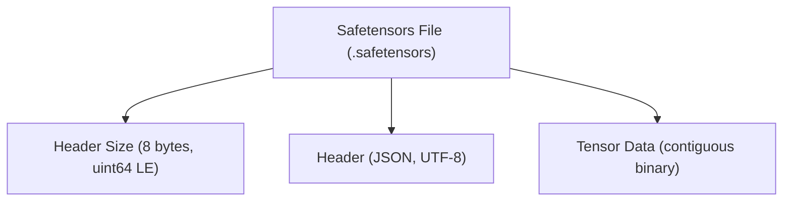
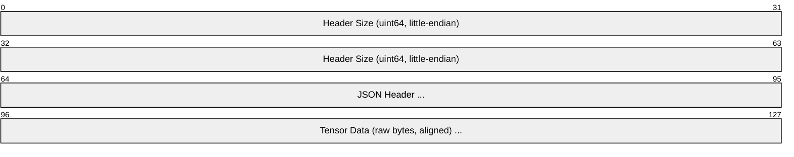

# Safetensors

> **Standard:** [Safetensors (huggingface.co)](https://huggingface.co/docs/safetensors/) | **Category:** ML Model Weight Storage Format

Safetensors is a secure, fast tensor serialization format developed by Hugging Face as a safe replacement for Python's pickle-based model files (.pt, .pkl). Unlike pickle (which can execute arbitrary code on load), safetensors stores only tensor data and metadata — no executable code, making it immune to deserialization attacks. It is the default format for Hugging Face model weights and is supported by PyTorch, TensorFlow, JAX, and most ML frameworks.

## File Structure



### Layout



| Component | Description |
|-----------|-------------|
| Header Size | 8 bytes, uint64 little-endian — size of the JSON header |
| Header | JSON object mapping tensor names to metadata (dtype, shape, offsets) |
| Tensor Data | Contiguous block of raw tensor bytes (no per-tensor headers) |

## Header Format (JSON)

```json
{
  "__metadata__": {
    "format": "pt"
  },
  "model.embed_tokens.weight": {
    "dtype": "F16",
    "shape": [32000, 4096],
    "data_offsets": [0, 262144000]
  },
  "model.layers.0.self_attn.q_proj.weight": {
    "dtype": "F16",
    "shape": [4096, 4096],
    "data_offsets": [262144000, 295698432]
  }
}
```

### Tensor Entry Fields

| Field | Type | Description |
|-------|------|-------------|
| `dtype` | string | Data type of the tensor |
| `shape` | int[] | Tensor dimensions |
| `data_offsets` | [int, int] | [start_byte, end_byte] in the data section |

### Supported Data Types

| dtype | Description | Bytes |
|-------|-------------|-------|
| F64 | 64-bit float | 8 |
| F32 | 32-bit float | 4 |
| F16 | 16-bit float (IEEE 754) | 2 |
| BF16 | Brain float 16 | 2 |
| F8_E4M3 | 8-bit float (4-bit exponent, 3-bit mantissa) | 1 |
| F8_E5M2 | 8-bit float (5-bit exponent, 2-bit mantissa) | 1 |
| I64 | 64-bit signed integer | 8 |
| I32 | 32-bit signed integer | 4 |
| I16 | 16-bit signed integer | 2 |
| I8 | 8-bit signed integer | 1 |
| U8 | 8-bit unsigned integer | 1 |
| BOOL | Boolean | 1 |

### Metadata

The optional `__metadata__` key stores arbitrary key-value string pairs:

| Key | Description |
|-----|-------------|
| `format` | Source framework (`pt`, `tf`, `flax`, `np`) |
| Any custom key | User-defined string metadata |

## Design Principles

| Principle | Implementation |
|-----------|---------------|
| **Security** | No executable code — only JSON header + raw bytes |
| **Speed** | Memory-mappable — `mmap()` the file, zero-copy tensor access |
| **Simplicity** | Single JSON header + contiguous data block |
| **Validation** | Header is validated before any data is read |
| **Lazy loading** | Individual tensors can be loaded by offset without reading the full file |

### Security Comparison

| Format | Arbitrary Code Execution | Attack Vector |
|--------|------------------------|---------------|
| pickle (.pt, .pkl) | **YES** — executes Python code on load | Malicious model files |
| safetensors | **NO** — only data + JSON metadata | None |
| ONNX (.onnx) | No — Protocol Buffers | None |
| GGUF (.gguf) | No — binary data + metadata | None |
| NumPy (.npy) | Low risk — but allow_pickle=True is dangerous | pickle in .npz |

## Loading Performance

| Operation | pickle (.pt) | safetensors |
|-----------|-------------|-------------|
| Load mechanism | Deserialize Python objects | `mmap()` + offset lookup |
| Zero-copy | No (full deserialization) | Yes (tensors point into mmap) |
| Lazy loading | No (must load everything) | Yes (load individual tensors by name) |
| Loading 7B F16 model | ~5-10 seconds | ~0.5-1 second |
| Memory overhead | 2× (load + copy) | 1× (mmap shares with page cache) |

## Sharded Files

Large models are split across multiple safetensors files:

```
model-00001-of-00004.safetensors
model-00002-of-00004.safetensors
model-00003-of-00004.safetensors
model-00004-of-00004.safetensors
model.safetensors.index.json         ← maps tensor names to files
```

### Index File

```json
{
  "metadata": { "total_size": 14483456000 },
  "weight_map": {
    "model.embed_tokens.weight": "model-00001-of-00004.safetensors",
    "model.layers.0.self_attn.q_proj.weight": "model-00001-of-00004.safetensors",
    "model.layers.31.mlp.down_proj.weight": "model-00004-of-00004.safetensors",
    "lm_head.weight": "model-00004-of-00004.safetensors"
  }
}
```

## Language Support

| Language | Library | Usage |
|----------|---------|-------|
| Python | `safetensors` | `save_file()` / `load_file()` |
| Rust | `safetensors` (native) | Core implementation (Python bindings via PyO3) |
| JavaScript | `@huggingface/safetensors` | Browser/Node.js |
| C++ | Via Rust FFI | Inference engines |
| PyTorch | `safetensors.torch` | `save_file()` / `load_file()` with torch tensors |
| TensorFlow | `safetensors.tensorflow` | TF tensor support |
| JAX/Flax | `safetensors.flax` | Flax model support |

## Standards

| Resource | Description |
|----------|-------------|
| [Safetensors Docs](https://huggingface.co/docs/safetensors/) | Official documentation |
| [Safetensors GitHub](https://github.com/huggingface/safetensors) | Source code and specification |
| [Format Spec](https://github.com/huggingface/safetensors/blob/main/docs/format.md) | Binary format specification |

## See Also

- [GGUF](gguf.md) — LLM format with quantization and tokenizer
- [ONNX](onnx.md) — model interchange with computation graph
- [Parquet](parquet.md) — training data storage
- [HDF5](hdf5.md) — hierarchical scientific data format
