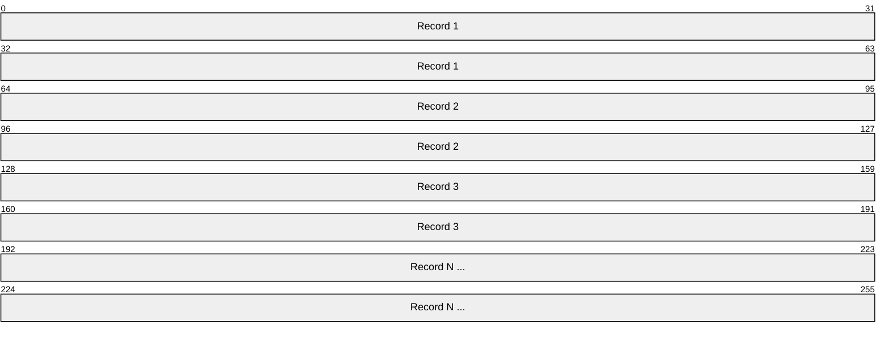
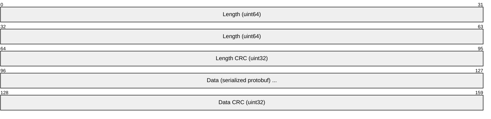

# TFRecord

> **Standard:** [TensorFlow TFRecord (tensorflow.org)](https://www.tensorflow.org/tutorials/load_data/tfrecord) | **Category:** ML Training Data Storage Format

TFRecord is TensorFlow's native binary format for storing training data as a sequence of serialized Protocol Buffer records. It is designed for high-throughput sequential reading during model training — data is stored as a stream of length-prefixed, CRC-checked binary records that can be read efficiently from disk, cloud storage (GCS), or over the network. TFRecord files are the standard input format for TensorFlow's `tf.data` pipeline and Google Cloud AI Platform.

## File Structure

A TFRecord file is a sequence of records with no global header or index:



### Record Format

Each record contains:



| Field | Size | Description |
|-------|------|-------------|
| Length | 8 bytes | Length of the data field |
| Length CRC | 4 bytes | CRC-32C of the length field (masked) |
| Data | Variable | Serialized `tf.train.Example` or `tf.train.SequenceExample` |
| Data CRC | 4 bytes | CRC-32C of the data field (masked) |

CRC masking: `masked_crc = ((crc >> 15) | (crc << 17)) + 0xa282ead8`

## tf.train.Example (Protobuf)

Each record typically contains a `tf.train.Example` — a map of feature names to values:

```protobuf
message Example {
  Features features = 1;
}

message Features {
  map<string, Feature> feature = 1;
}

message Feature {
  oneof kind {
    BytesList bytes_list = 1;
    FloatList float_list = 2;
    Int64List int64_list = 3;
  }
}
```

### Feature Types

| Type | Protobuf | Python Type | Use Case |
|------|----------|-------------|----------|
| BytesList | bytes_list | `bytes`, `string` | Images (JPEG/PNG bytes), text, raw data |
| FloatList | float_list | `float` | Features, embeddings, coordinates |
| Int64List | int64_list | `int` | Labels, indices, categorical features |

### Example: Image Classification

```python
tf.train.Example(features=tf.train.Features(feature={
    'image': tf.train.Feature(bytes_list=tf.train.BytesList(value=[jpeg_bytes])),
    'label': tf.train.Feature(int64_list=tf.train.Int64List(value=[3])),
    'height': tf.train.Feature(int64_list=tf.train.Int64List(value=[224])),
    'width': tf.train.Feature(int64_list=tf.train.Int64List(value=[224])),
    'filename': tf.train.Feature(bytes_list=tf.train.BytesList(value=[b'cat_001.jpg'])),
}))
```

## tf.train.SequenceExample

For sequential/temporal data (time series, video, NLP):

```protobuf
message SequenceExample {
  Features context = 1;              // Fixed-length context features
  FeatureLists feature_lists = 2;    // Variable-length sequences
}

message FeatureLists {
  map<string, FeatureList> feature_list = 1;
}

message FeatureList {
  repeated Feature feature = 1;      // One Feature per timestep
}
```

### Example: Video Classification

```python
tf.train.SequenceExample(
    context=tf.train.Features(feature={
        'video_id': bytes_feature(b'video_001'),
        'label': int64_feature(5),
    }),
    feature_lists=tf.train.FeatureLists(feature_list={
        'frames': tf.train.FeatureList(feature=[
            bytes_feature(frame1_jpeg),
            bytes_feature(frame2_jpeg),
            bytes_feature(frame3_jpeg),
        ]),
        'timestamps': tf.train.FeatureList(feature=[
            float_feature(0.0),
            float_feature(0.033),
            float_feature(0.066),
        ]),
    })
)
```

## Sharding

Large datasets are split into multiple TFRecord files (shards) for parallel reading:

```
train-00000-of-01024.tfrecord
train-00001-of-01024.tfrecord
...
train-01023-of-01024.tfrecord
```

Benefits:
- Parallel reading across workers
- Shuffle at the file level + within-file shuffle
- Distribute across storage systems
- Typical shard size: 100-200 MB

## Compression

| Method | Extension | Trade-off |
|--------|-----------|-----------|
| None | `.tfrecord` | Fastest I/O, largest files |
| GZIP | `.tfrecord.gz` | ~3-5× smaller, slower read |
| ZLIB | `.tfrecord.zlib` | Similar to GZIP |

For image datasets, data is usually pre-compressed (JPEG/PNG bytes inside the record), so file-level compression adds little benefit.

## tf.data Pipeline

```python
dataset = tf.data.TFRecordDataset(
    filenames=['train-00000.tfrecord', 'train-00001.tfrecord'],
    compression_type='GZIP',
    num_parallel_reads=8
)

def parse_fn(serialized):
    features = tf.io.parse_single_example(serialized, {
        'image': tf.io.FixedLenFeature([], tf.string),
        'label': tf.io.FixedLenFeature([], tf.int64),
    })
    image = tf.io.decode_jpeg(features['image'], channels=3)
    return image, features['label']

dataset = dataset.map(parse_fn, num_parallel_calls=tf.data.AUTOTUNE)
dataset = dataset.shuffle(10000).batch(32).prefetch(tf.data.AUTOTUNE)
```

## TFRecord vs Other Training Data Formats

| Feature | TFRecord | Parquet | HDF5 | WebDataset (TAR) | CSV |
|---------|----------|--------|------|-------------------|-----|
| Optimized for | Sequential training reads | Analytics + ML | Random access | PyTorch streaming | Simplicity |
| Random access | No (sequential only) | Yes (row groups) | Yes (chunked) | No (sequential) | No |
| Compression | Per-file (gzip) | Per-column | Per-chunk | Per-file | None |
| Schema | Protobuf (flexible) | Self-describing | Self-describing | File-based | None |
| Nested data | SequenceExample | Dremel encoding | Groups/datasets | Files in TAR | No |
| Framework | TensorFlow | Any | Any (Keras legacy) | PyTorch | Any |
| Sharding | Standard pattern | Row groups | Single file | Multiple TARs | Multiple files |
| Ecosystem | TF, Google Cloud | Universal | Scientific computing | PyTorch | Universal |

## Standards

| Resource | Description |
|----------|-------------|
| [TFRecord Tutorial](https://www.tensorflow.org/tutorials/load_data/tfrecord) | Official TensorFlow guide |
| [tf.train.Example](https://www.tensorflow.org/api_docs/python/tf/train/Example) | Protobuf message definition |
| [tf.data](https://www.tensorflow.org/guide/data) | Data pipeline API |

## See Also

- [Parquet](parquet.md) — columnar format (better for tabular ML data)
- [HDF5](hdf5.md) — hierarchical format with random access
- [ONNX](onnx.md) — model format (TFRecord is for training data)
- [gRPC](../web/grpc.md) — TF Serving uses gRPC for inference
