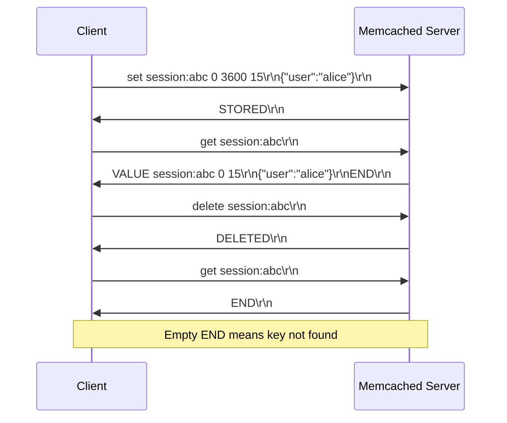
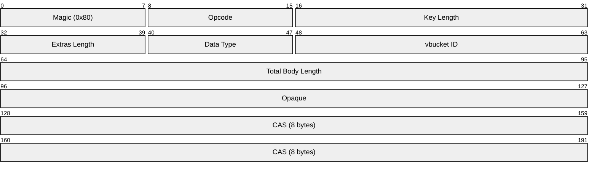
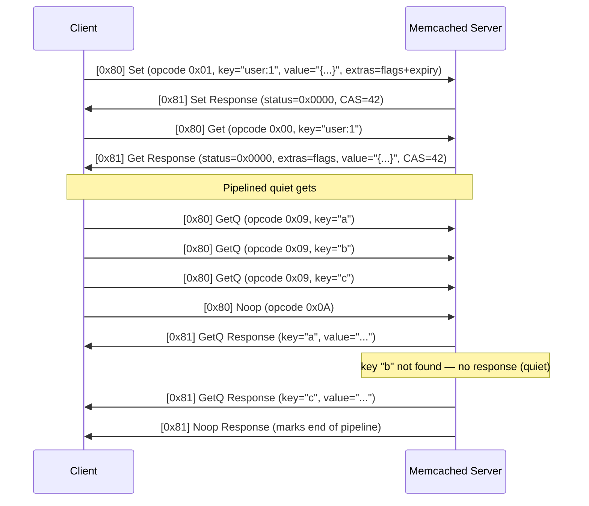
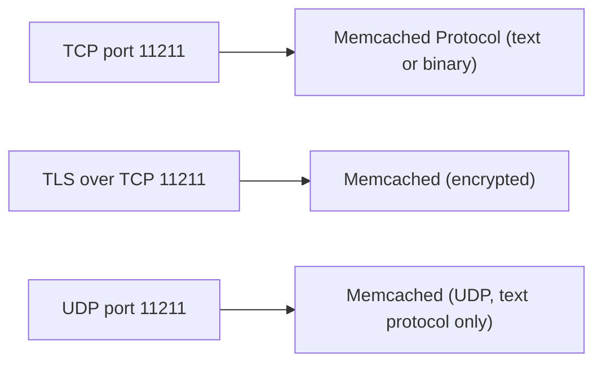

# Memcached Protocol

> **Standard:** [Memcached Protocol Documentation](https://github.com/memcached/memcached/wiki/Protocols) | **Layer:** Application (Layer 7) | **Wireshark filter:** `memcache`

Memcached is a high-performance, distributed in-memory key-value cache used to reduce database load and speed up dynamic web applications. Originally written by Brad Fitzpatrick for LiveJournal in 2003, it is deployed at massive scale across the internet. Memcached supports three wire protocols: the original text protocol (human-readable, line-based), a binary protocol (fixed-header, more efficient), and the newer meta commands protocol (text-based but with richer semantics). All protocols run over TCP on port 11211 by default. Keys are limited to 250 bytes and values to 1 MB.

## Text Protocol

The text protocol is line-oriented. Commands and responses are terminated by `\r\n`. Data blocks follow the command line and are terminated by `\r\n`.

### Storage Commands

| Command | Format | Description |
|---------|--------|-------------|
| `set` | `set <key> <flags> <exptime> <bytes> [noreply]\r\n<data>\r\n` | Store unconditionally |
| `add` | `add <key> <flags> <exptime> <bytes> [noreply]\r\n<data>\r\n` | Store only if key does not exist |
| `replace` | `replace <key> <flags> <exptime> <bytes> [noreply]\r\n<data>\r\n` | Store only if key already exists |
| `append` | `append <key> <flags> <exptime> <bytes> [noreply]\r\n<data>\r\n` | Append data to existing value |
| `prepend` | `prepend <key> <flags> <exptime> <bytes> [noreply]\r\n<data>\r\n` | Prepend data to existing value |
| `cas` | `cas <key> <flags> <exptime> <bytes> <cas_unique> [noreply]\r\n<data>\r\n` | Compare-and-swap (optimistic locking) |

### Retrieval Commands

| Command | Format | Description |
|---------|--------|-------------|
| `get` | `get <key> [<key> ...]\r\n` | Retrieve one or more items |
| `gets` | `gets <key> [<key> ...]\r\n` | Retrieve with CAS token |
| `gat` | `gat <exptime> <key> [<key> ...]\r\n` | Get and touch (reset expiration) |

### Other Commands

| Command | Format | Description |
|---------|--------|-------------|
| `delete` | `delete <key> [noreply]\r\n` | Delete an item |
| `incr` | `incr <key> <value> [noreply]\r\n` | Increment a numeric value |
| `decr` | `decr <key> <value> [noreply]\r\n` | Decrement a numeric value |
| `touch` | `touch <key> <exptime> [noreply]\r\n` | Update expiration without fetching |
| `stats` | `stats [<args>]\r\n` | Return server statistics |
| `flush_all` | `flush_all [<delay>] [noreply]\r\n` | Invalidate all items |
| `version` | `version\r\n` | Return server version string |
| `quit` | `quit\r\n` | Close connection |

### Text Protocol Responses

| Response | Description |
|----------|-------------|
| `STORED\r\n` | Storage command succeeded |
| `NOT_STORED\r\n` | Condition not met (add/replace/cas) |
| `EXISTS\r\n` | CAS value has been modified since last fetch |
| `NOT_FOUND\r\n` | Key does not exist (for cas, delete, incr, decr) |
| `VALUE <key> <flags> <bytes> [<cas>]\r\n<data>\r\n` | Retrieved item |
| `END\r\n` | End of retrieval response |
| `DELETED\r\n` | Delete succeeded |
| `ERROR\r\n` | Unknown command |
| `CLIENT_ERROR <msg>\r\n` | Client sent invalid input |
| `SERVER_ERROR <msg>\r\n` | Server-side error |

## Text Protocol Flow

## Binary Protocol

The binary protocol uses a fixed 24-byte header for both requests and responses, enabling faster parsing and reduced bandwidth:

### Request Header

### Response Header

### Header Fields

| Field | Size | Description |
|-------|------|-------------|
| Magic | 8 bits | `0x80` = request, `0x81` = response |
| Opcode | 8 bits | Operation code (see opcodes table) |
| Key Length | 16 bits | Length of the key in bytes |
| Extras Length | 8 bits | Length of the extras (command-specific parameters) |
| Data Type | 8 bits | Reserved (0x00 for raw bytes) |
| vbucket ID / Status | 16 bits | Request: virtual bucket ID; Response: status code |
| Total Body Length | 32 bits | Length of extras + key + value |
| Opaque | 32 bits | Copied back in response — client uses for request matching |
| CAS | 64 bits | Compare-and-swap value (0 = not used) |

### Binary Opcodes

| Opcode | Name | Description |
|--------|------|-------------|
| 0x00 | Get | Retrieve a key |
| 0x01 | Set | Store a key unconditionally |
| 0x02 | Add | Store only if key does not exist |
| 0x03 | Replace | Store only if key exists |
| 0x04 | Delete | Remove a key |
| 0x05 | Increment | Increment a numeric counter |
| 0x06 | Decrement | Decrement a numeric counter |
| 0x07 | Quit | Close connection |
| 0x08 | Flush | Invalidate all items |
| 0x09 | GetQ | Quiet Get (no response on miss) |
| 0x0A | Noop | No operation (used to end a GetQ pipeline) |
| 0x0B | Version | Return server version |
| 0x0E | Append | Append to existing value |
| 0x0F | Prepend | Prepend to existing value |
| 0x10 | Stat | Return statistics |
| 0x21 | SASL List Mechs | List SASL authentication mechanisms |
| 0x22 | SASL Auth | Begin SASL authentication |
| 0x23 | SASL Step | Continue SASL authentication |

### Binary Status Codes

| Code | Name | Description |
|------|------|-------------|
| 0x0000 | No error | Operation succeeded |
| 0x0001 | Key not found | Key does not exist |
| 0x0002 | Key exists | CAS conflict or key already present (for Add) |
| 0x0003 | Value too large | Value exceeds maximum size |
| 0x0004 | Invalid arguments | Malformed request |
| 0x0005 | Item not stored | Condition not met |
| 0x0006 | Non-numeric value | Incr/decr on non-numeric value |
| 0x0020 | Auth error | Authentication failed |
| 0x0081 | Unknown command | Opcode not recognized |
| 0x0082 | Out of memory | Server cannot allocate memory |

## Binary Protocol Flow

## Meta Commands Protocol

The meta commands protocol is a modern text-based alternative that combines the readability of the text protocol with richer semantics. It uses single-letter commands with flag arguments:

| Command | Description |
|---------|-------------|
| `mg <key> <flags>` | Meta Get — retrieve with optional flags (v=return value, t=return TTL, c=return CAS, etc.) |
| `ms <key> <datalen> <flags>` | Meta Set — store with flags (T=TTL, C=CAS compare, F=client flags, etc.) |
| `md <key> <flags>` | Meta Delete — delete with optional flags |
| `ma <key> <flags>` | Meta Arithmetic — increment/decrement with flags |
| `mn` | Meta Noop — pipeline terminator |
| `me <key> <flags>` | Meta Debug — return internal item metadata |

## Memcached vs Redis

| Feature | Memcached | Redis |
|---------|-----------|-------|
| Data structures | Key-value only (strings) | Strings, lists, sets, sorted sets, hashes, streams, etc. |
| Persistence | None (pure cache) | RDB snapshots, AOF log, or both |
| Replication | None (client-side sharding) | Built-in master-replica replication |
| Clustering | Client-side consistent hashing | Redis Cluster (server-side sharding) |
| Memory efficiency | Slab allocator, very efficient | More overhead per key (metadata, pointers) |
| Max value size | 1 MB (configurable) | 512 MB |
| Threading | Multi-threaded | Single-threaded event loop (I/O threads in Redis 6+) |
| Eviction | LRU per slab class | Multiple policies (LRU, LFU, random, TTL-based) |
| Pub/Sub | No | Yes |
| Scripting | No | Lua scripting, Redis Functions |
| Transactions | CAS (single-key optimistic locking) | MULTI/EXEC with WATCH |
| Authentication | SASL (binary protocol) | Password, ACL (Redis 6+) |
| Use case | Simple caching, session storage | Cache, database, message broker, real-time analytics |

## Encapsulation

## Standards

| Document | Title |
|----------|-------|
| [Memcached Protocol Wiki](https://github.com/memcached/memcached/wiki/Protocols) | Protocol overview and links |
| [Text Protocol](https://github.com/memcached/memcached/blob/master/doc/protocol.txt) | Text protocol specification |
| [Binary Protocol](https://github.com/memcached/memcached/wiki/BinaryProtocolRevamped) | Binary protocol specification |
| [Meta Commands](https://github.com/memcached/memcached/wiki/MetaCommands) | Meta commands protocol specification |

## See Also

- [Redis](redis.md) -- in-memory data structure store with richer features
- [MySQL](mysql.md) -- relational database often fronted by Memcached
- [PostgreSQL](postgresql.md) -- relational database often fronted by Memcached
