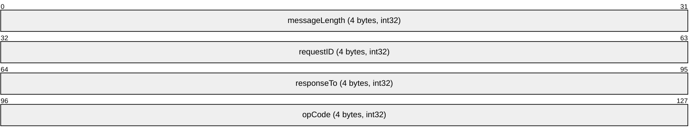
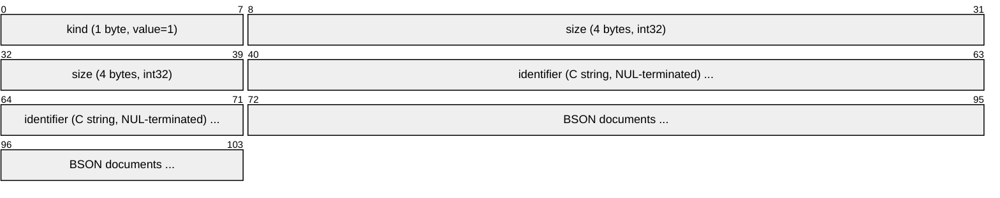
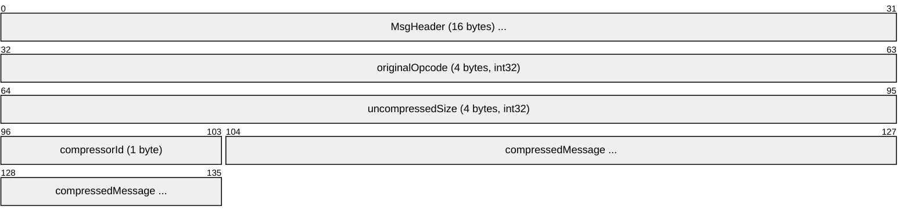
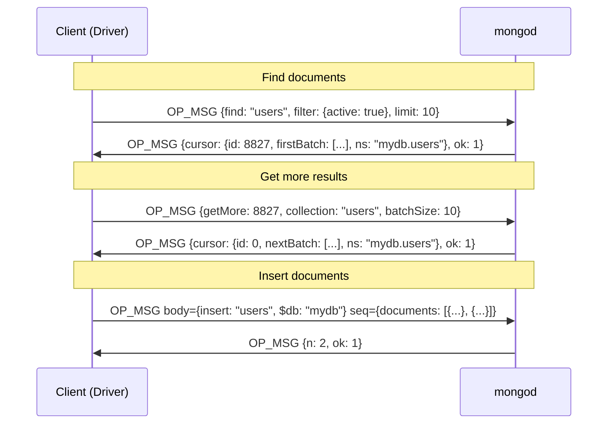
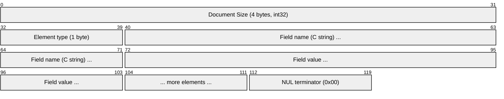
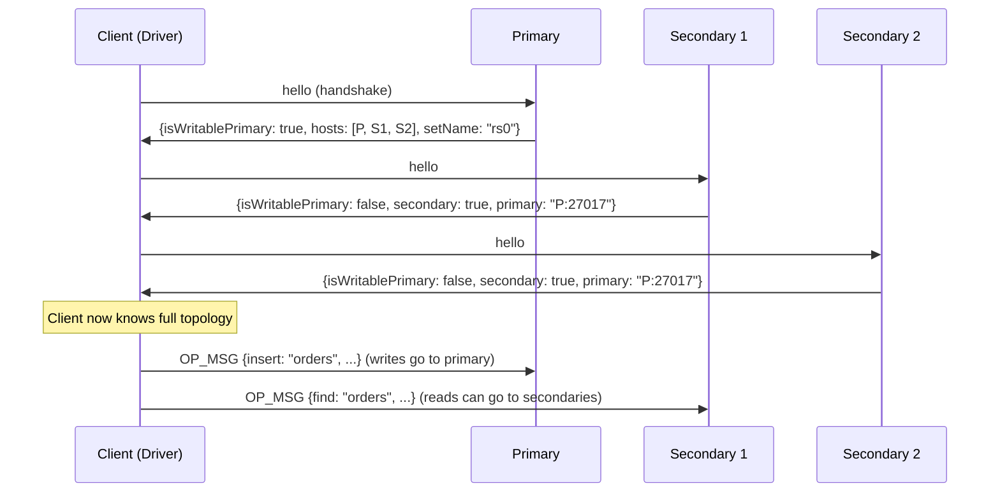
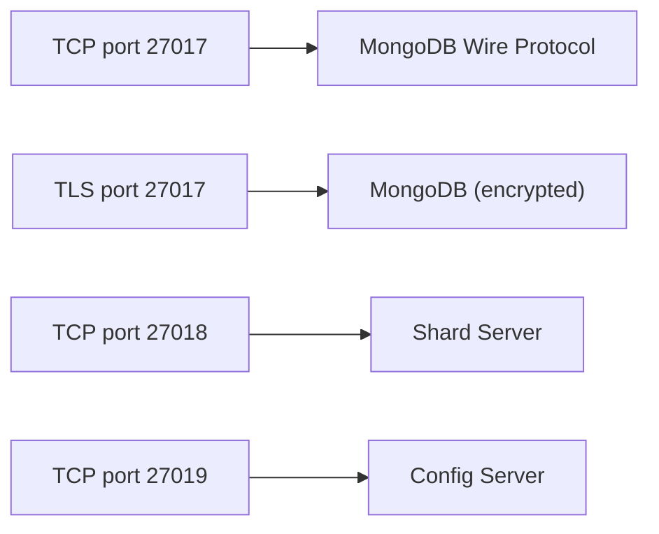

# MongoDB Wire Protocol

> **Standard:** [MongoDB Wire Protocol](https://www.mongodb.com/docs/manual/reference/mongodb-wire-protocol/) | **Layer:** Application (Layer 7) | **Wireshark filter:** `mongo`

The MongoDB wire protocol is a binary, little-endian, request-response protocol for communication between clients (drivers) and MongoDB servers (mongod/mongos). Every message begins with a standard 16-byte header containing the message length, request ID, response-to ID, and opcode. Modern MongoDB (3.6+) uses OP_MSG (opcode 2013) as the universal message format, replacing all legacy opcodes. OP_MSG carries BSON command documents in typed sections and supports checksums, exhaust cursors, and streaming. MongoDB also supports wire compression via OP_COMPRESSED. The protocol runs over TCP on port 27017 by default.

## Message Header (MsgHeader)

Every MongoDB wire protocol message starts with this 16-byte header:

## Key Fields

| Field | Size | Description |
|-------|------|-------------|
| messageLength | 4 bytes | Total size of the message in bytes, including the header |
| requestID | 4 bytes | Client-generated identifier for this message |
| responseTo | 4 bytes | requestID of the message this is a response to (0 for client requests) |
| opCode | 4 bytes | Type of message |

## Opcodes

| Opcode | Value | Status | Description |
|--------|-------|--------|-------------|
| OP_MSG | 2013 | Current | Universal message format (MongoDB 3.6+) |
| OP_COMPRESSED | 2012 | Current | Compressed wrapper around another message |
| OP_REPLY | 1 | Deprecated | Legacy reply to client request |
| OP_QUERY | 2004 | Deprecated | Legacy query message |
| OP_GET_MORE | 2005 | Deprecated | Legacy cursor iteration |
| OP_INSERT | 2002 | Removed | Legacy insert (removed in 5.1) |
| OP_UPDATE | 2001 | Removed | Legacy update (removed in 5.1) |
| OP_DELETE | 2006 | Removed | Legacy delete (removed in 5.1) |
| OP_KILL_CURSORS | 2007 | Deprecated | Close server-side cursors |

## OP_MSG (Opcode 2013)

The modern universal message format used for all operations:

### OP_MSG Flag Bits

| Bit | Name | Description |
|-----|------|-------------|
| 0 | checksumPresent | Message ends with a CRC-32C checksum (4 bytes) |
| 1 | moreToCome | Sender will send another message without waiting for a response |
| 16 | exhaustAllowed | Client permits the server to stream multiple replies (exhaust cursor) |

### OP_MSG Sections

| Kind | Name | Description |
|------|------|-------------|
| 0 | Body | Single BSON document -- the command and its parameters |
| 1 | Document Sequence | Named sequence of BSON documents (identifier + documents) -- used for batch writes |

### Section Kind 1 (Document Sequence)

## OP_COMPRESSED (Opcode 2012)

Wraps another message with compression:

### Compressor IDs

| ID | Name | Description |
|----|------|-------------|
| 0 | noop | No compression (testing only) |
| 1 | snappy | Snappy compression |
| 2 | zlib | Zlib compression |
| 3 | zstd | Zstandard compression (MongoDB 4.2+) |

## Query Flow (Modern OP_MSG)

All database operations are expressed as command documents sent via OP_MSG:

## Common Commands (via OP_MSG Body)

| Command | Description |
|---------|-------------|
| find | Query documents from a collection |
| insert | Insert one or more documents |
| update | Update documents matching a filter |
| delete | Delete documents matching a filter |
| aggregate | Run an aggregation pipeline |
| getMore | Retrieve next batch from a cursor |
| killCursors | Close open cursors |
| createIndexes | Create indexes on a collection |
| isMaster / hello | Server handshake and topology discovery |
| ping | Check server availability |
| saslStart / saslContinue | SCRAM-SHA-1 or SCRAM-SHA-256 authentication |

## BSON Document Format

MongoDB messages carry data as BSON (Binary JSON) documents:

### BSON Element Types

| Type | ID | Description |
|------|----|-------------|
| Double | 0x01 | 64-bit IEEE 754 floating point |
| String | 0x02 | UTF-8 string (length-prefixed) |
| Document | 0x03 | Embedded BSON document |
| Array | 0x04 | BSON array (document with "0", "1", ... keys) |
| Binary | 0x05 | Binary data with subtype |
| ObjectId | 0x07 | 12-byte unique identifier |
| Boolean | 0x08 | true (0x01) or false (0x00) |
| DateTime | 0x09 | UTC milliseconds since epoch (int64) |
| Null | 0x0A | Null value |
| Int32 | 0x10 | 32-bit signed integer |
| Timestamp | 0x11 | MongoDB internal timestamp (ordinal + seconds) |
| Int64 | 0x12 | 64-bit signed integer |
| Decimal128 | 0x13 | 128-bit IEEE 754 decimal |

## Replica Set Connection

## Authentication

MongoDB uses SASL for authentication, sent as commands via OP_MSG:

| Mechanism | Description |
|-----------|-------------|
| SCRAM-SHA-1 | Default through MongoDB 3.x |
| SCRAM-SHA-256 | Default from MongoDB 4.0+ |
| MONGODB-X509 | TLS client certificate authentication |
| MONGODB-AWS | AWS IAM authentication |
| PLAIN | LDAP proxy authentication (Enterprise) |

## Server Response Fields

| Field | Description |
|-------|-------------|
| ok | 1 for success, 0 for failure |
| errmsg | Error message (when ok=0) |
| code | Numeric error code |
| codeName | String name for the error code |
| n | Number of documents affected |
| cursor | Cursor object with id, firstBatch/nextBatch, ns |
| writeConcernError | Write concern was not satisfied |
| writeErrors | Array of per-document write errors |

## Encapsulation

## Standards

| Document | Title |
|----------|-------|
| [MongoDB Wire Protocol](https://www.mongodb.com/docs/manual/reference/mongodb-wire-protocol/) | Wire protocol specification |
| [OP_MSG](https://www.mongodb.com/docs/manual/reference/mongodb-wire-protocol/#op_msg) | OP_MSG message format |
| [BSON Specification](https://bsonspec.org/spec.html) | Binary JSON format specification |
| [Server Selection](https://www.mongodb.com/docs/manual/core/read-preference-mechanics/) | Read preference and server selection |
| [MongoDB Driver Specifications](https://github.com/mongodb/specifications) | Official driver protocol specs |

## See Also

- [MySQL](mysql.md) -- relational database wire protocol
- [PostgreSQL](postgresql.md) -- relational database wire protocol
- [Redis](redis.md) -- in-memory data store protocol
- [TCP](../transport-layer/tcp.md)
- [TLS](../security/tls.md) -- encrypts MongoDB connections
