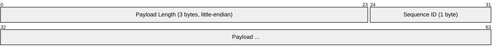
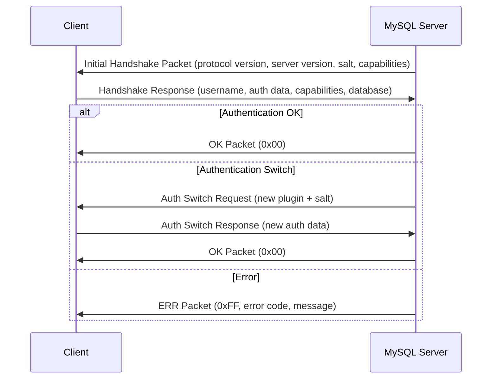
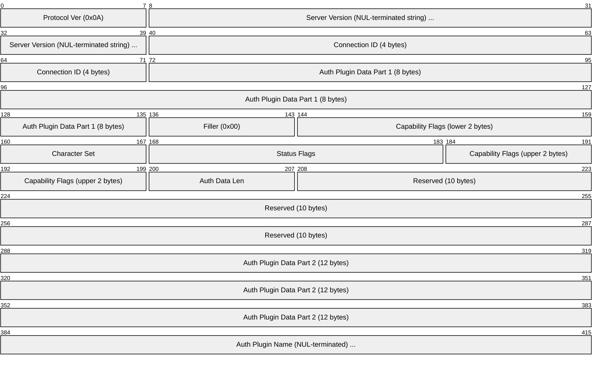
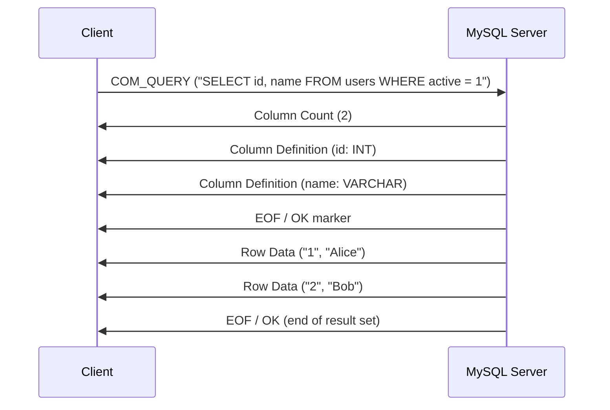
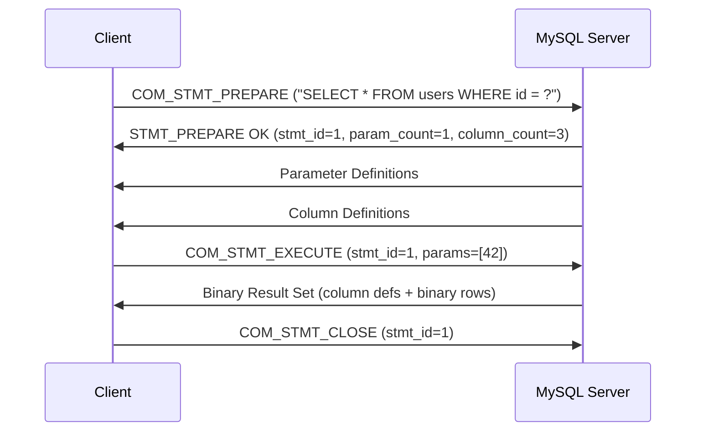
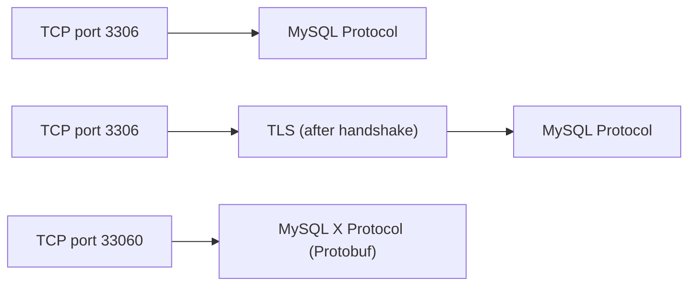

# MySQL Protocol

> **Standard:** [MySQL Client/Server Protocol](https://dev.mysql.com/doc/dev/mysql-server/latest/page_protocol_basics.html) | **Layer:** Application (Layer 7) | **Wireshark filter:** `mysql`

The MySQL protocol is a binary, client/server wire protocol used to communicate with MySQL and MariaDB database servers. It operates in two phases: a connection phase (handshake and authentication) followed by a command phase where the client sends queries and receives result sets. The protocol is length-prefixed and uses little-endian byte ordering. It runs over TCP on port 3306 by default and optionally over TLS for encrypted connections.

## Packet Header

Every MySQL packet begins with a 4-byte header:

## Key Fields

| Field | Size | Description |
|-------|------|-------------|
| Payload Length | 3 bytes | Length of the payload (max 16 MB per packet; larger results split across multiple packets) |
| Sequence ID | 1 byte | Sequence counter, incremented with each packet in a command exchange; resets to 0 for each new command |
| Payload | Variable | The actual protocol message data |

## Connection Phase

### Handshake Flow

### Initial Handshake Packet (Server to Client)

## Capability Flags

| Flag | Hex | Description |
|------|-----|-------------|
| CLIENT_LONG_PASSWORD | 0x00000001 | Use improved password hashing |
| CLIENT_FOUND_ROWS | 0x00000002 | Return found rows instead of affected rows |
| CLIENT_LONG_FLAG | 0x00000004 | Longer column flags in column definitions |
| CLIENT_CONNECT_WITH_DB | 0x00000008 | Connect to database directly |
| CLIENT_PROTOCOL_41 | 0x00000200 | New 4.1 protocol (always set) |
| CLIENT_SSL | 0x00000800 | Switch to TLS after handshake |
| CLIENT_TRANSACTIONS | 0x00002000 | Client knows about transactions |
| CLIENT_SECURE_CONNECTION | 0x00008000 | Secure authentication (4.1 password) |
| CLIENT_MULTI_STATEMENTS | 0x00010000 | Multiple statements per COM_QUERY |
| CLIENT_MULTI_RESULTS | 0x00020000 | Multiple result sets |
| CLIENT_PS_MULTI_RESULTS | 0x00040000 | Multiple result sets for prepared statements |
| CLIENT_PLUGIN_AUTH | 0x00080000 | Pluggable authentication |
| CLIENT_DEPRECATE_EOF | 0x01000000 | OK packet replaces EOF in result sets |

## Authentication Plugins

| Plugin | Description |
|--------|-------------|
| mysql_native_password | SHA1-based challenge-response (default through MySQL 5.7) |
| caching_sha2_password | SHA-256 with server-side cache (default from MySQL 8.0) |
| sha256_password | SHA-256 without caching (requires TLS or RSA exchange) |
| auth_socket | Unix socket peer credential authentication |
| mysql_clear_password | Plaintext password (requires TLS) |

## Command Phase

After authentication, the client sends command packets. The first byte of the payload identifies the command.

### Command Types

| Code | Command | Description |
|------|---------|-------------|
| 0x00 | COM_SLEEP | Internal (not used by clients) |
| 0x01 | COM_QUIT | Close the connection |
| 0x02 | COM_INIT_DB | Switch to a database (USE statement) |
| 0x03 | COM_QUERY | Execute a SQL statement (text protocol) |
| 0x04 | COM_FIELD_LIST | List columns in a table (deprecated) |
| 0x08 | COM_STATISTICS | Get server statistics string |
| 0x0E | COM_PING | Check if server is alive |
| 0x16 | COM_STMT_PREPARE | Prepare a statement (binary protocol) |
| 0x17 | COM_STMT_EXECUTE | Execute a prepared statement |
| 0x18 | COM_STMT_SEND_LONG_DATA | Send blob data for a prepared statement parameter |
| 0x19 | COM_STMT_CLOSE | Deallocate a prepared statement |
| 0x1A | COM_STMT_RESET | Reset a prepared statement |
| 0x1F | COM_RESET_CONNECTION | Reset session state without re-authenticating |

### Query Flow (Text Protocol)

### Prepared Statement Flow (Binary Protocol)

## Result Set Structure

### Text Protocol Result Set

| Packet | Description |
|--------|-------------|
| Column Count | Length-encoded integer indicating number of columns |
| Column Definition | One per column: catalog, schema, table, name, charset, length, type, flags |
| EOF / OK marker | Separates column definitions from rows (omitted if CLIENT_DEPRECATE_EOF) |
| Row | One per row: length-encoded strings for each column value (NULL = 0xFB) |
| EOF / OK | End of result set |

### Response Packets

| First Byte | Packet Type | Description |
|------------|-------------|-------------|
| 0x00 | OK | Success with affected rows, insert ID, status, warnings |
| 0xFF | ERR | Error with code, SQL state, message |
| 0xFE | EOF | End marker (deprecated in favor of OK with CLIENT_DEPRECATE_EOF) |

## Status Flags

| Flag | Hex | Description |
|------|-----|-------------|
| SERVER_STATUS_IN_TRANS | 0x0001 | A transaction is active |
| SERVER_STATUS_AUTOCOMMIT | 0x0002 | Autocommit mode is enabled |
| SERVER_MORE_RESULTS_EXISTS | 0x0008 | More result sets follow (multi-statement) |
| SERVER_STATUS_CURSOR_EXISTS | 0x0040 | A read-only cursor exists |
| SERVER_STATUS_LAST_ROW_SENT | 0x0080 | Last row has been sent |
| SERVER_SESSION_STATE_CHANGED | 0x4000 | Session state was changed |

## Encapsulation

## Standards

| Document | Title |
|----------|-------|
| [MySQL Client/Server Protocol](https://dev.mysql.com/doc/dev/mysql-server/latest/page_protocol_basics.html) | MySQL Internals — Client/Server Protocol |
| [MySQL COM Commands](https://dev.mysql.com/doc/dev/mysql-server/latest/page_protocol_command_phase.html) | Command Phase documentation |
| [MariaDB Protocol](https://mariadb.com/kb/en/clientserver-protocol/) | MariaDB Client/Server Protocol (compatible) |

## See Also

- [PostgreSQL](postgresql.md) -- frontend/backend message-based database protocol
- [TDS](tds.md) -- Microsoft SQL Server and Sybase wire protocol
- [Redis](redis.md) -- in-memory data store protocol
- [TCP](../transport-layer/tcp.md)
- [TLS](../security/tls.md) -- encrypts MySQL connections
