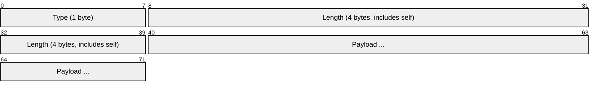
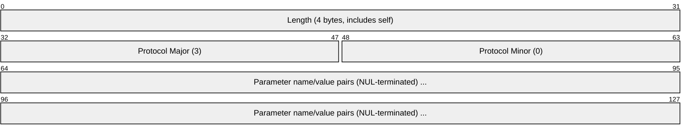
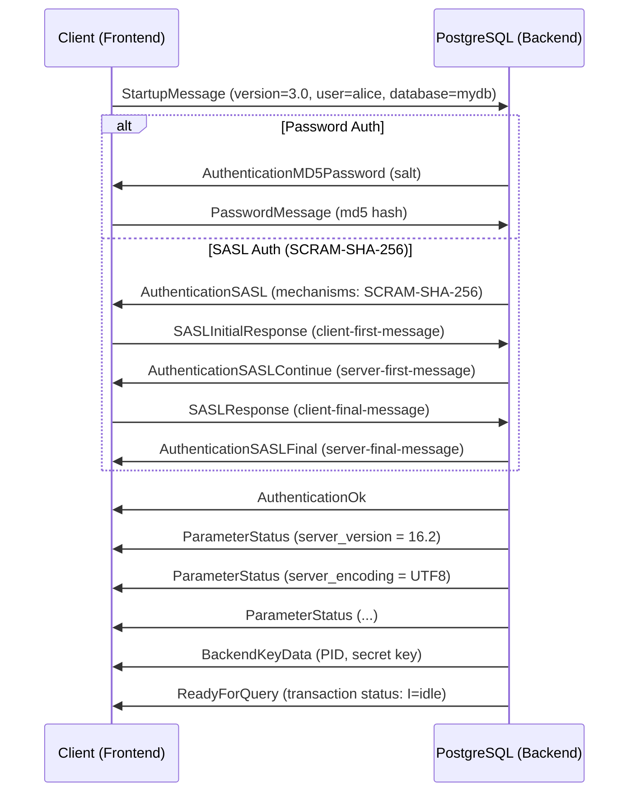
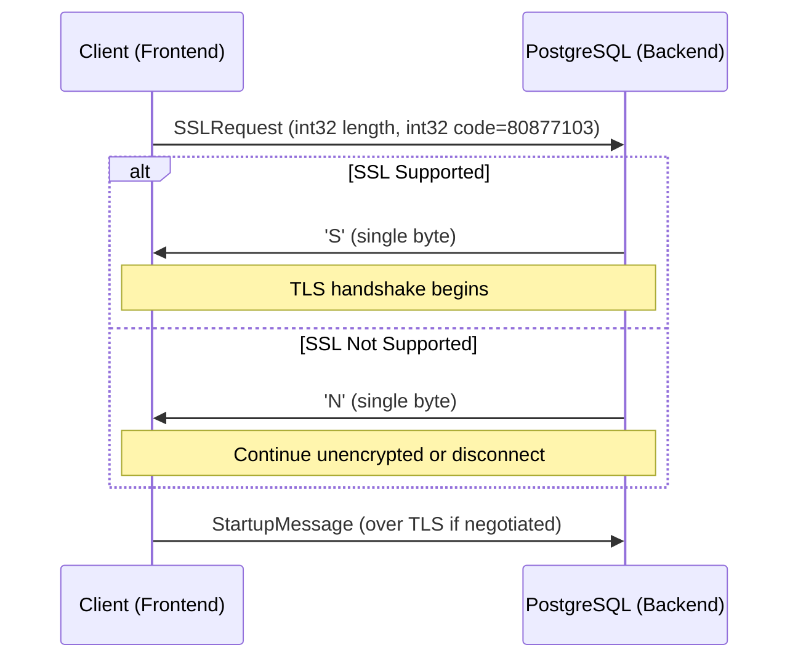
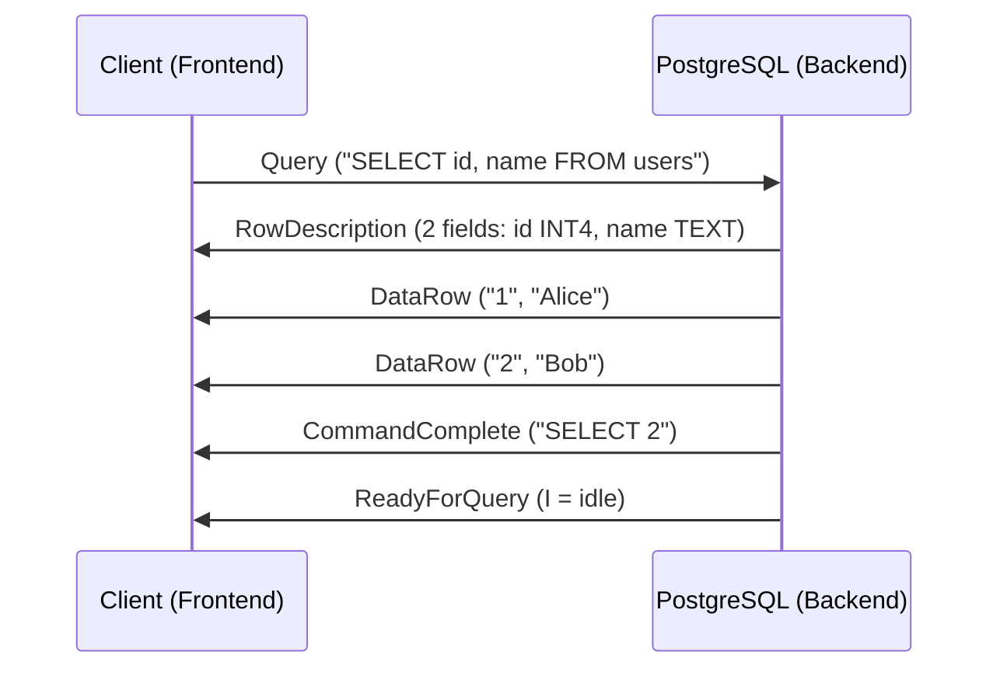
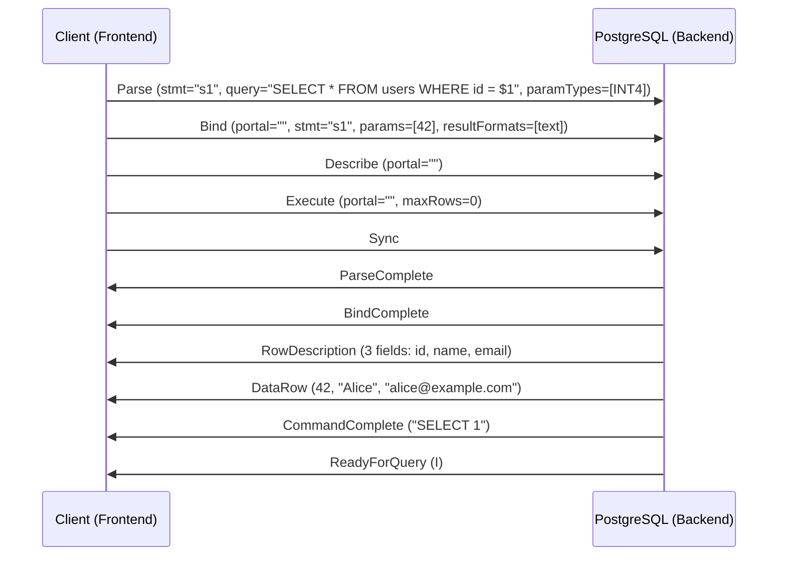
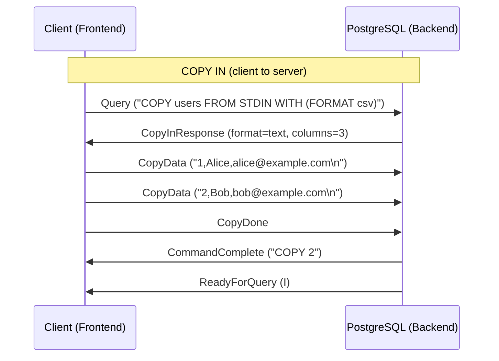
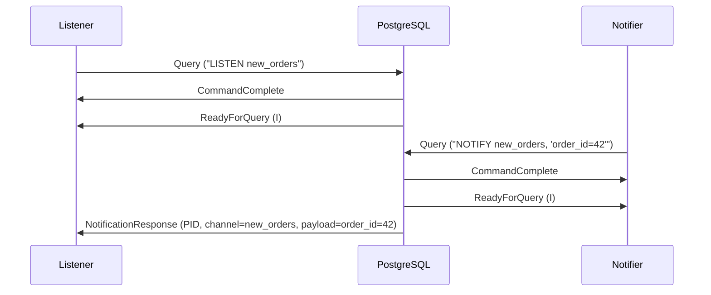
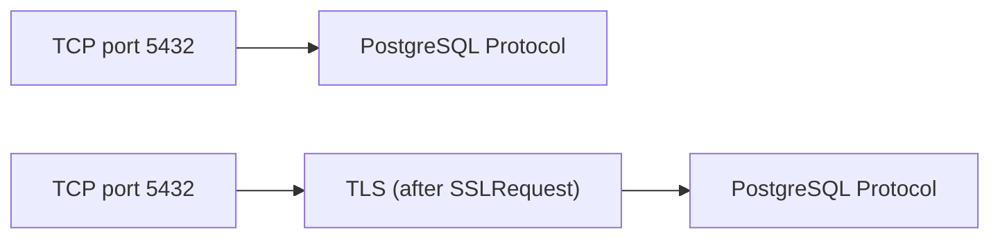

# PostgreSQL Wire Protocol

> **Standard:** [PostgreSQL Frontend/Backend Protocol](https://www.postgresql.org/docs/current/protocol.html) | **Layer:** Application (Layer 7) | **Wireshark filter:** `pgsql`

The PostgreSQL wire protocol is a message-based, binary protocol for communication between clients (frontends) and the PostgreSQL database server (backend). Messages are typed and length-prefixed. The protocol supports two query sub-protocols: the Simple Query protocol (send SQL text, get results) and the Extended Query protocol (parse, bind, execute as separate steps, enabling prepared statements and portals). PostgreSQL also defines a COPY sub-protocol for bulk data transfer and an asynchronous notification mechanism (LISTEN/NOTIFY). It runs on TCP port 5432 by default.

## Message Format

### Frontend (Client) and Backend (Server) Messages

All messages after the startup phase share this format:

### Startup Message (no type byte)

The initial startup message omits the type byte:

## Key Fields

| Field | Size | Description |
|-------|------|-------------|
| Type | 1 byte | Single ASCII character identifying the message type (omitted in startup) |
| Length | 4 bytes | Total length of message including the length field itself but not the type byte |
| Payload | Variable | Message-specific data |

## Connection Phase

### Startup and Authentication

### SSL Negotiation

## Authentication Types

| Code | Type | Description |
|------|------|-------------|
| 0 | AuthenticationOk | Authentication successful |
| 2 | AuthenticationKerberosV5 | Kerberos V5 required (deprecated) |
| 3 | AuthenticationCleartextPassword | Cleartext password required |
| 5 | AuthenticationMD5Password | MD5 password hash required (with 4-byte salt) |
| 7 | AuthenticationGSS | GSSAPI authentication |
| 9 | AuthenticationSSPI | SSPI authentication (Windows) |
| 10 | AuthenticationSASL | SASL mechanism negotiation (SCRAM-SHA-256) |
| 11 | AuthenticationSASLContinue | SASL challenge |
| 12 | AuthenticationSASLFinal | SASL completion |

## Frontend Messages (Client to Server)

| Type | Name | Description |
|------|------|-------------|
| Q | Query | Execute a simple SQL query (text) |
| P | Parse | Parse a SQL statement into a prepared statement |
| B | Bind | Bind parameters to a prepared statement, creating a portal |
| D | Describe | Describe a prepared statement (S) or portal (P) |
| E | Execute | Execute a portal |
| H | Flush | Force server to deliver pending output |
| S | Sync | Synchronization point (ends extended query, triggers ReadyForQuery) |
| C | Close | Close a prepared statement or portal |
| X | Terminate | Disconnect cleanly |
| d | CopyData | Data chunk during COPY operation |
| c | CopyDone | COPY operation complete |
| f | CopyFail | COPY operation failed |
| p | PasswordMessage / SASLResponse | Authentication data |
| F | FunctionCall | Call a server function by OID (legacy) |

## Backend Messages (Server to Client)

| Type | Name | Description |
|------|------|-------------|
| R | Authentication* | Authentication request or result |
| K | BackendKeyData | Process ID and secret key for cancel requests |
| S | ParameterStatus | Runtime parameter value (e.g., server_encoding) |
| Z | ReadyForQuery | Server is ready; includes transaction status (I/T/E) |
| T | RowDescription | Column metadata for upcoming rows |
| D | DataRow | One row of result data |
| C | CommandComplete | SQL command completed (with row count) |
| I | EmptyQueryResponse | Response to an empty query string |
| E | ErrorResponse | Error with severity, code, message, detail, hint |
| N | NoticeResponse | Non-fatal warning or notice |
| 1 | ParseComplete | Parse step succeeded |
| 2 | BindComplete | Bind step succeeded |
| 3 | CloseComplete | Close step succeeded |
| n | NoData | Describe returned no row info (e.g., for INSERT) |
| t | ParameterDescription | Parameter types for a prepared statement |
| G | CopyInResponse | Server is ready to receive COPY data |
| H | CopyOutResponse | Server is sending COPY data |
| d | CopyData | Data chunk during COPY OUT |
| c | CopyDone | COPY OUT complete |
| A | NotificationResponse | Asynchronous NOTIFY payload |

## Simple Query Protocol

## Extended Query Protocol

The extended protocol separates parsing, binding, and execution for prepared statements and parameterized queries:

## COPY Protocol

Bulk data transfer for imports and exports:

## LISTEN/NOTIFY (Async Notifications)

## ReadyForQuery Transaction Status

| Status | Meaning |
|--------|---------|
| I | Idle (not in a transaction) |
| T | In a transaction block |
| E | In a failed transaction block (queries will be rejected until ROLLBACK) |

## ErrorResponse Fields

| Code | Field | Description |
|------|-------|-------------|
| S | Severity | ERROR, FATAL, PANIC, WARNING, NOTICE, DEBUG, INFO, LOG |
| V | Severity (non-localized) | Always English severity |
| C | Code | SQLSTATE error code (5 characters, e.g., 42P01) |
| M | Message | Primary human-readable error message |
| D | Detail | Optional detailed error explanation |
| H | Hint | Optional suggestion for fixing the problem |
| P | Position | Cursor position in the query string |
| W | Where | Call stack context (PL/pgSQL) |

## Encapsulation

## Standards

| Document | Title |
|----------|-------|
| [Frontend/Backend Protocol](https://www.postgresql.org/docs/current/protocol.html) | PostgreSQL Wire Protocol specification |
| [Message Flow](https://www.postgresql.org/docs/current/protocol-flow.html) | Protocol message flow documentation |
| [Message Formats](https://www.postgresql.org/docs/current/protocol-message-formats.html) | Detailed message format reference |
| [Error Codes](https://www.postgresql.org/docs/current/errcodes-appendix.html) | PostgreSQL SQLSTATE error codes |
| [SCRAM Authentication](https://www.postgresql.org/docs/current/sasl-authentication.html) | SASL/SCRAM-SHA-256 authentication |

## See Also

- [MySQL](mysql.md) -- client/server database wire protocol
- [TDS](tds.md) -- Microsoft SQL Server and Sybase wire protocol
- [Redis](redis.md) -- in-memory data store protocol
- [TCP](../transport-layer/tcp.md)
- [TLS](../security/tls.md) -- encrypts PostgreSQL connections
