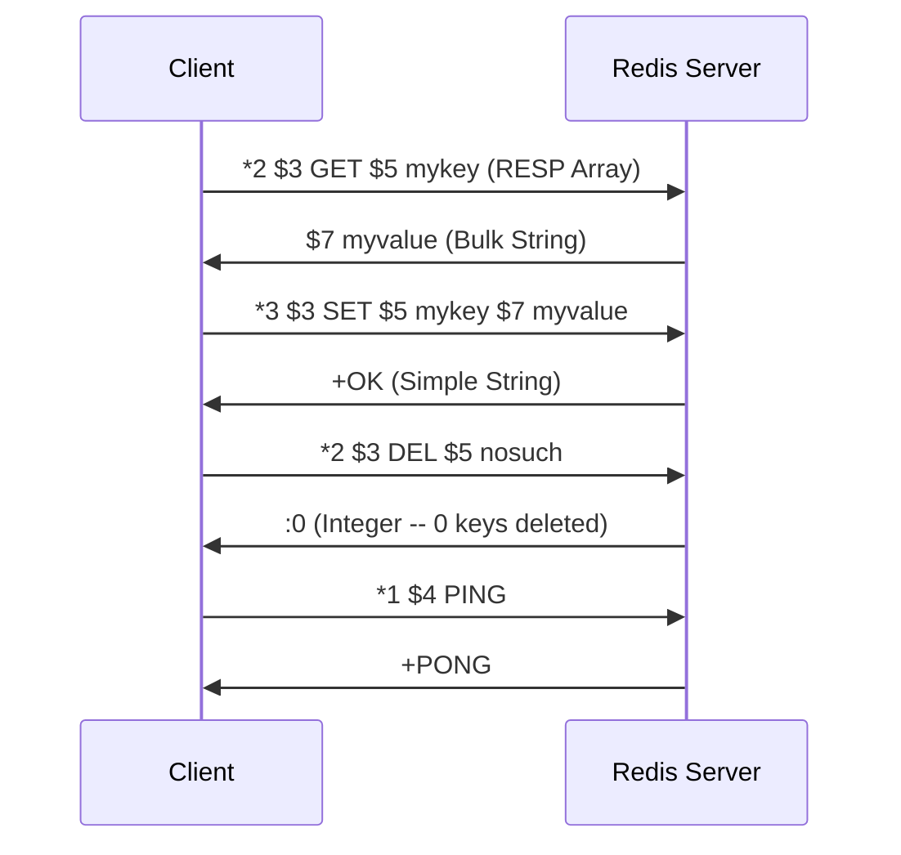
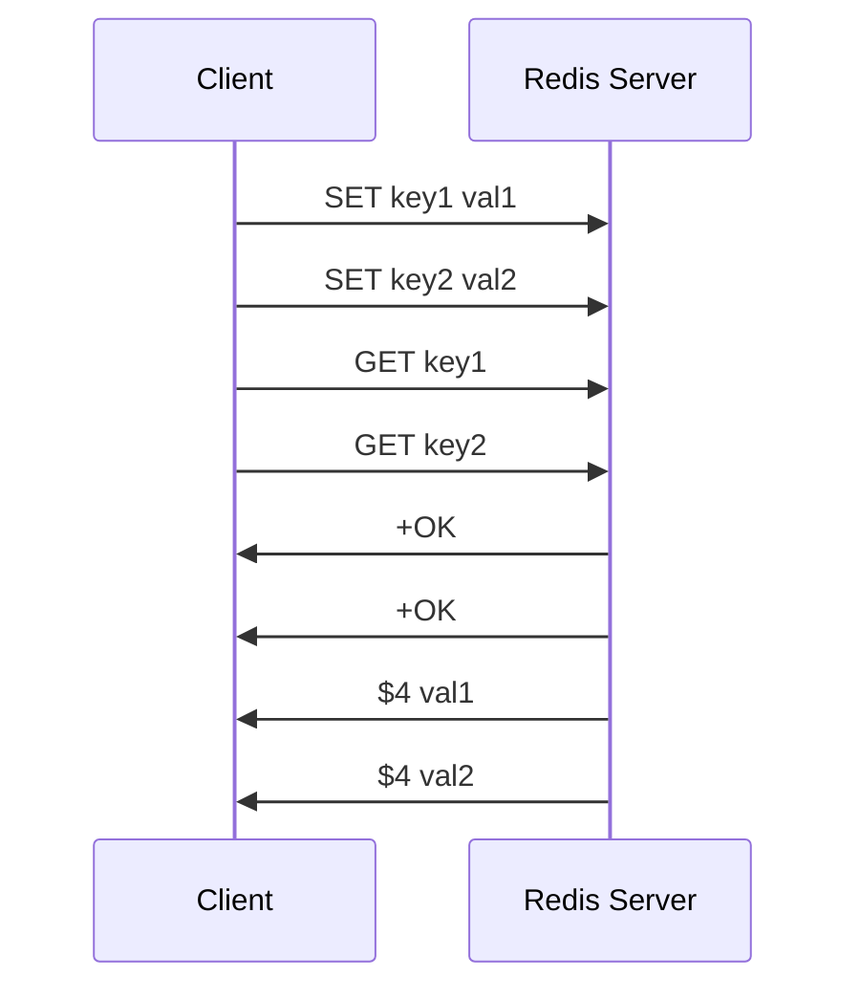
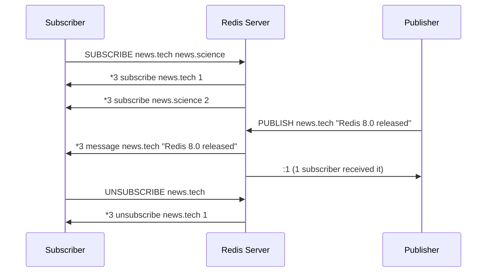
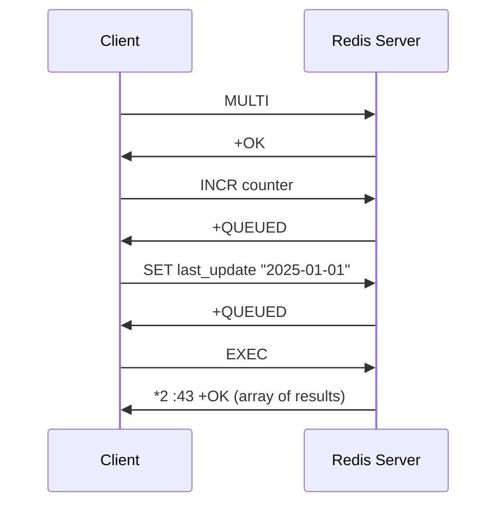
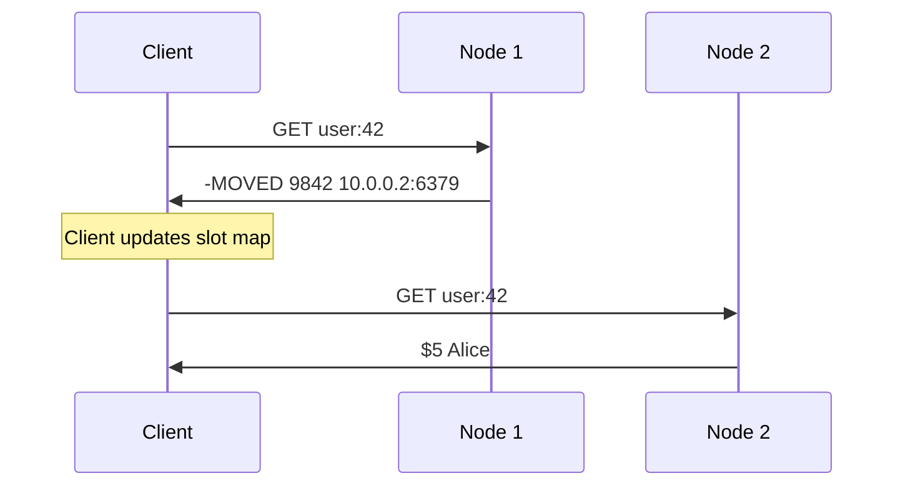
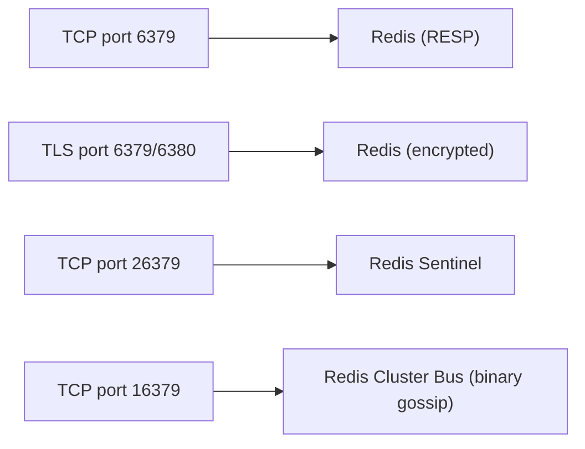

# Redis Protocol (RESP)

> **Standard:** [RESP Protocol Specification](https://redis.io/docs/reference/protocol-spec/) | **Layer:** Application (Layer 7) | **Wireshark filter:** `redis`

RESP (REdis Serialization Protocol) is the wire protocol used by Redis, an in-memory data structure store used as a database, cache, message broker, and streaming engine. RESP is a text-oriented, request-response protocol where clients send commands as arrays of bulk strings and the server replies with typed responses. The protocol is designed for simplicity and efficient parsing. RESP2 is the baseline version; RESP3 (introduced in Redis 6.0) adds richer data types including maps, sets, booleans, and client-side caching support. Redis runs on TCP port 6379 by default.

## RESP2 Data Types

Each RESP value begins with a single-byte type prefix, followed by data and a CRLF (`\r\n`) terminator:

| Prefix | Type | Format | Example |
|--------|------|--------|---------|
| `+` | Simple String | `+OK\r\n` | Success responses |
| `-` | Error | `-ERR unknown command\r\n` | Error messages |
| `:` | Integer | `:1000\r\n` | Numeric responses (counters, booleans) |
| `$` | Bulk String | `$5\r\nhello\r\n` | Binary-safe strings (length-prefixed) |
| `*` | Array | `*2\r\n$3\r\nfoo\r\n$3\r\nbar\r\n` | Ordered collections of RESP values |

### Null Values

| RESP2 Representation | Meaning |
|---------------------|---------|
| `$-1\r\n` | Null Bulk String (key does not exist) |
| `*-1\r\n` | Null Array |

## RESP3 Additional Types

RESP3 introduces new type prefixes for richer semantics:

| Prefix | Type | Format | Description |
|--------|------|--------|-------------|
| `_` | Null | `_\r\n` | Unified null type |
| `#` | Boolean | `#t\r\n` or `#f\r\n` | True/false |
| `,` | Double | `,3.14\r\n` | Floating-point number |
| `(` | Big Number | `(3492890328409238509324850943850943825024385\r\n` | Arbitrary precision integer |
| `!` | Bulk Error | `!21\r\nSYNTAX invalid syntax\r\n` | Binary-safe error (length-prefixed) |
| `=` | Verbatim String | `=15\r\ntxt:Some text\r\n` | String with encoding hint (txt, mkd) |
| `%` | Map | `%2\r\n+key1\r\n:1\r\n+key2\r\n:2\r\n` | Key-value pairs |
| `~` | Set | `~3\r\n+a\r\n+b\r\n+c\r\n` | Unordered unique elements |
| `\|` | Attribute | `\|1\r\n+ttl\r\n:3600\r\n` | Metadata attached to the next reply |
| `>` | Push | `>3\r\n+message\r\n+channel\r\n$5\r\nhello\r\n` | Out-of-band push data (pub/sub, invalidation) |

## Command Format

Clients send commands as RESP arrays of bulk strings:

```
*3\r\n
$3\r\n
SET\r\n
$5\r\n
mykey\r\n
$7\r\n
myvalue\r\n
```

Redis also supports inline commands (space-separated, no RESP framing) for human interaction:

```
SET mykey myvalue\r\n
```

## Command/Response Flow



## Pipelining

Clients can send multiple commands without waiting for each response. The server buffers responses and sends them in order:



## Pub/Sub

When a client enters subscription mode, it only receives push messages:



## Transactions (MULTI/EXEC)

| Command | Description |
|---------|-------------|
| MULTI | Begin a transaction (commands are queued) |
| EXEC | Execute all queued commands atomically |
| DISCARD | Discard the transaction queue |
| WATCH key | Optimistic locking -- abort EXEC if key changed |



## Authentication and ACL

| Command | Description |
|---------|-------------|
| AUTH password | Authenticate with a single password (legacy) |
| AUTH username password | Authenticate with username and password (Redis 6+ ACL) |
| ACL SETUSER | Create or modify a user with permissions |
| ACL LIST | List all configured ACL rules |
| HELLO 3 | Switch to RESP3 protocol (optionally with AUTH) |

## Cluster Protocol

Redis Cluster distributes data across multiple nodes using hash slots (0-16383):

| Response | Description |
|----------|-------------|
| -MOVED 3999 127.0.0.1:6380 | Slot permanently moved to another node; client should update slot map |
| -ASK 3999 127.0.0.1:6380 | Slot temporarily migrating; send ASKING then retry to that node |
| -CLUSTERDOWN | Cluster is not available |

### Cluster Redirect Flow



## Sentinel Protocol

Redis Sentinel provides high availability. Sentinels use the same RESP protocol on port 26379:

| Command | Description |
|---------|-------------|
| SENTINEL get-master-addr-by-name mymaster | Get current master address |
| SENTINEL sentinels mymaster | List known sentinels |
| SENTINEL replicas mymaster | List known replicas |
| +switch-master | Pub/Sub notification when master changes |

## Encapsulation



## Standards

| Document | Title |
|----------|-------|
| [RESP Protocol Spec](https://redis.io/docs/reference/protocol-spec/) | Redis Serialization Protocol specification |
| [RESP3 Specification](https://github.com/redis/redis-specifications/blob/master/protocol/RESP3.md) | RESP3 protocol specification |
| [Redis Commands](https://redis.io/commands/) | Complete command reference |
| [Redis Cluster Spec](https://redis.io/docs/reference/cluster-spec/) | Redis Cluster protocol and design |
| [Redis Sentinel](https://redis.io/docs/management/sentinel/) | Sentinel high availability documentation |

## See Also

- [MySQL](mysql.md) -- relational database wire protocol
- [PostgreSQL](postgresql.md) -- relational database wire protocol
- [MongoDB](mongodb.md) -- document database wire protocol
- [MQTT](../messaging/mqtt.md) -- lightweight pub/sub messaging (similar pub/sub concept)
- [TCP](../transport-layer/tcp.md)
