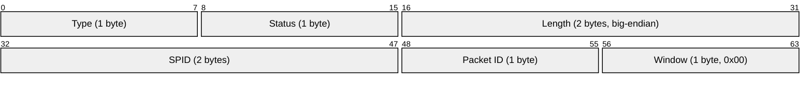
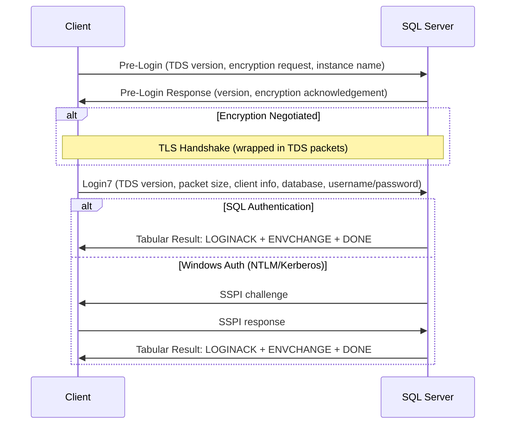
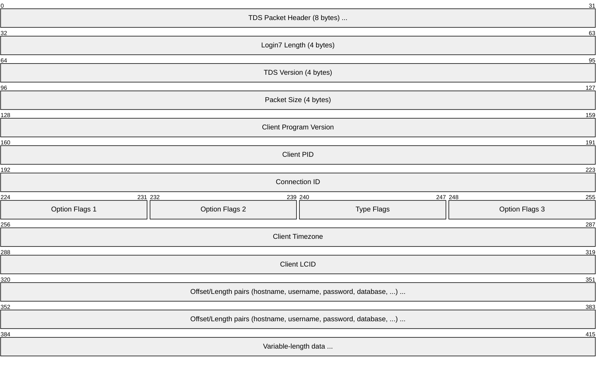
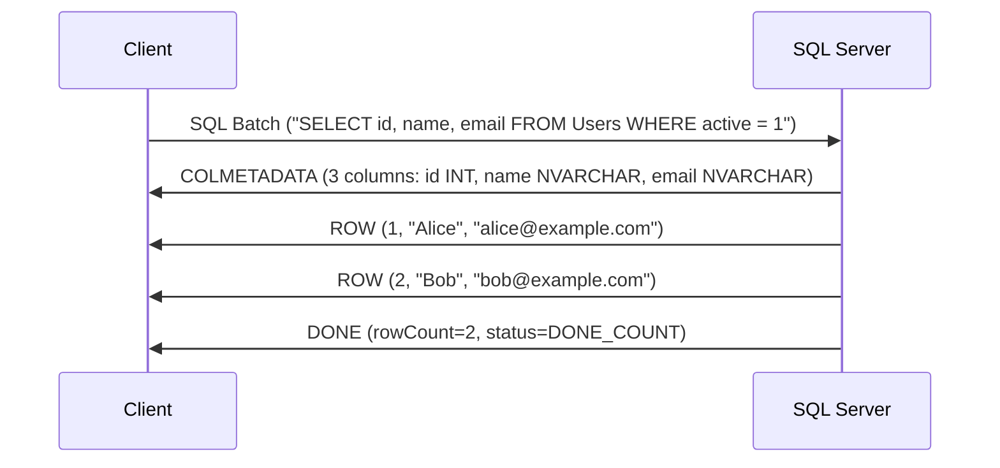
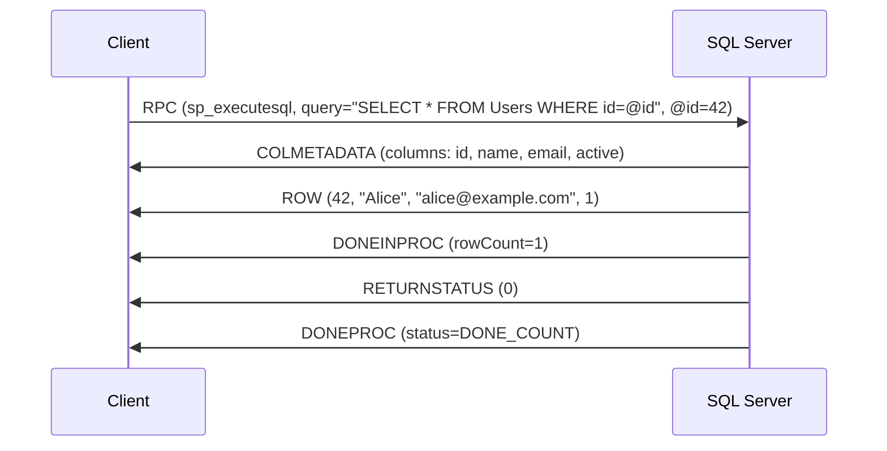
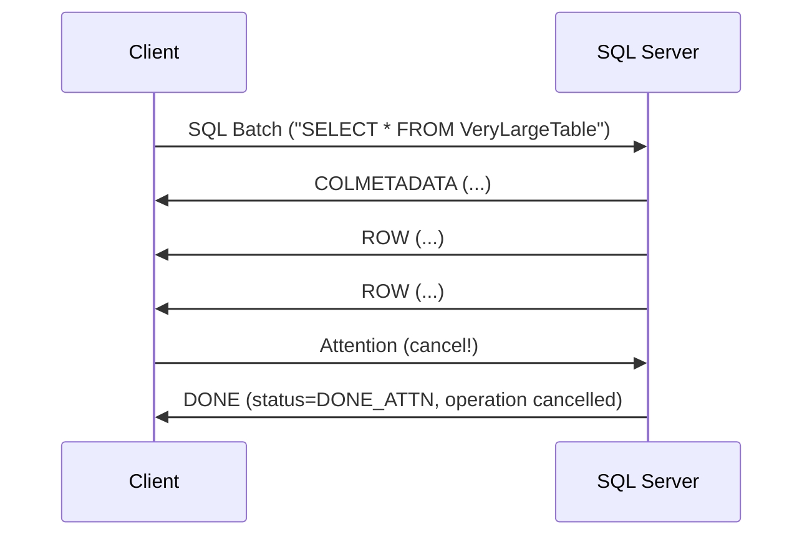
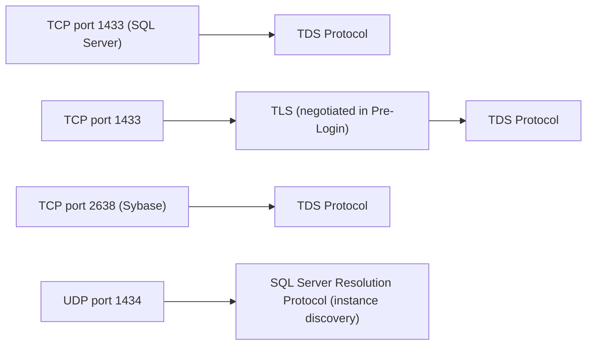

# TDS (Tabular Data Stream)

> **Standard:** [MS-TDS (Microsoft Open Specifications)](https://learn.microsoft.com/en-us/openspecs/windows_protocols/ms-tds/) | **Layer:** Application (Layer 7) | **Wireshark filter:** `tds`

TDS (Tabular Data Stream) is the binary wire protocol used by Microsoft SQL Server and Sybase ASE for client-server communication. It is a message-oriented protocol layered on top of TCP, where each message consists of one or more packets with an 8-byte header. The protocol defines a connection establishment phase (pre-login negotiation and Login7 authentication), followed by request/response exchanges where clients send SQL batches or RPC calls and servers return results as token streams. TDS has evolved through multiple versions, with TDS 7.x/8.0 covering modern SQL Server releases. SQL Server listens on TCP port 1433 by default; Sybase uses port 2638.

## Packet Header

Every TDS packet begins with an 8-byte header:

## Key Fields

| Field | Size | Description |
|-------|------|-------------|
| Type | 1 byte | Message type identifier |
| Status | 1 byte | Status flags (bit 0: last packet in message; bit 1: ignore event; bit 3: reset connection) |
| Length | 2 bytes | Total packet length including the header (big-endian, max typically 4096 or 32767) |
| SPID | 2 bytes | Server Process ID (used by the server for session tracking) |
| Packet ID | 1 byte | Incremented per packet within a message (wraps at 255) |
| Window | 1 byte | Reserved, always 0x00 |

## Message Types

| Type | Hex | Name | Direction | Description |
|------|-----|------|-----------|-------------|
| 1 | 0x01 | SQL Batch | Client to Server | Raw SQL text to execute |
| 2 | 0x02 | Pre-TDS7 Login | Client to Server | Legacy login (TDS 4.2/5.0) |
| 3 | 0x03 | RPC | Client to Server | Remote procedure call (sp_executesql, stored procs) |
| 4 | 0x04 | Tabular Result | Server to Client | Token stream with results, errors, info |
| 6 | 0x06 | Attention | Client to Server | Cancel the current request |
| 7 | 0x07 | Bulk Load | Client to Server | Bulk insert data stream |
| 14 | 0x0E | Transaction Manager | Client to Server | Distributed transaction coordination |
| 16 | 0x10 | Login7 | Client to Server | TDS 7.x login message |
| 17 | 0x11 | SSPI | Client to Server | NTLM/Kerberos authentication token |
| 18 | 0x12 | Pre-Login | Both | Pre-login negotiation (version, encryption, instance) |

## TDS Versions

| Version | Value | Description |
|---------|-------|-------------|
| TDS 4.2 | 0x04000000 | Sybase, SQL Server 6.5 and earlier |
| TDS 5.0 | 0x05000000 | Sybase ASE only |
| TDS 7.0 | 0x00000070 | SQL Server 7.0 |
| TDS 7.1 | 0x01000071 | SQL Server 2000 |
| TDS 7.2 | 0x02000972 | SQL Server 2005 |
| TDS 7.3 | 0x03000A73 | SQL Server 2008 |
| TDS 7.4 | 0x04000B74 | SQL Server 2012+ |

## Login Flow

### Pre-Login and Authentication

### Pre-Login Message Options

| Token | Description |
|-------|-------------|
| VERSION | Client/server TDS version |
| ENCRYPTION | Encryption negotiation (off, on, required, not supported) |
| INSTOPT | SQL Server instance name |
| THREADID | Client thread ID |
| MARS | Multiple Active Result Sets support |
| TRACEID | Activity tracing ID |
| FEDAUTHREQUIRED | Federated authentication (Azure AD) |

### Login7 Packet

## Token Stream (Tabular Result)

Server responses are encoded as a stream of typed tokens. Each token begins with a 1-byte type identifier:

### Token Types

| Token | Hex | Name | Description |
|-------|-----|------|-------------|
| 0x81 | COLMETADATA | Column Metadata | Column names, types, and flags for the result set |
| 0xD1 | ROW | Row | One row of data in the result set |
| 0xD2 | NBCROW | Null Bitmap Compressed Row | Row with null bitmap optimization |
| 0xFD | DONE | Done | Completion of a SQL statement (with row count) |
| 0xFE | DONEPROC | Done Procedure | Completion of a stored procedure |
| 0xFF | DONEINPROC | Done In Procedure | Completion of a statement within a stored procedure |
| 0xAA | ERROR | Error | Error message with number, state, severity, text |
| 0xAB | INFO | Info | Informational message |
| 0xE3 | ENVCHANGE | Environment Change | Database, language, packet size, transaction, or collation change |
| 0xAD | LOGINACK | Login Acknowledgement | Confirms successful login with TDS version and server name |
| 0xA9 | ORDER | Order | Column ordering information |
| 0xE5 | RETURNSTATUS | Return Status | Return value from a stored procedure |
| 0xAC | RETURNVALUE | Return Value | Output parameter value |
| 0x79 | COLINFO | Column Info | Additional column metadata |
| 0xA4 | NBCROW | Null Bitmap | Bitmap of NULL columns in a row |
| 0xED | SSPI | SSPI Token | Security token for NTLM/Kerberos |

## Query Flow

### SQL Batch Request and Response

### RPC (Stored Procedure / Parameterized Query)

### Attention (Cancel)

## Data Types

| Type ID | Name | Description |
|---------|------|-------------|
| 0x30 | INTN | Nullable integer (1, 2, 4, or 8 bytes) |
| 0x3E | FLTN | Nullable float (4 or 8 bytes) |
| 0xA7 | NVARCHAR | Variable-length Unicode string |
| 0xA5 | BIGVARBINARY | Variable-length binary |
| 0x6D | DATETIMN | Nullable datetime |
| 0x6A | DECIMALN | Nullable decimal |
| 0x6C | NUMERICN | Nullable numeric |
| 0x24 | GUIDTYPE | Uniqueidentifier (16 bytes) |
| 0xF1 | XMLTYPE | XML data |
| 0x62 | BIGVARCHARTYPE | Variable-length non-Unicode string |

## ENVCHANGE Types

| Type | Description |
|------|-------------|
| 1 | Database changed |
| 2 | Language changed |
| 3 | Character set changed |
| 4 | Packet size changed |
| 8 | Begin transaction (returns transaction descriptor) |
| 9 | Commit transaction |
| 10 | Rollback transaction |
| 17 | Transaction manager address |
| 20 | Routing information (AlwaysOn redirect) |

## DONE Status Flags

| Flag | Hex | Description |
|------|-----|-------------|
| DONE_FINAL | 0x0000 | Final DONE in the request |
| DONE_MORE | 0x0001 | More results follow |
| DONE_ERROR | 0x0002 | Error occurred |
| DONE_INXACT | 0x0004 | Transaction is in progress |
| DONE_COUNT | 0x0010 | Row count is valid |
| DONE_ATTN | 0x0020 | Response to an Attention request |
| DONE_SRVERROR | 0x0100 | Severe error, connection may be dead |

## Encapsulation

## Standards

| Document | Title |
|----------|-------|
| [MS-TDS](https://learn.microsoft.com/en-us/openspecs/windows_protocols/ms-tds/) | Tabular Data Stream Protocol (Microsoft Open Specifications) |
| [MS-SSRP](https://learn.microsoft.com/en-us/openspecs/windows_protocols/ms-ssrp/) | SQL Server Resolution Protocol (UDP instance discovery) |
| [MS-LOGIN7](https://learn.microsoft.com/en-us/openspecs/windows_protocols/ms-tds/773a62b6-ee89-4c02-9e5e-344b9c055c8c) | Login7 message specification |
| [jTDS](http://jtds.sourceforge.net/typemap.html) | Open-source TDS implementation reference |
| [FreeTDS](https://www.freetds.org/tds.html) | FreeTDS protocol documentation |

## See Also

- [MySQL](mysql.md) -- MySQL client/server database wire protocol
- [PostgreSQL](postgresql.md) -- PostgreSQL frontend/backend wire protocol
- [Redis](redis.md) -- in-memory data store protocol
- [SMB](../file-sharing/smb.md) -- often co-located in Windows environments
- [TCP](../transport-layer/tcp.md)
- [TLS](../security/tls.md) -- encrypts TDS connections
