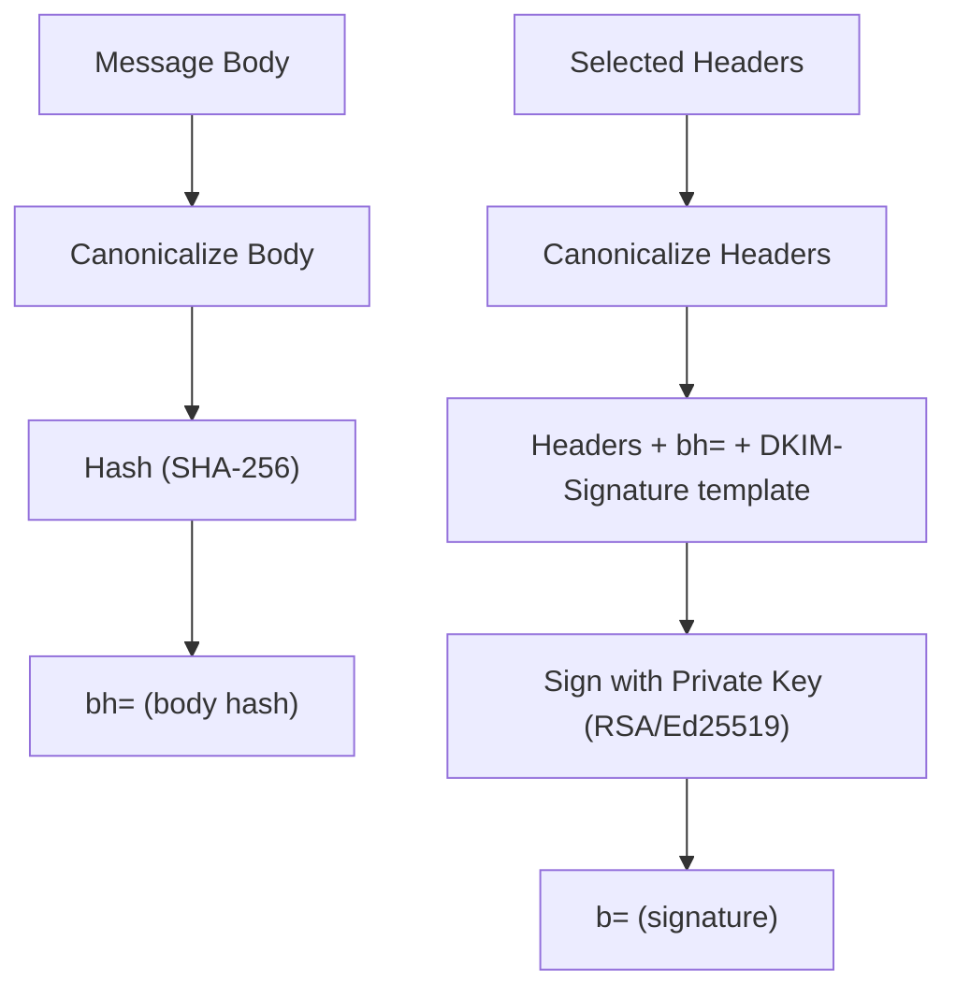

# DKIM (DomainKeys Identified Mail)

> **Standard:** [RFC 6376](https://www.rfc-editor.org/rfc/rfc6376) | **Layer:** Application (Layer 7) | **Wireshark filter:** N/A (DKIM is in email headers, verified by receiving server)

DKIM allows the sending domain to cryptographically sign email messages, proving that the message was authorized by the domain owner and has not been tampered with in transit. The sending server signs selected headers and the body with a private key; the receiving server retrieves the corresponding public key from DNS (a TXT record) and verifies the signature. DKIM survives forwarding (unlike SPF) because the signature travels with the message.

## How DKIM Works

```mermaid
sequenceDiagram
  participant S as Sending Server
  participant R as Receiving Server
  participant DNS as DNS

  Note over S: Sign message with private key
  S->>R: Email with DKIM-Signature header

  Note over R: Extract d= and s= from DKIM-Signature
  R->>DNS: TXT selector._domainkey.example.com?
  DNS->>R: "v=DKIM1; k=rsa; p=MIGfMA0GCS..."
  Note over R: Verify signature with public key
  Note over R: Signature valid → DKIM PASS
```

## DKIM-Signature Header

```
DKIM-Signature: v=1; a=rsa-sha256; c=relaxed/relaxed;
  d=example.com; s=selector1;
  h=from:to:subject:date:message-id;
  bh=2jUSOH9NhtVGCQWNr9BrIAPreKQjO6Sn7XIkfJVOzv8=;
  b=AuUoFEfDxTDkHlLXSZEpZj79LICEps6eda7W3deTVFOk2P...
```

## Key Fields

| Tag | Required | Description |
|-----|----------|-------------|
| `v` | Yes | Version (always `1`) |
| `a` | Yes | Signing algorithm (`rsa-sha256` or `ed25519-sha256`) |
| `d` | Yes | Signing domain (the domain claiming responsibility) |
| `s` | Yes | Selector (identifies which key in DNS) |
| `h` | Yes | Signed header fields (colon-separated list) |
| `b` | Yes | Signature data (Base64-encoded) |
| `bh` | Yes | Body hash (Base64-encoded hash of the canonicalized body) |
| `c` | No | Canonicalization method for header/body (`relaxed/relaxed`, `simple/simple`) |
| `l` | No | Body length limit (how many bytes of body were signed) |
| `t` | No | Signature timestamp (Unix epoch) |
| `x` | No | Signature expiration timestamp |
| `i` | No | Agent or user identifier (defaults to `@d`) |
| `q` | No | Query method for key retrieval (default `dns/txt`) |

## DNS Public Key Record

Published at `<selector>._domainkey.<domain>`:

```
selector1._domainkey.example.com. IN TXT "v=DKIM1; k=rsa; p=MIGfMA0GCSqGSIb3DQEBAQUAA4..."
```

| Tag | Description |
|-----|-------------|
| `v` | Version (`DKIM1`) |
| `k` | Key type (`rsa` or `ed25519`) |
| `p` | Public key (Base64-encoded; empty = key revoked) |
| `t` | Flags (`y` = testing mode, `s` = strict alignment) |
| `h` | Acceptable hash algorithms |
| `n` | Notes (human-readable) |
| `s` | Service type (`*` = all, `email` = email only) |

## Canonicalization

Canonicalization normalizes the message before signing to survive minor transit modifications:

| Method | Headers | Body |
|--------|---------|------|
| `simple` | No modifications | No modifications (except trailing empty lines) |
| `relaxed` | Lowercase names, unfold lines, compress whitespace | Compress whitespace, remove trailing whitespace, remove trailing empty lines |

`relaxed/relaxed` is the most common choice — it tolerates minor reformatting by intermediate servers.

## Signing Process



## Verification Process

1. Extract `d=` (domain) and `s=` (selector) from DKIM-Signature
2. Fetch public key from DNS: `<s>._domainkey.<d>`
3. Canonicalize the body and compute hash; compare with `bh=`
4. Canonicalize the signed headers + DKIM-Signature (without `b=` value)
5. Verify the `b=` signature with the public key
6. Result: **pass**, **fail**, **temperror**, or **permerror**

## Key Rotation

Selectors enable key rotation without downtime:

| Step | Action |
|------|--------|
| 1 | Generate new key pair, publish as a new selector in DNS |
| 2 | Configure sending server to sign with the new selector |
| 3 | Wait for DNS propagation + message delivery time |
| 4 | Remove old selector from DNS |

Multiple selectors can coexist — receiving servers use the selector from each message's DKIM-Signature.

## DKIM vs SPF

| Feature | SPF | DKIM |
|---------|-----|------|
| What it checks | Sending server IP | Message content signature |
| Survives forwarding | No (different IP) | Yes (signature travels with message) |
| Detects tampering | No | Yes (body and headers are signed) |
| Where it's checked | MAIL FROM domain | DKIM-Signature `d=` domain |
| DNS record | TXT on domain | TXT on selector._domainkey.domain |

## Standards

| Document | Title |
|----------|-------|
| [RFC 6376](https://www.rfc-editor.org/rfc/rfc6376) | DomainKeys Identified Mail (DKIM) Signatures |
| [RFC 6377](https://www.rfc-editor.org/rfc/rfc6377) | DKIM and Mailing Lists |
| [RFC 8463](https://www.rfc-editor.org/rfc/rfc8463) | Ed25519 Signatures for DKIM |
| [RFC 8301](https://www.rfc-editor.org/rfc/rfc8301) | DKIM Cryptographic Algorithm Updates |

## See Also

- [SPF](spf.md) — IP-based sender authorization
- [DMARC](dmarc.md) — policy framework combining SPF and DKIM
- [DANE](dane.md) — certificate pinning via DNSSEC
- [SMTP](smtp.md) — email transport
- [DNS](../naming/dns.md) — public key published as DNS TXT record
