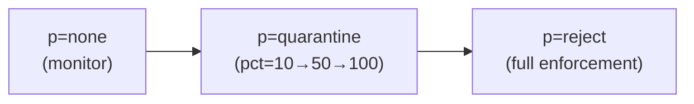
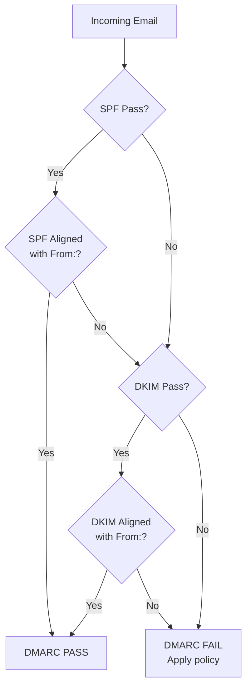

# DMARC (Domain-based Message Authentication, Reporting, and Conformance)

> **Standard:** [RFC 7489](https://www.rfc-editor.org/rfc/rfc7489) | **Layer:** Application (Layer 7) | **Wireshark filter:** `dns` (DMARC is a DNS TXT record + email policy)

DMARC ties SPF and DKIM together into a policy framework, telling receiving servers what to do when email fails authentication and providing a reporting mechanism so domain owners can see who is sending email using their domain. DMARC solves the critical gap that SPF and DKIM leave open: neither alone verifies that the From: header address (what the user sees) matches the authenticated domain. DMARC adds **identifier alignment** — the From: domain must match the SPF or DKIM authenticated domain.

## How DMARC Works

```mermaid
sequenceDiagram
  participant S as Sending Server
  participant R as Receiving Server
  participant DNS as DNS

  S->>R: Email (From: alice@example.com)

  Note over R: Step 1: Check SPF
  R->>DNS: TXT example.com? (SPF)
  DNS->>R: SPF record
  Note over R: SPF result: pass/fail

  Note over R: Step 2: Check DKIM
  R->>DNS: TXT selector._domainkey.example.com?
  DNS->>R: DKIM public key
  Note over R: DKIM result: pass/fail

  Note over R: Step 3: Check DMARC
  R->>DNS: TXT _dmarc.example.com?
  DNS->>R: "v=DMARC1; p=reject; rua=mailto:dmarc@example.com"

  Note over R: Step 4: Alignment check
  Note over R: From: domain must match SPF domain OR DKIM d= domain
  Note over R: Apply policy: none / quarantine / reject
```

## DMARC Record

Published as a DNS TXT record at `_dmarc.<domain>`:

```
_dmarc.example.com. IN TXT "v=DMARC1; p=reject; sp=quarantine; rua=mailto:dmarc-reports@example.com; ruf=mailto:dmarc-forensic@example.com; adkim=r; aspf=r; pct=100"
```

## Key Tags

| Tag | Required | Description |
|-----|----------|-------------|
| `v` | Yes | Version (always `DMARC1`) |
| `p` | Yes | Policy for the domain |
| `sp` | No | Policy for subdomains (defaults to `p`) |
| `rua` | No | Aggregate report destination (mailto: URI) |
| `ruf` | No | Forensic/failure report destination (mailto: URI) |
| `adkim` | No | DKIM alignment mode: `r` = relaxed (default), `s` = strict |
| `aspf` | No | SPF alignment mode: `r` = relaxed (default), `s` = strict |
| `pct` | No | Percentage of messages to apply policy to (0-100, default 100) |
| `fo` | No | Failure reporting options |
| `rf` | No | Forensic report format (default `afrf`) |
| `ri` | No | Aggregate report interval in seconds (default 86400 = 24h) |

## Policy Values

| Policy | Action |
|--------|--------|
| `none` | Monitor only — deliver and report (deployment phase) |
| `quarantine` | Treat as suspicious — deliver to spam/junk |
| `reject` | Reject the message outright (strongest) |

### Recommended Deployment Path



1. Start with `p=none` and collect reports to identify all legitimate sending sources
2. Add SPF and DKIM for all legitimate sources
3. Move to `p=quarantine` with low `pct` and gradually increase
4. Move to `p=reject` once confident all legitimate mail passes

## Identifier Alignment

DMARC requires that the From: header domain aligns with at least one authenticated domain:

| Check | Alignment | Passes When |
|-------|-----------|-------------|
| SPF alignment | From: domain matches MAIL FROM domain | `relaxed`: organizational domain match; `strict`: exact match |
| DKIM alignment | From: domain matches DKIM `d=` domain | `relaxed`: organizational domain match; `strict`: exact match |

**Relaxed** alignment: `mail.example.com` aligns with `example.com`
**Strict** alignment: `mail.example.com` does NOT align with `example.com`

DMARC **passes** if either SPF or DKIM passes with alignment.

## DMARC Evaluation



## Aggregate Reports (rua)

Receiving servers send daily XML reports (gzipped) to the `rua` address:

| Report Field | Description |
|-------------|-------------|
| Report metadata | Reporter, date range, policy published |
| Policy published | The DMARC record at time of evaluation |
| Records | Per-source-IP results: count, SPF result, DKIM result, disposition |

### Example Report Record

```xml
<record>
  <row>
    <source_ip>203.0.113.10</source_ip>
    <count>1542</count>
    <policy_evaluated>
      <disposition>none</disposition>
      <dkim>pass</dkim>
      <spf>pass</spf>
    </policy_evaluated>
  </row>
  <identifiers>
    <header_from>example.com</header_from>
  </identifiers>
  <auth_results>
    <dkim><domain>example.com</domain><result>pass</result></dkim>
    <spf><domain>example.com</domain><result>pass</result></spf>
  </auth_results>
</record>
```

## Authentication-Results Header

Receiving servers add this header for downstream filters:

```
Authentication-Results: mx.receiver.com;
  dmarc=pass (p=reject dis=none) header.from=example.com;
  dkim=pass header.d=example.com header.s=selector1;
  spf=pass smtp.mailfrom=example.com
```

## Standards

| Document | Title |
|----------|-------|
| [RFC 7489](https://www.rfc-editor.org/rfc/rfc7489) | DMARC |
| [RFC 7208](https://www.rfc-editor.org/rfc/rfc7208) | SPF (dependency) |
| [RFC 6376](https://www.rfc-editor.org/rfc/rfc6376) | DKIM (dependency) |
| [RFC 7601](https://www.rfc-editor.org/rfc/rfc7601) | Message Header Field for Authentication Results |

## See Also

- [SPF](spf.md) — IP-based sender authorization
- [DKIM](dkim.md) — cryptographic message signing
- [DANE](dane.md) — TLS certificate pinning via DNSSEC
- [SMTP](smtp.md) — email transport
- [DNS](../naming/dns.md) — DMARC records are DNS TXT records
