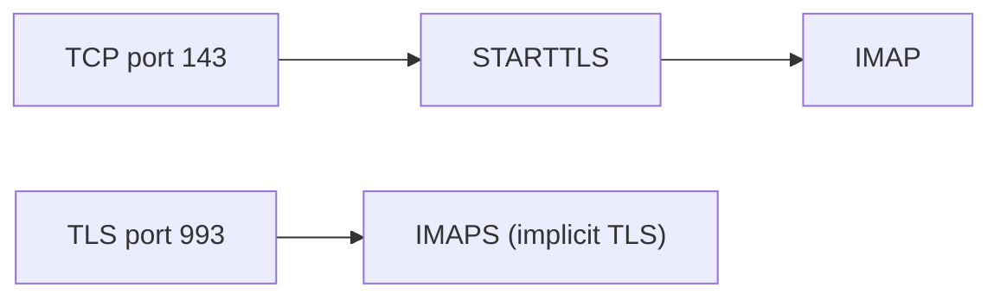

# IMAP (Internet Message Access Protocol)

> **Standard:** [RFC 9051](https://www.rfc-editor.org/rfc/rfc9051) | **Layer:** Application (Layer 7) | **Wireshark filter:** `imap`

IMAP is the standard protocol for accessing email stored on a mail server. Unlike POP3 (which downloads and typically deletes messages), IMAP keeps mail on the server and synchronizes state across multiple clients — read/unread flags, folders, and search all work consistently whether you check email from your phone, laptop, or webmail. IMAP supports multiple mailboxes (folders), server-side search, partial message fetch, and concurrent access. It is the protocol behind virtually every modern email client.

## Commands

IMAP commands are prefixed with a client-generated tag (e.g., `a001`) that matches responses to requests:

| Command | Arguments | Description |
|---------|-----------|-------------|
| LOGIN | user password | Authenticate with plaintext credentials |
| AUTHENTICATE | mechanism | SASL authentication (PLAIN, XOAUTH2, etc.) |
| STARTTLS | — | Upgrade to TLS encryption |
| SELECT | mailbox | Open a mailbox (read-write) |
| EXAMINE | mailbox | Open a mailbox (read-only) |
| LIST | reference pattern | List available mailboxes |
| CREATE | mailbox | Create a new mailbox |
| DELETE | mailbox | Delete a mailbox |
| RENAME | old new | Rename a mailbox |
| SUBSCRIBE | mailbox | Add to subscribed list |
| STATUS | mailbox (items) | Get mailbox status (MESSAGES, UNSEEN, etc.) |
| FETCH | sequence items | Retrieve message data |
| STORE | sequence flags | Set/clear message flags |
| SEARCH | criteria | Search for messages matching criteria |
| COPY | sequence mailbox | Copy messages to another mailbox |
| MOVE | sequence mailbox | Move messages to another mailbox |
| EXPUNGE | — | Permanently remove messages flagged \Deleted |
| CLOSE | — | Close mailbox and expunge |
| IDLE | — | Wait for server-push notifications (RFC 2177) |
| NOOP | — | Keepalive / check for new mail |
| LOGOUT | — | End the session |
| CAPABILITY | — | List supported extensions |
| APPEND | mailbox message | Upload a message to a mailbox |
| UID | command args | Use UIDs instead of sequence numbers |

## Response Types

| Prefix | Meaning |
|--------|---------|
| `*` | Untagged response (server-initiated data) |
| `+` | Command continuation (server needs more data) |
| `tag OK` | Command succeeded |
| `tag NO` | Command failed (operational error) |
| `tag BAD` | Command error (protocol/syntax error) |

## Session Flow

```
S: * OK [CAPABILITY IMAP4rev2 STARTTLS AUTH=PLAIN] IMAP ready
C: a001 STARTTLS
S: a001 OK Begin TLS negotiation
  [TLS handshake]
C: a002 LOGIN alice secret
S: a002 OK LOGIN completed
C: a003 SELECT INBOX
S: * 172 EXISTS
S: * 1 RECENT
S: * FLAGS (\Answered \Flagged \Deleted \Seen \Draft)
S: * OK [UIDVALIDITY 1234567890]
S: a003 OK [READ-WRITE] SELECT completed
C: a004 FETCH 170:172 (FLAGS ENVELOPE)
S: * 170 FETCH (FLAGS (\Seen) ENVELOPE ("Mon, 17 Mar 2026..." ...))
S: * 171 FETCH (FLAGS () ENVELOPE ("Tue, 18 Mar 2026..." ...))
S: * 172 FETCH (FLAGS (\Recent) ENVELOPE ("Wed, 19 Mar 2026..." ...))
S: a004 OK FETCH completed
C: a005 STORE 171 +FLAGS (\Seen)
S: * 171 FETCH (FLAGS (\Seen))
S: a005 OK STORE completed
C: a006 LOGOUT
S: * BYE IMAP server closing connection
S: a006 OK LOGOUT completed
```

## Message Flags

| Flag | Description |
|------|-------------|
| \Seen | Message has been read |
| \Answered | Message has been replied to |
| \Flagged | Message is flagged/starred |
| \Deleted | Message marked for deletion (expunged later) |
| \Draft | Message is a draft |
| \Recent | Message arrived since last session (read-only) |

## FETCH Data Items

| Item | Description |
|------|-------------|
| BODY[] | Full message (headers + body) |
| BODY[HEADER] | Headers only |
| BODY[TEXT] | Body only |
| BODY[1] | First MIME part |
| BODYSTRUCTURE | MIME structure without downloading content |
| ENVELOPE | Parsed header fields (From, To, Subject, Date, etc.) |
| FLAGS | Message flags |
| RFC822.SIZE | Message size in bytes |
| UID | Unique Identifier (persistent across sessions) |
| INTERNALDATE | Date the server received the message |

## IMAP vs POP3

| Feature | IMAP | POP3 |
|---------|------|------|
| Mail storage | Server (synced) | Downloaded to client |
| Folders | Full server-side folder support | Inbox only |
| Multi-client | Yes — all clients see same state | Conflicts between clients |
| Server-side search | Yes | No |
| Partial fetch | Yes (MIME parts, ranges) | Full message only |
| Flags | Synced across clients | Local only |
| Offline | Cached locally | Full local copy |
| Bandwidth | Efficient (fetch only what's needed) | Downloads everything |
| Port | 143 (STARTTLS), 993 (implicit TLS) | 110 (STARTTLS), 995 (implicit TLS) |

## Common Extensions

| Extension | RFC | Description |
|-----------|-----|-------------|
| IDLE | RFC 2177 | Push notifications (no polling) |
| CONDSTORE | RFC 7162 | Conditional store with mod-sequences |
| QRESYNC | RFC 7162 | Quick resynchronization after reconnect |
| COMPRESS | RFC 4978 | DEFLATE compression |
| MOVE | RFC 6851 | Atomic move operation |
| SPECIAL-USE | RFC 6154 | Standard folder roles (Sent, Drafts, Trash, Junk) |
| LITERAL+ | RFC 7888 | Non-synchronizing literals |
| NOTIFY | RFC 5465 | Advanced event notifications |

## Encapsulation



## Standards

| Document | Title |
|----------|-------|
| [RFC 9051](https://www.rfc-editor.org/rfc/rfc9051) | Internet Message Access Protocol (IMAP) Version 4rev2 |
| [RFC 3501](https://www.rfc-editor.org/rfc/rfc3501) | IMAP Version 4rev1 (widely deployed) |
| [RFC 2177](https://www.rfc-editor.org/rfc/rfc2177) | IMAP IDLE Command |
| [RFC 7162](https://www.rfc-editor.org/rfc/rfc7162) | CONDSTORE and QRESYNC Extensions |
| [RFC 6154](https://www.rfc-editor.org/rfc/rfc6154) | IMAP LIST Extension for Special-Use Mailboxes |

## See Also

- [SMTP](smtp.md) — sends email (IMAP retrieves it)
- [TCP](../transport-layer/tcp.md)
- [TLS](../security/tls.md) — encrypts IMAP connections
- [DNS](../naming/dns.md) — SRV records for IMAP server auto-discovery
