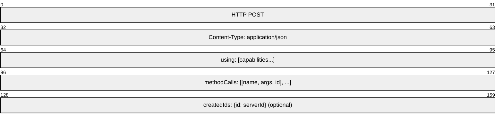
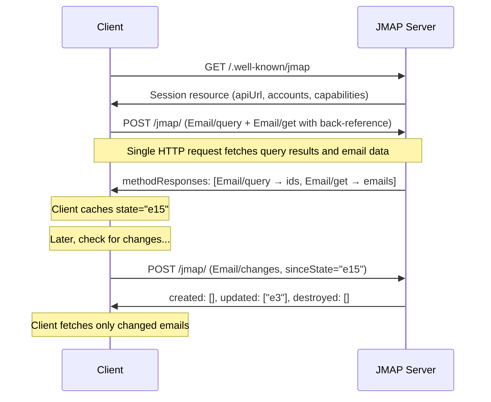
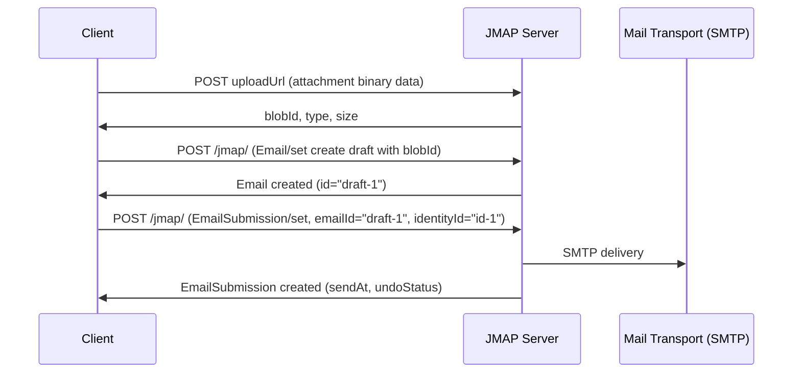
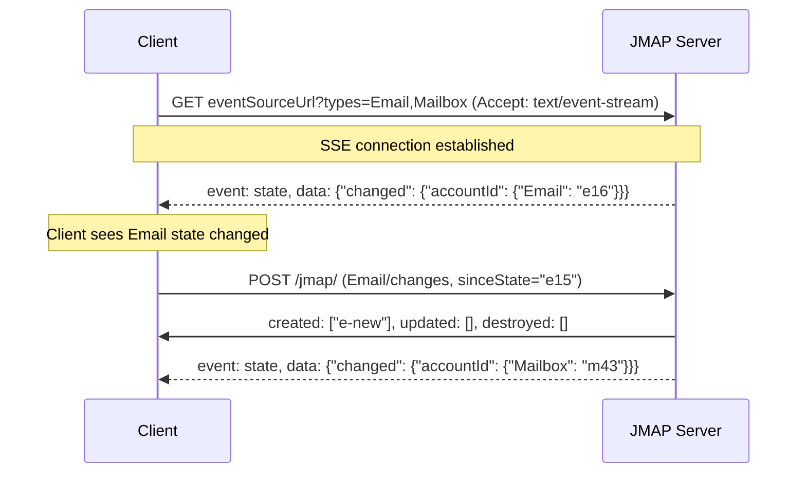
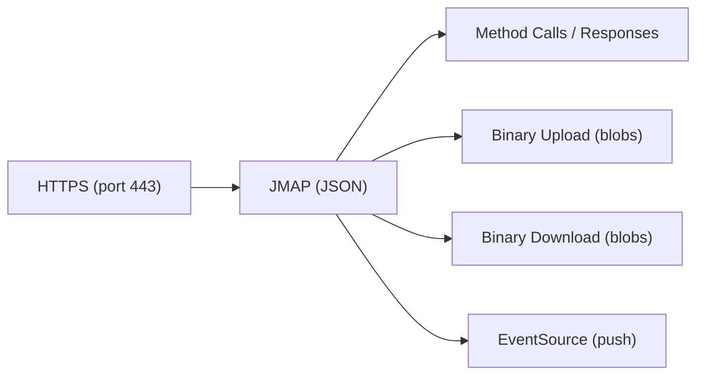

# JMAP (JSON Meta Application Protocol)

> **Standard:** [RFC 8620](https://www.rfc-editor.org/rfc/rfc8620) / [RFC 8621](https://www.rfc-editor.org/rfc/rfc8621) | **Layer:** Application (Layer 7) | **Wireshark filter:** `http` or `http2` (JSON over HTTPS)

JMAP is a modern, HTTP-based protocol designed as a replacement for IMAP. It uses JSON over HTTPS instead of a custom text protocol, making it simpler to implement in web and mobile clients. JMAP supports efficient synchronization (delta updates via /changes), batched method calls in a single HTTP request, push notifications via Server-Sent Events, and binary upload/download for attachments. It eliminates the statefulness, complexity, and bandwidth inefficiency of IMAP while providing equivalent functionality.

## Request Structure

All JMAP operations are sent as a single HTTP POST to the API endpoint:

```
POST /jmap/ HTTP/1.1
Content-Type: application/json
Authorization: Bearer <token>
```



### Request Body

```json
{
  "using": [
    "urn:ietf:params:jmap:core",
    "urn:ietf:params:jmap:mail"
  ],
  "methodCalls": [
    ["Mailbox/get", {"accountId": "abc", "ids": null}, "call-0"],
    ["Email/query", {"accountId": "abc", "filter": {"inMailbox": "inbox-id"}}, "call-1"],
    ["Email/get", {"accountId": "abc", "#ids": {"resultOf": "call-1", "name": "Email/query", "path": "/ids"}}, "call-2"]
  ]
}
```

### Response Body

```json
{
  "methodResponses": [
    ["Mailbox/get", {"accountId": "abc", "list": [...], "state": "m42"}, "call-0"],
    ["Email/query", {"accountId": "abc", "ids": ["e1","e2"], "queryState": "q7"}, "call-1"],
    ["Email/get", {"accountId": "abc", "list": [...], "state": "e15"}, "call-2"]
  ],
  "sessionState": "s3"
}
```

## Method Calls

| Method | Description |
|--------|-------------|
| Mailbox/get | Retrieve mailbox properties (name, role, counts) |
| Mailbox/query | Search/filter mailboxes |
| Mailbox/set | Create, update, or destroy mailboxes |
| Mailbox/changes | Get mailbox changes since a given state |
| Email/get | Retrieve email properties (subject, from, body, etc.) |
| Email/query | Search/filter emails (by mailbox, date, keyword, text) |
| Email/set | Create, update (move, flag), or destroy emails |
| Email/changes | Get email changes since a given state |
| Email/queryChanges | Get changes to a previous query result |
| Email/copy | Copy emails between accounts |
| EmailSubmission/set | Submit an email for sending via SMTP |
| Thread/get | Retrieve conversation threads |
| Thread/changes | Get thread changes since a given state |
| Identity/get | Retrieve sender identities |
| SearchSnippet/get | Get highlighted search result snippets |

## Session Resource

The JMAP session is discovered via a well-known URL (`/.well-known/jmap`) and provides:

| Field | Description |
|-------|-------------|
| username | Authenticated user's username |
| accounts | Map of account IDs to account objects (name, capabilities) |
| capabilities | Server capabilities and limits |
| apiUrl | URL for JMAP API requests |
| uploadUrl | URL template for binary uploads |
| downloadUrl | URL template for binary downloads |
| eventSourceUrl | URL for push notifications (Server-Sent Events) |
| state | Session state string (changes when session config changes) |

## Key Fields

| Field | Description |
|-------|-------------|
| using | Array of capability URIs the request requires |
| methodCalls | Array of [methodName, arguments, callId] triples |
| methodResponses | Array of [methodName, response, callId] triples |
| accountId | Target account for the method call |
| ids | Array of object IDs to retrieve (null = all) |
| state | Opaque state string for synchronization |
| #ids (back-reference) | Reference the result of a previous method call in the same request |
| filter | Filter conditions for /query methods |
| sort | Sort criteria for /query methods |
| position / anchor | Pagination for /query results |

## Email Fetch Flow



## Email Send Flow



## Push Notifications



Push mechanisms:
| Method | Description |
|--------|-------------|
| EventSource (SSE) | Long-lived HTTP connection; server sends state change events |
| Web Push (RFC 8030) | Push notifications via push service (for mobile/background) |

## Efficient Sync

JMAP eliminates IMAP's resync overhead with state-based delta updates:

| Method | Purpose |
|--------|---------|
| Foo/changes | Returns created, updated, destroyed IDs since a given state |
| Foo/queryChanges | Returns additions/removals from a previous query result |

The client stores the state string from each response and provides it as `sinceState` on the next sync. The server returns only what changed.

## JMAP vs IMAP

| Feature | JMAP | IMAP |
|---------|------|------|
| Transport | HTTPS (standard port 443) | Custom TCP (port 143/993) |
| Data format | JSON | Custom text protocol |
| Connection model | Stateless HTTP requests | Stateful persistent connection |
| Batching | Multiple method calls per request | One command at a time |
| Sync | /changes and /queryChanges (delta) | Full re-fetch or CONDSTORE/QRESYNC |
| Push | EventSource (SSE) or Web Push | IDLE (holds connection open) |
| Binary data | Upload/download URLs | LITERAL inline or BINARY extension |
| Firewall friendly | Standard HTTPS (port 443) | Requires port 143/993 |
| Back-references | Yes (chain method calls in one request) | No |
| Implementation | Simple (HTTP + JSON libraries) | Complex (custom parser, state machine) |
| Mobile battery | Efficient (stateless, push) | Poor (persistent connection, IDLE) |
| Partial fetch | Property selection in /get | BODY[section] and PARTIAL |

## Encapsulation



## Standards

| Document | Title |
|----------|-------|
| [RFC 8620](https://www.rfc-editor.org/rfc/rfc8620) | The JSON Meta Application Protocol (JMAP) |
| [RFC 8621](https://www.rfc-editor.org/rfc/rfc8621) | JMAP for Mail |
| [RFC 8887](https://www.rfc-editor.org/rfc/rfc8887) | JMAP Subprotocol for WebSocket |
| [RFC 9007](https://www.rfc-editor.org/rfc/rfc9007) | Handling Message Disposition Notification with JMAP |
| [jmap.io](https://jmap.io/) | JMAP community resources and specifications |

## See Also

- [IMAP](imap.md) -- the protocol JMAP is designed to replace
- [SMTP](smtp.md) -- JMAP uses EmailSubmission to trigger SMTP delivery
- [HTTP](../web/http.md) -- JMAP transport
- [SSE](../web/sse.md) -- Server-Sent Events for JMAP push notifications
