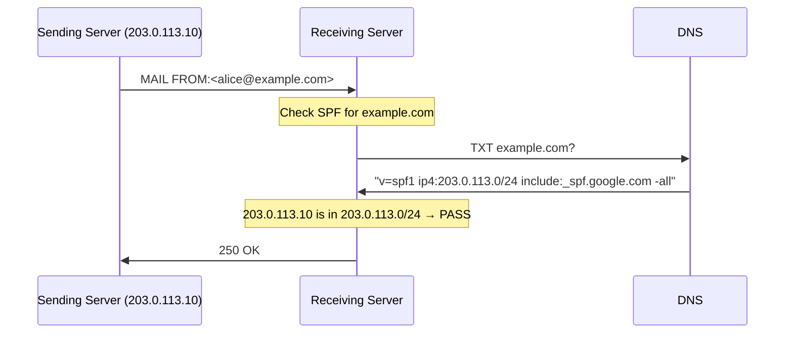

# SPF (Sender Policy Framework)

> **Standard:** [RFC 7208](https://www.rfc-editor.org/rfc/rfc7208) | **Layer:** Application (Layer 7) | **Wireshark filter:** `dns` (SPF is published as DNS TXT records)

SPF is an email authentication mechanism that allows domain owners to specify which mail servers are authorized to send email on behalf of their domain. It works by publishing a DNS TXT record listing the permitted sending IP addresses. When a receiving mail server gets an email, it checks the SMTP envelope sender (MAIL FROM) domain's SPF record against the connecting server's IP address. SPF is one of the three pillars of email authentication alongside DKIM and DMARC.

## How SPF Works



## SPF Record Syntax

An SPF record is a DNS TXT record beginning with `v=spf1`:

```
v=spf1 ip4:203.0.113.0/24 ip6:2001:db8::/32 include:_spf.google.com -all
```

### Mechanisms

| Mechanism | Description | Example |
|-----------|-------------|---------|
| `ip4` | IPv4 address or CIDR range | `ip4:203.0.113.0/24` |
| `ip6` | IPv6 address or CIDR range | `ip6:2001:db8::/32` |
| `a` | Domain's A/AAAA records | `a:mail.example.com` |
| `mx` | Domain's MX records | `mx` |
| `include` | Include another domain's SPF policy | `include:_spf.google.com` |
| `exists` | Check if a DNS A record exists | `exists:%{i}.spf.example.com` |
| `all` | Match everything (usually at the end) | `-all` |
| `redirect` | Use another domain's SPF entirely | `redirect=_spf.example.com` |

### Qualifiers

| Qualifier | Result | Meaning |
|-----------|--------|---------|
| `+` (default) | Pass | Authorized sender |
| `-` | Fail (hard fail) | Unauthorized — reject |
| `~` | SoftFail | Probably unauthorized — accept but mark |
| `?` | Neutral | No assertion |

### Results

| Result | Action |
|--------|--------|
| Pass | IP is authorized — deliver normally |
| Fail | IP is not authorized — reject or quarantine |
| SoftFail | IP is probably not authorized — accept but flag |
| Neutral | Domain makes no assertion |
| None | No SPF record found |
| TempError | DNS lookup failed — try later |
| PermError | SPF record is malformed |

## Common SPF Records

| Provider | SPF Include |
|----------|-------------|
| Google Workspace | `include:_spf.google.com` |
| Microsoft 365 | `include:spf.protection.outlook.com` |
| Amazon SES | `include:amazonses.com` |
| Mailchimp | `include:servers.mcsv.net` |
| SendGrid | `include:sendgrid.net` |

## Limitations

| Limitation | Description |
|------------|-------------|
| DNS lookup limit | Max 10 DNS lookups (includes, a, mx, exists, redirect) |
| Forwarding breaks SPF | Forwarded email comes from a different IP than the original sender |
| Only checks envelope sender | Does not verify the From: header (that's DMARC's job) |
| No content integrity | Does not sign or verify the message body (that's DKIM) |

## Standards

| Document | Title |
|----------|-------|
| [RFC 7208](https://www.rfc-editor.org/rfc/rfc7208) | Sender Policy Framework (SPF) |
| [RFC 7372](https://www.rfc-editor.org/rfc/rfc7372) | Email Authentication Status Codes |

## See Also

- [DKIM](dkim.md) — cryptographic email signing
- [DMARC](dmarc.md) — policy framework that ties SPF and DKIM together
- [DANE](dane.md) — certificate pinning via DNS
- [SMTP](smtp.md) — the email transport SPF protects
- [DNS](../naming/dns.md) — SPF records are DNS TXT records
