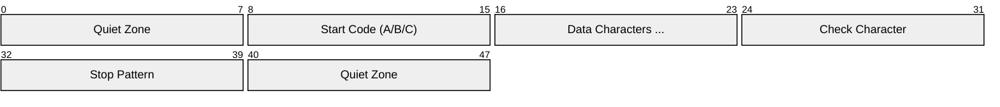

# Code 128

> **Standard:** [ISO/IEC 15417:2007](https://www.iso.org/standard/43896.html) | **Category:** 1D Linear Barcode / Symbology

Code 128 is a high-density alphanumeric barcode capable of encoding all 128 ASCII characters. It is widely used in shipping labels (GS1-128), logistics, inventory management, and any application requiring compact alphanumeric or numeric barcodes. Code 128 uses three character sets (A, B, C) and can switch between them mid-barcode for optimal density — Code Set C encodes digit pairs in a single symbol, making it extremely compact for numeric data.

## Structure



Each character is encoded as 3 bars and 3 spaces within 11 modules (the stop pattern uses 13 modules including the final bar).

## Character Sets

| Set | Start Code | Characters | Best For |
|-----|-----------|------------|----------|
| Code A | 103 | ASCII 0-95 (uppercase, control chars, digits) | Uppercase + control characters |
| Code B | 104 | ASCII 32-127 (upper + lowercase, digits) | Mixed case text |
| Code C | 105 | Digit pairs 00-99 | Dense numeric data (5.5 digits/cm) |

### Switching Between Sets

| Code | From | To | Description |
|------|------|----|-------------|
| 98 | A or B | A or B | Shift (next character only from the other set) |
| 99 | A or B | C | Switch to Code C |
| 100 | A or C | B | Switch to Code B |
| 101 | B or C | A | Switch to Code A |

### Special Codes

| Value | Name | Description |
|-------|------|-------------|
| 102 | FNC1 | GS1-128 application identifier prefix |
| 96 | FNC2 | Message append |
| 97 | FNC3 | Reader initialization |
| 103 | START A | Begin with Code Set A |
| 104 | START B | Begin with Code Set B |
| 105 | START C | Begin with Code Set C |
| 106 | STOP | End of barcode |

## Check Digit Calculation

Weighted modulo 103 checksum:

1. Start with the start code value
2. Add each data character value × its position (1-indexed)
3. Result mod 103 = check character value

### Example: "Code128"

```
START B (104) × 1 = 104 (position weight for start is just its value)
'C' (35) × 1 = 35
'o' (79) × 2 = 158
'd' (68) × 3 = 204
'e' (69) × 4 = 276
'1' (17) × 5 = 85
'2' (18) × 6 = 108
'8' (24) × 7 = 168

Sum = 104 + 35 + 158 + 204 + 276 + 85 + 108 + 168 = 1138
Check = 1138 mod 103 = 5 (character '%' in Code B)
```

## GS1-128 (formerly UCC/EAN-128)

GS1-128 uses Code 128 with FNC1 as the first character to signal GS1 Application Identifiers:

```
[FNC1] (01) 00012345678905 (17) 260401 (10) ABC123
```

### Common Application Identifiers

| AI | Name | Format | Example |
|----|------|--------|---------|
| (01) | GTIN | 14 digits | Product identifier |
| (10) | Batch/Lot | Variable (up to 20) | Production lot |
| (17) | Expiration date | YYMMDD | 260401 = April 1, 2026 |
| (21) | Serial number | Variable (up to 20) | Unique item serial |
| (310n) | Net weight (kg) | 6 digits | 310**3** 001500 = 1.500 kg |
| (37) | Count | Variable (up to 8) | Quantity in shipment |
| (400) | Purchase order | Variable (up to 30) | Customer PO number |

GS1-128 is the standard barcode on shipping labels, pallet labels, and pharmaceutical packaging.

## Code 128 vs Other 1D Barcodes

| Feature | Code 128 | Code 39 | UPC-A | Interleaved 2 of 5 |
|---------|----------|---------|-------|---------------------|
| Character set | Full ASCII | A-Z, 0-9, 7 symbols | Digits only | Digits only |
| Density | High | Low | Medium | Medium |
| Self-checking | No (check digit needed) | Yes | Yes | No |
| Variable length | Yes | Yes | Fixed (12) | Yes (even count) |
| GS1 use | GS1-128 | No | Retail POS | ITF-14 (cartons) |

## Standards

| Document | Title |
|----------|-------|
| [ISO/IEC 15417:2007](https://www.iso.org/standard/43896.html) | Code 128 bar code symbology specification |
| [GS1 General Specifications](https://www.gs1.org/standards/barcodes) | GS1-128 (Application Identifiers) |

## See Also

- [UPC / EAN](upc.md) — retail product barcodes
- [QR Code](qrcode.md) — 2D barcode with much higher capacity
- [Data Matrix](datamatrix.md) — 2D barcode for compact industrial marking
