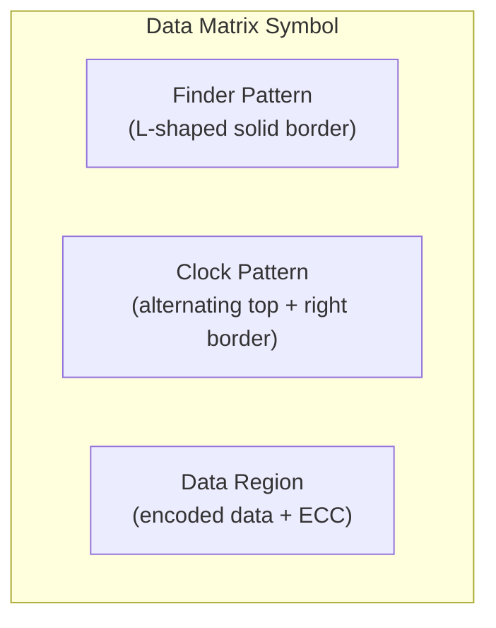

# Data Matrix

> **Standard:** [ISO/IEC 16022:2006](https://www.iso.org/standard/44230.html) | **Category:** 2D Matrix Barcode / Symbology

Data Matrix is a two-dimensional barcode consisting of black and white cells arranged in a square or rectangular pattern. It is widely used in industrial applications — electronics component marking (PCBs, ICs), pharmaceutical packaging (serialization), aerospace part tracking, and postal services (USPS, Royal Mail). Data Matrix can encode data in very small sizes (as small as 2-3mm) and is readable even when printed directly on parts via laser etching or ink-jet. The ECC200 variant (current standard) uses Reed-Solomon error correction.

## Structure



### Borders

| Border | Pattern | Purpose |
|--------|---------|---------|
| Left side | Solid dark modules | Finder pattern (orientation) |
| Bottom | Solid dark modules | Finder pattern (orientation) |
| Top | Alternating dark/light | Clock track (module counting) |
| Right side | Alternating dark/light | Clock track (module counting) |

The L-shaped finder pattern (solid left + bottom borders) allows scanners to determine symbol orientation. The alternating clock patterns (top + right borders) help determine the number of rows and columns.

## Symbol Sizes (ECC200)

### Square Symbols

| Size (modules) | Data Capacity (bytes) | ECC Codewords | Regions |
|---------------|----------------------|---------------|---------|
| 10×10 | 1 | 5 | 1 |
| 12×12 | 3 | 5 | 1 |
| 14×14 | 6 | 7 | 1 |
| 16×16 | 10 | 10 | 1 |
| 18×18 | 16 | 12 | 1 |
| 20×20 | 22 | 14 | 1 |
| 22×22 | 30 | 18 | 1 |
| 24×24 | 36 | 20 | 1 |
| 26×26 | 44 | 24 | 1 |
| 32×32 | 72 | 36 | 4 |
| 44×44 | 142 | 72 | 4 |
| 64×64 | 300 | 140 | 16 |
| 88×88 | 576 | 280 | 16 |
| 120×120 | 1,050 | 510 | 36 |
| 144×144 | 1,558 | 620 | 36 |

### Rectangular Symbols

| Size (modules) | Data Capacity (bytes) |
|---------------|----------------------|
| 8×18 | 5 |
| 8×32 | 10 |
| 12×26 | 16 |
| 12×36 | 22 |
| 16×36 | 32 |
| 16×48 | 49 |

## Data Capacity

| Encoding | Maximum Capacity (144×144) |
|----------|---------------------------|
| Numeric | 3,116 digits |
| Alphanumeric | 2,335 characters |
| Byte (ASCII) | 1,558 bytes |

## Encoding Modes

| Mode | Name | Efficiency | Description |
|------|------|-----------|-------------|
| ASCII | ASCII Encode | 1 byte per character | Default; digits encoded in pairs (5.5 bits/digit) |
| C40 | C40 Encode | 3 chars per 2 bytes | Uppercase + digits (common in industrial) |
| Text | Text Encode | 3 chars per 2 bytes | Lowercase + digits |
| X12 | ANSI X12 Encode | 3 chars per 2 bytes | EDI character set |
| EDIFACT | EDIFACT Encode | 4 chars per 3 bytes | UN/EDIFACT character set |
| Base 256 | Base 256 Encode | 1 byte per byte | Binary data |

The encoder automatically selects the most efficient mode and can switch modes mid-symbol.

## Error Correction (ECC200)

Data Matrix ECC200 uses **Reed-Solomon** error correction:

- Error correction capacity varies by symbol size (see table above)
- Can correct errors equal to half the number of ECC codewords
- Provides both error **detection** and **correction**
- ECC200 replaced older ECC000-140 (convolutional codes, now obsolete)

## GS1 Data Matrix

When used with GS1 Application Identifiers, Data Matrix carries a FNC1 character at the start, followed by AI-encoded data:

```
]d2 (01) 00012345678905 (17) 260401 (10) ABC123
```

The `]d2` symbology identifier indicates GS1 Data Matrix.

### Common Applications

| Application | AI Content | Example |
|-------------|-----------|---------|
| Pharmaceutical serialization | (01) GTIN + (21) Serial + (17) Expiry + (10) Lot | Drug package tracking |
| Electronics (PCB marking) | Part number, lot, date | Component traceability |
| Postal | Tracking number, routing | USPS Intelligent Mail barcode |
| Aerospace | Part number, serial, manufacturer | AS9132 part marking |
| Medical devices | (01) GTIN + (11) Production date + (21) Serial | UDI (Unique Device Identification) |

## Direct Part Marking (DPM)

Data Matrix is the preferred symbology for DPM — permanently marking parts:

| Method | Surface | Description |
|--------|---------|-------------|
| Laser etching | Metal, plastic | Ablates material to create contrast |
| Dot peen | Metal | Mechanical indentation (rounded modules) |
| Ink-jet | Any | High-resolution printed code |
| Chemical etch | Metal | Acid/electrochemical marking |

DPM codes often require specialized readers that handle low-contrast, textured, or curved surfaces.

## Data Matrix vs QR Code

| Feature | Data Matrix | QR Code |
|---------|-------------|---------|
| Finder pattern | L-shaped border | Three corner squares |
| Shape | Square or rectangular | Square only |
| Minimum size | 10×10 (1 byte) | 21×21 (17 bytes) |
| Maximum capacity | 1,558 bytes | 2,953 bytes |
| Small symbol performance | Better (smaller minimum) | Larger minimum |
| Industrial DPM | Dominant | Less common |
| Consumer use | Rare | Dominant |
| Licensing | Open standard | Open (originally patented, now free) |

## Standards

| Document | Title |
|----------|-------|
| [ISO/IEC 16022:2006](https://www.iso.org/standard/44230.html) | Data Matrix bar code symbology specification |
| [ISO/IEC 15415](https://www.iso.org/standard/65577.html) | 2D print quality (verification) |
| [GS1 DataMatrix Guideline](https://www.gs1.org/standards/gs1-datamatrix-guideline) | GS1 Application Identifiers in Data Matrix |
| [AIM DPM](https://www.aimglobal.org/) | Direct Part Marking quality guideline |

## See Also

- [QR Code](qrcode.md) — alternative 2D barcode (larger capacity, consumer-oriented)
- [UPC / EAN](upc.md) — 1D retail barcodes
- [Code 128](code128.md) — 1D alphanumeric barcode (GS1-128)
