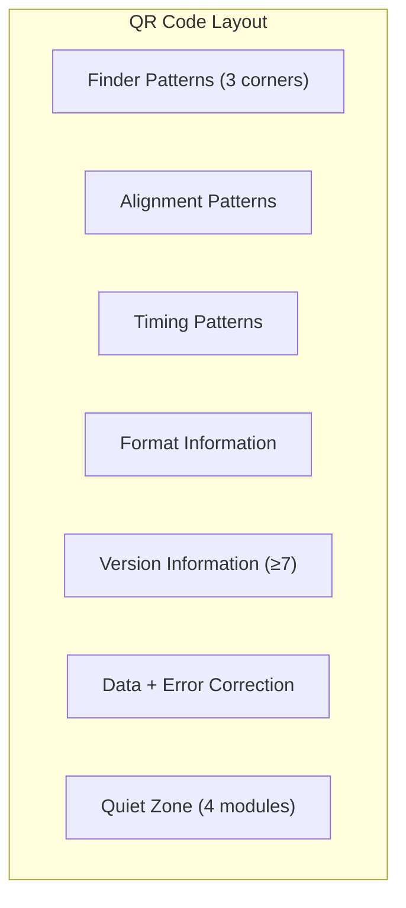
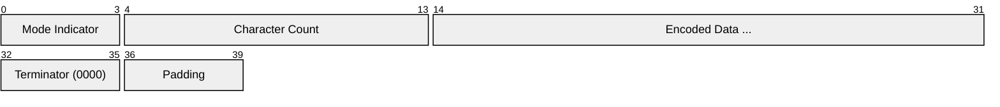

# QR Code (Quick Response Code)

> **Standard:** [ISO/IEC 18004:2015](https://www.iso.org/standard/62021.html) | **Category:** 2D Matrix Barcode / Symbology

QR Code is a two-dimensional matrix barcode developed by Denso Wave (Toyota subsidiary) in 1994 for tracking automotive parts. It encodes data in a grid of black and white modules (squares) that can be read by cameras from any orientation. QR codes are ubiquitous — used for URLs, Wi-Fi credentials, payment (Alipay, WeChat Pay, UPI), boarding passes, COVID certificates, contact cards (vCard), and authentication (TOTP setup). They support four encoding modes, four error correction levels, and can store up to 7,089 numeric characters or 4,296 alphanumeric characters.

## Structure



### Module Layout

| Component | Location | Purpose |
|-----------|----------|---------|
| Finder Patterns | Top-left, top-right, bottom-left corners | Detect position and orientation (3 nested squares) |
| Alignment Patterns | Grid positions (version 2+) | Correct for perspective distortion |
| Timing Patterns | Row 6 and column 6 | Alternating black/white for module coordinate calibration |
| Format Information | Adjacent to finder patterns | Error correction level + mask pattern (15 bits, BCH-encoded) |
| Version Information | Near top-right and bottom-left finders (v7+) | Version number (18 bits, Golay-encoded) |
| Data Region | Remaining modules | Encoded data + Reed-Solomon error correction |
| Quiet Zone | 4-module border around the symbol | Separation from surrounding content |

### Finder Pattern

Each finder pattern is a 7×7 module structure:

```
███████
█     █
█ ███ █
█ ███ █
█ ███ █
█     █
███████
```

The 1:1:3:1:1 ratio of dark-light-dark-light-dark is unique and detectable from any angle at any rotation.

## Encoding Modes

| Mode | Mode Indicator | Characters | Bits per Character | Character Set |
|------|---------------|------------|-------------------|---------------|
| Numeric | 0001 | 0-9 | 3.33 (10 bits per 3 digits) | Digits only |
| Alphanumeric | 0010 | 0-9, A-Z, space, $%*+-./:  | 5.5 (11 bits per 2 chars) | 45 characters |
| Byte | 0100 | Any | 8 | ISO 8859-1 or UTF-8 |
| Kanji | 1000 | Kanji/Kana | 13 (per character) | Shift JIS |
| ECI | 0111 | Any | Variable | Extended Channel Interpretation (specify charset) |

### Data Encoding Structure



Multiple mode segments can be concatenated in a single QR code for optimal encoding.

## Error Correction Levels

QR codes use [**Reed-Solomon**](https://en.wikipedia.org/wiki/Reed%E2%80%93Solomon_error_correction) error correction with four levels:

| Level | Recovery Capacity | Typical Use |
|-------|------------------|-------------|
| L (Low) | ~7% of codewords | Maximum data capacity |
| M (Medium) | ~15% of codewords | General purpose (default for most) |
| Q (Quartile) | ~25% of codewords | Industrial, moderate damage risk |
| H (High) | ~30% of codewords | Harsh environments, design QR codes with logos |

Higher error correction allows more damage/obstruction but reduces data capacity.

## Versions and Capacity

QR codes come in 40 versions (sizes):

| Version | Modules | Numeric (L) | Alphanumeric (L) | Byte (L) | Numeric (H) | Byte (H) |
|---------|---------|-------------|-------------------|----------|-------------|----------|
| 1 | 21×21 | 41 | 25 | 17 | 17 | 7 |
| 2 | 25×25 | 77 | 47 | 32 | 34 | 14 |
| 5 | 37×37 | 202 | 122 | 84 | 88 | 36 |
| 10 | 57×57 | 652 | 395 | 271 | 281 | 119 |
| 15 | 77×77 | 1,250 | 758 | 520 | 511 | 217 |
| 20 | 97×97 | 2,061 | 1,249 | 858 | 858 | 367 |
| 25 | 117×117 | 3,057 | 1,853 | 1,273 | 1,273 | 535 |
| 30 | 137×137 | 4,158 | 2,520 | 1,732 | 1,732 | 742 |
| 40 | 177×177 | 7,089 | 4,296 | 2,953 | 3,057 | 1,273 |

Size formula: **4 × version + 17** modules per side.

## Masking

After data placement, one of 8 mask patterns is applied (XORed with the data region) to avoid large areas of uniform color that confuse scanners. The pattern that produces the most balanced result is selected:

| Mask | Condition (module inverted when true) |
|------|--------------------------------------|
| 0 | (row + col) mod 2 == 0 |
| 1 | row mod 2 == 0 |
| 2 | col mod 3 == 0 |
| 3 | (row + col) mod 3 == 0 |
| 4 | (row/2 + col/3) mod 2 == 0 |
| 5 | (row×col) mod 2 + (row×col) mod 3 == 0 |
| 6 | ((row×col) mod 2 + (row×col) mod 3) mod 2 == 0 |
| 7 | ((row+col) mod 2 + (row×col) mod 3) mod 2 == 0 |

## Common Data Types

| Prefix | Data Type | Example |
|--------|-----------|---------|
| `http://` or `https://` | URL | `https://example.com` |
| `WIFI:` | Wi-Fi credentials | `WIFI:T:WPA;S:MyNetwork;P:password;;` |
| `BEGIN:VCARD` | Contact card | vCard format |
| `BEGIN:VEVENT` | Calendar event | iCalendar format |
| `MATMSG:` | Email | `MATMSG:TO:user@example.com;SUB:Hello;;` |
| `tel:` | Phone number | `tel:+15551234567` |
| `smsto:` | SMS | `smsto:+15551234567:Hello` |
| `otpauth://` | TOTP/HOTP setup | `otpauth://totp/user@example.com?secret=BASE32&issuer=Example` |
| `geo:` | Location | `geo:37.7749,-122.4194` |

## QR Code Variants

| Variant | Size | Modules | Use Case |
|---------|------|---------|----------|
| QR Code (standard) | Version 1-40 | 21-177 | General purpose |
| Micro QR | M1-M4 | 11-17 | Small labels (less data, one finder pattern) |
| iQR | — | Variable | Rectangular shapes, larger capacity |
| SQRC | — | Standard | Encrypted data (private + public areas) |
| Frame QR | — | Standard | Canvas area in center for images |

## Standards

| Document | Title |
|----------|-------|
| [ISO/IEC 18004:2015](https://www.iso.org/standard/62021.html) | QR Code bar code symbology specification |
| [AIM ITS/04-001](https://www.aimglobal.org/) | International symbology specification — QR Code |

## See Also

- [UPC / EAN](upc.md) — 1D barcodes for retail products
- [Data Matrix](datamatrix.md) — alternative 2D barcode (smaller, industrial)
- [Code 128](code128.md) — high-density 1D barcode
