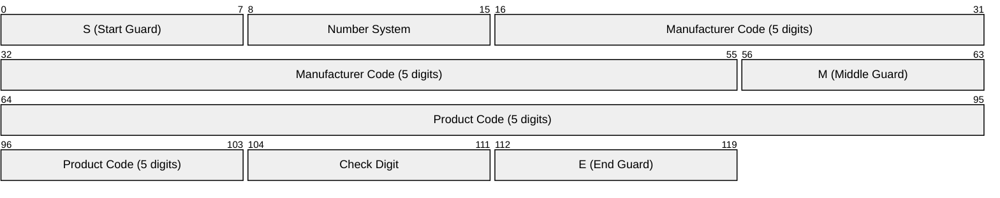
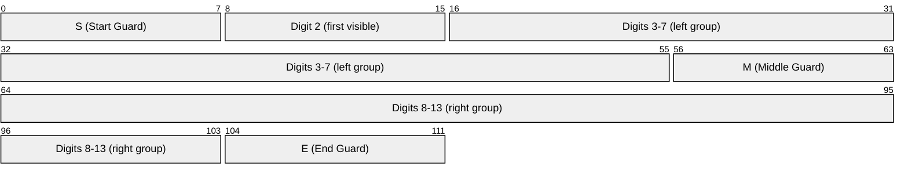
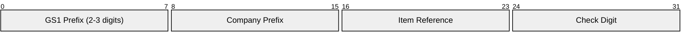

# UPC / EAN (Universal Product Code / European Article Number)

> **Standard:** [ISO/IEC 15420 (EAN/UPC)](https://www.iso.org/standard/46143.html) / [GS1 General Specifications](https://www.gs1.org/standards/barcodes) | **Category:** 1D Linear Barcode / Symbology

UPC and EAN are the barcode symbologies printed on virtually every retail product worldwide. UPC-A (12 digits, North America) and EAN-13 (13 digits, international) are the dominant formats. A scanner reads the pattern of bars and spaces to decode a numeric product identifier (GTIN), which is looked up in a database for price and product information. The system was introduced in 1974 and is managed by GS1.

## UPC-A Structure



### Bar Encoding

Each digit is encoded as a pattern of 2 bars and 2 spaces within 7 modules:

| Component | Bars/Spaces | Modules |
|-----------|-------------|---------|
| Start guard | bar-space-bar | 3 |
| Left digits (6) | 7 modules each | 42 |
| Middle guard | space-bar-space-bar-space | 5 |
| Right digits (6) | 7 modules each | 42 |
| End guard | bar-space-bar | 3 |
| **Total** | | **95 modules** |

### Left-Side Encoding (Odd Parity)

| Digit | Pattern (S=space, B=bar) | Binary |
|-------|--------------------------|--------|
| 0 | SSSBBSB | 0001101 |
| 1 | SSBBSSB | 0011001 |
| 2 | SSBSSBB | 0010011 |
| 3 | SBBBBSB | 0111101 |
| 4 | SBSSSBB | 0100011 |
| 5 | SBBSSAB | 0110001 |
| 6 | SBSBBBB | 0101111 |
| 7 | SBBBSBB | 0111011 |
| 8 | SBBSBBB | 0110111 |
| 9 | SSSBSBB | 0001011 |

Right-side digits use the complement (inverted) patterns.

## EAN-13 Structure

EAN-13 is a superset of UPC-A. The 13th digit (first digit) is encoded implicitly by varying the parity patterns of the left-side digits:



The first digit (country/region) determines which parity pattern (L or G) each left-side digit uses:

| First Digit | Left-Side Pattern (digits 2-7) |
|-------------|-------------------------------|
| 0 | LLLLLL (= UPC-A) |
| 1 | LLGLGG |
| 2 | LLGGLG |
| 3 | LLGGGL |
| 4 | LGLLGG |
| 5 | LGGLLG |
| 6 | LGGGLL |
| 7 | LGLGLG |
| 8 | LGLGGL |
| 9 | LGGLGL |

This encodes the first digit without adding extra bars — EAN-13 and UPC-A have the same physical width.

## Check Digit Calculation

The check digit ensures the barcode was scanned correctly:

1. From right to left (excluding check digit), alternate multiplying by 3 and 1
2. Sum all products
3. Check digit = (10 - (sum mod 10)) mod 10

### Example: UPC-A `036000291452`

```
Digits:  0  3  6  0  0  0  2  9  1  4  5  ?
Weights: 1  3  1  3  1  3  1  3  1  3  1
Products: 0  9  6  0  0  0  2  27 1  12 5  = 62
Check: (10 - (62 mod 10)) mod 10 = (10 - 2) = 8
```

But actual check digit for this UPC is 2. (The algorithm applies from the rightmost digit with weight 3 first.)

## GTIN (Global Trade Item Number)

The number encoded in a UPC/EAN barcode is a GTIN:

| Format | Digits | Usage |
|--------|--------|-------|
| GTIN-8 | 8 | EAN-8 (small products) |
| GTIN-12 | 12 | UPC-A (North America) |
| GTIN-13 | 13 | EAN-13 (international) |
| GTIN-14 | 14 | Shipping containers (ITF-14) |

### GTIN-13 Structure



| Field | Description |
|-------|-------------|
| GS1 Prefix | Country/region or special use (00-09 = USA/Canada, 30-37 = France, 45/49 = Japan, 50 = UK, 471 = Taiwan, etc.) |
| Company Prefix | Assigned to the manufacturer by the local GS1 organization |
| Item Reference | Assigned by the manufacturer to the specific product |
| Check Digit | Calculated using the mod-10 algorithm |

### Special Prefixes

| Prefix | Use |
|--------|-----|
| 00-09 | UPC-A (US/Canada) |
| 20-29 | Internal/store use (not globally unique) |
| 978/979 | ISBN (books) |
| 977 | ISSN (periodicals) |
| 471 | Taiwan |
| 489 | Hong Kong |

## Barcode Variants

| Symbology | Digits | Usage |
|-----------|--------|-------|
| UPC-A | 12 | Retail products (North America) |
| UPC-E | 6 (compressed) | Small packages (zero-suppressed UPC-A) |
| EAN-13 | 13 | Retail products (international) |
| EAN-8 | 8 | Small products with limited space |
| UPC-A + 2 | 12 + 2 | Periodicals (issue number) |
| UPC-A + 5 | 12 + 5 | Books (suggested price) |
| ITF-14 | 14 | Shipping cartons (Interleaved 2 of 5) |

## Scanner Operation

| Step | Description |
|------|-------------|
| 1. Illumination | Scanner projects a light line (laser or LED) |
| 2. Reflection | Dark bars absorb light; light spaces reflect |
| 3. Decoding | Photodetector measures transitions; decoder determines digit patterns |
| 4. Validation | Check digit verified |
| 5. Lookup | GTIN sent to POS database for price/description |

Scanners can read barcodes **in either direction** — the guard patterns and parity indicate the orientation.

## Standards

| Document | Title |
|----------|-------|
| [ISO/IEC 15420](https://www.iso.org/standard/46143.html) | EAN/UPC bar code symbology specification |
| [GS1 General Specifications](https://www.gs1.org/standards/barcodes) | GTIN allocation, barcode standards |
| [GS1 DataBar](https://www.gs1.org/standards/gs1-databar) | Compact barcode for produce, coupons |

## See Also

- [QR Code](qrcode.md) — 2D barcode with much higher capacity
- [Code 128](code128.md) — alphanumeric 1D barcode
- [Data Matrix](datamatrix.md) — 2D barcode for industrial marking
