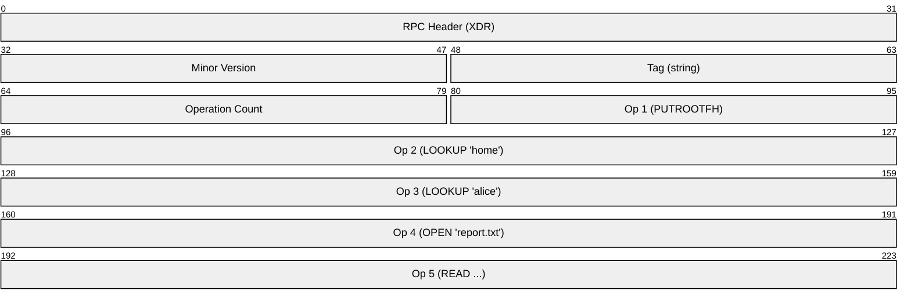
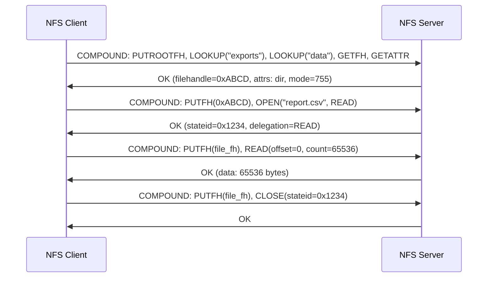
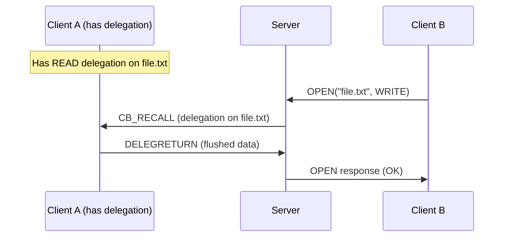
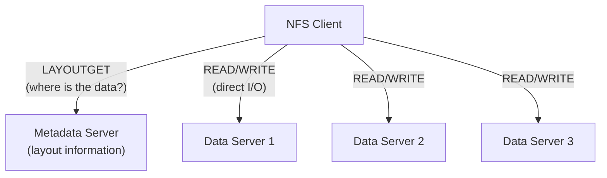
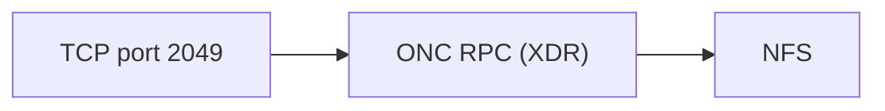

# NFS (Network File System)

> **Standard:** [RFC 7530](https://www.rfc-editor.org/rfc/rfc7530) (NFSv4) / [RFC 1813](https://www.rfc-editor.org/rfc/rfc1813) (NFSv3) | **Layer:** Application (Layer 7) | **Wireshark filter:** `nfs`

NFS is a distributed file system protocol that allows a client to access files over a network as if they were on local storage. Developed by Sun Microsystems in 1984, NFS is the standard file sharing protocol in Unix/Linux environments — used for home directories, shared storage, data centers, and HPC clusters. NFSv4 (current) consolidated the protocol into a single TCP port (2049) with built-in security, eliminating the auxiliary protocols (mountd, portmapper) that earlier versions required.

## NFSv4 Compound Request

NFSv4 uses a single RPC program on TCP port 2049. Requests are **compound** — multiple operations in a single RPC call:

This is equivalent to `open("/home/alice/report.txt")` + `read()` in a single round trip.

## NFSv4 Operations

| Op | Name | Description |
|----|------|-------------|
| 0 | ACCESS | Check access permissions |
| 1 | CLOSE | Close a file |
| 3 | COMMIT | Commit cached writes to stable storage |
| 4 | CREATE | Create a non-regular file (directory, symlink, etc.) |
| 6 | GETATTR | Get file attributes |
| 7 | GETFH | Get current filehandle |
| 9 | LINK | Create a hard link |
| 10 | LOCK | Byte-range lock |
| 11 | LOCKT | Test a byte-range lock |
| 12 | LOCKU | Unlock a byte-range lock |
| 15 | LOOKUP | Look up a filename in a directory |
| 18 | OPEN | Open a file (state-based, with share modes) |
| 22 | PUTROOTFH | Set current FH to root of export |
| 23 | READ | Read file data |
| 25 | READDIR | Read directory entries |
| 26 | READLINK | Read a symbolic link |
| 27 | REMOVE | Remove a file or directory |
| 28 | RENAME | Rename a file |
| 32 | SETATTR | Set file attributes |
| 38 | WRITE | Write file data |
| 40 | DELEGRETURN | Return a delegation |

## File Access Flow

## Delegations

NFSv4 delegations allow the server to grant a client exclusive caching rights, dramatically improving performance for files accessed by a single client:

| Delegation | Description |
|------------|-------------|
| READ | Client can cache reads without revalidating; server recalls if another client reads/writes |
| WRITE | Client can cache reads AND writes; server recalls if another client accesses the file |

### Delegation Recall

## NFSv3 vs NFSv4

| Feature | NFSv3 | NFSv4 |
|---------|-------|-------|
| Transport | UDP or TCP | TCP only |
| Port | 2049 + mountd + portmapper | 2049 only |
| File path | Opaque filehandles | Named path navigation (LOOKUP) |
| Locking | Separate NLM protocol | Integrated (LOCK/LOCKU) |
| Mounting | Separate MOUNT protocol | Virtual filesystem + pseudo-root |
| State | Stateless | Stateful (open, lock, delegation state) |
| Security | AUTH_SYS (UID/GID), Kerberos optional | Kerberos mandatory support (RPCSEC_GSS) |
| ACLs | POSIX only | NFSv4 ACLs (richer, Windows-compatible) |
| Compound ops | No (one op per RPC) | Yes (multiple ops per RPC) |
| Replication | No | Optional (referrals, migration) |

## Security (RPCSEC_GSS)

| Security Flavor | Name | Description |
|----------------|------|-------------|
| AUTH_NONE | None | No authentication |
| AUTH_SYS | System | UID/GID trust (legacy, no real security) |
| RPCSEC_GSS krb5 | Kerberos auth | Authentication only |
| RPCSEC_GSS krb5i | Kerberos integrity | Auth + integrity (HMAC on every RPC) |
| RPCSEC_GSS krb5p | Kerberos privacy | Auth + integrity + encryption |

## pNFS (Parallel NFS — NFSv4.1+)

pNFS separates metadata from data access, allowing clients to read/write directly to storage devices for massive parallelism:

## Common Mount Options

| Option | Description |
|--------|-------------|
| `vers=4` | NFSv4 |
| `sec=krb5p` | Kerberos with encryption |
| `rsize=1048576` | Read block size (1MB) |
| `wsize=1048576` | Write block size (1MB) |
| `hard` | Retry indefinitely on timeout |
| `soft` | Return error after retries |
| `intr` | Allow signals to interrupt |
| `noatime` | Don't update access times |

## Encapsulation

NFSv3 also uses: portmapper (111), mountd (variable), nlockmgr (variable), statd (variable).

## Standards

| Document | Title |
|----------|-------|
| [RFC 7530](https://www.rfc-editor.org/rfc/rfc7530) | NFS Version 4 Protocol |
| [RFC 8881](https://www.rfc-editor.org/rfc/rfc8881) | NFS Version 4.1 (sessions, pNFS) |
| [RFC 7862](https://www.rfc-editor.org/rfc/rfc7862) | NFS Version 4.2 (server-side copy, space reservation) |
| [RFC 1813](https://www.rfc-editor.org/rfc/rfc1813) | NFS Version 3 Protocol |
| [RFC 7861](https://www.rfc-editor.org/rfc/rfc7861) | RPCSEC_GSS Version 2 |

## See Also

- [SMB](smb.md) — Windows file sharing (alternative to NFS)
- [Kerberos](../security/kerberos.md) — authentication for NFSv4 security
- [TCP](../transport-layer/tcp.md)
