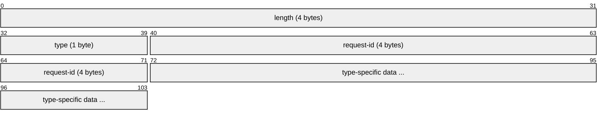
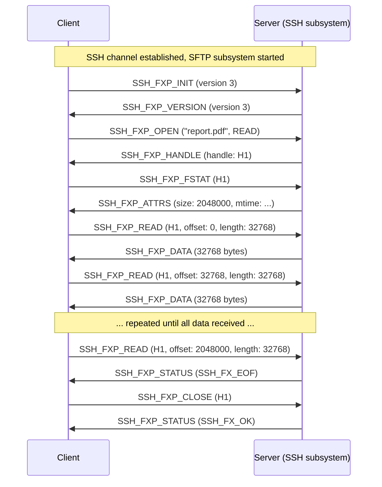
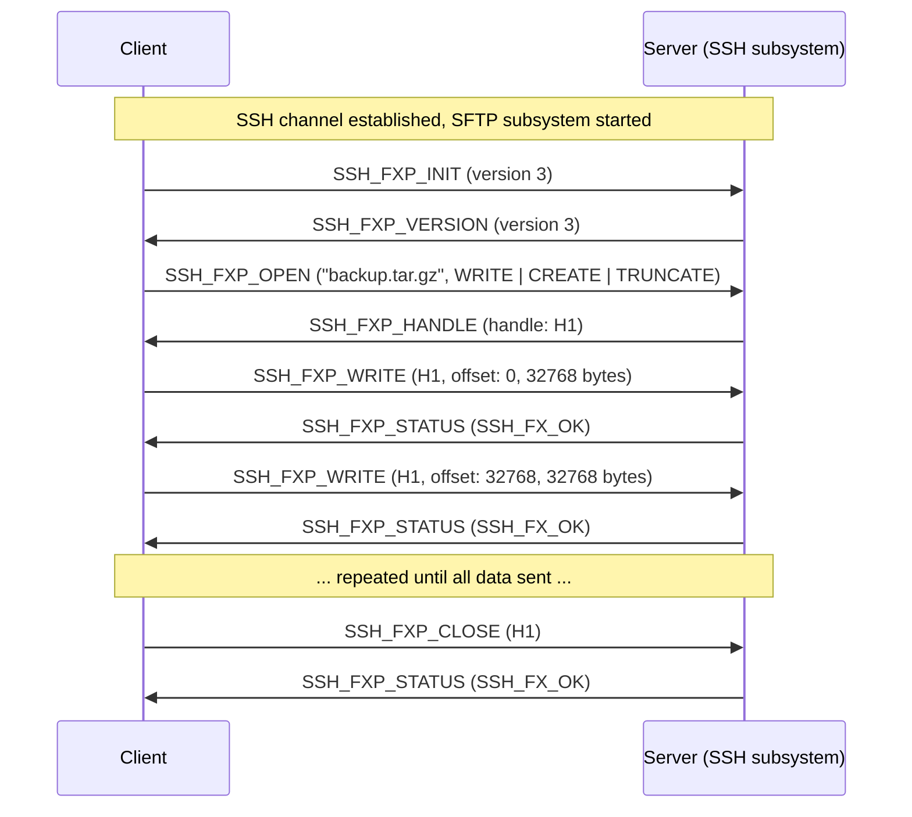
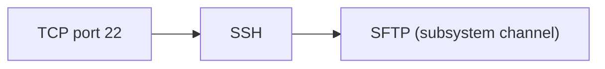

# SFTP (SSH File Transfer Protocol)

> **Standard:** [draft-ietf-secsh-filexfer](https://datatracker.ietf.org/doc/html/draft-ietf-secsh-filexfer-13) | **Layer:** Application (Layer 7) | **Wireshark filter:** `sftp`

SFTP is a binary file transfer protocol that runs as a subsystem of SSH. Despite the name, it is not FTP over SSH or FTP over SSL -- it is an entirely different protocol designed from the ground up for secure file operations. SFTP provides file upload, download, directory listing, rename, delete, and attribute management, all within a single encrypted SSH channel on port 22. No additional ports are needed. Version 3 of the protocol (from OpenSSH) is the most widely deployed, though the specification was never finalized as an RFC -- it remained an IETF draft through version 13.

## Packet Structure

Every SFTP packet has a simple framing format inside the SSH channel:

The `length` field covers everything after itself (type + request-id + data). The `request-id` is present in all packets except SSH_FXP_INIT and SSH_FXP_VERSION, and is used to match requests with responses asynchronously.

## Key Fields

| Field | Size | Description |
|-------|------|-------------|
| length | 4 bytes | Total length of the packet payload (excluding the length field itself) |
| type | 1 byte | Packet type identifier |
| request-id | 4 bytes | Client-chosen ID to correlate requests and responses |
| data | variable | Type-specific fields and payload |

## Packet Types

### Client Requests

| Type | Value | Description |
|------|-------|-------------|
| SSH_FXP_INIT | 1 | Initialize protocol, send client version |
| SSH_FXP_OPEN | 3 | Open or create a file (returns handle) |
| SSH_FXP_CLOSE | 4 | Close a file or directory handle |
| SSH_FXP_READ | 5 | Read data from an open file |
| SSH_FXP_WRITE | 6 | Write data to an open file |
| SSH_FXP_LSTAT | 7 | Get attributes for a path (don't follow symlinks) |
| SSH_FXP_FSTAT | 8 | Get attributes for an open handle |
| SSH_FXP_SETSTAT | 9 | Set attributes on a path |
| SSH_FXP_FSETSTAT | 10 | Set attributes on an open handle |
| SSH_FXP_OPENDIR | 11 | Open a directory for reading (returns handle) |
| SSH_FXP_READDIR | 12 | Read directory entries from a handle |
| SSH_FXP_REMOVE | 13 | Delete a file |
| SSH_FXP_MKDIR | 14 | Create a directory |
| SSH_FXP_RMDIR | 15 | Remove a directory |
| SSH_FXP_REALPATH | 16 | Canonicalize a path (resolve `.`, `..`, symlinks) |
| SSH_FXP_STAT | 17 | Get attributes for a path (follow symlinks) |
| SSH_FXP_RENAME | 18 | Rename a file or directory |
| SSH_FXP_READLINK | 19 | Read the target of a symbolic link |
| SSH_FXP_SYMLINK | 20 | Create a symbolic link |

### Server Responses

| Type | Value | Description |
|------|-------|-------------|
| SSH_FXP_VERSION | 2 | Server version and supported extensions |
| SSH_FXP_STATUS | 101 | Status/error code response |
| SSH_FXP_HANDLE | 102 | File or directory handle (response to OPEN/OPENDIR) |
| SSH_FXP_DATA | 103 | File data (response to READ) |
| SSH_FXP_NAME | 104 | File name(s) and attributes (response to READDIR/REALPATH) |
| SSH_FXP_ATTRS | 105 | File attributes (response to STAT/FSTAT) |

### Extended

| Type | Value | Description |
|------|-------|-------------|
| SSH_FXP_EXTENDED | 200 | Vendor-defined extended request |
| SSH_FXP_EXTENDED_REPLY | 201 | Response to extended request |

## Status Codes

The SSH_FXP_STATUS response carries a status code:

| Code | Name | Description |
|------|------|-------------|
| 0 | SSH_FX_OK | Success |
| 1 | SSH_FX_EOF | End of file reached |
| 2 | SSH_FX_NO_SUCH_FILE | File does not exist |
| 3 | SSH_FX_PERMISSION_DENIED | Insufficient permissions |
| 4 | SSH_FX_FAILURE | Generic failure |
| 5 | SSH_FX_BAD_MESSAGE | Malformed packet |
| 6 | SSH_FX_NO_CONNECTION | No connection (not used in practice) |
| 7 | SSH_FX_CONNECTION_LOST | Connection lost |
| 8 | SSH_FX_OP_UNSUPPORTED | Operation not supported by server |

## File Attributes

SFTP transfers file attributes as a structure with a flags bitmask indicating which fields are present:

| Flag | Value | Fields Present |
|------|-------|----------------|
| SSH_FILEXFER_ATTR_SIZE | 0x00000001 | size (uint64) |
| SSH_FILEXFER_ATTR_UIDGID | 0x00000002 | uid, gid (uint32 each) |
| SSH_FILEXFER_ATTR_PERMISSIONS | 0x00000004 | permissions (uint32, POSIX mode bits) |
| SSH_FILEXFER_ATTR_ACMODTIME | 0x00000008 | atime, mtime (uint32 each, Unix epoch) |
| SSH_FILEXFER_ATTR_EXTENDED | 0x80000000 | extended_count + extended name-value pairs |

### ATTRS Structure

## File Download Flow

Clients typically send multiple READ requests in parallel (pipelining) to maximize throughput over high-latency links.

## File Upload Flow

## Open Flags (pflags)

Used in SSH_FXP_OPEN to specify how a file should be opened:

| Flag | Value | Description |
|------|-------|-------------|
| SSH_FXF_READ | 0x00000001 | Open for reading |
| SSH_FXF_WRITE | 0x00000002 | Open for writing |
| SSH_FXF_APPEND | 0x00000004 | Append to end of file |
| SSH_FXF_CREAT | 0x00000008 | Create file if it does not exist |
| SSH_FXF_TRUNC | 0x00000010 | Truncate file to zero length if it exists |
| SSH_FXF_EXCL | 0x00000020 | Fail if file already exists (with CREAT) |

## SFTP vs SCP vs FTP vs FTPS

| Feature | SFTP | SCP | FTP | FTPS |
|---------|------|-----|-----|------|
| Transport | SSH subsystem (port 22) | SSH exec (port 22) | TCP ports 21 + data | TCP ports 21 + data (TLS) |
| Connections | 1 | 1 | 2 (control + data) | 2 (control + data) |
| Encryption | Always (SSH) | Always (SSH) | None | TLS |
| Resume/seek | Yes | No | REST command | REST command |
| Directory listing | Yes (READDIR) | No | LIST (inconsistent format) | LIST (inconsistent format) |
| Rename/delete | Yes | No | Yes | Yes |
| Random access | Yes (offset-based READ/WRITE) | No | No | No |
| NAT traversal | Simple (single port) | Simple (single port) | Problematic (multiple ports) | Problematic (multiple ports) |
| Formal standard | IETF draft (never RFC) | None | RFC 959 | RFC 4217 |
| Protocol type | Binary | Text control + raw data | Text | Text + TLS |

## Security

SFTP inherits all security from SSH:

| Feature | Provided By |
|---------|-------------|
| Encryption | SSH transport (AES-GCM, ChaCha20-Poly1305) |
| Authentication | SSH (public key, password, Kerberos, certificate) |
| Integrity | SSH MAC or AEAD |
| Host verification | SSH host key fingerprint |
| Key exchange | SSH (Diffie-Hellman, ECDH) |

## Encapsulation

SFTP is not a separate network protocol visible on the wire -- all traffic appears as SSH. The SFTP binary framing exists entirely within an SSH channel. The subsystem is started with `ssh -s sftp` or by requesting the `sftp` subsystem on an existing SSH session.

## Standards

| Document | Title |
|----------|-------|
| [draft-ietf-secsh-filexfer-02](https://datatracker.ietf.org/doc/html/draft-ietf-secsh-filexfer-02) | SSH File Transfer Protocol (version 3 -- most widely deployed) |
| [draft-ietf-secsh-filexfer-13](https://datatracker.ietf.org/doc/html/draft-ietf-secsh-filexfer-13) | SSH File Transfer Protocol (version 6 -- final draft, limited adoption) |
| [RFC 4253](https://www.rfc-editor.org/rfc/rfc4253) | SSH Transport Layer Protocol |
| [RFC 4254](https://www.rfc-editor.org/rfc/rfc4254) | SSH Connection Protocol (subsystem channels) |
| [OpenSSH source](https://github.com/openssh/openssh-portable) | Reference implementation (sftp-server, sftp-client) |

## See Also

- [SCP](scp.md) -- simpler SSH-based file copy (deprecated in favor of SFTP)
- [FTP](ftp.md) -- legacy unencrypted file transfer
- [SSH](../remote-access/ssh.md) -- the transport protocol SFTP runs over
